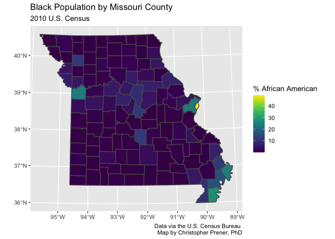

Lab 1-2 Replication
================
Christopher Prener, Ph.D.
(February 07, 2022)

## Introduction

This notebook provides a replication of Lab 1-2.

## Dependencies

This notebook requires the following packages:

``` r
# tidyverse packages
library(ggplot2)       # static mapping
```

    ## Warning in register(): Can't find generic `scale_type` in package ggplot2 to
    ## register S3 method.

``` r
# mapping packages
library(mapview)      # preview spatial data
library(sf)           # spatial tools
```

    ## Linking to GEOS 3.8.1, GDAL 3.2.1, PROJ 7.2.1; sf_use_s2() is TRUE

``` r
# other packages
library(here)         # file path management
```

    ## here() starts at /Users/kathryncoccia/Documents/GitHub/module-1-basics/assignments/lab-1-2-replication

``` r
library(viridis)      # viridis color palettes
```

    ## Loading required package: viridisLite

## Load Data

The data for today’s lecture are county-level population estimates from
the 2010 Decennial Census for Missouri. These can be found in
`data/MO_DEMOS_Black_Population`. They are `.geojson` data:

``` r
mo <- st_read(here("data", "MO_DEMOS_Black_Population", "MO_DEMOS_Black_Population.geojson"))
```

    ## Reading layer `MO_DEMOS_Black_Population' from data source 
    ##   `/Users/kathryncoccia/Documents/GitHub/module-1-basics/assignments/lab-1-2-replication/data/MO_DEMOS_Black_Population/MO_DEMOS_Black_Population.geojson' 
    ##   using driver `GeoJSON'
    ## Simple feature collection with 115 features and 9 fields
    ## Geometry type: MULTIPOLYGON
    ## Dimension:     XY
    ## Bounding box:  xmin: 265131.4 ymin: 3986650 xmax: 847376.1 ymax: 4496645
    ## Projected CRS: NAD83 / UTM zone 15N

We’re now ready to map these data.

## Part 1 - Exploration

We’ll use the `mapview()` function to explore these data:

``` r
mapview(mo)
```

    ## PhantomJS not found. You can install it with webshot::install_phantomjs(). If it is installed, please make sure the phantomjs executable can be found via the PATH variable.

<div id="htmlwidget-c09afde192c1611d121a" style="width:672px;height:480px;" class="leaflet html-widget"></div>
<script type="application/json" data-for="htmlwidget-c09afde192c1611d121a">{"x":{"options":{"minZoom":1,"maxZoom":52,"crs":{"crsClass":"L.CRS.EPSG3857","code":null,"proj4def":null,"projectedBounds":null,"options":{}},"preferCanvas":false,"bounceAtZoomLimits":false,"maxBounds":[[[-90,-370]],[[90,370]]]},"calls":[{"method":"addProviderTiles","args":["CartoDB.Positron","CartoDB.Positron","CartoDB.Positron",{"errorTileUrl":"","noWrap":false,"detectRetina":false,"pane":"tilePane"}]},{"method":"addProviderTiles","args":["CartoDB.DarkMatter","CartoDB.DarkMatter","CartoDB.DarkMatter",{"errorTileUrl":"","noWrap":false,"detectRetina":false,"pane":"tilePane"}]},{"method":"addProviderTiles","args":["OpenStreetMap","OpenStreetMap","OpenStreetMap",{"errorTileUrl":"","noWrap":false,"detectRetina":false,"pane":"tilePane"}]},{"method":"addProviderTiles","args":["Esri.WorldImagery","Esri.WorldImagery","Esri.WorldImagery",{"errorTileUrl":"","noWrap":false,"detectRetina":false,"pane":"tilePane"}]},{"method":"addProviderTiles","args":["OpenTopoMap","OpenTopoMap","OpenTopoMap",{"errorTileUrl":"","noWrap":false,"detectRetina":false,"pane":"tilePane"}]},{"method":"createMapPane","args":["polygon",420]},{"method":"addPolygons","args":[[[[{"lng":[-92.557311,-92.565598,-92.572654,-92.594978,-92.616652,-92.617147,-92.635317,-92.713912,-92.726706,-92.726692,-92.731451,-92.745305,-92.763927,-92.79224,-92.820722,-92.839792,-92.839819,-92.839837,-92.858654,-92.876826,-92.909134,-92.915778,-92.924727,-92.927966,-92.932435,-92.947196,-92.950512,-92.950889,-92.950986,-92.953597,-92.958598,-92.961924,-92.974051,-92.975996,-92.997001,-93.000202,-93.043891,-93.046662,-93.059974,-93.059549,-93.05914,-93.058962,-93.056921,-93.056875,-93.055499,-93.054987,-93.054501,-93.054652,-93.053682,-93.053643,-93.052439,-93.052043,-93.050511,-93.050707,-93.050453,-93.04875,-93.048245,-93.037185,-93.025954,-93.02563,-93.001208,-92.985475,-92.982653,-92.957345,-92.946834,-92.934569,-92.934992,-92.93065,-92.923113,-92.921403,-92.918175,-92.915223,-92.914477,-92.909654,-92.902547,-92.894328,-92.889185,-92.884513,-92.87951,-92.876046,-92.870118,-92.866218,-92.861851,-92.856591,-92.852628,-92.847561,-92.841617,-92.829152,-92.820393,-92.81782,-92.809713,-92.804497,-92.796897,-92.791809,-92.783099,-92.779855,-92.774216,-92.770922,-92.764862,-92.754442,-92.746012,-92.733659,-92.720402,-92.719421,-92.718756,-92.715643,-92.707198,-92.697669,-92.693002,-92.689466,-92.678932,-92.665822,-92.655927,-92.6467,-92.635028,-92.629587,-92.612291,-92.606998,-92.59776,-92.590677,-92.587451,-92.570661,-92.564393,-92.558086,-92.553187,-92.544946,-92.540118,-92.536382,-92.531947,-92.529105,-92.526437,-92.523427,-92.514987,-92.508657,-92.498377,-92.500185,-92.505725,-92.520627,-92.528162,-92.528699,-92.552674,-92.554793,-92.557311],"lat":[38.809876,38.794178,38.781192,38.737609,38.694466,38.680013,38.680441,38.682701,38.683135,38.684077,38.683893,38.683534,38.683802,38.684181,38.684616,38.684948,38.684042,38.683974,38.683752,38.684319,38.685158,38.685109,38.685313,38.685269,38.685515,38.685953,38.68577,38.685794,38.685803,38.685985,38.686442,38.686524,38.687581,38.687569,38.689049,38.689444,38.692137,38.69228,38.693077,38.700905,38.709524,38.71322,38.765409,38.766017,38.797303,38.807728,38.817123,38.820878,38.840654,38.84175,38.875196,38.884247,38.918362,38.924894,38.928244,38.968517,38.972598,38.98148,38.990657,38.990921,39.010862,39.023665,39.025929,39.046254,39.054741,39.064547,39.058909,39.050746,39.040835,39.037601,39.029167,39.022798,39.021188,39.015648,39.01111,39.008359,39.007096,39.00563,39.003236,39.000836,38.995655,38.990993,38.987123,38.98409,38.982183,38.980943,38.979821,38.978844,38.978312,38.977942,38.975861,38.975086,38.973042,38.972044,38.971571,38.97177,38.972182,38.972703,38.974429,38.979199,38.981122,38.983343,38.984194,38.98426,38.984305,38.984011,38.981892,38.977417,38.975957,38.975645,38.97547,38.976237,38.976658,38.975875,38.974699,38.973882,38.969748,38.968726,38.967681,38.967554,38.967783,38.971896,38.972229,38.970692,38.967276,38.959691,38.953718,38.950936,38.948839,38.946654,38.944776,38.943359,38.938114,38.93271,38.922084,38.919381,38.909067,38.881517,38.867051,38.865718,38.818581,38.81473,38.809876]}]],[[{"lng":[-91.255465,-91.248168,-91.217467,-91.208461,-91.208425,-91.199438,-91.199387,-91.187445,-91.177301,-91.177049,-91.169419,-91.16827,-91.159442,-91.144616,-91.14063,-91.125141,-91.123721,-91.097604,-91.095765,-91.095755,-91.095707,-91.095734,-91.095219,-91.09449,-91.094312,-91.094469,-91.094602,-91.094279,-91.094112,-91.093953,-91.094779,-91.09481,-91.094934,-91.095694,-91.096354,-91.097582,-91.099666,-91.100017,-91.146521,-91.146972,-91.153345,-91.225232,-91.274026,-91.27627,-91.310655,-91.309767,-91.309083,-91.308426,-91.37678,-91.418759,-91.492419,-91.517112,-91.528797,-91.527526,-91.527373,-91.526934,-91.526713,-91.526686,-91.526392,-91.526367,-91.526355,-91.526306,-91.526223,-91.525856,-91.525712,-91.525758,-91.525712,-91.525329,-91.525308,-91.52531,-91.525006,-91.52526,-91.525245,-91.52499,-91.525025,-91.526602,-91.534384,-91.534636,-91.535119,-91.535333,-91.535333,-91.535115,-91.470209,-91.460616,-91.44008,-91.433099,-91.424832,-91.42483,-91.418965,-91.41808,-91.405235,-91.367482,-91.36763,-91.358091,-91.348024,-91.346926,-91.33884,-91.31119,-91.291153,-91.255465],"lat":[38.204141,38.204093,38.204093,38.204091,38.20409,38.204088,38.204088,38.204085,38.204084,38.204085,38.204065,38.204155,38.20416,38.204214,38.204219,38.204243,38.204144,38.204083,38.204083,38.186175,38.150863,38.125356,38.117386,38.088961,38.08198,38.052076,38.050341,38.030566,38.01638,38.001273,37.957889,37.95253,37.9502,37.918829,37.870838,37.840299,37.747635,37.740012,37.740811,37.697198,37.69734,37.698533,37.699358,37.6994,37.700048,37.736533,37.764526,37.787186,37.788187,37.788452,37.788858,37.788857,37.788989,37.873468,37.875043,37.904536,37.919317,37.92123,37.941426,37.95515,37.96192,37.968751,37.970853,38.008406,38.044442,38.046354,38.048979,38.077907,38.077944,38.07796,38.123623,38.125066,38.135628,38.14082,38.152433,38.152559,38.152593,38.167105,38.196383,38.210936,38.210975,38.210976,38.210859,38.210528,38.21036,38.210937,38.211639,38.209876,38.209899,38.21014,38.209953,38.209741,38.204013,38.204121,38.204054,38.204037,38.20404,38.204048,38.203994,38.204141]}]],[[{"lng":[-93.180165,-93.179917,-93.179549,-93.177966,-93.1782,-93.177214,-93.176405,-93.176058,-93.175586,-93.175222,-93.173183,-93.177975,-93.19138,-93.190691,-93.190121,-93.190938,-93.189984,-93.188532,-93.188508,-93.187915,-93.187136,-93.186391,-93.18335,-93.182814,-93.182706,-93.124658,-93.122965,-93.112545,-93.102464,-93.099239,-93.096044,-93.072447,-93.045519,-92.982175,-92.973092,-92.965489,-92.948436,-92.923532,-92.902436,-92.886799,-92.885954,-92.855384,-92.85596,-92.857563,-92.858116,-92.858333,-92.85839,-92.858451,-92.858756,-92.858589,-92.858586,-92.859239,-92.859284,-92.859294,-92.859913,-92.846281,-92.846736,-92.846759,-92.848548,-92.848871,-92.848918,-92.849761,-92.849534,-92.84977,-92.851102,-92.851515,-92.851603,-92.851514,-92.851855,-92.852721,-92.852775,-92.853481,-92.855118,-92.908138,-92.957689,-92.961166,-92.970843,-92.979916,-93.015856,-93.071584,-93.072642,-93.073271,-93.07338,-93.182489,-93.181825,-93.181629,-93.180687,-93.180124,-93.180116,-93.180165],"lat":[37.511559,37.518749,37.533488,37.574544,37.576723,37.605676,37.634712,37.64003,37.664555,37.67489,37.72966,37.729626,37.730012,37.744522,37.756865,37.759066,37.759778,37.787832,37.788444,37.802737,37.817272,37.831643,37.889899,37.899988,37.904144,37.903293,37.903418,37.903423,37.90303,37.90309,37.902841,37.902627,37.901531,37.899399,37.898965,37.898985,37.898417,37.89773,37.897117,37.896657,37.896632,37.895736,37.880467,37.838044,37.82342,37.812331,37.808769,37.80502,37.786011,37.765346,37.764959,37.74798,37.746262,37.745941,37.721239,37.721039,37.708694,37.708105,37.65899,37.650122,37.64883,37.625041,37.623228,37.614471,37.570876,37.552953,37.551139,37.550817,37.541856,37.509943,37.507848,37.48397,37.48386,37.484843,37.485723,37.4856,37.485668,37.485705,37.486411,37.487444,37.444003,37.41904,37.414989,37.417204,37.446892,37.453592,37.489709,37.511386,37.511509,37.511559]}]],[[{"lng":[-94.040159,-94.093205,-94.107173,-94.130484,-94.162197,-94.167575,-94.184125,-94.185299,-94.204314,-94.205844,-94.205871,-94.205575,-94.205561,-94.205482,-94.205301,-94.205213,-94.204932,-94.204817,-94.204725,-94.204674,-94.204455,-94.204262,-94.203948,-94.203457,-94.2188,-94.218459,-94.216867,-94.216905,-94.216723,-94.216494,-94.216696,-94.141284,-94.139644,-94.136459,-94.103708,-94.086395,-94.009268,-93.990194,-93.990129,-93.990103,-93.950572,-93.934869,-93.907128,-93.877876,-93.872415,-93.867714,-93.764021,-93.764038,-93.764205,-93.764207,-93.764362,-93.764921,-93.76461,-93.764011,-93.764009,-93.764485,-93.764613,-93.764765,-93.76369,-93.763288,-93.763054,-93.762574,-93.761973,-93.761625,-93.760879,-93.760567,-93.760211,-93.759209,-93.758993,-93.75899,-93.759145,-93.759122,-93.75912,-93.758992,-93.792156,-93.852324,-93.870526,-93.91573,-93.94541,-93.983636,-93.983907,-94.011695,-94.013739,-94.03638,-94.040159],"lat":[39.785642,39.785852,39.786218,39.786862,39.787815,39.788003,39.78845,39.788368,39.78895,39.788954,39.789433,39.832529,39.847281,39.875936,39.901802,39.90916,39.92629,39.934156,39.948109,39.948775,39.963151,39.977797,40.000046,40.034539,40.034885,40.049406,40.107574,40.110906,40.115409,40.12503,40.136626,40.135223,40.135291,40.135235,40.13466,40.134793,40.134173,40.133992,40.133988,40.133988,40.133864,40.133755,40.133651,40.133547,40.133483,40.133462,40.132909,40.129237,40.11834,40.118268,40.111079,40.10202,40.074657,40.067589,40.060373,40.055457,40.045806,40.032444,40.031241,40.011103,39.999934,39.995934,39.959552,39.930831,39.886773,39.885692,39.872299,39.818292,39.817195,39.810801,39.808879,39.807535,39.80741,39.784674,39.784861,39.78649,39.786798,39.786297,39.78617,39.785783,39.785784,39.785609,39.785864,39.785586,39.785642]}]],[[{"lng":[-94.5546,-94.517379,-94.464648,-94.45262,-94.4457,-94.393612,-94.3314,-94.318722,-94.294173,-94.256423,-94.234539,-94.2188,-94.203457,-94.203948,-94.204262,-94.204455,-94.204674,-94.204725,-94.204817,-94.204932,-94.205213,-94.205301,-94.205482,-94.205561,-94.205575,-94.205871,-94.205844,-94.205884,-94.205429,-94.205778,-94.205546,-94.20578,-94.205961,-94.21119,-94.212063,-94.219965,-94.236897,-94.253114,-94.254018,-94.257903,-94.262183,-94.262269,-94.281346,-94.318595,-94.319034,-94.320346,-94.321819,-94.337796,-94.346461,-94.350733,-94.353368,-94.362337,-94.365509,-94.432472,-94.442519,-94.451465,-94.470451,-94.479833,-94.489145,-94.50794,-94.526485,-94.544458,-94.553634,-94.571891,-94.573967,-94.577994,-94.581399,-94.596138,-94.602257,-94.602228,-94.602331,-94.602354,-94.602363,-94.602819,-94.602712,-94.603191,-94.604011,-94.604347,-94.604539,-94.604544,-94.604846,-94.604783,-94.604795,-94.604812,-94.604696,-94.605377,-94.58459,-94.579647,-94.576126,-94.5546],"lat":[40.039206,40.039071,40.038888,40.038861,40.038894,40.039169,40.039281,40.038817,40.037938,40.036559,40.035594,40.034885,40.034539,40.000046,39.977797,39.963151,39.948775,39.948109,39.934156,39.92629,39.90916,39.901802,39.875936,39.847281,39.832529,39.789433,39.788954,39.767152,39.760563,39.759727,39.75879,39.753873,39.745841,39.745965,39.745989,39.746209,39.746348,39.746398,39.746402,39.746431,39.746435,39.746443,39.746873,39.7475,39.747465,39.74739,39.747268,39.747115,39.747219,39.747146,39.747221,39.747148,39.747373,39.747474,39.747629,39.747694,39.747639,39.747735,39.747644,39.747794,39.747772,39.747627,39.747222,39.747139,39.747277,39.747278,39.747271,39.747237,39.747195,39.748657,39.768976,39.772639,39.776347,39.819608,39.826133,39.834317,39.878161,39.915037,39.936018,39.936573,39.966245,39.97637,39.980724,39.98167,39.982362,40.039217,40.039289,40.039265,40.039266,40.039206]}]],[[{"lng":[-91.418759,-91.37678,-91.308426,-91.309083,-91.309767,-91.310655,-91.27627,-91.274026,-91.225232,-91.153345,-91.155073,-91.173798,-91.209357,-91.245734,-91.281547,-91.312458,-91.312944,-91.313176,-91.314236,-91.210984,-91.21109,-91.211143,-91.211247,-91.211263,-91.211282,-91.211413,-91.211517,-91.211863,-91.303903,-91.334133,-91.370845,-91.427323,-91.448573,-91.463722,-91.465824,-91.529232,-91.555395,-91.569826,-91.591699,-91.605685,-91.646626,-91.68519,-91.75504,-91.7551,-91.754804,-91.754693,-91.754859,-91.754795,-91.809105,-91.808371,-91.808194,-91.80818,-91.806709,-91.806105,-91.806219,-91.805538,-91.769174,-91.764749,-91.734,-91.732446,-91.711656,-91.71152,-91.693165,-91.6796,-91.638388,-91.625151,-91.620165,-91.566036,-91.528797,-91.517112,-91.492419,-91.418759],"lat":[37.788452,37.788187,37.787186,37.764526,37.736533,37.700048,37.6994,37.699358,37.698533,37.69734,37.588092,37.588492,37.588811,37.590335,37.592266,37.592824,37.578063,37.555046,37.505132,37.501911,37.474941,37.470109,37.46174,37.460863,37.458104,37.451311,37.443784,37.415277,37.41693,37.417436,37.418216,37.418043,37.418911,37.418879,37.419077,37.420491,37.421037,37.421359,37.421703,37.421952,37.422731,37.423295,37.42411,37.453279,37.511456,37.58421,37.588504,37.598768,37.598863,37.678269,37.702274,37.704246,37.704243,37.783143,37.791286,37.791285,37.7914,37.791391,37.791057,37.791091,37.790909,37.791063,37.790795,37.790583,37.789952,37.789752,37.790154,37.789411,37.788989,37.788857,37.788858,37.788452]}]],[[{"lng":[-92.41764,-92.41531,-92.41435,-92.378208,-92.35076,-92.305426,-92.288001,-92.270607,-92.26424,-92.251359,-92.246736,-92.23716,-92.196689,-92.196489,-92.143087,-92.088708,-92.089628,-92.089904,-92.090286,-92.090912,-92.090922,-92.092247,-92.093066,-92.093229,-92.093466,-92.094676,-92.094678,-92.095088,-92.095982,-92.112346,-92.132075,-92.141852,-92.147343,-92.204295,-92.221292,-92.22247,-92.313135,-92.33074,-92.345852,-92.359968,-92.367155,-92.403328,-92.409844,-92.413963,-92.422429,-92.483021,-92.484451,-92.507432,-92.516727,-92.529504,-92.548115,-92.582668,-92.58959,-92.638226,-92.638755,-92.644019,-92.65683,-92.74677,-92.759889,-92.764869,-92.783007,-92.854709,-92.855405,-92.903692,-92.909336,-92.908987,-92.908844,-92.908258,-92.908218,-92.907992,-92.907094,-92.905803,-92.905782,-92.90558,-92.905114,-92.904533,-92.903494,-92.903408,-92.903051,-92.903273,-92.86711,-92.857042,-92.856751,-92.851871,-92.849076,-92.848146,-92.811871,-92.750167,-92.745012,-92.738977,-92.717411,-92.685867,-92.649227,-92.632492,-92.613427,-92.545275,-92.544945,-92.522279,-92.520502,-92.476564,-92.467788,-92.454287,-92.41764],"lat":[37.062589,37.062575,37.062569,37.062141,37.061851,37.061251,37.060296,37.059978,37.060062,37.059653,37.059668,37.059431,37.058427,37.058422,37.057097,37.056248,37.012494,37.000054,36.996003,36.969257,36.968928,36.918598,36.895091,36.881607,36.869977,36.837565,36.837495,36.82214,36.794011,36.794231,36.794641,36.794853,36.794971,36.79612,36.796373,36.7965,36.79829,36.798573,36.79892,36.799147,36.799325,36.799865,36.799955,36.800035,36.8002,36.801017,36.80121,36.801631,36.80187,36.802134,36.802481,36.802981,36.803109,36.803981,36.803989,36.804074,36.804246,36.805708,36.805894,36.806097,36.806471,36.807939,36.807953,36.809043,36.809178,36.819885,36.824056,36.854565,36.857204,36.867628,36.896715,36.939291,36.940015,36.950079,36.969185,36.998333,37.037644,37.041428,37.056048,37.070651,37.069403,37.069335,37.068963,37.068833,37.068763,37.06874,37.068852,37.068003,37.067753,37.067829,37.067517,37.067051,37.066697,37.066548,37.06597,37.064128,37.064122,37.063675,37.063637,37.062977,37.062894,37.062801,37.062589]}]],[[{"lng":[-91.217467,-91.248168,-91.255465,-91.291153,-91.31119,-91.33884,-91.346926,-91.348024,-91.358091,-91.36763,-91.367482,-91.367101,-91.366638,-91.367065,-91.366653,-91.36648,-91.366282,-91.36599,-91.365953,-91.365948,-91.365898,-91.365565,-91.365436,-91.367037,-91.366827,-91.366855,-91.367753,-91.36777,-91.367665,-91.367622,-91.367794,-91.36852,-91.36832,-91.368337,-91.367821,-91.368002,-91.368358,-91.36877,-91.368692,-91.368853,-91.36842,-91.368417,-91.369228,-91.369192,-91.367338,-91.352986,-91.34912,-91.346112,-91.341682,-91.329563,-91.326092,-91.324376,-91.319022,-91.313093,-91.309687,-91.306579,-91.304157,-91.29112,-91.279243,-91.274743,-91.266634,-91.259813,-91.250154,-91.246672,-91.243636,-91.243443,-91.243051,-91.237423,-91.232986,-91.230425,-91.227035,-91.226538,-91.228472,-91.227526,-91.226547,-91.224986,-91.216357,-91.213136,-91.202933,-91.199511,-91.192394,-91.184573,-91.182957,-91.174806,-91.152537,-91.132535,-91.125148,-91.123011,-91.117379,-91.11291,-91.096117,-91.089183,-91.077324,-91.068888,-91.055898,-91.046568,-91.037222,-91.035005,-91.032325,-91.029306,-91.024469,-91.02143,-91.017605,-91.014132,-91.007668,-91.005406,-90.998144,-90.99241,-90.984761,-90.978335,-90.96952,-90.964461,-90.963467,-90.96037,-90.958841,-90.958061,-90.954039,-90.947721,-90.942567,-90.932857,-90.923303,-90.916554,-90.906043,-90.904003,-90.895968,-90.892675,-90.883917,-90.873268,-90.849841,-90.841933,-90.835834,-90.829223,-90.825255,-90.821451,-90.816536,-90.812988,-90.804059,-90.79574,-90.789585,-90.781228,-90.777993,-90.773622,-90.768684,-90.763245,-90.761567,-90.75609,-90.754757,-90.750703,-90.744048,-90.742412,-90.736299,-90.733952,-90.732328,-90.732231,-90.732441,-90.732628,-90.73388,-90.734224,-90.734408,-90.734446,-90.735301,-90.735324,-90.735328,-90.735566,-90.735733,-90.735739,-90.735814,-90.735826,-90.73603,-90.735929,-90.73643,-90.736508,-90.73653,-90.73653,-90.73653,-90.736319,-90.736232,-90.737333,-90.73743,-90.737599,-90.739034,-90.739247,-90.739641,-90.74823,-90.7494,-90.750126,-90.750222,-90.755601,-90.760533,-90.765978,-90.766984,-90.76778,-90.77228,-90.772585,-90.773549,-90.773849,-90.780185,-90.819205,-90.835147,-90.857393,-90.858312,-90.863934,-90.881812,-90.884854,-90.934015,-90.952198,-90.967944,-90.970187,-90.978782,-90.98964,-91.008785,-91.095765,-91.097604,-91.123721,-91.125141,-91.14063,-91.144616,-91.159442,-91.16827,-91.169419,-91.177049,-91.177301,-91.187445,-91.199387,-91.199438,-91.208425,-91.208461,-91.217467],"lat":[38.204093,38.204093,38.204141,38.203994,38.204048,38.20404,38.204037,38.204054,38.204121,38.204013,38.209741,38.224488,38.242861,38.250064,38.256094,38.263811,38.281531,38.285204,38.289407,38.293158,38.299846,38.322086,38.33147,38.331491,38.393121,38.42001,38.420296,38.434604,38.461479,38.480272,38.509374,38.509366,38.546312,38.55365,38.569216,38.5837,38.598592,38.602749,38.623014,38.625044,38.665575,38.688158,38.688134,38.699324,38.698735,38.695635,38.695435,38.695956,38.697415,38.705974,38.708057,38.708414,38.708368,38.706715,38.704464,38.702116,38.699977,38.689181,38.682074,38.67899,38.671753,38.666601,38.661445,38.660144,38.658383,38.658262,38.658084,38.654966,38.65134,38.648138,38.64171,38.636648,38.630194,38.625048,38.621567,38.620783,38.617702,38.616979,38.614706,38.613492,38.610963,38.608414,38.607896,38.60682,38.603692,38.598279,38.597704,38.597883,38.598494,38.599606,38.605082,38.606895,38.609343,38.609898,38.608267,38.60488,38.598576,38.596274,38.59349,38.588684,38.578398,38.57352,38.569433,38.566013,38.562492,38.561082,38.557495,38.555126,38.552943,38.551861,38.549652,38.547545,38.546986,38.545099,38.544107,38.543692,38.541561,38.53894,38.537602,38.535017,38.534134,38.534725,38.537178,38.537779,38.540589,38.542182,38.547847,38.553893,38.562257,38.565955,38.569788,38.575292,38.578007,38.580071,38.583414,38.585554,38.588192,38.590153,38.590494,38.591959,38.592816,38.594617,38.597661,38.602186,38.60405,38.611318,38.616108,38.625103,38.63089,38.634563,38.636744,38.639104,38.639302,38.62137,38.600684,38.5766,38.548944,38.541939,38.534972,38.533726,38.505229,38.504336,38.504159,38.49715,38.49247,38.492327,38.490369,38.490036,38.484165,38.482744,38.469853,38.468129,38.467653,38.467431,38.466953,38.466645,38.465879,38.422049,38.418352,38.415897,38.407632,38.406559,38.404396,38.36442,38.35819,38.355735,38.355078,38.330052,38.306405,38.280241,38.274,38.271637,38.25005,38.245856,38.24068,38.239067,38.204112,38.204258,38.204551,38.20509,38.205103,38.204875,38.204966,38.204832,38.205244,38.205369,38.205492,38.206687,38.20564,38.204295,38.204089,38.204083,38.204083,38.204144,38.204243,38.204219,38.204214,38.20416,38.204155,38.204065,38.204085,38.204084,38.204085,38.204088,38.204088,38.20409,38.204091,38.204093]}]],[[{"lng":[-92.460645,-92.460444,-92.451083,-92.404051,-92.403904,-92.349975,-92.349948,-92.349894,-92.347801,-92.348167,-92.348055,-92.348533,-92.348551,-92.348578,-92.34927,-92.348747,-92.348616,-92.346697,-92.346455,-92.34584,-92.345772,-92.345782,-92.345818,-92.345907,-92.345955,-92.345955,-92.345798,-92.34539,-92.345265,-92.345265,-92.345064,-92.399038,-92.467751,-92.477683,-92.487607,-92.488419,-92.490481,-92.491162,-92.492745,-92.496491,-92.501666,-92.509616,-92.515529,-92.622069,-92.625192,-92.628804,-92.685819,-92.700684,-92.733642,-92.742944,-92.847477,-92.856191,-92.856045,-92.856045,-92.856044,-92.855903,-92.855743,-92.855863,-92.855505,-92.855625,-92.855618,-92.855629,-92.818537,-92.743615,-92.737182,-92.724584,-92.686852,-92.684167,-92.646934,-92.62919,-92.574961,-92.572797,-92.567675,-92.566318,-92.563088,-92.55866,-92.51579,-92.467443,-92.460645],"lat":[40.345204,40.345207,40.345513,40.346329,40.346683,40.346505,40.318825,40.302988,40.302756,40.28717,40.281599,40.281135,40.273915,40.240797,40.239763,40.237393,40.215834,40.215866,40.215888,40.153788,40.125037,40.124747,40.124563,40.124339,40.124171,40.117136,40.09532,40.046768,40.045973,40.038283,40.03721,40.037012,40.036961,40.037106,40.03698,40.037097,40.037079,40.037124,40.037114,40.037092,40.037093,40.03706,40.037116,40.038224,40.038302,40.03829,40.038289,40.038192,40.038056,40.03798,40.037301,40.037253,40.121128,40.124365,40.125025,40.164753,40.165432,40.166183,40.211761,40.299083,40.300674,40.342736,40.342723,40.342481,40.342834,40.342666,40.343427,40.343466,40.343595,40.343679,40.344283,40.344175,40.344321,40.344245,40.3443,40.344346,40.34491,40.345187,40.345204]}]],[[{"lng":[-94.6139350083481,-94.613856,-94.613748,-94.613422,-94.613073,-94.612848,-94.612822,-94.6127231579095,-94.612658,-94.6126585742788,-94.612659,-94.612635,-94.6126142080008,-94.612614,-94.612692,-94.6126922711167,-94.612849,-94.612844,-94.612673,-94.612673,-94.612673,-94.612788,-94.612825,-94.613,-94.613312,-94.613329,-94.613265,-94.6133327609411,-94.613365,-94.6133416478909,-94.6131579346,-94.6128844000454,-94.612866,-94.6128650452802,-94.602801,-94.598581,-94.584743,-94.511205,-94.510088,-94.507933,-94.502244,-94.4149,-94.399901,-94.398782,-94.323429,-94.320282,-94.31217,-94.313915,-94.310925,-94.311297,-94.310281,-94.306298,-94.305156,-94.304308,-94.301312,-94.298968,-94.29751,-94.29419,-94.292882,-94.293504,-94.289895,-94.291713,-94.291661,-94.289964,-94.286787,-94.285017,-94.284196,-94.282738,-94.281767,-94.278116,-94.276769,-94.275325,-94.275199,-94.272953,-94.27006,-94.26611,-94.265195,-94.266756,-94.259329,-94.257162,-94.249865,-94.246892,-94.244878,-94.239326,-94.237787,-94.238048,-94.239824,-94.238403,-94.235298,-94.231541,-94.227168,-94.226302,-94.224979,-94.226405,-94.228776,-94.226144,-94.229257,-94.225938,-94.225065,-94.222883,-94.222474,-94.223812,-94.22282,-94.217933,-94.216186,-94.214788,-94.212955,-94.212023,-94.209811,-94.209375,-94.211239,-94.210661,-94.207512,-94.206173,-94.203729,-94.202566,-94.200524,-94.193164,-94.189963,-94.187635,-94.189992,-94.189643,-94.186674,-94.185976,-94.184899,-94.1826,-94.182163,-94.180795,-94.179515,-94.17662,-94.174102,-94.174043,-94.170377,-94.172821,-94.173548,-94.171569,-94.16863,-94.167553,-94.168076,-94.165602,-94.164439,-94.161528,-94.161033,-94.159344,-94.157205,-94.155347,-94.152263,-94.153226,-94.151386,-94.147682,-94.145787,-94.140929,-94.138329,-94.132773,-94.124848,-94.118286,-94.116713,-94.114481,-94.109348,-94.108155,-94.109233,-94.102538,-94.101635,-94.097181,-94.095842,-94.094241,-94.093455,-94.092755,-94.090921,-94.090049,-94.088915,-94.086873,-94.085479,-94.084147,-94.08256,-94.082235,-94.080433,-94.07974,-94.076724,-94.075978,-94.077916,-94.073734,-94.072846,-94.070864,-94.065713,-94.067373,-94.067936,-94.070462,-94.071806,-94.073721,-94.075214,-94.049895,-94.050852,-94.051579,-94.05449,-94.055174,-94.05785,-94.058285,-94.063198,-94.065166,-94.065266,-94.067645,-94.069951,-94.071402,-94.074208,-94.080659,-94.085239,-94.087321,-94.088601,-94.088065,-94.086687,-94.086999,-94.088065,-94.092218,-94.095409,-94.095948,-94.098935,-94.101912,-94.103996,-94.104893,-94.103934,-94.103869,-94.105647,-94.106769,-94.109911,-94.113419,-94.115757,-94.118246,-94.119162,-94.118868,-94.115375,-94.114719,-94.116669,-94.121064,-94.124693,-94.126506,-94.127416,-94.129037,-94.131396,-94.135238,-94.139687,-94.144872,-94.150064,-94.153095,-94.155403,-94.157432,-94.16016,-94.164864,-94.169431,-94.175704,-94.184033,-94.189502,-94.191788,-94.193597,-94.195133,-94.195162,-94.194374,-94.196061,-94.198136,-94.198597,-94.197676,-94.197908,-94.200292,-94.20069,-94.199136,-94.195307,-94.19463,-94.195358,-94.198002,-94.200993,-94.20282,-94.210037,-94.211368,-94.209894,-94.210605,-94.213977,-94.214782,-94.214581,-94.215532,-94.216811,-94.218078,-94.219178,-94.222209,-94.223889,-94.226357,-94.226996,-94.226562,-94.224894,-94.224849,-94.227683,-94.230947,-94.236588,-94.239281,-94.244296,-94.245361,-94.245063,-94.24346,-94.239404,-94.234757,-94.23373,-94.233668,-94.236593,-94.240429,-94.24075,-94.239841,-94.232368,-94.230771,-94.230404,-94.230793,-94.234364,-94.235399,-94.237363,-94.238968,-94.239636,-94.239054,-94.240619,-94.26848,-94.28045,-94.389762,-94.444725,-94.498873,-94.499236,-94.6140548972062,-94.614055,-94.614089,-94.614061,-94.6139350083481],"lat":[38.11800147754,38.149769,38.160633,38.167908,38.190552,38.200714,38.203918,38.2121936142959,38.217649,38.2185689946478,38.219251,38.226987,38.2376592361414,38.237766,38.270394,38.2704277082702,38.289914,38.291423,38.302527,38.3131160055866,38.314832,38.320142,38.324387,38.335801,38.364407,38.369618,38.392426,38.3998769930798,38.403422,38.4068920110898,38.4341909225274,38.4748368417466,38.477571,38.477602354122,38.4773,38.477168,38.476735,38.475651,38.475535,38.475495,38.47539,38.473582,38.473379,38.473356,38.471746,38.471562,38.471496,38.469364,38.468796,38.466294,38.465311,38.465375,38.467233,38.463506,38.461075,38.460938,38.458879,38.458183,38.457714,38.460638,38.459986,38.46322,38.465321,38.465352,38.461138,38.461133,38.462699,38.461643,38.458892,38.458314,38.456717,38.457437,38.458917,38.458304,38.455841,38.454688,38.453319,38.450144,38.452682,38.450072,38.455912,38.455071,38.455635,38.460262,38.459728,38.458332,38.45648,38.455801,38.458016,38.458392,38.457275,38.459074,38.457425,38.455631,38.454808,38.453318,38.45237,38.451046,38.452741,38.452904,38.450937,38.448696,38.448309,38.450186,38.446753,38.448195,38.448379,38.446754,38.447121,38.448219,38.448904,38.45004,38.450784,38.447099,38.447877,38.446368,38.445358,38.447626,38.44726,38.449,38.45003,38.450625,38.449366,38.446848,38.446139,38.446116,38.447627,38.447421,38.445635,38.445921,38.445452,38.446917,38.446275,38.448038,38.450029,38.449457,38.447213,38.44758,38.450189,38.450372,38.449227,38.449844,38.450783,38.45092,38.44863,38.450025,38.449892,38.452959,38.453422,38.450673,38.451264,38.451725,38.453366,38.453834,38.452941,38.451826,38.452901,38.452215,38.452951,38.454665,38.455789,38.455632,38.4546,38.454648,38.455265,38.458355,38.458516,38.45712,38.455861,38.452658,38.452705,38.45591,38.455247,38.453438,38.4529,38.450636,38.449695,38.451332,38.451777,38.449162,38.447968,38.44789,38.449117,38.446756,38.447087,38.403182,38.388459,38.330542,38.301438,38.258083,38.214502,38.213985,38.191269,38.176663,38.118682,38.104217,38.049702,38.036627,38.030861,38.031851,38.034781,38.036543,38.036713,38.036405,38.033727,38.031597,38.032465,38.034007,38.035946,38.038195,38.039415,38.041492,38.041713,38.039504,38.040711,38.043382,38.046773,38.048105,38.047614,38.045103,38.042431,38.040598,38.037759,38.036954,38.03732,38.040307,38.040343,38.041776,38.043142,38.044505,38.046069,38.047493,38.048735,38.048779,38.05017,38.051852,38.054706,38.0567,38.057995,38.058118,38.057028,38.055926,38.053913,38.054738,38.0571,38.057119,38.055772,38.051219,38.049549,38.047374,38.04518,38.04548,38.044794,38.043269,38.0403,38.036977,38.035057,38.033791,38.035283,38.036673,38.038529,38.04016,38.043971,38.046545,38.049388,38.050711,38.052129,38.053688,38.054683,38.054572,38.054292,38.051919,38.049333,38.045383,38.04261,38.039688,38.037557,38.034998,38.033682,38.033384,38.0345,38.038323,38.040446,38.040348,38.038148,38.034527,38.031927,38.028707,38.027337,38.026325,38.026534,38.025952,38.02625,38.027731,38.029221,38.030611,38.03243,38.031767,38.031522,38.032033,38.033753,38.03446,38.038018,38.039386,38.040903,38.042614,38.043878,38.045345,38.046054,38.047112,38.046519,38.043909,38.043897,38.045155,38.047369,38.050819,38.051598,38.052003,38.054939,38.056322,38.05748,38.057468,38.0600558575032,38.060088,38.065901,38.067343,38.11800147754]}]],[[{"lng":[-89.861454,-89.861453,-89.861635,-89.861668,-89.861801,-89.861849,-89.861843,-89.862469,-89.862413,-89.86238,-89.862339,-89.862583,-89.862592,-89.862595,-89.862363,-89.862578,-89.863382,-89.863563,-89.862212,-89.862306,-89.862346,-89.862376,-89.862376,-89.86259,-89.86326,-89.8668,-89.866788,-89.866721,-89.866721,-89.866704,-89.866627,-89.880037,-89.94556,-89.945829,-89.959574,-89.959416,-89.959235,-89.959196,-89.995852,-89.99572,-90.002506,-90.036123,-90.040834,-90.073162,-90.091583,-90.111247,-90.110616,-90.110354,-90.119967,-90.125104,-90.129488,-90.22323,-90.222864,-90.222559,-90.221658,-90.220722,-90.220509,-90.220414,-90.220405,-90.219953,-90.219704,-90.219459,-90.219454,-90.219234,-90.2188,-90.217657,-90.201264,-90.145699,-90.1454,-90.145614,-90.145809,-90.145516,-90.145181,-90.144411,-90.143698,-90.143989,-90.144116,-90.144014,-90.144156,-90.143924,-90.141925,-90.141466,-90.138536,-90.146763,-90.125107,-90.091762,-90.000208,-89.99568,-89.994147,-89.991483,-89.990705,-89.960072,-89.944492,-89.890268,-89.878036,-89.861123,-89.861212,-89.861306,-89.861454],"lat":[37.540241,37.525421,37.513504,37.511378,37.502754,37.499237,37.496501,37.496451,37.475284,37.459877,37.447117,37.407089,37.404016,37.402908,37.369974,37.359364,37.319701,37.310679,37.310662,37.292255,37.284474,37.272711,37.271159,37.248796,37.219035,37.218975,37.213998,37.184568,37.184364,37.177052,37.126227,37.126441,37.127034,37.12717,37.127251,37.098356,37.079822,37.05438,37.054734,37.04011,37.040359,37.040543,37.040602,37.040926,37.041001,37.041205,37.077328,37.085871,37.085205,37.085648,37.085612,37.086527,37.10058,37.116433,37.125052,37.159755,37.167849,37.174121,37.174713,37.205497,37.221595,37.235984,37.236296,37.24927,37.254602,37.314967,37.313795,37.312091,37.342433,37.357112,37.366772,37.403713,37.405848,37.436375,37.465097,37.480923,37.484733,37.487656,37.490069,37.496478,37.496552,37.500055,37.541219,37.597434,37.597542,37.598281,37.598006,37.598288,37.59815,37.598241,37.59823,37.598668,37.598636,37.599103,37.599025,37.599286,37.584633,37.559453,37.540241]}]],[[{"lng":[-90.4674220893914,-90.494575,-90.495027,-90.50016,-90.5141810224775,-90.576112,-90.576179556009,-90.575568,-90.575698,-90.575473,-90.574959,-90.574759,-90.592753,-90.592732,-90.592783,-90.592609,-90.59249,-90.592417,-90.592418,-90.592338,-90.592364,-90.592382,-90.59222,-90.592166,-90.628387,-90.628262,-90.628371,-90.628047,-90.627898,-90.627869,-90.627705,-90.627676,-90.627663,-90.627614,-90.627517,-90.662617,-90.661797,-90.661787,-90.6615,-90.661244,-90.679729,-90.678562,-90.659334,-90.630509,-90.570081,-90.569522,-90.552984,-90.522921,-90.516646,-90.502316,-90.500114,-90.498746,-90.492913,-90.425015,-90.406714,-90.375109,-90.374909,-90.352708,-90.352708,-90.331689,-90.325107,-90.313604,-90.309679,-90.29927,-90.29495,-90.288602,-90.27826,-90.267623,-90.264269,-90.258563,-90.259362,-90.258546,-90.25755,-90.255562,-90.25224,-90.248643,-90.248657,-90.250575,-90.252682,-90.25697,-90.259457,-90.259859,-90.258036,-90.257409,-90.254846,-90.252717,-90.252564,-90.253266,-90.251717,-90.248657,-90.247133,-90.249722,-90.249678,-90.248064,-90.245161,-90.244781,-90.247421,-90.249745,-90.251644,-90.251966,-90.250996,-90.251429,-90.252999,-90.250765,-90.248068,-90.247879,-90.251303,-90.251764,-90.253152,-90.255084,-90.256794,-90.256617,-90.25413,-90.253279,-90.25136,-90.249022,-90.244869,-90.242933,-90.239589,-90.241147,-90.239985,-90.238524,-90.236958,-90.234659,-90.235073,-90.233843,-90.230464,-90.228973,-90.231822,-90.228997,-90.227762,-90.22536,-90.225597,-90.22973,-90.224831,-90.223636,-90.223765,-90.222277,-90.220971,-90.221147,-90.220036,-90.217175,-90.216321,-90.217114,-90.218956,-90.222428,-90.221664,-90.222071,-90.224423,-90.224467,-90.22202,-90.219993,-90.217531,-90.219756,-90.222166,-90.221329,-90.218013,-90.217182,-90.21714,-90.21314,-90.210348,-90.210918,-90.214442,-90.216462,-90.212771,-90.210387,-90.208056,-90.207888,-90.209086,-90.207771,-90.202755,-90.201175,-90.199022,-90.198111,-90.199629,-90.203655,-90.204165,-90.203891,-90.201452,-90.20133,-90.199453,-90.197645,-90.202172,-90.202774,-90.201339,-90.200095,-90.203505,-90.200163,-90.201999,-90.202118,-90.202167,-90.200997,-90.201739,-90.205386,-90.206002,-90.204205,-90.200945,-90.198594,-90.197624,-90.196438,-90.193837,-90.191664,-90.19071,-90.189446,-90.188113,-90.189841,-90.190574,-90.189298,-90.184806,-90.1829,-90.183485,-90.186964,-90.18744,-90.183349,-90.181158,-90.179766,-90.175021,-90.17661,-90.175216,-90.172762,-90.172378,-90.174709,-90.177785,-90.178411,-90.177329,-90.173333,-90.171376,-90.16867,-90.168946,-90.168046,-90.169076,-90.166239,-90.162453,-90.165033,-90.162766,-90.16143,-90.164474,-90.15805,-90.156722,-90.15485,-90.152794,-90.151623,-90.15396,-90.151549,-90.148403,-90.148855,-90.152674,-90.152301,-90.153524,-90.150685,-90.145818,-90.147009,-90.14529,-90.143391,-90.141515,-90.14002,-90.13972,-90.147091,-90.141891,-90.139758,-90.140462,-90.144299,-90.145687,-90.149195,-90.147957,-90.144856,-90.142071,-90.143089,-90.146903,-90.149088,-90.149153,-90.144642,-90.148715,-90.149291,-90.146796,-90.142475,-90.140398,-90.139698,-90.141365,-90.143577,-90.142949,-90.140863,-90.138195,-90.136844,-90.137133,-90.136653,-90.134457,-90.135118,-90.137313,-90.140878,-90.142098,-90.144722,-90.146769,-90.14662,-90.143498,-90.143098,-90.144822,-90.144131,-90.139698,-90.139197,-90.139999,-90.138798,-90.140719,-90.142635,-90.146497,-90.149098,-90.14713,-90.144278,-90.142298,-90.143398,-90.144998,-90.143934,-90.147504,-90.149628,-90.149185,-90.148798,-90.148398,-90.146496,-90.148054,-90.150159,-90.151223,-90.151484,-90.153878,-90.154379,-90.155472,-90.155331,-90.153105,-90.151347,-90.150254,-90.148934,-90.147281,-90.147636,-90.149336,-90.151616,-90.153389,-90.156997,-90.15643,-90.156365,-90.154679,-90.157134,-90.157856,-90.160237,-90.161233,-90.159786,-90.156721,-90.156044,-90.158765,-90.160459,-90.161886,-90.162033,-90.163489,-90.165783,-90.168559,-90.167001,-90.166629,-90.167567,-90.166025,-90.162473,-90.162017,-90.16429,-90.168615,-90.17001,-90.170275,-90.175853,-90.175798,-90.173494,-90.174437,-90.176262,-90.177413,-90.17725,-90.174842,-90.17452,-90.176103,-90.173677,-90.175915,-90.179704,-90.179613,-90.181673,-90.182544,-90.184231,-90.182921,-90.181044,-90.182767,-90.185693,-90.186992,-90.184609,-90.182166,-90.180624,-90.182372,-90.185675,-90.187633,-90.186924,-90.18257,-90.182981,-90.185088,-90.183837,-90.18068,-90.184228,-90.184347,-90.182802,-90.182838,-90.184217,-90.187402,-90.188546,-90.187081,-90.187113,-90.185666,-90.188328,-90.189113,-90.192074,-90.193833,-90.19025,-90.191254,-90.194716,-90.198155,-90.198314,-90.200004,-90.199519,-90.200122,-90.204222,-90.204358,-90.205264,-90.209954,-90.208516,-90.209697,-90.211815,-90.211572,-90.208847,-90.208406,-90.206728,-90.205314,-90.206791,-90.209458,-90.212344,-90.214561,-90.215667,-90.217262,-90.21364,-90.215312,-90.218011,-90.219942,-90.218834,-90.216583,-90.218367,-90.219504,-90.220835,-90.218656,-90.216779,-90.216544,-90.219131,-90.218894,-90.217057,-90.217941,-90.217676,-90.2207319861011,-90.228943,-90.2851222863222,-90.339892,-90.3766130953988,-90.4315400963612,-90.4674220893914],"lat":[36.4983407914435,36.498368,36.498371,36.498399,36.4984076763753,36.498446,36.4984463732781,36.547305,36.54858,36.549277,36.576822,36.59185,36.592124,36.61267,36.613798,36.628333,36.635629,36.650052,36.650211,36.660958,36.664066,36.665052,36.672413,36.679368,36.679544,36.683466,36.68549,36.692968,36.717949,36.723356,36.752404,36.752782,36.766408,36.781392,36.810954,36.811453,36.853759,36.854224,36.87434,36.882909,36.883107,36.92649,36.926562,36.926168,36.926565,36.927123,36.926743,36.926873,36.926796,36.926614,36.926603,36.926632,36.926753,36.92594,36.925926,36.926153,36.925853,36.926653,36.926053,36.925458,36.925453,36.924831,36.924475,36.924252,36.924006,36.923857,36.923459,36.922709,36.922629,36.922043,36.919014,36.913396,36.912049,36.911238,36.911546,36.911087,36.910224,36.908775,36.908567,36.909198,36.907866,36.907075,36.906435,36.90729,36.906541,36.903196,36.901529,36.899093,36.89795,36.897583,36.894893,36.893468,36.892213,36.891915,36.89255,36.891012,36.888761,36.88972,36.888394,36.887702,36.884495,36.883021,36.88188,36.881161,36.87925,36.878558,36.878242,36.876969,36.876619,36.879417,36.879582,36.878501,36.871239,36.869571,36.867839,36.867321,36.868543,36.865049,36.863951,36.859683,36.859607,36.862635,36.862679,36.859372,36.857779,36.857132,36.85874,36.85662,36.853283,36.852869,36.854091,36.855032,36.852914,36.850621,36.846698,36.847854,36.849415,36.850474,36.848843,36.845725,36.844804,36.843838,36.842811,36.84078,36.838552,36.838658,36.836856,36.835286,36.832396,36.831273,36.830734,36.828352,36.826524,36.824591,36.820879,36.819917,36.818352,36.818635,36.820609,36.821082,36.817552,36.816852,36.817385,36.814996,36.812581,36.81224,36.813462,36.811525,36.808581,36.807966,36.808807,36.806858,36.8053,36.803063,36.802773,36.803432,36.802808,36.801679,36.798823,36.797237,36.795724,36.792252,36.793858,36.793038,36.790371,36.786541,36.786425,36.783094,36.78035,36.779974,36.779776,36.77721,36.776438,36.775169,36.773485,36.772262,36.773512,36.773309,36.770749,36.769526,36.769346,36.770662,36.772329,36.772033,36.769562,36.767799,36.76325,36.762513,36.76194,36.759257,36.757459,36.757197,36.755814,36.754903,36.754031,36.752645,36.751333,36.748181,36.747751,36.748427,36.747873,36.745147,36.745733,36.745166,36.742492,36.741063,36.741112,36.742295,36.74039,36.737231,36.735594,36.735527,36.734163,36.731898,36.727285,36.725903,36.72492,36.722976,36.718085,36.715626,36.717831,36.716346,36.710993,36.709095,36.710559,36.70921,36.707215,36.705313,36.702674,36.699732,36.698935,36.695571,36.69551,36.69889,36.698216,36.69676,36.693982,36.693259,36.688806,36.687282,36.686484,36.686852,36.685264,36.684245,36.681788,36.681608,36.680521,36.679601,36.678792,36.67922,36.677162,36.673111,36.673443,36.672047,36.671175,36.671632,36.670856,36.669157,36.668044,36.667598,36.666545,36.666108,36.667427,36.667413,36.664758,36.663585,36.662529,36.660513,36.659227,36.659633,36.657356,36.656807,36.657766,36.656057,36.653155,36.652056,36.649462,36.648728,36.648253,36.647255,36.645058,36.642356,36.640935,36.641228,36.64075,36.640956,36.639075,36.640248,36.638155,36.636256,36.635256,36.633979,36.633155,36.633479,36.631286,36.630856,36.630656,36.630416,36.629024,36.630334,36.630208,36.62849,36.628825,36.630413,36.629835,36.628694,36.626509,36.626116,36.627604,36.627896,36.625118,36.623514,36.622032,36.621839,36.623801,36.626355,36.624028,36.620552,36.619478,36.619372,36.620763,36.62252,36.621919,36.619679,36.618316,36.617174,36.614202,36.613219,36.614431,36.618697,36.619239,36.616206,36.614975,36.613751,36.611975,36.610075,36.609654,36.60762,36.605096,36.604151,36.605392,36.604344,36.602156,36.600697,36.602868,36.60522,36.606335,36.605173,36.602322,36.600208,36.598822,36.596936,36.595889,36.593285,36.592736,36.594551,36.597271,36.596704,36.59256,36.590279,36.590172,36.588857,36.587962,36.588392,36.587629,36.582112,36.58318,36.583112,36.580985,36.580544,36.578752,36.577222,36.576055,36.574827,36.573417,36.571097,36.569487,36.565808,36.564388,36.561768,36.560401,36.560689,36.557282,36.554623,36.553728,36.550887,36.548485,36.546347,36.544473,36.543889,36.546712,36.547428,36.54968,36.547773,36.548468,36.546818,36.545085,36.541715,36.541266,36.540923,36.54479,36.54511,36.542034,36.539473,36.537326,36.537306,36.534372,36.533111,36.531199,36.531751,36.529976,36.528819,36.530121,36.528676,36.529882,36.529408,36.526649,36.522908,36.522939,36.521848,36.522033,36.518512,36.515651,36.513395,36.509976,36.507799,36.508228,36.507701,36.506458,36.504868,36.502935,36.502693,36.500428,36.498815,36.4978576834376,36.497771,36.4979948077365,36.498213,36.4982497963499,36.4983048359156,36.4983407914435]}]],[[{"lng":[-92.186583,-92.199055,-92.202149,-92.202957,-92.202962,-92.203492,-92.203492,-92.202325,-92.202372,-92.203072,-92.204751,-92.208287,-92.209829,-92.215746,-92.220661,-92.220161,-92.219099,-92.218365,-92.21846,-92.221276,-92.225956,-92.225384,-92.220738,-92.215691,-92.214433,-92.214962,-92.216691,-92.216388,-92.213355,-92.211908,-92.206179,-92.201963,-92.200688,-92.198565,-92.195162,-92.192431,-92.194235,-92.192191,-92.19473,-92.195531,-92.194159,-92.192363,-92.186124,-92.182058,-92.181355,-92.181245,-92.18411,-92.186022,-92.186123,-92.181679,-92.182196,-92.180331,-92.176007,-92.174652,-92.173934,-92.172312,-92.17095,-92.168898,-92.162859,-92.162457,-92.16149,-92.162353,-92.166991,-92.167812,-92.167238,-92.16384,-92.163261,-92.164867,-92.164228,-92.161928,-92.158335,-92.159316,-92.160068,-92.155903,-92.155673,-92.159384,-92.157736,-92.15387,-92.151872,-92.151435,-92.148985,-92.145235,-92.144552,-92.14795,-92.149879,-92.150957,-92.149,-92.146566,-92.144527,-92.141898,-92.143276,-92.1416,-92.13815,-92.135245,-92.135397,-92.138205,-92.140934,-92.142017,-92.144643,-92.14579,-92.142827,-92.142821,-92.14421,-92.149678,-92.1525,-92.153057,-92.152272,-92.147631,-92.145523,-92.146802,-92.149606,-92.15081,-92.148683,-92.146094,-92.142367,-92.141412,-92.140358,-92.142426,-92.148287,-92.148735,-92.148663,-92.147938,-92.145915,-92.14507,-92.145553,-92.146667,-92.149562,-92.150473,-92.152483,-92.154172,-92.154385,-92.153186,-92.15004,-92.148409,-92.147555,-92.148035,-92.149272,-92.151236,-92.156004,-92.157912,-92.162375,-92.162235,-92.158707,-92.158313,-92.159325,-92.158394,-92.157064,-92.156132,-92.154928,-92.149766,-92.14808,-92.147807,-92.148256,-92.14994,-92.15384,-92.15575,-92.156686,-92.156891,-92.158287,-92.157418,-92.158849,-92.161291,-92.161856,-92.163715,-92.168952,-92.168769,-92.166964,-92.165117,-92.164108,-92.158291,-92.155501,-92.154512,-92.156441,-92.160709,-92.158769,-92.154814,-92.154024,-92.154416,-92.152404,-92.153884,-92.154085,-92.153258,-92.151581,-92.151256,-92.15317,-92.152722,-92.153366,-92.15135,-92.150859,-92.14979,-92.14678,-92.148784,-92.146453,-92.143265,-92.145327,-92.144811,-92.145904,-92.14706,-92.145669,-92.14632,-92.143817,-92.142842,-92.141958,-92.141813,-92.140559,-92.138111,-92.139688,-92.138526,-92.137086,-92.137758,-92.136528,-92.138785,-92.137631,-92.136623,-92.137204,-92.138167,-92.139454,-92.140289,-92.13978,-92.138581,-92.138496,-92.140472,-92.135687,-92.133069,-92.132822,-92.133729,-92.13359,-92.131022,-92.13022,-92.131675,-92.134589,-92.140653,-92.140209,-92.140784,-92.135974,-92.135746,-92.134892,-92.133375,-92.133511,-92.129425,-92.128847,-92.130006,-92.132266,-92.131499,-92.130975,-92.132577,-92.130935,-92.130143,-92.12958,-92.131512,-92.110387,-92.091254,-92.047768,-92.046523,-91.976453,-91.966549,-91.937252,-91.928611,-91.909322,-91.901007,-91.863324,-91.833654,-91.804064,-91.774604,-91.752994,-91.745579,-91.728514,-91.72702,-91.723468,-91.711253,-91.633998,-91.63529,-91.635172,-91.635243,-91.635845,-91.635867,-91.636901,-91.6367,-91.638403,-91.638708,-91.639059,-91.640133,-91.641001,-91.641589,-91.641427,-91.64231,-91.642341,-91.642333,-91.64231,-91.64233,-91.643419,-91.643454,-91.64345,-91.644292,-91.644255,-91.645137,-91.645021,-91.645826,-91.647163,-91.646421,-91.647171,-91.656301,-91.665498,-91.67647,-91.682681,-91.690021,-91.695075,-91.702039,-91.717561,-91.726221,-91.732286,-91.734356,-91.736566,-91.741249,-91.754931,-91.759726,-91.773087,-91.777985,-91.801411,-91.809414,-91.814436,-91.821484,-91.833296,-91.841696,-91.854867,-91.86057,-91.864169,-91.869489,-91.877356,-91.881916,-91.885226,-91.889147,-91.891493,-91.892696,-91.893749,-91.904394,-91.906279,-91.91082,-91.913013,-91.919869,-91.925363,-91.932193,-91.944238,-91.949235,-91.957513,-91.967735,-91.973021,-91.982025,-91.991718,-92.005643,-92.015617,-92.025774,-92.037277,-92.03772,-92.037909,-92.050566,-92.052653,-92.061736,-92.065233,-92.068812,-92.084937,-92.090353,-92.101772,-92.107211,-92.110436,-92.11951,-92.123447,-92.127892,-92.13775,-92.140477,-92.14437,-92.14751,-92.155386,-92.160233,-92.164065,-92.169328,-92.17848,-92.178807,-92.185817,-92.186583],"lat":[38.591929,38.600366,38.603648,38.604914,38.604938,38.608348,38.611754,38.617633,38.623139,38.626639,38.630279,38.635534,38.637219,38.641285,38.643167,38.657925,38.671871,38.687004,38.689051,38.690196,38.697608,38.699469,38.701574,38.702541,38.707128,38.709213,38.712064,38.714495,38.717367,38.720304,38.720265,38.720859,38.722294,38.722268,38.723716,38.726132,38.729835,38.730551,38.731893,38.734332,38.736647,38.73677,38.735888,38.738402,38.739451,38.74168,38.743744,38.745606,38.747878,38.749064,38.751176,38.753209,38.753944,38.758092,38.761076,38.763939,38.7653,38.764609,38.765206,38.769078,38.772063,38.775972,38.776095,38.776786,38.777647,38.779803,38.78107,38.782505,38.78384,38.784782,38.784837,38.787366,38.790248,38.792849,38.795813,38.800426,38.80246,38.804118,38.803652,38.798729,38.796521,38.796269,38.797516,38.800335,38.802737,38.806043,38.806939,38.806272,38.806276,38.808536,38.812665,38.813139,38.811798,38.813894,38.815581,38.817737,38.816793,38.815819,38.81491,38.815341,38.82033,38.821772,38.823179,38.823498,38.825447,38.827065,38.829141,38.830909,38.832777,38.834715,38.836295,38.838718,38.840244,38.839973,38.841378,38.842246,38.8455,38.846074,38.84545,38.846582,38.84675,38.847319,38.849172,38.853312,38.854379,38.854639,38.851596,38.851477,38.852059,38.853504,38.854974,38.855912,38.855907,38.856472,38.858448,38.861062,38.866238,38.867748,38.865169,38.864624,38.86544,38.866521,38.869577,38.870719,38.872898,38.875559,38.87691,38.880652,38.881067,38.87984,38.881062,38.88271,38.885615,38.885564,38.884366,38.88466,38.885495,38.888509,38.888012,38.8928,38.894667,38.895865,38.896833,38.897558,38.896424,38.898252,38.900763,38.900948,38.907026,38.911084,38.914396,38.918066,38.918774,38.925617,38.925765,38.923691,38.924154,38.927122,38.931352,38.933056,38.934572,38.936143,38.936545,38.937642,38.937782,38.940093,38.943578,38.949088,38.95349,38.954301,38.958706,38.961036,38.964804,38.967854,38.970487,38.972757,38.973898,38.977577,38.979105,38.980954,38.98197,38.98016,38.980496,38.982027,38.984541,38.985451,38.986806,38.988419,38.991887,38.993622,38.995118,38.996576,38.997433,38.999633,39.002125,39.002745,39.000438,39.001102,39.003063,39.003836,39.005902,39.006659,39.009103,39.012637,39.01487,39.015309,39.018107,39.021455,39.023642,39.026212,39.027377,39.027382,39.028595,39.030135,39.032397,39.035819,39.036101,39.040101,39.043522,39.04597,39.048813,39.050426,39.05174,39.052068,39.055272,39.059393,39.061273,39.060844,39.062488,39.064484,39.064204,39.064297,39.063417,39.0633,39.062044,39.062012,39.061905,39.06187,39.061803,39.061748,39.061531,39.061248,39.060937,39.060786,39.060224,39.059991,39.059918,39.059956,39.059947,39.059868,39.059057,39.029154,39.028809,39.028191,39.013944,39.013502,38.985037,38.984498,38.953785,38.946858,38.939324,38.901746,38.875066,38.867459,38.863514,38.843688,38.843571,38.842993,38.842571,38.841775,38.820798,38.820544,38.820176,38.799467,38.798251,38.769387,38.76758,38.745265,38.730627,38.716178,38.703396,38.701774,38.701983,38.703377,38.704602,38.706897,38.707501,38.70777,38.707439,38.706721,38.705891,38.704879,38.702571,38.699311,38.688007,38.685157,38.682938,38.6823,38.683101,38.682442,38.681835,38.680021,38.676148,38.673462,38.670336,38.668174,38.666367,38.66394,38.657743,38.652713,38.648217,38.640439,38.63649,38.635084,38.634087,38.626121,38.625041,38.621459,38.619893,38.615864,38.611648,38.60592,38.596925,38.595123,38.594134,38.592602,38.591246,38.587638,38.582272,38.572663,38.567398,38.564565,38.562387,38.562303,38.562261,38.559422,38.559044,38.557495,38.557079,38.557495,38.558653,38.559502,38.560322,38.561054,38.562273,38.563531,38.564894,38.565903,38.569315,38.570408,38.572248,38.573415,38.575918,38.577461,38.580052,38.58166,38.587392,38.587572,38.591435,38.591929]}]],[[{"lng":[-92.456219,-92.457479,-92.461627,-92.465454,-92.471953,-92.4734,-92.477265,-92.481612,-92.489603,-92.492196,-92.497152,-92.501467,-92.503573,-92.503974,-92.508365,-92.508627,-92.509755,-92.511396,-92.511634,-92.513696,-92.51343,-92.517545,-92.517498,-92.523019,-92.526716,-92.529919,-92.532952,-92.533964,-92.538799,-92.539605,-92.548934,-92.550174,-92.554875,-92.558052,-92.563901,-92.56532,-92.564796,-92.565059,-92.564478,-92.567296,-92.566389,-92.566766,-92.568577,-92.569432,-92.571376,-92.572575,-92.577276,-92.580576,-92.582376,-92.585376,-92.587976,-92.589676,-92.595577,-92.596377,-92.596277,-92.599577,-92.600677,-92.599477,-92.601273,-92.601277,-92.599077,-92.601277,-92.602177,-92.608478,-92.608078,-92.611479,-92.612679,-92.614479,-92.613479,-92.614378,-92.617978,-92.618678,-92.617278,-92.617078,-92.618978,-92.618978,-92.620978,-92.618978,-92.620479,-92.620181,-92.621416,-92.629566,-92.632415,-92.686781,-92.694259,-92.701411,-92.705852,-92.761468,-92.769976,-92.774029,-92.825602,-92.846599,-92.855384,-92.885954,-92.886799,-92.902436,-92.923532,-92.948436,-92.965489,-92.973092,-92.982175,-93.045519,-93.072447,-93.071818,-93.07213,-93.069046,-93.068887,-93.068886,-93.068884,-93.068308,-93.06765,-93.067525,-93.067462,-93.065199,-93.064554,-93.063513,-93.063513,-93.063494,-93.063442,-93.063056,-93.062695,-93.059073,-93.079684,-93.082164,-93.078588,-93.078043,-93.077692,-93.075609,-93.072611,-93.06825,-93.066511,-93.061136,-93.056666,-93.05109,-93.046306,-93.042475,-93.034835,-93.020639,-93.016534,-93.013743,-93.012243,-93.0105,-93.009309,-93.006386,-93.00565,-93.002026,-92.999595,-92.995895,-92.992895,-92.985895,-92.983495,-92.983094,-92.983394,-92.984894,-92.988294,-92.995895,-93.006522,-93.01204,-93.014477,-93.016628,-93.02,-93.022359,-93.022277,-93.01694,-93.01499,-93.008132,-93.0062,-93.000194,-92.99564,-92.989903,-92.986555,-92.982678,-92.979558,-92.975699,-92.97299,-92.970116,-92.963744,-92.960592,-92.956898,-92.951623,-92.947682,-92.943975,-92.937823,-92.931993,-92.932093,-92.934393,-92.938793,-92.944293,-92.947593,-92.95821,-92.961794,-92.962994,-92.916613,-92.867422,-92.865657,-92.861295,-92.85193,-92.842992,-92.834114,-92.833061,-92.829142,-92.819406,-92.80696,-92.806825,-92.778893,-92.767943,-92.765499,-92.764539,-92.764098,-92.761704,-92.758207,-92.755988,-92.750193,-92.749044,-92.740828,-92.736675,-92.731405,-92.725603,-92.718587,-92.714117,-92.707187,-92.698987,-92.695886,-92.685887,-92.679586,-92.675586,-92.657586,-92.652413,-92.648257,-92.642485,-92.640085,-92.640459,-92.640934,-92.64094,-92.641314,-92.630161,-92.627175,-92.624557,-92.615915,-92.605039,-92.60481,-92.60482,-92.604957,-92.604976,-92.605024,-92.605087,-92.605159,-92.605219,-92.605302,-92.596374,-92.596496,-92.596944,-92.596761,-92.587688,-92.587982,-92.569682,-92.570045,-92.570227,-92.570281,-92.563992,-92.552081,-92.552381,-92.547881,-92.533554,-92.533895,-92.51558,-92.515979,-92.474432,-92.461305,-92.406275,-92.406872,-92.406889,-92.407461,-92.40773,-92.407934,-92.40834,-92.408646,-92.408916,-92.408849,-92.408836,-92.409007,-92.409204,-92.409231,-92.414761,-92.415567,-92.420492,-92.424153,-92.424757,-92.425499,-92.426478,-92.43021,-92.433001,-92.433183,-92.438068,-92.439335,-92.442184,-92.447661,-92.449459,-92.44853,-92.448872,-92.451537,-92.452963,-92.452253,-92.452953,-92.456219],"lat":[37.824778,37.824941,37.82476,37.826604,37.827835,37.827516,37.82873,37.828913,37.828787,37.82962,37.827317,37.827735,37.826489,37.825139,37.819999,37.818716,37.815718,37.814649,37.813678,37.811962,37.810994,37.810887,37.812422,37.812675,37.811679,37.811479,37.810546,37.809861,37.804009,37.802064,37.80047,37.802039,37.802239,37.802911,37.805628,37.806965,37.807669,37.81104,37.812289,37.814444,37.816113,37.817129,37.816856,37.81951,37.823439,37.824038,37.823438,37.826538,37.827538,37.828038,37.832638,37.834938,37.836638,37.837638,37.839438,37.840138,37.841838,37.844038,37.847814,37.849238,37.851638,37.852838,37.854038,37.855938,37.857938,37.859438,37.862738,37.863238,37.867738,37.871537,37.872937,37.873837,37.876637,37.878637,37.880837,37.882937,37.886437,37.888737,37.890937,37.892521,37.892542,37.89258,37.892482,37.893643,37.893772,37.893871,37.893871,37.894525,37.894632,37.894906,37.89534,37.895606,37.895736,37.896632,37.896657,37.897117,37.89773,37.898417,37.898985,37.898965,37.899399,37.901531,37.902627,37.911406,37.91348,37.98584,37.989575,37.98959,37.989647,38.004271,38.016436,38.017695,38.018327,38.062479,38.077134,38.09737,38.097372,38.097716,38.098729,38.106227,38.113533,38.185685,38.186414,38.186503,38.252918,38.25704,38.263092,38.26451,38.267449,38.270123,38.270771,38.271616,38.271737,38.270093,38.267757,38.26518,38.257077,38.248155,38.244912,38.241464,38.237532,38.231611,38.228861,38.223528,38.222705,38.22095,38.220228,38.220328,38.221028,38.220728,38.218528,38.215828,38.213528,38.211428,38.210428,38.210028,38.210768,38.210224,38.20931,38.208026,38.204797,38.199811,38.198642,38.191282,38.189775,38.186554,38.186002,38.186247,38.186974,38.188375,38.190761,38.194861,38.197734,38.203481,38.208818,38.215222,38.225487,38.228358,38.229508,38.229308,38.227876,38.227493,38.225223,38.220229,38.215929,38.211429,38.208529,38.205829,38.204829,38.20312,38.199729,38.197229,38.19542,38.19344,38.193454,38.193285,38.192918,38.192568,38.192254,38.192247,38.192123,38.191645,38.191157,38.191151,38.19006,38.18965,38.189554,38.189619,38.196067,38.201857,38.20595,38.212465,38.217025,38.21756,38.21886,38.220733,38.221588,38.220437,38.220131,38.221212,38.224031,38.222569,38.222031,38.218931,38.214331,38.212831,38.212632,38.211751,38.211664,38.212832,38.213032,38.201244,38.185898,38.185715,38.171631,38.171391,38.171326,38.171267,38.171033,38.170742,38.164693,38.162808,38.157688,38.156815,38.154269,38.150889,38.147027,38.143278,38.139894,38.139787,38.134705,38.127066,38.110754,38.110636,38.096134,38.095934,38.078194,38.069272,38.066635,38.066527,38.066335,38.052145,38.052139,38.051808,38.037467,38.036936,38.022336,38.021997,38.021851,38.021179,37.977802,37.976965,37.948645,37.935216,37.932838,37.904188,37.888891,37.874633,37.870347,37.868563,37.867282,37.865886,37.85918,37.859424,37.859484,37.859531,37.856733,37.855816,37.852175,37.851098,37.8498,37.8477,37.846028,37.84435,37.843295,37.839628,37.836803,37.835359,37.833539,37.832272,37.830735,37.828485,37.825834,37.824083,37.824778]}]],[[{"lng":[-89.5121078908483,-89.514042,-89.514605,-89.5152911590806,-89.515741,-89.517692,-89.5179005246572,-89.5180540487202,-89.518393,-89.5183891552531,-89.51834,-89.517032,-89.513905,-89.506773,-89.502303,-89.496386,-89.489915,-89.4887281875826,-89.489769,-89.492523,-89.494023,-89.497581,-89.499987,-89.504097,-89.505045,-89.507077,-89.509385,-89.509679,-89.510771,-89.513445,-89.518137,-89.517854,-89.521915,-89.545986,-89.546034,-89.54612,-89.547321,-89.565054,-89.566828,-89.571642,-89.583425,-89.583473,-89.592559,-89.620256,-89.620457,-89.649659,-89.649464,-89.667424,-89.667425,-89.667426,-89.686121,-89.685862,-89.703805,-89.703797,-89.721678,-89.721783,-89.74044,-89.758512,-89.758466,-89.758112,-89.762907,-89.765211,-89.812232,-89.818061,-89.821758,-89.866627,-89.866704,-89.866721,-89.866721,-89.866788,-89.8668,-89.86326,-89.86259,-89.862376,-89.862376,-89.862346,-89.862306,-89.862212,-89.863563,-89.863382,-89.862578,-89.862363,-89.862595,-89.862592,-89.862583,-89.862339,-89.86238,-89.862413,-89.862469,-89.861843,-89.861849,-89.861801,-89.861668,-89.861635,-89.861453,-89.861454,-89.861306,-89.861212,-89.861123,-89.816631,-89.809203,-89.804959,-89.802261,-89.800184,-89.799086,-89.797051,-89.797493,-89.802206,-89.801461,-89.79946,-89.797962,-89.795803,-89.793698,-89.791911,-89.788791,-89.786334,-89.785127,-89.783155,-89.782099,-89.781389,-89.780181,-89.780004,-89.779803,-89.779029,-89.778849,-89.776745,-89.77286,-89.770769,-89.769618,-89.764625,-89.761101,-89.7598,-89.758732,-89.756122,-89.75291,-89.748588,-89.74348,-89.739293,-89.736057,-89.735719,-89.73757,-89.739899,-89.74048,-89.734951,-89.727266,-89.726219,-89.722143,-89.721005,-89.720493,-89.719313,-89.717508,-89.714967,-89.71461,-89.716206,-89.712478,-89.709566,-89.708023,-89.70394,-89.701964,-89.697561,-89.695234,-89.693536,-89.689805,-89.686017,-89.684126,-89.68405,-89.685953,-89.68606,-89.685887,-89.681055,-89.677842,-89.677116,-89.677586,-89.675732,-89.674544,-89.674423,-89.672355,-89.672184,-89.670483,-89.664373,-89.665362,-89.658482,-89.654359,-89.650915,-89.647518,-89.644695,-89.641442,-89.638927,-89.638027,-89.637733,-89.638777,-89.640871,-89.641581,-89.639328,-89.63987,-89.636182,-89.635243,-89.634518,-89.632781,-89.628184,-89.626724,-89.625785,-89.624744,-89.624922,-89.623267,-89.62074,-89.619822,-89.617358,-89.616522,-89.615023,-89.612092,-89.611909,-89.608934,-89.607225,-89.606452,-89.602828,-89.602603,-89.603574,-89.602946,-89.598513,-89.594309,-89.592698,-89.59466,-89.596755,-89.593858,-89.591328,-89.590139,-89.590133,-89.586171,-89.584066,-89.58292,-89.583293,-89.582218,-89.582875,-89.585246,-89.581641,-89.577198,-89.565764,-89.559348,-89.554583,-89.549761,-89.548433,-89.548484,-89.54339,-89.538612,-89.538385,-89.541265,-89.541115,-89.53921,-89.534928,-89.533953,-89.533821,-89.528082,-89.527508,-89.524971,-89.5217295671219,-89.521925,-89.521093,-89.517051,-89.5168603192324,-89.516447,-89.5124,-89.507459,-89.502917,-89.500231,-89.497689,-89.492051,-89.4821160615076,-89.475525,-89.471201,-89.4545736309584,-89.450969,-89.445649252191,-89.443493,-89.439769,-89.43413,-89.4288379809222,-89.42594,-89.422465,-89.42132,-89.421054,-89.422037,-89.428185,-89.4294353128655,-89.429738,-89.432836,-89.43604,-89.447556,-89.454723,-89.474569,-89.484211,-89.489005,-89.4891357658261,-89.4893198828342,-89.491194,-89.49516,-89.49909,-89.508174,-89.5086731515293,-89.509699,-89.5105559385781,-89.511842,-89.5121078908483],"lat":[37.3099730615501,37.303776,37.299323,37.2969305034172,37.295362,37.29204,37.291241002526,37.2906527491262,37.289354,37.2890742039854,37.285497,37.28192,37.277164,37.268537,37.263738,37.258474,37.251315,37.2515074830223,37.248821,37.247627,37.247992,37.245844,37.245985,37.247377,37.245639,37.243993,37.244241,37.246042,37.246344,37.244456,37.243535,37.245353,37.24742,37.247505,37.244693,37.240219,37.240229,37.240381,37.24038,37.240307,37.240319,37.233057,37.23302,37.233008,37.21828,37.218268,37.205982,37.206034,37.204695,37.198754,37.198484,37.183981,37.183965,37.155161,37.155074,37.14056,37.14061,37.140528,37.133355,37.126038,37.126056,37.126066,37.126099,37.126069,37.126085,37.126227,37.177052,37.184364,37.184568,37.213998,37.218975,37.219035,37.248796,37.271159,37.272711,37.284474,37.292255,37.310662,37.310679,37.319701,37.359364,37.369974,37.402908,37.404016,37.407089,37.447117,37.459877,37.475284,37.496451,37.496501,37.499237,37.502754,37.511378,37.513504,37.525421,37.540241,37.559453,37.584633,37.599286,37.599884,37.601509,37.601728,37.602706,37.606423,37.605895,37.60265,37.600421,37.593679,37.592685,37.593564,37.593415,37.592103,37.593135,37.592388,37.596895,37.598728,37.598229,37.59344,37.591837,37.591628,37.591468,37.591454,37.591368,37.591211,37.591133,37.590608,37.591255,37.591337,37.591645,37.591249,37.587909,37.58806,37.591628,37.592286,37.591927,37.590217,37.592669,37.590875,37.591206,37.59227,37.595419,37.59718,37.599908,37.601558,37.599833,37.598015,37.595405,37.594292,37.589487,37.587857,37.587795,37.588993,37.590245,37.594963,37.598713,37.599307,37.597626,37.596022,37.596144,37.594243,37.593927,37.595528,37.596345,37.595025,37.593541,37.591912,37.590819,37.588662,37.58787,37.584609,37.58449,37.586915,37.591446,37.591556,37.589879,37.589673,37.587238,37.58338,37.585621,37.59073,37.598197,37.598319,37.598957,37.597933,37.59765,37.599218,37.603585,37.603595,37.601704,37.597669,37.595617,37.594379,37.592183,37.590173,37.587188,37.586867,37.587354,37.59063,37.590743,37.589476,37.587975,37.588462,37.591097,37.593183,37.59373,37.593279,37.594794,37.593696,37.592645,37.594251,37.59595,37.597756,37.597427,37.602892,37.603464,37.603225,37.596974,37.592056,37.591626,37.589072,37.585167,37.582526,37.580447,37.57994,37.576816,37.574594,37.575343,37.577695,37.581175,37.581898,37.580972,37.579497,37.577006,37.575268,37.574661,37.57107,37.572428,37.57369,37.575125,37.576823,37.574628,37.573238,37.569185,37.567009,37.568247,37.569484,37.571839,37.573591,37.5744,37.570815,37.569137,37.566863,37.563965,37.56567,37.566316,37.5662095222196,37.560735,37.553805,37.537278,37.5367350017875,37.535558,37.52981,37.524322,37.51787,37.512954,37.504948,37.494008,37.4804095303946,37.471388,37.466473,37.4529916159669,37.450069,37.4444190805774,37.442129,37.4372,37.426847,37.4143270779425,37.407471,37.397132,37.392077,37.387668,37.38053,37.356158,37.3527749899157,37.351956,37.347056,37.344441,37.340475,37.339283,37.338165,37.335646,37.333368,37.3332481064354,37.3330792974654,37.331361,37.324795,37.32149,37.315662,37.3152031079055,37.31426,37.3128864190314,37.310825,37.3099730615501]}]],[[{"lng":[-93.301963,-93.310473,-93.316504,-93.324764,-93.332252,-93.336856,-93.340312,-93.343174,-93.344109,-93.344619,-93.34443,-93.343782,-93.341996,-93.337763,-93.332624,-93.328962,-93.328547,-93.328335,-93.329121,-93.333337,-93.33673,-93.344522,-93.353637,-93.357548,-93.362615,-93.368136,-93.373137,-93.382104,-93.388411,-93.396335,-93.401877,-93.406401,-93.411414,-93.415226,-93.415882,-93.41523,-93.413381,-93.40764,-93.404498,-93.403013,-93.402903,-93.404775,-93.407143,-93.411449,-93.413924,-93.419441,-93.423917,-93.43296,-93.440554,-93.444231,-93.450714,-93.451433,-93.455873,-93.458652,-93.459908,-93.464985,-93.470529,-93.477233,-93.483999,-93.489889,-93.492018,-93.49334,-93.495377,-93.496313,-93.496221,-93.495171,-93.494173,-93.492238,-93.490194,-93.487611,-93.486573,-93.487885,-93.489284,-93.49196,-93.498663,-93.500211,-93.505836,-93.516071,-93.529631,-93.537167,-93.544047,-93.556897,-93.560172,-93.563192,-93.565778,-93.567707,-93.568926,-93.572658,-93.574062,-93.578088,-93.580546,-93.583556,-93.58495,-93.589967,-93.595939,-93.60433,-93.60641,-93.613419,-93.628091,-93.634679,-93.640584,-93.643351,-93.646739,-93.650526,-93.653622,-93.657603,-93.656065,-93.658009,-93.661096,-93.661901,-93.666473,-93.674332,-93.681595,-93.683496,-93.687497,-93.689411,-93.692696,-93.693857,-93.696968,-93.700057,-93.70781,-93.71121,-93.719246,-93.722891,-93.728851,-93.738956,-93.746,-93.758463,-93.758891,-93.758929,-93.758992,-93.758958,-93.75895,-93.759036,-93.758993,-93.758958,-93.758965,-93.759183,-93.758357,-93.646559,-93.637896,-93.636806,-93.634784,-93.590759,-93.576408,-93.557643,-93.556741,-93.540127,-93.534371,-93.496329,-93.493298,-93.491239,-93.489918,-93.45908,-93.422679,-93.421761,-93.343754,-93.330154,-93.326563,-93.281868,-93.281153,-93.278098,-93.276847,-93.27484,-93.270247,-93.269856,-93.270135,-93.271041,-93.273065,-93.274259,-93.275055,-93.274498,-93.269411,-93.269448,-93.271414,-93.270306,-93.269105,-93.266591,-93.266894,-93.268162,-93.270721,-93.270972,-93.270014,-93.265911,-93.259523,-93.258203,-93.258042,-93.260205,-93.265968,-93.267004,-93.266368,-93.263582,-93.257973,-93.254392,-93.253605,-93.255155,-93.257594,-93.263525,-93.26595,-93.268091,-93.271128,-93.272839,-93.274819,-93.27724,-93.281818,-93.284813,-93.285858,-93.285896,-93.284253,-93.282941,-93.278402,-93.276296,-93.275671,-93.27713,-93.27848,-93.282557,-93.283536,-93.281652,-93.278351,-93.276906,-93.276286,-93.273073,-93.26741,-93.265863,-93.265951,-93.267986,-93.269951,-93.273845,-93.276539,-93.276868,-93.276591,-93.275932,-93.272109,-93.266338,-93.264772,-93.26265,-93.261638,-93.261301,-93.26283,-93.26409,-93.264322,-93.268225,-93.270687,-93.271085,-93.273228,-93.274867,-93.277069,-93.276755,-93.274368,-93.271687,-93.265626,-93.264338,-93.26125,-93.258051,-93.253969,-93.249902,-93.249882,-93.250809,-93.249464,-93.250194,-93.254631,-93.254582,-93.251753,-93.250197,-93.246927,-93.246355,-93.245047,-93.246839,-93.247415,-93.244955,-93.243887,-93.242751,-93.240251,-93.237541,-93.237003,-93.239749,-93.239212,-93.232311,-93.228095,-93.224576,-93.222743,-93.221593,-93.2218,-93.224774,-93.224471,-93.220981,-93.219546,-93.21997,-93.221203,-93.223402,-93.228092,-93.229918,-93.228442,-93.229501,-93.230116,-93.228755,-93.219212,-93.218281,-93.216272,-93.216267,-93.217043,-93.222101,-93.221493,-93.217426,-93.214448,-93.211233,-93.210864,-93.212787,-93.212639,-93.213581,-93.21109,-93.207935,-93.20495,-93.202209,-93.198713,-93.197752,-93.19781,-93.199542,-93.204834,-93.206454,-93.204897,-93.200873,-93.197222,-93.191932,-93.190846,-93.187228,-93.183537,-93.174168,-93.171452,-93.167307,-93.16555,-93.159464,-93.157903,-93.15475,-93.149471,-93.14084,-93.137915,-93.124687,-93.123757,-93.120646,-93.117177,-93.115556,-93.114841,-93.117499,-93.118502,-93.118484,-93.115685,-93.114348,-93.111524,-93.104485,-93.106071,-93.10906,-93.125199,-93.131868,-93.135507,-93.139631,-93.146082,-93.151992,-93.154525,-93.15653,-93.159482,-93.162066,-93.164322,-93.167221,-93.174465,-93.177451,-93.180646,-93.189435,-93.193101,-93.196746,-93.199282,-93.200708,-93.200951,-93.200028,-93.197088,-93.191531,-93.190199,-93.188909,-93.1888,-93.189569,-93.192037,-93.195201,-93.203168,-93.206753,-93.209536,-93.215349,-93.221204,-93.221669,-93.225221,-93.226508,-93.230079,-93.240283,-93.242857,-93.247776,-93.252726,-93.255922,-93.263813,-93.264953,-93.267795,-93.266509,-93.269393,-93.276057,-93.280886,-93.283404,-93.292635,-93.294161,-93.301963],"lat":[39.309773,39.310744,39.310921,39.310615,39.309606,39.307032,39.303353,39.299113,39.297179,39.292702,39.289364,39.287104,39.283648,39.2769,39.271305,39.265483,39.263804,39.256998,39.255081,39.250012,39.248079,39.246031,39.242763,39.240698,39.237327,39.23331,39.231331,39.22883,39.227426,39.22634,39.226905,39.228394,39.231058,39.234923,39.237824,39.241797,39.244556,39.250021,39.254222,39.25803,39.260054,39.263274,39.26511,39.267152,39.267753,39.267917,39.26749,39.267262,39.267821,39.268525,39.272975,39.274077,39.285332,39.288314,39.289375,39.29237,39.293256,39.292796,39.290038,39.285145,39.282938,39.28067,39.275459,39.268263,39.264891,39.261185,39.255737,39.25002,39.245541,39.238338,39.233861,39.228875,39.226297,39.223461,39.219514,39.218005,39.216712,39.215289,39.214996,39.215653,39.215762,39.218149,39.219007,39.22002,39.222503,39.227174,39.228605,39.231744,39.232459,39.236136,39.237708,39.238965,39.240431,39.24167,39.242062,39.24081,39.241303,39.24252,39.243087,39.246781,39.247306,39.245391,39.245862,39.248214,39.24806,39.245059,39.241383,39.238478,39.237407,39.235782,39.235477,39.233966,39.231235,39.230051,39.22686,39.224716,39.218908,39.215858,39.211874,39.209725,39.206895,39.206262,39.206396,39.207098,39.208437,39.209655,39.209487,39.207021,39.264219,39.31286,39.336356,39.350903,39.394239,39.422912,39.437368,39.480993,39.481634,39.524558,39.611407,39.611901,39.612134,39.611962,39.61214,39.613085,39.613321,39.613559,39.613665,39.61389,39.613822,39.614149,39.614136,39.614302,39.614169,39.614483,39.61481,39.614818,39.615296,39.615577,39.615447,39.615546,39.615494,39.615632,39.611021,39.607169,39.601022,39.599925,39.59736,39.595902,39.59436,39.592649,39.590096,39.588587,39.584335,39.581676,39.579276,39.575685,39.57453,39.573608,39.571379,39.569662,39.565116,39.563193,39.560196,39.558002,39.556888,39.55579,39.554406,39.551865,39.549637,39.548546,39.546085,39.544517,39.545821,39.544962,39.54354,39.542194,39.541954,39.54229,39.541666,39.540306,39.534376,39.53418,39.538617,39.539467,39.539309,39.538738,39.537857,39.535873,39.533502,39.532754,39.531835,39.529621,39.526782,39.524247,39.523462,39.52267,39.520467,39.518421,39.516588,39.515159,39.51129,39.50671,39.502948,39.500023,39.497905,39.496489,39.496248,39.497445,39.496705,39.490411,39.486123,39.484371,39.482608,39.478358,39.476269,39.473108,39.469973,39.466961,39.463263,39.461756,39.461182,39.460833,39.461667,39.463058,39.465022,39.465108,39.462607,39.459857,39.457342,39.456936,39.458158,39.458757,39.459608,39.462856,39.461918,39.459135,39.457456,39.45508,39.452491,39.450571,39.446873,39.445083,39.44225,39.442234,39.442972,39.443834,39.450553,39.454601,39.458092,39.458757,39.459673,39.462511,39.463992,39.464423,39.465407,39.469367,39.470877,39.472611,39.473215,39.472124,39.47015,39.467662,39.465221,39.460497,39.458794,39.454512,39.450793,39.449283,39.447942,39.447141,39.447686,39.44724,39.44436,39.441693,39.437943,39.436297,39.430402,39.430279,39.431516,39.434646,39.43597,39.439982,39.441853,39.443296,39.442996,39.441405,39.438388,39.433757,39.432409,39.430507,39.430688,39.429752,39.430296,39.432463,39.433645,39.4343,39.435539,39.436967,39.437847,39.43944,39.440438,39.440671,39.436845,39.436459,39.436069,39.43329,39.432473,39.432609,39.433476,39.436254,39.436335,39.430534,39.425184,39.421723,39.420619,39.423642,39.423123,39.419168,39.419065,39.417923,39.415861,39.414032,39.411027,39.407428,39.403489,39.402489,39.389455,39.387,39.385481,39.383656,39.383724,39.38306,39.377675,39.377328,39.377654,39.378643,39.381997,39.387158,39.38996,39.392947,39.398952,39.402513,39.405007,39.407253,39.411026,39.411714,39.411805,39.410486,39.409278,39.406836,39.404312,39.401787,39.398891,39.395991,39.390434,39.383791,39.381792,39.377698,39.375023,39.370383,39.365705,39.362523,39.355775,39.35239,39.348573,39.338107,39.331656,39.331326,39.328863,39.328485,39.327877,39.336394,39.337617,39.338669,39.338784,39.337837,39.331009,39.328766,39.325117,39.319721,39.31655,39.31242,39.3105,39.309904,39.309283,39.309214,39.309773]}]],[[{"lng":[-92.703937,-92.705094,-92.705309,-92.7067,-92.707367,-92.753727,-92.763155,-92.790369,-92.794585,-92.794691,-92.797787,-92.814956,-92.841614,-92.841707,-92.847975,-92.849224,-92.848825,-92.849809,-92.850702,-92.851796,-92.854935,-92.86015,-92.86523,-92.870294,-92.872606,-92.879067,-92.88414,-92.886552,-92.892788,-92.896194,-92.899431,-92.906142,-92.911669,-92.915197,-92.919572,-92.919968,-92.919969,-92.917194,-92.915681,-92.915469,-92.916263,-92.918446,-92.923617,-92.926623,-92.931673,-92.936659,-92.943591,-92.947403,-92.95047,-92.956121,-92.957766,-92.958978,-92.957986,-92.954925,-92.953273,-92.953402,-92.954289,-92.958148,-92.959801,-92.960569,-92.961572,-92.968462,-92.971592,-92.976803,-92.993568,-93.001933,-93.01136,-93.014919,-93.023776,-93.03101,-93.044755,-93.052043,-93.061533,-93.067996,-93.072915,-93.074438,-93.076948,-93.078053,-93.076361,-93.077083,-93.080289,-93.087759,-93.092577,-93.098584,-93.104485,-93.111524,-93.114348,-93.115685,-93.118484,-93.118502,-93.117499,-93.114841,-93.115556,-93.117177,-93.120646,-93.123757,-93.124687,-93.137915,-93.14084,-93.149471,-93.15475,-93.157903,-93.159464,-93.16555,-93.167307,-93.171452,-93.174168,-93.183537,-93.187228,-93.190846,-93.191932,-93.197222,-93.200873,-93.204897,-93.206454,-93.204834,-93.199542,-93.19781,-93.197752,-93.198713,-93.202209,-93.20495,-93.207935,-93.21109,-93.213581,-93.212639,-93.212787,-93.210864,-93.211233,-93.214448,-93.217426,-93.221493,-93.222101,-93.217043,-93.216267,-93.216272,-93.218281,-93.219212,-93.228755,-93.230116,-93.229501,-93.228442,-93.229918,-93.228092,-93.223402,-93.221203,-93.21997,-93.219546,-93.220981,-93.224471,-93.224774,-93.2218,-93.221593,-93.222743,-93.224576,-93.228095,-93.232311,-93.239212,-93.239749,-93.237003,-93.237541,-93.240251,-93.242751,-93.243887,-93.244955,-93.247415,-93.246839,-93.245047,-93.246355,-93.246927,-93.250197,-93.251753,-93.254582,-93.254631,-93.250194,-93.249464,-93.250809,-93.249882,-93.249902,-93.253969,-93.258051,-93.26125,-93.264338,-93.265626,-93.271687,-93.274368,-93.276755,-93.277069,-93.274867,-93.273228,-93.271085,-93.270687,-93.268225,-93.264322,-93.26409,-93.26283,-93.261301,-93.261638,-93.26265,-93.264772,-93.266338,-93.272109,-93.275932,-93.276591,-93.276868,-93.276539,-93.273845,-93.269951,-93.267986,-93.265951,-93.265863,-93.26741,-93.273073,-93.276286,-93.276906,-93.278351,-93.281652,-93.283536,-93.282557,-93.27848,-93.27713,-93.275671,-93.276296,-93.278402,-93.282941,-93.284253,-93.285896,-93.285858,-93.284813,-93.281818,-93.27724,-93.274819,-93.272839,-93.271128,-93.268091,-93.26595,-93.263525,-93.257594,-93.255155,-93.253605,-93.254392,-93.257973,-93.263582,-93.266368,-93.267004,-93.265968,-93.260205,-93.258042,-93.258203,-93.259523,-93.265911,-93.270014,-93.270972,-93.270721,-93.268162,-93.266894,-93.266591,-93.269105,-93.270306,-93.271414,-93.269448,-93.269411,-93.274498,-93.275055,-93.274259,-93.273065,-93.271041,-93.270135,-93.269856,-93.270247,-93.27484,-93.276847,-93.278098,-93.281119,-93.280909,-93.279275,-93.277289,-93.274083,-93.272494,-93.268082,-93.265772,-93.261803,-93.26066,-93.260388,-93.261583,-93.268471,-93.273469,-93.278608,-93.280113,-93.283418,-93.284807,-93.284507,-93.283056,-93.280964,-93.277638,-93.275818,-93.273686,-93.273392,-93.274605,-93.278888,-93.283574,-93.285892,-93.282003,-93.283259,-93.282096,-93.282365,-93.28077,-93.283236,-93.282933,-93.28216,-93.279744,-93.279261,-93.285393,-93.287328,-93.287446,-93.286134,-93.284644,-93.283424,-93.285255,-93.282324,-93.279609,-93.279287,-93.278574,-93.276666,-93.276886,-93.273986,-93.273129,-93.271125,-93.270809,-93.269359,-93.26416,-93.263545,-93.266545,-93.266968,-93.262762,-93.260957,-93.195273,-93.1885,-93.158271,-93.139325,-93.137821,-93.120306,-93.082306,-93.056547,-93.046754,-93.044973,-93.037619,-93.033504,-93.027817,-93.027086,-92.971028,-92.961378,-92.951646,-92.945603,-92.937909,-92.933102,-92.85792,-92.821574,-92.764885,-92.75816,-92.70809,-92.696688,-92.689497,-92.689331,-92.689467,-92.689349,-92.690044,-92.690419,-92.690284,-92.692149,-92.696592,-92.698322,-92.698648,-92.700364,-92.700459,-92.699925,-92.699869,-92.700506,-92.701266,-92.701331,-92.701148,-92.701748,-92.703384,-92.703037,-92.703324,-92.702928,-92.703669,-92.70382,-92.703937],"lat":[39.408078,39.370747,39.364334,39.341704,39.321614,39.333677,39.33622,39.343586,39.33498,39.334313,39.328778,39.293804,39.240295,39.240123,39.22851,39.226218,39.229378,39.231839,39.233142,39.233946,39.235537,39.236502,39.235904,39.234197,39.232981,39.228774,39.225195,39.224257,39.222507,39.221897,39.221865,39.222339,39.223946,39.226262,39.231615,39.232953,39.240208,39.245143,39.250031,39.253379,39.255678,39.259769,39.263376,39.264458,39.26566,39.266522,39.26865,39.270094,39.271993,39.277163,39.279336,39.283041,39.288063,39.293817,39.298457,39.302752,39.306346,39.311142,39.312526,39.312856,39.312995,39.31518,39.3156,39.31548,39.313641,39.312995,39.313232,39.312875,39.313115,39.314382,39.317666,39.320725,39.325566,39.330294,39.33552,39.337965,39.342506,39.347977,39.36069,39.3655,39.371752,39.378912,39.38156,39.383174,39.383656,39.385481,39.387,39.389455,39.402489,39.403489,39.407428,39.411027,39.414032,39.415861,39.417923,39.419065,39.419168,39.423123,39.423642,39.420619,39.421723,39.425184,39.430534,39.436335,39.436254,39.433476,39.432609,39.432473,39.43329,39.436069,39.436459,39.436845,39.440671,39.440438,39.43944,39.437847,39.436967,39.435539,39.4343,39.433645,39.432463,39.430296,39.429752,39.430688,39.430507,39.432409,39.433757,39.438388,39.441405,39.442996,39.443296,39.441853,39.439982,39.43597,39.434646,39.431516,39.430279,39.430402,39.436297,39.437943,39.441693,39.44436,39.44724,39.447686,39.447141,39.447942,39.449283,39.450793,39.454512,39.458794,39.460497,39.465221,39.467662,39.47015,39.472124,39.473215,39.472611,39.470877,39.469367,39.465407,39.464423,39.463992,39.462511,39.459673,39.458757,39.458092,39.454601,39.450553,39.443834,39.442972,39.442234,39.44225,39.445083,39.446873,39.450571,39.452491,39.45508,39.457456,39.459135,39.461918,39.462856,39.459608,39.458757,39.458158,39.456936,39.457342,39.459857,39.462607,39.465108,39.465022,39.463058,39.461667,39.460833,39.461182,39.461756,39.463263,39.466961,39.469973,39.473108,39.476269,39.478358,39.482608,39.484371,39.486123,39.490411,39.496705,39.497445,39.496248,39.496489,39.497905,39.500023,39.502948,39.50671,39.51129,39.515159,39.516588,39.518421,39.520467,39.52267,39.523462,39.524247,39.526782,39.529621,39.531835,39.532754,39.533502,39.535873,39.537857,39.538738,39.539309,39.539467,39.538617,39.53418,39.534376,39.540306,39.541666,39.54229,39.541954,39.542194,39.54354,39.544962,39.545821,39.544517,39.546085,39.548546,39.549637,39.551865,39.554406,39.55579,39.556888,39.558002,39.560196,39.563193,39.565116,39.569662,39.571379,39.573608,39.57453,39.575685,39.579276,39.581676,39.584335,39.588587,39.590096,39.592649,39.59436,39.595902,39.59736,39.599925,39.601022,39.607169,39.611021,39.615632,39.619279,39.621272,39.622569,39.622863,39.620574,39.620015,39.619509,39.620025,39.622719,39.624506,39.626711,39.629207,39.633901,39.640185,39.645625,39.648128,39.651433,39.654523,39.655723,39.656355,39.654025,39.651826,39.651836,39.652728,39.654842,39.657171,39.658996,39.661974,39.666819,39.670798,39.673351,39.674805,39.676623,39.677971,39.678838,39.680106,39.679299,39.67966,39.681613,39.682202,39.682023,39.6833,39.68388,39.682857,39.683426,39.685179,39.685404,39.687966,39.689076,39.690652,39.690079,39.691774,39.691987,39.69529,39.694748,39.696509,39.695703,39.698138,39.700758,39.700288,39.703562,39.703732,39.703719,39.704248,39.704537,39.704434,39.704772,39.704703,39.705307,39.706714,39.705923,39.705479,39.705452,39.705057,39.704829,39.704766,39.704729,39.702346,39.702199,39.70203,39.701935,39.701778,39.701669,39.699985,39.699893,39.69954,39.699331,39.698571,39.69828,39.698098,39.698094,39.696128,39.695785,39.672012,39.668311,39.666664,39.610265,39.610371,39.576134,39.568836,39.525138,39.517827,39.517839,39.514383,39.502157,39.487511,39.487369,39.485499,39.473093,39.429679,39.428864,39.422985,39.418292,39.41469,39.410801,39.408078]}]],[[{"lng":[-93.855237,-93.864036,-93.945064,-93.948557,-93.954739,-93.955411,-93.955472,-94.052313,-94.083833,-94.082083,-94.081228,-94.080789,-94.079878,-94.07873,-94.078316,-94.076958,-94.076854,-94.076024,-94.075385,-94.05893,-94.056803,-93.950974,-93.947012,-93.922488,-93.922,-93.837602,-93.773941,-93.773585,-93.762436,-93.724992,-93.707188,-93.700505,-93.699009,-93.697965,-93.69364,-93.693581,-93.655834,-93.616033,-93.616424,-93.617371,-93.618147,-93.618174,-93.618177,-93.620377,-93.620379,-93.620909,-93.621153,-93.621671,-93.622231,-93.622412,-93.622785,-93.62304,-93.623928,-93.623858,-93.624372,-93.624639,-93.624415,-93.625844,-93.634947,-93.63523,-93.673889,-93.703451,-93.705254,-93.709076,-93.710535,-93.733511,-93.735481,-93.747049,-93.750207,-93.759443,-93.760946,-93.767074,-93.785395,-93.837305,-93.841438,-93.845532,-93.855237],"lat":[37.286662,37.286856,37.287848,37.287701,37.288086,37.288088,37.288074,37.290078,37.290851,37.349291,37.37806,37.378043,37.40712,37.450801,37.465098,37.520631,37.521707,37.552754,37.58157,37.580893,37.580965,37.579342,37.579379,37.579,37.579123,37.578169,37.576641,37.57663,37.576308,37.575179,37.574698,37.574399,37.574417,37.57449,37.574407,37.574374,37.573459,37.572689,37.564114,37.538992,37.514667,37.514487,37.514327,37.456348,37.456289,37.434617,37.427423,37.412805,37.398265,37.394041,37.38373,37.369176,37.347561,37.345816,37.331079,37.325362,37.324748,37.282011,37.282109,37.282102,37.282941,37.283747,37.283643,37.28366,37.283755,37.284206,37.284242,37.284551,37.284782,37.284764,37.284843,37.284981,37.285379,37.286432,37.286359,37.286449,37.286662]}]],[[{"lng":[-90.1157227221077,-90.12635,-90.127331,-90.158812,-90.1860719447437,-90.1950312029531,-90.2477326251475,-90.2483105644692,-90.2888,-90.292376,-90.339434,-90.342616,-90.368718,-90.37789,-90.36443,-90.35739,-90.351732,-90.35131,-90.351818,-90.350974,-90.348297,-90.34909,-90.347908,-90.339343,-90.337146,-90.335466,-90.333261,-90.320746,-90.318491,-90.318378,-90.318745,-90.32007,-90.320662,-90.319168,-90.312373,-90.306255,-90.29991,-90.297991,-90.297878,-90.298413,-90.294492,-90.293109,-90.278724,-90.272378,-90.266256,-90.260645,-90.258755,-90.255596,-90.253198,-90.248808,-90.2485382631555,-90.245961,-90.244317,-90.240887,-90.235585,-90.231386,-90.231445,-90.23537,-90.230324,-90.231284,-90.229339,-90.2257361701165,-90.220425,-90.21574,-90.213509,-90.21128,-90.2052592426659,-90.204449,-90.200582,-90.201712,-90.201655,-90.199905,-90.197167,-90.195247,-90.194259,-90.193017,-90.190053,-90.188189,-90.18579,-90.182853,-90.179695,-90.173281,-90.167745,-90.161166,-90.159415,-90.157383,-90.15614,-90.152497,-90.151422,-90.14224,-90.138089,-90.134785,-90.132356,-90.126366,-90.124673,-90.12466,-90.127264,-90.1273186890242,-90.130114,-90.130565,-90.129716,-90.125958,-90.124476,-90.118219,-90.114922,-90.112945,-90.110317,-90.105231,-90.100175,-90.091247,-90.087913,-90.086471,-90.083731,-90.075934,-90.0778,-90.070085,-90.06398,-90.0672198881285,-90.069266,-90.076504,-90.077296,-90.079077,-90.079981,-90.081961,-90.081425,-90.07888,-90.076986,-90.075572,-90.075884,-90.078231,-90.077185,-90.075064,-90.074074,-90.074668,-90.077695,-90.077723,-90.075376,-90.070653,-90.066297,-90.063891,-90.064514,-90.068907,-90.072897,-90.074227,-90.076689,-90.0773716635467,-90.078671,-90.080426,-90.094353,-90.103644,-90.1043706227777,-90.109495,-90.114677,-90.115839,-90.1198827144581,-90.121445,-90.128719,-90.131038,-90.135002,-90.138512,-90.138653,-90.136218,-90.134915,-90.134231,-90.134797,-90.13559,-90.137771,-90.139499,-90.143743,-90.144139,-90.143798,-90.14272,-90.139039,-90.137565,-90.134136,-90.133993,-90.136029,-90.137323,-90.140041,-90.141399,-90.141568,-90.1411009923032,-90.1415303414598,-90.1424749076075,-90.1431618635955,-90.1438488229117,-90.14462,-90.155804,-90.1557,-90.152888,-90.1463271320312,-90.142222,-90.142269,-90.143683,-90.145382,-90.148329,-90.158838,-90.159376,-90.15946,-90.157136,-90.1593053775726,-90.159462,-90.156369,-90.155997,-90.158568,-90.1593053775726,-90.1590477707411,-90.157358,-90.1550118909988,-90.153871,-90.154409,-90.152481,-90.193943,-90.217323,-90.220702,-90.2207319861011,-90.217676,-90.217941,-90.217057,-90.218894,-90.219131,-90.216544,-90.216779,-90.218656,-90.220835,-90.219504,-90.218367,-90.216583,-90.218834,-90.219942,-90.218011,-90.215312,-90.21364,-90.217262,-90.215667,-90.214561,-90.212344,-90.209458,-90.206791,-90.205314,-90.206728,-90.208406,-90.208847,-90.211572,-90.211815,-90.209697,-90.208516,-90.209954,-90.205264,-90.204358,-90.204222,-90.200122,-90.199519,-90.200004,-90.198314,-90.198155,-90.194716,-90.191254,-90.19025,-90.193833,-90.192074,-90.189113,-90.188328,-90.185666,-90.187113,-90.187081,-90.188546,-90.187402,-90.184217,-90.182838,-90.182802,-90.184347,-90.184228,-90.18068,-90.183837,-90.185088,-90.182981,-90.18257,-90.186924,-90.187633,-90.185675,-90.182372,-90.180624,-90.182166,-90.184609,-90.186992,-90.185693,-90.182767,-90.181044,-90.182921,-90.184231,-90.182544,-90.181673,-90.179613,-90.179704,-90.175915,-90.173677,-90.176103,-90.17452,-90.174842,-90.17725,-90.177413,-90.176262,-90.174437,-90.173494,-90.175798,-90.175853,-90.170275,-90.17001,-90.168615,-90.16429,-90.162017,-90.162473,-90.166025,-90.167567,-90.166629,-90.167001,-90.168559,-90.165783,-90.163489,-90.162033,-90.161886,-90.160459,-90.158765,-90.156044,-90.156721,-90.159786,-90.161233,-90.160237,-90.157856,-90.157134,-90.154679,-90.156365,-90.15643,-90.156997,-90.153389,-90.151616,-90.149336,-90.147636,-90.147281,-90.148934,-90.150254,-90.151347,-90.153105,-90.155331,-90.155472,-90.154379,-90.153878,-90.151484,-90.151223,-90.150159,-90.148054,-90.146496,-90.148398,-90.142414,-90.137928,-90.083548,-90.055028,-90.051971,-90.033313,-90.028801,-90.019817,-89.992353,-89.969579,-89.958786,-89.962532,-89.963395,-89.963436,-89.962809,-89.963601,-89.962712,-89.962148,-89.963248,-89.962716,-89.960432,-89.957693,-89.958715,-89.95796,-89.957952,-89.957443,-89.957389,-89.957169,-89.957009,-89.956407,-89.95659,-89.956988,-89.956391,-89.955645,-89.953996,-89.95387,-89.957025,-89.956802,-89.957514,-89.95646,-89.958988,-89.960492,-89.959505,-89.95911,-89.96031,-89.960284,-89.958972,-89.958972,-89.958759,-89.959633,-89.960766,-89.959928,-89.957948,-89.957587,-89.956629,-89.957922,-89.958081,-89.957594,-89.960056,-89.960839,-89.96068,-89.957425,-89.957316,-89.957454,-89.959083,-89.958821,-89.961583,-89.962426,-89.961748,-89.963381,-89.963174,-89.964947,-89.966134,-89.963539,-89.964002,-89.966836,-89.967699,-89.968188,-89.96807,-89.970315,-89.972478,-89.96131,-89.96117,-89.96112,-89.960946,-89.960856,-89.961535,-89.961393,-89.961391,-89.959197,-89.95947,-89.959761,-89.959559,-89.959557,-89.959271,-89.959147,-89.9593753420007,-89.959377,-89.959893,-89.961075,-89.965327,-89.972563,-89.9956307584049,-90.103842,-90.1157227221077],"lat":[35.9978542691046,35.997596,35.997635,35.997375,35.997174516054,35.9971086249652,35.9967210310364,35.9967167805672,35.996419,35.996397,35.996033,35.995895,35.995812,35.995683,36.013625,36.01825,36.025347,36.02688,36.028436,36.031572,36.035074,36.040131,36.041939,36.047112,36.047754,36.061714,36.067504,36.071326,36.075514,36.076658,36.079313,36.081234,36.087138,36.089976,36.094507,36.094758,36.098236,36.103201,36.104826,36.106748,36.112949,36.114368,36.117406,36.11809,36.120559,36.127409,36.127591,36.127086,36.127383,36.129835,36.1301213170861,36.132857,36.136502,36.137321,36.139474,36.147348,36.153868,36.159153,36.167072,36.169246,36.17364,36.178136060088,36.184764,36.184582,36.183232,36.183392,36.1865191624976,36.18694,36.192181,36.193187,36.19607,36.196848,36.196002,36.200257,36.200692,36.20044,36.201493,36.20536,36.204674,36.205108,36.208262,36.210301,36.21332,36.215767,36.215424,36.213821,36.213706,36.215582,36.219174,36.227522,36.227245,36.226397,36.226442,36.229367,36.233787,36.235549,36.236347,36.2364229889599,36.240307,36.242092,36.243235,36.243416,36.244198,36.253491,36.265595,36.266557,36.26697,36.266835,36.268988,36.271256,36.271447970268,36.271531,36.272332,36.281485,36.288349,36.29471,36.303038,36.3092370595028,36.313152,36.319237,36.319329,36.318414,36.318619,36.322097,36.325644,36.327977,36.330791,36.33404,36.335184,36.336511,36.341339,36.341774,36.342895,36.344794,36.348478,36.349484,36.350148,36.356097,36.3593,36.372982,36.382085,36.38866,36.393007,36.393304,36.395867,36.3969860584577,36.399116,36.400763,36.403963,36.40472,36.4046396504978,36.404073,36.406039,36.408235,36.4101796760933,36.410931,36.411659,36.415069,36.413721,36.413952,36.414547,36.415346,36.416902,36.422827,36.42324,36.422897,36.421205,36.421457,36.424433,36.425806,36.428483,36.43116,36.431273,36.431913,36.436602,36.437906,36.442941,36.455411,36.457883,36.459874,36.460766,36.4617905974991,36.4629927738064,36.463422122963,36.4636797322905,36.4632503831339,36.462789,36.463555,36.466103,36.47093,36.4695199573242,36.470554,36.472138,36.476029,36.47651,36.476168,36.479558,36.480084,36.481343,36.484317,36.4858341302997,36.487609,36.487748,36.490385,36.491574,36.4924460999894,36.4937341474592,36.494223,36.4936482762966,36.495344,36.496832,36.497952,36.497823,36.497797,36.497858,36.4978576834376,36.498815,36.500428,36.502693,36.502935,36.504868,36.506458,36.507701,36.508228,36.507799,36.509976,36.513395,36.515651,36.518512,36.522033,36.521848,36.522939,36.522908,36.526649,36.529408,36.529882,36.528676,36.530121,36.528819,36.529976,36.531751,36.531199,36.533111,36.534372,36.537306,36.537326,36.539473,36.542034,36.54511,36.54479,36.540923,36.541266,36.541715,36.545085,36.546818,36.548468,36.547773,36.54968,36.547428,36.546712,36.543889,36.544473,36.546347,36.548485,36.550887,36.553728,36.554623,36.557282,36.560689,36.560401,36.561768,36.564388,36.565808,36.569487,36.571097,36.573417,36.574827,36.576055,36.577222,36.578752,36.580544,36.580985,36.583112,36.58318,36.582112,36.587629,36.588392,36.587962,36.588857,36.590172,36.590279,36.59256,36.596704,36.597271,36.594551,36.592736,36.593285,36.595889,36.596936,36.598822,36.600208,36.602322,36.605173,36.606335,36.60522,36.602868,36.600697,36.602156,36.604344,36.605392,36.604151,36.605096,36.60762,36.609654,36.610075,36.611975,36.613751,36.614975,36.616206,36.619239,36.618697,36.614431,36.613219,36.614202,36.617174,36.618316,36.619679,36.621919,36.62252,36.620763,36.619372,36.619478,36.620552,36.624028,36.626355,36.623801,36.621839,36.622032,36.623514,36.625118,36.627896,36.627604,36.626116,36.626509,36.628694,36.629835,36.630413,36.628825,36.62849,36.630208,36.630334,36.629024,36.630416,36.630656,36.630667,36.631212,36.630696,36.630249,36.630345,36.630142,36.630092,36.629943,36.629621,36.629417,36.629331,36.626277,36.625056,36.617381,36.615751,36.613435,36.611881,36.60863,36.601212,36.600268,36.595677,36.585657,36.582021,36.580089,36.574588,36.574578,36.570958,36.567092,36.565453,36.562428,36.561313,36.56085,36.556841,36.552241,36.550114,36.545644,36.541283,36.539526,36.537055,36.534932,36.531656,36.527459,36.525712,36.523908,36.521736,36.51941,36.515292,36.512624,36.505438,36.501361,36.500059,36.498126,36.49507,36.485623,36.480619,36.47741,36.47517,36.472393,36.468792,36.466757,36.463284,36.460158,36.459242,36.45496,36.449063,36.447309,36.443976,36.442331,36.437736,36.433093,36.42788,36.422304,36.415846,36.412378,36.410715,36.408105,36.406372,36.404508,36.40173,36.397161,36.389597,36.388803,36.366871,36.349382,36.323105,36.30862,36.268193,36.23547,36.23515,36.146647,36.146655,36.146759,36.132525,36.132387,36.052954,36.001234,35.9990200098294,35.99902,35.99902,35.999135,35.998813,35.998994,35.9988444660882,35.998143,35.9978542691046]}]],[[{"lng":[-94.517379,-94.5546,-94.576126,-94.579647,-94.58459,-94.605377,-94.606596,-94.605942,-94.605848,-94.605629,-94.605125,-94.604687,-94.604468,-94.603482,-94.603812,-94.60335,-94.602659,-94.601835,-94.601444,-94.599824,-94.599613,-94.598487,-94.479542,-94.478801,-94.460489,-94.404392,-94.366811,-94.366528,-94.326358,-94.294973,-94.293419,-94.291795,-94.214278,-94.215931,-94.21625,-94.21654,-94.216254,-94.216488,-94.216696,-94.216494,-94.216723,-94.216905,-94.216867,-94.218459,-94.2188,-94.234539,-94.256423,-94.294173,-94.318722,-94.3314,-94.393612,-94.4457,-94.45262,-94.464648,-94.517379],"lat":[40.039071,40.039206,40.039266,40.039265,40.039289,40.039217,40.039203,40.126127,40.126281,40.126336,40.169953,40.198311,40.213422,40.217202,40.242324,40.271255,40.300216,40.300374,40.300373,40.346237,40.347461,40.386714,40.386613,40.386609,40.386367,40.38654,40.386784,40.386678,40.38665,40.386354,40.386433,40.386226,40.384254,40.296716,40.241974,40.216768,40.209407,40.166057,40.136626,40.12503,40.115409,40.110906,40.107574,40.049406,40.034885,40.035594,40.036559,40.037938,40.038817,40.039281,40.039169,40.038894,40.038861,40.038888,40.039071]}]],[[{"lng":[-95.554817342733,-95.465228,-95.45511,-95.370081,-95.351045,-95.319277,-95.31826,-95.316983,-95.313712,-95.209018,-95.180614,-95.161719,-95.12392,-95.121887,-95.071593,-95.072694,-95.067824,-95.069041,-95.073031,-95.075556,-95.075535,-95.072011,-95.073234,-95.073596,-95.07011,-95.067487,-95.066457,-95.067641,-95.070768,-95.069962,-95.0671,-95.06438,-95.064859,-95.061708,-95.061011,-95.057879,-95.060379,-95.066831,-95.067891,-95.067047,-95.067896,-95.066757,-95.067322,-95.06645,-95.064124,-95.063849,-95.06831,-95.068854,-95.073527,-95.072468,-95.072954,-95.074912,-95.072004,-95.070876,-95.071196,-95.065964,-95.068064,-95.06608,-95.063548,-95.062636,-95.060645,-95.063918,-95.064216,-95.065986,-95.067198,-95.066708,-95.064159,-95.062829,-95.060206,-95.06101,-95.062642,-95.063376,-95.061134,-95.060967,-95.065112,-95.065662,-95.060629,-95.05887,-95.059541,-95.062749,-95.060248,-95.060969,-95.059793,-95.060035,-95.058511,-95.056347,-95.055109,-95.054985,-95.055543,-95.052495,-95.051225,-95.0499,-95.049835,-95.053139,-95.052919,-95.05053,-95.047199,-95.045884,-95.042907,-95.04308,-95.043528,-95.046508,-95.047909,-95.046389,-95.040548,-95.039267,-95.04034,-95.042873,-95.043857,-95.043296,-95.040554,-95.042542,-95.042462,-95.043863,-95.04571,-95.045531,-95.043655,-95.042165,-95.040735,-95.040854,-95.037841,-95.036152,-95.037122,-95.039433,-95.041719,-95.042911,-95.041958,-95.040408,-95.036626,-95.035881,-95.036655,-95.034718,-95.033587,-95.037431,-95.037491,-95.039278,-95.041751,-95.042258,-95.044283,-95.043569,-95.041096,-95.038713,-95.038684,-95.042497,-95.044254,-95.040561,-95.043034,-95.040116,-95.043542,-95.041934,-95.04381,-95.042381,-95.043007,-95.045307,-95.043532,-95.043494,-95.049312,-95.049494,-95.046413,-95.047957,-95.049927,-95.052203,-95.052875,-95.051256,-95.051687,-95.05431,-95.054205,-95.056196,-95.058275,-95.059064,-95.05758,-95.060281,-95.06071,-95.059062,-95.058689,-95.057451,-95.055605,-95.052896,-95.049889,-95.042625,-95.03941,-95.038565,-95.03834,-95.037061,-95.035484,-95.037562,-95.034004,-95.036842,-95.035379,-95.033655,-95.032586,-95.03102,-95.027486,-95.025764,-95.020506,-95.018759,-95.018684,-95.015511,-95.012952,-95.010542,-95.015968,-95.015598,-95.011359,-95.008535,-95.01106,-95.009885,-95.006803,-95.007461,-95.009719,-95.009741,-95.005488,-95.004272,-95.007511,-95.010017,-95.010753,-95.010033,-95.011972,-95.009638,-95.010443,-95.007836,-95.01081,-95.009979,-95.010933,-95.00413,-95.003684,-95.004849,-95.00589,-95.004623,-95.004856,-94.994261,-94.9943,-94.996294,-94.997748,-94.999453,-94.999591,-95.001173,-95.003009,-95.000673,-94.997937,-94.997415,-94.996108,-94.995777,-94.992387,-94.991403,-94.991658,-94.995861,-94.997048,-94.995038,-94.992128,-94.990656,-94.988097,-94.988809,-94.992107,-94.997632,-95.002516,-95.005432,-95.001751,-95.001931,-95.006743,-95.0052,-95.000584,-94.997314,-94.993392,-94.9934102510667,-95.003819,-95.00844,-95.013152,-95.018743,-95.024389,-95.02524,-95.025947,-95.025119,-95.025422,-95.027931,-95.032053,-95.037767,-95.042142,-95.052535,-95.081534,-95.085003,-95.090158,-95.105912,-95.128166,-95.134747,-95.137092,-95.140601,-95.142718,-95.143403,-95.142445,-95.142563,-95.143802,-95.146055,-95.149657,-95.156024,-95.159834,-95.172296,-95.179453,-95.1813799478561,-95.189565,-95.193816,-95.199347,-95.201935,-95.205733,-95.206196,-95.206326,-95.205745,-95.20201,-95.20069,-95.201277,-95.204428,-95.213737,-95.21644,-95.220212,-95.231114,-95.236761,-95.241383,-95.250254,-95.257652,-95.261854,-95.269886,-95.274757,-95.289715,-95.302507,-95.307111,-95.30778,-95.308404,-95.3083073417951,-95.30829,-95.308469,-95.311163,-95.312211,-95.315271,-95.318015,-95.328501,-95.336242,-95.346573,-95.348777,-95.356876,-95.363983,-95.382957,-95.387195,-95.391527,-95.395858,-95.402665,-95.40726,-95.413588,-95.416824,-95.41932,-95.4206009824345,-95.42164,-95.420643,-95.4183447062923,-95.4147344847385,-95.4101549354993,-95.4098559897835,-95.4084554385348,-95.4092430539601,-95.410642633692,-95.4075913018681,-95.400139,-95.397146,-95.394216,-95.393062,-95.3929906292078,-95.39284,-95.3931068229708,-95.393347,-95.395369,-95.398667,-95.404395,-95.409481,-95.419186,-95.42478,-95.428749,-95.431022,-95.432165,-95.433374,-95.433822,-95.434817,-95.436348,-95.440694,-95.442818,-95.454919,-95.460746,-95.471054,-95.476301,-95.479193,-95.48102,-95.4815289369171,-95.48254,-95.482757,-95.482319,-95.477948,-95.473469,-95.471393,-95.470061,-95.469718,-95.470349,-95.472548,-95.477501,-95.482778,-95.485994,-95.490333,-95.50026,-95.515455,-95.521925,-95.54716,-95.552473,-95.554324,-95.554817342733],"lat":[40.2644598412112,40.263911,40.263827,40.263004,40.262875,40.262723,40.262795,40.262695,40.262732,40.262289,40.261706,40.261386,40.260456,40.260574,40.260855,40.257614,40.255434,40.254101,40.253503,40.251486,40.248736,40.248053,40.246337,40.243383,40.24228,40.242479,40.243549,40.244559,40.245398,40.246758,40.247329,40.24614,40.243461,40.24217,40.240609,40.239086,40.23333,40.228251,40.225786,40.224126,40.221463,40.217563,40.212859,40.210406,40.207915,40.205863,40.204454,40.200044,40.195537,40.194191,40.190314,40.188836,40.186507,40.18279,40.179641,40.177795,40.17516,40.175106,40.17622,40.172839,40.17173,40.170431,40.167479,40.168807,40.167729,40.165836,40.165727,40.162541,40.161258,40.15968,40.160016,40.158886,40.157034,40.155817,40.152724,40.15097,40.151183,40.15045,40.148058,40.147791,40.145122,40.142875,40.140667,40.138523,40.138079,40.141139,40.141064,40.137677,40.135618,40.135851,40.138617,40.138355,40.13578,40.133977,40.132784,40.133591,40.133776,40.131352,40.130759,40.130096,40.128351,40.129175,40.12842,40.126407,40.12819,40.126955,40.126292,40.126406,40.125458,40.124115,40.123772,40.122463,40.119929,40.120455,40.119609,40.118808,40.116474,40.117893,40.117366,40.115216,40.116098,40.114547,40.113679,40.11416,40.113775,40.112425,40.111007,40.11119,40.108123,40.108398,40.110686,40.110434,40.108718,40.105882,40.103663,40.105859,40.10531,40.102703,40.102154,40.10149,40.101604,40.101009,40.099202,40.09966,40.098288,40.096799,40.094513,40.09185,40.088909,40.087239,40.085821,40.083693,40.080531,40.080603,40.079584,40.078447,40.077368,40.076597,40.074636,40.073,40.07517,40.07651,40.074735,40.072021,40.071105,40.070782,40.072594,40.074575,40.075013,40.073261,40.070383,40.070975,40.069866,40.069035,40.066103,40.064822,40.06521,40.064135,40.064661,40.062441,40.059741,40.057582,40.055188,40.052718,40.051825,40.049465,40.048847,40.046134,40.044933,40.045311,40.048042,40.048484,40.049143,40.050502,40.052029,40.052079,40.050335,40.050401,40.049164,40.046761,40.042707,40.041603,40.041476,40.039891,40.036981,40.034844,40.03588,40.033624,40.032865,40.03169,40.028642,40.02627,40.025864,40.022792,40.019999,40.016414,40.014986,40.011483,40.0101,40.008412,40.006155,40.004324,40.001259,39.99723,39.996155,39.989658,39.987966,39.982095,39.979501,39.971208,39.968243,39.970004,39.967303,39.965047,39.963025,39.962189,39.958337,39.956603,39.958215,39.960922,39.96115,39.95701,39.955524,39.951476,39.948661,39.947327,39.945501,39.945003,39.947316,39.947266,39.945003,39.942738,39.940449,39.937518,39.932624,39.927432,39.923495,39.922237,39.923361,39.921049,39.917569,39.915921,39.915031,39.8977932373378,39.900401,39.900596,39.899953,39.897372,39.891202,39.8897,39.886747,39.878833,39.876711,39.871522,39.868337,39.865542,39.864805,39.864374,39.861718,39.861883,39.86314,39.869164,39.874165,39.876852,39.878351,39.881688,39.885889,39.889356,39.89542,39.897992,39.901918,39.904183,39.905948,39.907243,39.906984,39.902026,39.900062,39.9000423722677,39.899959,39.90069,39.902709,39.904053,39.908275,39.909557,39.912121,39.915169,39.922438,39.928155,39.934194,39.938949,39.943206,39.943953,39.944433,39.943784,39.943931,39.944949,39.948644,39.954886,39.960618,39.969396,39.972115,39.977706,39.984357,39.989114,39.990618,39.993758,39.9990487648982,39.999998,40.002194,40.007806,40.009395,40.01207,40.013216,40.015657,40.019104,40.028272,40.029297,40.031522,40.031498,40.027112,40.02677,40.027058,40.028038,40.030567,40.033112,40.038424,40.043235,40.048442,40.0542450712872,40.058952,40.062599,40.0665090334179,40.0698198523542,40.0740446325912,40.0743204195489,40.0791576800525,40.0841659838061,40.0915310645392,40.0980298382525,40.103238,40.105183,40.108263,40.111175,40.1126898611384,40.115887,40.1176368745124,40.119212,40.122811,40.126419,40.129018,40.130052,40.130586,40.132765,40.135577,40.138411,40.141025,40.146114,40.152935,40.156017,40.15872,40.162282,40.163261,40.166577,40.169173,40.17691,40.181988,40.185652,40.188524,40.189782614389,40.192283,40.197346,40.200667,40.208643,40.213482,40.217333,40.221507,40.227908,40.230819,40.236078,40.24272,40.246273,40.247825,40.248966,40.249629,40.248505,40.24947,40.259066,40.261904,40.263395,40.2644598412112]}]],[[{"lng":[-94.607646894661,-94.607534039454,-94.6074864852045,-94.6074367838444,-94.6073826595805,-94.6073692234682,-94.6073437023927,-94.6073013808904,-94.607234,-94.6072753040365,-94.607334,-94.6073137720282,-94.607234,-94.607354,-94.603901,-94.598663,-94.595725,-94.589685,-94.589597,-94.588456,-94.579019,-94.566226,-94.566107,-94.565712,-94.564446,-94.563765,-94.554952,-94.549573,-94.546132,-94.539232,-94.53572,-94.534204,-94.533728,-94.531298,-94.53079,-94.529901,-94.520887,-94.516534,-94.506406,-94.498387,-94.498198,-94.495411,-94.489764,-94.484112,-94.48023,-94.47633,-94.46933,-94.467546,-94.467345,-94.46723,-94.46159,-94.455429,-94.45036,-94.444292,-94.440642,-94.439262,-94.431581,-94.430365,-94.423485,-94.419475,-94.417963,-94.404235,-94.402328,-94.401228,-94.399928,-94.400426,-94.402309,-94.403085,-94.409025,-94.408628,-94.407228,-94.402128,-94.401782,-94.395028,-94.389287,-94.387817,-94.384828,-94.380098,-94.378845,-94.378494,-94.377839,-94.376447,-94.375165,-94.374089,-94.369415,-94.363556,-94.3601,-94.356767,-94.356322,-94.354132,-94.350664,-94.346172,-94.337659,-94.335213,-94.331752,-94.3223,-94.320498,-94.319362,-94.317218,-94.31325,-94.304609,-94.300929,-94.295105,-94.289873,-94.285737,-94.278325,-94.2674,-94.255424,-94.250068,-94.245204,-94.243311,-94.238429,-94.235456,-94.232453,-94.228759,-94.221275,-94.217744,-94.212515,-94.207254,-94.204916,-94.199551,-94.193391,-94.188895,-94.184703,-94.176143,-94.173519,-94.170495,-94.169423,-94.170239,-94.175327,-94.176447,-94.181519,-94.185056,-94.187174,-94.18584,-94.181152,-94.176831,-94.169056,-94.154016,-94.147152,-94.136863,-94.133664,-94.129919,-94.126367,-94.124303,-94.122223,-94.114032,-94.104823,-94.104864,-94.104935,-94.105225,-94.105223,-94.105223,-94.105474,-94.105629,-94.105639,-94.106764,-94.10742,-94.108145,-94.108822,-94.10886,-94.109106,-94.109325,-94.109584,-94.110005,-94.110005,-94.110006,-94.109998,-94.110136,-94.110215,-94.110289,-94.110319,-94.11054,-94.11058,-94.110719,-94.110992,-94.111478,-94.112384,-94.112928,-94.11427,-94.11418,-94.114175,-94.113712,-94.114092,-94.11596,-94.11651,-94.117156,-94.117665,-94.118498,-94.118786,-94.118839,-94.119096,-94.120778,-94.156066,-94.158463,-94.165452,-94.175327,-94.185427,-94.194113,-94.201852,-94.212111,-94.226111,-94.230674,-94.262961,-94.267957,-94.272483,-94.278155,-94.287586,-94.325186,-94.342266,-94.343613,-94.3481,-94.353947,-94.361971,-94.376002,-94.378466,-94.39001,-94.399447,-94.418523,-94.426801,-94.430756,-94.431277,-94.432321,-94.436806,-94.438195,-94.441128,-94.441401,-94.45503,-94.472449,-94.490031,-94.49213,-94.510525,-94.512408,-94.518767,-94.529564,-94.532213,-94.537827,-94.541828,-94.56208,-94.562234,-94.562616,-94.56269,-94.564921,-94.585572,-94.593789,-94.608033,-94.608033,-94.608033,-94.608033,-94.607993,-94.608033,-94.608033,-94.608033,-94.608032984388,-94.6080256044729,-94.6080092743906,-94.6080028201014,-94.6079955650691,-94.6079952007756,-94.6079859071513,-94.6079780165636,-94.607978,-94.6079240237258,-94.607866,-94.608134,-94.608134,-94.608170778496,-94.6082079478057,-94.6082621080249,-94.6082982907429,-94.608334,-94.6082838320152,-94.6082577394965,-94.608187915623,-94.6080930837859,-94.6080043272156,-94.607927906469,-94.6078965853411,-94.6078642270628,-94.6078188973741,-94.6077238055932,-94.6076513647977,-94.607646894661],"lat":[39.0342121488489,39.0428197180791,39.0464467239234,39.050237491838,39.05436559865,39.0553903831535,39.057336898781,39.0605647982354,39.065704,39.0723126458441,39.081704,39.0833020097725,39.089604,39.113444,39.110916,39.109831,39.110004,39.11253,39.112556,39.113112,39.117367,39.123062,39.123117,39.12329,39.123508,39.123702,39.127428,39.130895,39.134303,39.142703,39.144947,39.145861,39.146017,39.146864,39.147082,39.147331,39.149219,39.149872,39.150914,39.15046,39.150418,39.150394,39.148308,39.145009,39.141403,39.137004,39.130704,39.12478,39.124704,39.124304,39.120372,39.123104,39.12593,39.129007,39.13078,39.13177,39.137369,39.138026,39.144069,39.149318,39.151144,39.163691,39.164766,39.167903,39.174803,39.175983,39.180447,39.181982,39.192104,39.193603,39.195303,39.197003,39.197001,39.196303,39.192936,39.191052,39.187204,39.17345,39.171104,39.170365,39.16978,39.168857,39.168099,39.167239,39.163676,39.163656,39.165763,39.168623,39.169004,39.170451,39.171425,39.173882,39.180742,39.183337,39.187088,39.198666,39.201763,39.204611,39.214675,39.222307,39.231411,39.233395,39.235523,39.237107,39.23673,39.236159,39.235396,39.236219,39.234852,39.232954,39.232004,39.228219,39.224428,39.218449,39.21465,39.210134,39.208452,39.207086,39.206324,39.206531,39.208197,39.211541,39.213461,39.214293,39.214149,39.213829,39.21231,39.210614,39.204486,39.19719,39.196038,39.192613,39.189285,39.183843,39.18103,39.179014,39.178118,39.177766,39.176263,39.175175,39.172567,39.171239,39.168903,39.165783,39.163287,39.159307,39.149714,39.143507,39.142565,39.140933,39.131732,39.131441,39.130307,39.128083,39.126709,39.126406,39.091703,39.076201,39.06233,39.04526,39.044342,39.038424,39.033189,39.018745,39.015087,39.014987,39.014808,39.013925,39.010383,39.00796,39.005548,39.004557,38.998447,38.997336,38.987927,38.985587,38.982862,38.966162,38.960904,38.928542,38.917995,38.917304,38.915366,38.906242,38.870998,38.869673,38.853604,38.851239,38.837189,38.833208,38.833187,38.833167,38.833006,38.833831,38.8343,38.834028,38.834246,38.834745,38.83481,38.834073,38.834221,38.8354,38.8354,38.835525,38.835484,38.835521,38.835566,38.835642,38.836895,38.837178,38.837185,38.837205,38.837358,38.837602,38.838005,38.838088,38.838543,38.838809,38.839316,38.839506,38.839608,38.839617,38.839634,38.839713,38.839829,38.839933,38.839943,38.840419,38.841062,38.841713,38.841707,38.842627,38.84258,38.842878,38.843652,38.843784,38.84403,38.843994,38.845002,38.845007,38.844983,38.844992,38.845221,38.8462,38.846564,38.847207,38.855007,38.859882,38.861207,38.867271,38.868107,38.869207,38.883807,38.883822062174,38.8909420700723,38.906697036562,38.9129240174341,38.9199235407173,38.9202750043541,38.92924132421,38.9368540197107,38.93687,38.9371244595782,38.937398,38.940006,38.942006,38.9493249207111,38.9567216133276,38.9674994969446,38.9746998578355,38.981806,38.9856323578061,38.9876224579304,38.9929479882379,39.0001808986646,39.0069504429657,39.0127791227814,39.0151680136818,39.0176360089844,39.0210933455519,39.0283460821253,39.0338712074576,39.0342121488489]}]],[[{"lng":[-90.3407573658894,-90.343118,-90.3434826721311,-90.3451588996112,-90.346118,-90.3478657242576,-90.349743,-90.3549517425189,-90.356318,-90.368219,-90.370819,-90.372519,-90.3725054229645,-90.371719,-90.3733941455561,-90.373819,-90.3738269550003,-90.3738618888127,-90.3738908370819,-90.373929,-90.3736005437331,-90.371869,-90.370892,-90.3692930829517,-90.3682849672125,-90.367764,-90.367013,-90.3666431410334,-90.363926,-90.359559,-90.356176,-90.3557930485632,-90.3554305754695,-90.353902,-90.334258,-90.331554,-90.322353,-90.316839,-90.31063,-90.30049,-90.290765,-90.283091,-90.2765516480287,-90.274928,-90.2526647395139,-90.256032,-90.256115,-90.252421,-90.250118,-90.249858,-90.251311,-90.256001,-90.257334,-90.259347,-90.259882,-90.262057,-90.26473,-90.266673,-90.267569,-90.269921,-90.274046,-90.279376,-90.281651,-90.280139,-90.280283,-90.281977,-90.28468,-90.285099,-90.287193,-90.287894,-90.291282,-90.293114,-90.295325,-90.29931,-90.299648,-90.30401,-90.31748,-90.317779,-90.321016,-90.324573,-90.328978,-90.32939,-90.341504,-90.349733,-90.378416,-90.389244,-90.397046,-90.39722,-90.415177,-90.416022,-90.416667,-90.416953,-90.472329,-90.472435,-90.48728,-90.491507,-90.527582,-90.539229,-90.569132,-90.583324,-90.617067,-90.628084,-90.628301,-90.626469,-90.624905,-90.61651,-90.61345,-90.612751,-90.613589,-90.615787,-90.616778,-90.616445,-90.618034,-90.61953,-90.621508,-90.620453,-90.621447,-90.621128,-90.620171,-90.61891,-90.613812,-90.6124,-90.612011,-90.614895,-90.619854,-90.623119,-90.625212,-90.632542,-90.636477,-90.63998,-90.644684,-90.650688,-90.656389,-90.659544,-90.661998,-90.662033,-90.657794,-90.653677,-90.651919,-90.651356,-90.65433,-90.656902,-90.659052,-90.661192,-90.660618,-90.661381,-90.663581,-90.668087,-90.669656,-90.674868,-90.677686,-90.680833,-90.684776,-90.685846,-90.685793,-90.683681,-90.677859,-90.676175,-90.676987,-90.680683,-90.681399,-90.693362,-90.701007,-90.702814,-90.706565,-90.71268,-90.71333,-90.715458,-90.716425,-90.745266,-90.75013,-90.754263,-90.767603,-90.780185,-90.773849,-90.773549,-90.772585,-90.77228,-90.76778,-90.766984,-90.765978,-90.760533,-90.755601,-90.750222,-90.750126,-90.7494,-90.74823,-90.739641,-90.739247,-90.739034,-90.737599,-90.73743,-90.737333,-90.736232,-90.736319,-90.73553,-90.73353,-90.732083,-90.73203,-90.730509,-90.725424,-90.720019,-90.71712,-90.71425,-90.714419,-90.716725,-90.718109,-90.713051,-90.708811,-90.706458,-90.701528,-90.696027,-90.695658,-90.693926,-90.691192,-90.688951,-90.687408,-90.687557,-90.689089,-90.686567,-90.683861,-90.683337,-90.680546,-90.678799,-90.676907,-90.677055,-90.680564,-90.685958,-90.686546,-90.679576,-90.678955,-90.674537,-90.668325,-90.66381,-90.661022,-90.657054,-90.654389,-90.654249,-90.655857,-90.660703,-90.658585,-90.653829,-90.649594,-90.64352,-90.633663,-90.630773,-90.628619,-90.62639,-90.625971,-90.618026,-90.613685,-90.610609,-90.604889,-90.602652,-90.595914,-90.592892,-90.591552,-90.591123,-90.588158,-90.584109,-90.560764,-90.52149,-90.521373,-90.512522,-90.510362,-90.503907,-90.497512,-90.49277,-90.49139,-90.475321,-90.470054,-90.466184,-90.463149,-90.459402,-90.454569,-90.453213,-90.448612,-90.443767,-90.431964,-90.421564,-90.412519,-90.405573,-90.405262,-90.405603,-90.407619,-90.407419,-90.40562,-90.405636,-90.407949,-90.411805,-90.414513,-90.420057,-90.422231,-90.421926,-90.415011,-90.414408,-90.410463,-90.40321,-90.400087,-90.396319,-90.391631,-90.390985,-90.392643,-90.391031,-90.383032,-90.37834,-90.376841,-90.367205,-90.363684,-90.360746,-90.358158,-90.350639,-90.344235,-90.338918,-90.336135,-90.335685,-90.340875,-90.344993,-90.347117,-90.347954,-90.348175,-90.34712,-90.346481,-90.347992,-90.347939,-90.344307,-90.344162,-90.3407573658894],"lat":[38.3875062876655,38.385453,38.3850153934426,38.3830039204666,38.381853,38.3798068367589,38.377609,38.3639395167813,38.360354,38.340254,38.333554,38.323354,38.3230315454078,38.304354,38.2964568852355,38.294454,38.2935427185521,38.2895408915513,38.286224735739,38.281853,38.2805890811516,38.273926,38.267441,38.261494132692,38.2577446382833,38.255807,38.250054,38.2484126984181,38.236355,38.224525,38.217501,38.2168869978282,38.2163058294467,38.213855,38.189932,38.18758,38.181593,38.179456,38.178572,38.175246,38.170453,38.164447,38.1589739076727,38.157615,38.1278129416306,38.126248,38.125912,38.118378,38.116142,38.11455,38.114254,38.116931,38.115124,38.11436,38.11194,38.107898,38.106728,38.107827,38.107186,38.107691,38.105039,38.104771,38.103391,38.101734,38.098764,38.098289,38.096406,38.095253,38.094111,38.091803,38.091746,38.08941,38.088061,38.089316,38.089389,38.089798,38.092753,38.09418,38.094938,38.09339,38.094224,38.09436,38.087162,38.082277,38.064983,38.058425,38.053702,38.053595,38.042795,38.042315,38.04276,38.042701,38.029808,38.029783,38.026279,38.025281,38.016706,38.013946,38.00686,38.003499,38.006759,38.007743,38.009857,38.011937,38.012762,38.013493,38.014783,38.017021,38.018792,38.020713,38.02328,38.028412,38.031706,38.036307,38.040357,38.043043,38.047474,38.052063,38.055198,38.0572,38.061512,38.064637,38.069585,38.07291,38.072779,38.074699,38.076036,38.07406,38.076162,38.076548,38.077949,38.080908,38.080886,38.08203,38.08465,38.086225,38.086862,38.089032,38.090529,38.092094,38.095353,38.096936,38.097474,38.094724,38.093045,38.090582,38.087743,38.087652,38.088494,38.087741,38.086941,38.087675,38.08627,38.088499,38.090165,38.092061,38.092306,38.095066,38.096434,38.100337,38.102681,38.11427,38.122471,38.125051,38.128886,38.135135,38.135799,38.137974,38.138963,38.16852,38.172933,38.177394,38.190678,38.204112,38.239067,38.24068,38.245856,38.25005,38.271637,38.274,38.280241,38.306405,38.330052,38.355078,38.355735,38.35819,38.36442,38.404396,38.406559,38.407632,38.415897,38.418352,38.422049,38.465879,38.466645,38.467753,38.475753,38.479514,38.482153,38.482736,38.482469,38.480303,38.478267,38.475075,38.473633,38.47239,38.46968,38.469549,38.471408,38.47204,38.472256,38.471252,38.470539,38.465765,38.462618,38.461427,38.459565,38.456503,38.45396,38.452439,38.455234,38.457108,38.458372,38.457879,38.455309,38.453601,38.450561,38.448824,38.447542,38.446635,38.445937,38.446319,38.447963,38.449054,38.450673,38.45423,38.457156,38.459374,38.462081,38.479195,38.482751,38.487547,38.487986,38.487906,38.485765,38.482329,38.47773,38.475936,38.475707,38.471984,38.471328,38.472977,38.477574,38.479617,38.49375,38.496965,38.500342,38.501652,38.501653,38.501653,38.501572,38.501454,38.501454,38.501454,38.501361,38.501352,38.501261,38.501226,38.501187,38.501554,38.501698,38.50181,38.501872,38.50185,38.501796,38.50178,38.501689,38.501569,38.501351,38.501049,38.500853,38.501153,38.501153,38.498586,38.496353,38.491652,38.488453,38.486542,38.483328,38.480988,38.480821,38.483725,38.483359,38.47857,38.462959,38.456971,38.453469,38.453951,38.45557,38.458253,38.457329,38.4544,38.451713,38.450561,38.45188,38.452525,38.452861,38.454858,38.455811,38.456683,38.457613,38.458082,38.456879,38.455347,38.453491,38.448655,38.440875,38.43757,38.435953,38.432114,38.428349,38.419488,38.418163,38.410057,38.405357,38.396568,38.391491,38.3875062876655]}]],[[{"lng":[-92.165854,-92.156692,-92.137644,-92.061741,-92.047153,-92.044234,-92.025151,-91.949747,-91.950677,-91.95078,-91.950812,-91.951663,-91.947241,-91.947467,-91.947721,-91.949013,-91.949226,-91.949967,-91.950329,-91.950948,-91.951036,-91.951228,-91.951571,-91.952419,-91.952527,-91.952726,-92.037981,-92.063637,-92.096565,-92.120373,-92.177328,-92.287882,-92.28833,-92.293316,-92.344708,-92.344291,-92.344024,-92.343802,-92.343032,-92.342985,-92.342887,-92.34294,-92.343141,-92.345064,-92.345265,-92.345265,-92.34539,-92.345798,-92.345955,-92.345955,-92.345907,-92.345818,-92.345782,-92.345772,-92.34584,-92.346455,-92.346697,-92.348616,-92.348747,-92.34927,-92.348578,-92.348551,-92.348533,-92.348055,-92.348167,-92.347801,-92.326416,-92.326264,-92.242803,-92.190642,-92.188463,-92.17859,-92.178568,-92.172297,-92.165854],"lat":[40.304067,40.303968,40.303727,40.302725,40.302562,40.302403,40.302026,40.300832,40.262019,40.257586,40.25721,40.21395,40.213799,40.205179,40.195989,40.159542,40.152881,40.123164,40.093991,40.054661,40.050784,40.036336,40.021677,39.985701,39.981171,39.949426,39.950661,39.9513,39.952203,39.95283,39.954494,39.95249,39.95249,39.952598,39.953297,39.967222,39.992968,39.993484,40.026213,40.033294,40.033699,40.037163,40.037218,40.03721,40.038283,40.045973,40.046768,40.09532,40.117136,40.124171,40.124339,40.124563,40.124747,40.125037,40.153788,40.215888,40.215866,40.215834,40.237393,40.239763,40.240797,40.273915,40.281135,40.281599,40.28717,40.302756,40.302864,40.303054,40.303827,40.304139,40.304049,40.304195,40.304195,40.304135,40.304067]}]],[[{"lng":[-93.330512,-93.364808,-93.364665,-93.364493,-93.364292,-93.364408,-93.363692,-93.363513,-93.363282,-93.361422,-93.361296,-93.361295,-93.361359,-93.361957,-93.361761,-93.361761,-93.361951,-93.336043,-93.332926,-93.309992,-93.271618,-93.251932,-93.220888,-93.168934,-93.151109,-93.123347,-93.121043,-93.108464,-93.046195,-93.043926,-93.015559,-93.008855,-93.007352,-93.003146,-92.959467,-92.866413,-92.865015,-92.856191,-92.847477,-92.849494,-92.849215,-92.849635,-92.850453,-92.85248,-92.852767,-92.852924,-92.853339,-92.853349,-92.85613,-92.856624,-92.856938,-92.857097,-92.85792,-92.933102,-92.937909,-92.945603,-92.951646,-92.961378,-92.971028,-93.027086,-93.027817,-93.033504,-93.037619,-93.044973,-93.046754,-93.056547,-93.082306,-93.120306,-93.137821,-93.139325,-93.158271,-93.1885,-93.195273,-93.260957,-93.262762,-93.266968,-93.307204,-93.330512],"lat":[39.703599,39.703803,39.720764,39.744371,39.74543,39.748447,39.821403,39.850388,39.880102,39.880137,39.923788,39.92395,39.967628,39.967606,40.00483,40.01125,40.033098,40.033525,40.033748,40.033886,40.034556,40.03491,40.035412,40.036246,40.036545,40.036858,40.036883,40.037,40.036999,40.037012,40.036578,40.036436,40.036535,40.036498,40.03639,40.037087,40.036791,40.037253,40.037301,39.971688,39.971036,39.962822,39.941492,39.897489,39.890261,39.886079,39.875731,39.875486,39.788243,39.759034,39.743564,39.729376,39.699985,39.701669,39.701778,39.701935,39.70203,39.702199,39.702346,39.704729,39.704766,39.704829,39.705057,39.705452,39.705479,39.705923,39.706714,39.705307,39.704703,39.704772,39.704434,39.704537,39.704248,39.703719,39.703732,39.703562,39.703539,39.703599]}]],[[{"lng":[-92.109887,-92.044763,-92.035325,-91.959562,-91.908928,-91.903315,-91.860832,-91.846743,-91.772069,-91.763195,-91.762574,-91.759107,-91.758409,-91.754151,-91.752215,-91.7503,-91.734621,-91.730054,-91.715247,-91.71525,-91.715253,-91.715749,-91.716264,-91.711934,-91.712991,-91.713436,-91.713055,-91.713516,-91.713687,-91.713549,-91.713535,-91.713712,-91.715292,-91.716053,-91.715963,-91.716589,-91.716863,-91.716674,-91.717968,-91.722523,-91.737693,-91.745196,-91.755234,-91.756628,-91.816168,-91.8565,-91.87061,-91.874566,-91.874651,-91.892405,-91.904989,-91.907372,-91.911729,-91.94955,-91.968648,-91.987253,-91.995785,-92.005828,-92.024397,-92.045362,-92.045613,-92.061688,-92.082016,-92.092226,-92.100742,-92.119431,-92.17597,-92.178721,-92.180247,-92.182696,-92.216481,-92.218438,-92.227188,-92.245555,-92.246292,-92.250759,-92.310028,-92.309979,-92.31001,-92.309335,-92.309114,-92.308506,-92.308284,-92.307222,-92.306578,-92.305976,-92.305923,-92.305576,-92.304763,-92.304398,-92.304151,-92.302843,-92.300871,-92.299316,-92.186691,-92.184986,-92.159398,-92.149167,-92.128561,-92.109887],"lat":[39.661793,39.660582,39.660433,39.659471,39.659313,39.659269,39.658698,39.658513,39.658032,39.657916,39.657907,39.657965,39.658066,39.658027,39.658134,39.6579,39.657365,39.657928,39.657644,39.649691,39.649042,39.642981,39.59945,39.599095,39.528467,39.512242,39.511664,39.5091,39.502384,39.50004,39.499195,39.485017,39.444798,39.429399,39.426445,39.384414,39.382859,39.381711,39.339122,39.339293,39.339337,39.339083,39.338859,39.338862,39.337907,39.337879,39.337738,39.337845,39.337794,39.338241,39.338408,39.338322,39.338429,39.339254,39.339576,39.33983,39.340348,39.340371,39.340332,39.340351,39.340511,39.340607,39.34062,39.340762,39.340933,39.341518,39.343239,39.343467,39.343526,39.343397,39.34463,39.344554,39.344999,39.345725,39.345873,39.346066,39.347795,39.348649,39.34877,39.363248,39.36984,39.385243,39.392089,39.421224,39.444953,39.457151,39.458605,39.472062,39.498444,39.508824,39.515952,39.552215,39.605348,39.605344,39.604082,39.662932,39.662728,39.662387,39.661956,39.661793]}]],[[{"lng":[-89.5382657619334,-89.534524,-89.522674,-89.520642,-89.519501,-89.5196754353969,-89.51972,-89.521021,-89.523427,-89.52519,-89.527274,-89.540868,-89.543406,-89.545061,-89.545503,-89.545255,-89.544221,-89.542337,-89.525293,-89.513956,-89.51038,-89.509558,-89.509722,-89.513178,-89.519,-89.522695,-89.527029,-89.531822,-89.538079,-89.545006,-89.545085,-89.554176,-89.553944,-89.563218,-89.563108,-89.57141,-89.575045,-89.581865,-89.583722,-89.5923,-89.611016,-89.617612,-89.624336,-89.6302,-89.632174,-89.639738,-89.646842,-89.649269,-89.65168,-89.660558,-89.662238,-89.66376,-89.666724,-89.670752,-89.677713,-89.679226,-89.679302,-89.679392,-89.682819,-89.687436,-89.691541,-89.695795,-89.700854,-89.705516,-89.706772,-89.708721,-89.710586,-89.710922,-89.716546,-89.721533,-89.725501,-89.730643,-89.73494,-89.737982,-89.743568,-89.745168,-89.74533,-89.746302,-89.745582,-89.74674,-89.748103,-89.75224,-89.754487,-89.753986,-89.751528,-89.749096,-89.749827,-89.751937,-89.755649,-89.758582,-89.761796,-89.765669,-89.766643,-89.768156,-89.808119,-89.808717,-89.817801,-89.844785,-89.895082,-89.897426,-89.913426,-89.934962,-89.943785,-89.96131,-89.972478,-89.970315,-89.96807,-89.968188,-89.967699,-89.966836,-89.964002,-89.963539,-89.966134,-89.964947,-89.963174,-89.963381,-89.961748,-89.962426,-89.961583,-89.958821,-89.959083,-89.957454,-89.957316,-89.957425,-89.96068,-89.960839,-89.960056,-89.957594,-89.958081,-89.957922,-89.956629,-89.957587,-89.957948,-89.959928,-89.960766,-89.959633,-89.958759,-89.958972,-89.958972,-89.960284,-89.96031,-89.95911,-89.959505,-89.960492,-89.958988,-89.95646,-89.957514,-89.956802,-89.957025,-89.95387,-89.953996,-89.955645,-89.956391,-89.956988,-89.95659,-89.956407,-89.957009,-89.957169,-89.957389,-89.957443,-89.957952,-89.95796,-89.958715,-89.957693,-89.960432,-89.962716,-89.963248,-89.962148,-89.962712,-89.963601,-89.962809,-89.963436,-89.963395,-89.962532,-89.958786,-89.936534,-89.919381,-89.919384,-89.86491,-89.846579,-89.828746,-89.817826,-89.811717,-89.810327,-89.773764,-89.773595,-89.70145,-89.701146,-89.700952,-89.700823,-89.700936,-89.70137,-89.701247,-89.702017,-89.702564,-89.702677,-89.700104,-89.700145,-89.701091,-89.702268,-89.702265,-89.702537,-89.703044,-89.703197,-89.704162,-89.70417,-89.704833,-89.691603,-89.686633,-89.650254,-89.638001,-89.632775,-89.625062,-89.623629,-89.61592,-89.605965,-89.603697,-89.604596,-89.597621,-89.591351,-89.586271,-89.585321,-89.579482,-89.567101,-89.566664,-89.566426,-89.562352,-89.553565,-89.53773,-89.533048,-89.532458,-89.531917,-89.528343,-89.52668,-89.519809,-89.519701,-89.502093,-89.502092,-89.502045,-89.483394,-89.483141,-89.48327,-89.474913,-89.472109,-89.472584,-89.472558,-89.463589,-89.463226,-89.445614,-89.445654,-89.44586,-89.445888,-89.436886,-89.436869,-89.428066,-89.42795,-89.418775,-89.418832,-89.415557,-89.404488,-89.400772,-89.400611,-89.39167,-89.39146,-89.373855,-89.373169,-89.364123,-89.364331,-89.354872,-89.355074,-89.346188,-89.345968,-89.336967,-89.336969,-89.327476,-89.3275887217666,-89.334046,-89.343753,-89.35651,-89.365548,-89.371002,-89.375453,-89.376367,-89.378012,-89.380643,-89.382762,-89.395909,-89.396627,-89.396811,-89.398685,-89.405654,-89.417293,-89.41977,-89.422942,-89.429311,-89.436763,-89.448468,-89.453081,-89.460436,-89.464153,-89.471718,-89.476532,-89.486215,-89.49067,-89.493198,-89.494074,-89.494248,-89.493495,-89.48671,-89.485106,-89.482474,-89.477186,-89.47246,-89.468668,-89.465888,-89.465445,-89.467761,-89.4710999151877,-89.473341,-89.479093,-89.4808134475126,-89.480893,-89.484836,-89.500076,-89.514468,-89.5181810796452,-89.518702,-89.522338,-89.525804819365,-89.527583,-89.542459,-89.546113,-89.55264,-89.5537271684955,-89.558089,-89.563185,-89.566817,-89.569807,-89.5701143232044,-89.571509,-89.571241,-89.570071,-89.565804,-89.5640495779806,-89.560344,-89.558349,-89.5564106509334,-89.554321,-89.542955,-89.5391,-89.5382657619334],"lat":[36.4969669620908,36.491432,36.481305,36.478668,36.475419,36.4687147865949,36.467002,36.461934,36.456572,36.453991,36.451545,36.441559,36.43877,36.434915,36.4307,36.427079,36.423684,36.420103,36.400446,36.384891,36.378356,36.375065,36.373626,36.359897,36.3486,36.344789,36.341679,36.339246,36.337496,36.336809,36.359996,36.360004,36.367219,36.367031,36.369481,36.37342,36.376622,36.381311,36.383028,36.403805,36.411212,36.409787,36.406301,36.4045,36.403531,36.400788,36.399592,36.399797,36.399093,36.398856,36.399391,36.399643,36.399656,36.399952,36.401269,36.402389,36.402445,36.402496,36.403709,36.406444,36.4103,36.41639,36.418242,36.419876,36.420066,36.420747,36.421538,36.421618,36.423492,36.426047,36.42721,36.42761,36.427211,36.426028,36.422041,36.41842,36.414318,36.409454,36.405662,36.4031,36.402473,36.402543,36.40167,36.400113,36.39979,36.396951,36.39264,36.386891,36.384804,36.385242,36.388585,36.38985,36.389844,36.386212,36.385802,36.386501,36.386695,36.386624,36.386282,36.386442,36.38645,36.387544,36.387494,36.388803,36.389597,36.397161,36.40173,36.404508,36.406372,36.408105,36.410715,36.412378,36.415846,36.422304,36.42788,36.433093,36.437736,36.442331,36.443976,36.447309,36.449063,36.45496,36.459242,36.460158,36.463284,36.466757,36.468792,36.472393,36.47517,36.47741,36.480619,36.485623,36.49507,36.498126,36.500059,36.501361,36.505438,36.512624,36.515292,36.51941,36.521736,36.523908,36.525712,36.527459,36.531656,36.534932,36.537055,36.539526,36.541283,36.545644,36.550114,36.552241,36.556841,36.56085,36.561313,36.562428,36.565453,36.567092,36.570958,36.574578,36.574588,36.580089,36.582021,36.585657,36.595677,36.600268,36.601212,36.60863,36.611881,36.613435,36.615751,36.617381,36.625056,36.626277,36.629331,36.628547,36.6284,36.628247,36.627689,36.627681,36.627375,36.627753,36.627924,36.627536,36.627521,36.627521,36.627455,36.627454,36.627453,36.649204,36.682411,36.683498,36.686364,36.715521,36.735042,36.739077,36.740265,36.742915,36.757352,36.786213,36.786469,36.793756,36.80689,36.807907,36.839084,36.83932,36.859285,36.859517,36.859545,36.860562,36.860815,36.860952,36.861113,36.861094,36.861294,36.861537,36.862184,36.866218,36.867131,36.867921,36.868559,36.868651,36.869331,36.870882,36.869337,36.86931,36.869367,36.86945,36.869495,36.869363,36.869291,36.869563,36.869587,36.869598,36.869617,36.847896,36.847905,36.847571,36.832803,36.832815,36.832561,36.818111,36.817789,36.817769,36.805524,36.803345,36.803301,36.788923,36.789311,36.782055,36.777844,36.767646,36.767944,36.760521,36.760719,36.746524,36.746728,36.739405,36.739405,36.732071,36.73018,36.717451,36.717383,36.702911,36.702935,36.688248,36.688178,36.674012,36.673709,36.666702,36.666785,36.651818,36.652067,36.64486,36.644969,36.6321935043326,36.63225,36.630991,36.628439,36.625059,36.62084,36.615719,36.613868,36.608096,36.59113,36.583603,36.559649,36.556429,36.551975,36.542329,36.528165,36.499033,36.493896,36.489381,36.481875,36.474432,36.46442,36.461285,36.45814,36.457189,36.457001,36.457846,36.46162,36.465528,36.470124,36.473225,36.475972,36.4787,36.494954,36.497692,36.502131,36.50707,36.513741,36.521291,36.529946,36.536163,36.546847,36.5546683190713,36.559918,36.568206,36.5697018335318,36.569771,36.571821,36.576305,36.577803,36.578587885754,36.578698,36.58018,36.5808191638372,36.581147,36.580566,36.579989,36.577178,36.5764469694683,36.573514,36.568749,36.564216,36.558119,36.557116859116,36.552569,36.547343,36.544387,36.536988,36.5332760800057,36.525436,36.522099,36.5196558524799,36.517022,36.504957,36.498201,36.4969669620908]}]],[[{"lng":[-89.5848419924109,-89.584080266576,-89.583316,-89.573516,-89.566704,-89.538652,-89.531427,-89.52573,-89.521948,-89.516685,-89.514255,-89.512009,-89.51204,-89.513927,-89.516146,-89.516827,-89.515903,-89.51586,-89.517136,-89.517718,-89.515649,-89.510526,-89.506563,-89.485792,-89.478399,-89.476514,-89.475932,-89.47603,-89.477548,-89.481118,-89.486062,-89.494051,-89.509542,-89.513943,-89.516538,-89.519808,-89.520804,-89.521274,-89.5217295671219,-89.524971,-89.527508,-89.528082,-89.533821,-89.533953,-89.534928,-89.53921,-89.541115,-89.541265,-89.538385,-89.538612,-89.54339,-89.548484,-89.548433,-89.549761,-89.554583,-89.559348,-89.565764,-89.577198,-89.581641,-89.585246,-89.582875,-89.582218,-89.583293,-89.58292,-89.584066,-89.586171,-89.590133,-89.590139,-89.591328,-89.593858,-89.596755,-89.59466,-89.592698,-89.594309,-89.598513,-89.602946,-89.603574,-89.602603,-89.602828,-89.606452,-89.607225,-89.608934,-89.611909,-89.612092,-89.615023,-89.616522,-89.617358,-89.619822,-89.62074,-89.623267,-89.624922,-89.624744,-89.625785,-89.626724,-89.628184,-89.632781,-89.634518,-89.635243,-89.636182,-89.63987,-89.639328,-89.641581,-89.640871,-89.638777,-89.637733,-89.638027,-89.638927,-89.641442,-89.644695,-89.647518,-89.650915,-89.654359,-89.658482,-89.665362,-89.664373,-89.670483,-89.672184,-89.672355,-89.674423,-89.674544,-89.675732,-89.677586,-89.677116,-89.677842,-89.681055,-89.685887,-89.68606,-89.685953,-89.68405,-89.684126,-89.686017,-89.689805,-89.693536,-89.695234,-89.697561,-89.701964,-89.70394,-89.708023,-89.709566,-89.712478,-89.716206,-89.71461,-89.714967,-89.717508,-89.719313,-89.720493,-89.721005,-89.722143,-89.726219,-89.727266,-89.734951,-89.74048,-89.739899,-89.73757,-89.735719,-89.736057,-89.739293,-89.74348,-89.748588,-89.75291,-89.756122,-89.758732,-89.7598,-89.761101,-89.764625,-89.769618,-89.770769,-89.77286,-89.776745,-89.778849,-89.779029,-89.779803,-89.780004,-89.780181,-89.781389,-89.782099,-89.783155,-89.785127,-89.786334,-89.788791,-89.791911,-89.793698,-89.795803,-89.797962,-89.79946,-89.801461,-89.802206,-89.797493,-89.797051,-89.799086,-89.800184,-89.802261,-89.804959,-89.809203,-89.816631,-89.861123,-89.878036,-89.890268,-89.944492,-89.960072,-89.990705,-89.991483,-89.994147,-89.99568,-90.000208,-90.091762,-90.125107,-90.146763,-90.147296,-90.146809,-90.146778,-90.110537,-90.110122,-90.092067,-90.072117,-90.052207,-90.050744,-90.035055,-90.034488,-90.000063,-89.985824,-89.950476,-89.94829,-89.946055,-89.943016,-89.939032,-89.9381907218617,-89.937383,-89.923185,-89.913317,-89.901832,-89.897301,-89.881475,-89.876594,-89.8723818733465,-89.866988,-89.862949,-89.851048,-89.844786,-89.842649,-89.8371888084277,-89.836254,-89.813647,-89.803913,-89.799333,-89.798041,-89.797678,-89.799835,-89.80036,-89.796087,-89.793718,-89.786369,-89.782035,-89.779828,-89.774306,-89.765222,-89.761992,-89.757363,-89.754104,-89.749961,-89.739873,-89.736439,-89.732737,-89.729426,-89.71748,-89.7034526331234,-89.702844,-89.696559,-89.68285,-89.677605,-89.669644,-89.663982,-89.66132,-89.66038,-89.660227,-89.66119,-89.6619982662976,-89.66413,-89.666474,-89.667993,-89.6660352292041,-89.665546,-89.663352,-89.658455,-89.64953,-89.645429,-89.63337,-89.62801,-89.624023,-89.617278,-89.616389,-89.615933,-89.616194,-89.615586,-89.6131575132878,-89.612478,-89.608757,-89.602406,-89.596566,-89.591289,-89.587213,-89.5848419924109],"lat":[37.7149248290362,37.714094299636,37.713261,37.709065,37.707189,37.701054,37.700334,37.698441,37.696475,37.692762,37.689923,37.685525,37.680985,37.676575,37.667975,37.656089,37.650803,37.645555,37.643789,37.641217,37.636446,37.631755,37.62505,37.607157,37.598869,37.595554,37.592998,37.590226,37.585885,37.582973,37.580853,37.580116,37.584147,37.584815,37.584504,37.582748,37.581155,37.578971,37.5662095222196,37.566316,37.56567,37.563965,37.566863,37.569137,37.570815,37.5744,37.573591,37.571839,37.569484,37.568247,37.567009,37.569185,37.573238,37.574628,37.576823,37.575125,37.57369,37.572428,37.57107,37.574661,37.575268,37.577006,37.579497,37.580972,37.581898,37.581175,37.577695,37.575343,37.574594,37.576816,37.57994,37.580447,37.582526,37.585167,37.589072,37.591626,37.592056,37.596974,37.603225,37.603464,37.602892,37.597427,37.597756,37.59595,37.594251,37.592645,37.593696,37.594794,37.593279,37.59373,37.593183,37.591097,37.588462,37.587975,37.589476,37.590743,37.59063,37.587354,37.586867,37.587188,37.590173,37.592183,37.594379,37.595617,37.597669,37.601704,37.603595,37.603585,37.599218,37.59765,37.597933,37.598957,37.598319,37.598197,37.59073,37.585621,37.58338,37.587238,37.589673,37.589879,37.591556,37.591446,37.586915,37.58449,37.584609,37.58787,37.588662,37.590819,37.591912,37.593541,37.595025,37.596345,37.595528,37.593927,37.594243,37.596144,37.596022,37.597626,37.599307,37.598713,37.594963,37.590245,37.588993,37.587795,37.587857,37.589487,37.594292,37.595405,37.598015,37.599833,37.601558,37.599908,37.59718,37.595419,37.59227,37.591206,37.590875,37.592669,37.590217,37.591927,37.592286,37.591628,37.58806,37.587909,37.591249,37.591645,37.591337,37.591255,37.590608,37.591133,37.591211,37.591368,37.591454,37.591468,37.591628,37.591837,37.59344,37.598229,37.598728,37.596895,37.592388,37.593135,37.592103,37.593415,37.593564,37.592685,37.593679,37.600421,37.60265,37.605895,37.606423,37.602706,37.601728,37.601509,37.599884,37.599286,37.599025,37.599103,37.598636,37.598668,37.59823,37.598241,37.59815,37.598288,37.598006,37.598281,37.597542,37.597434,37.61321,37.638587,37.641618,37.67134,37.671925,37.69582,37.722261,37.748587,37.750054,37.772038,37.772831,37.821326,37.833716,37.864082,37.865975,37.867914,37.870545,37.873971,37.8751107703036,37.874693,37.870672,37.869641,37.869822,37.871605,37.879591,37.883294,37.8877775514295,37.893519,37.896906,37.90398,37.905572,37.905196,37.9022981281945,37.901802,37.88771,37.882985,37.881517,37.879655,37.874202,37.871367,37.868625,37.859505,37.857054,37.851734,37.855092,37.853896,37.852123,37.851782,37.850657,37.847613,37.846358,37.846984,37.84693,37.843494,37.838507,37.835081,37.825724,37.8171826025141,37.816812,37.814337,37.807789,37.805066,37.799922,37.790801,37.788204,37.786296,37.781032,37.775732,37.7737465240813,37.76851,37.764195,37.759484,37.753572284262,37.752095,37.750052,37.74771,37.745498,37.746108,37.745782,37.748135,37.74912,37.74972,37.749167,37.748184,37.744283,37.74235,37.7405419181943,37.740036,37.739684,37.736492,37.732886,37.723599,37.71751,37.7149248290362]}]],[[{"lng":[-93.463858,-93.458308,-93.431785,-93.418779,-93.408504,-93.407409,-93.38075,-93.378694,-93.375071,-93.372107,-93.371835,-93.371824,-93.37163,-93.353767,-93.321706,-93.293721,-93.281363,-93.273077,-93.267716,-93.266441,-93.187915,-93.188508,-93.188532,-93.189984,-93.190938,-93.190121,-93.190691,-93.19138,-93.177975,-93.173183,-93.175222,-93.175586,-93.176058,-93.176405,-93.177214,-93.1782,-93.177966,-93.179549,-93.179917,-93.180165,-93.180116,-93.180124,-93.180687,-93.181629,-93.181825,-93.182489,-93.219022,-93.239088,-93.250188,-93.27354,-93.30113,-93.32759,-93.351,-93.351935,-93.36394,-93.36435,-93.364351,-93.400563,-93.42797,-93.43723,-93.441948,-93.4557,-93.461931,-93.473797,-93.49226,-93.509344,-93.511633,-93.511756,-93.621153,-93.620909,-93.620379,-93.620377,-93.618177,-93.618174,-93.618147,-93.617371,-93.616424,-93.616033,-93.615407,-93.614557,-93.614212,-93.61381,-93.612327,-93.612013,-93.61201,-93.609848,-93.609489,-93.618678,-93.632439,-93.632033,-93.631357,-93.631102,-93.630216,-93.629456,-93.629533,-93.628404,-93.617713,-93.573202,-93.574103,-93.556477,-93.52749,-93.501146,-93.482322,-93.473018,-93.463858],"lat":[37.810376,37.810238,37.809395,37.808984,37.808933,37.808342,37.807434,37.807367,37.807251,37.807193,37.807186,37.807185,37.80718,37.806644,37.805712,37.804791,37.804571,37.804387,37.804301,37.804281,37.802737,37.788444,37.787832,37.759778,37.759066,37.756865,37.744522,37.730012,37.729626,37.72966,37.67489,37.664555,37.64003,37.634712,37.605676,37.576723,37.574544,37.533488,37.518749,37.511559,37.511509,37.511386,37.489709,37.453592,37.446892,37.417204,37.418287,37.418943,37.418843,37.41925,37.41996,37.420544,37.42135,37.421453,37.42181,37.421833,37.421815,37.42269,37.42332,37.423554,37.423686,37.424184,37.424466,37.424543,37.424962,37.425381,37.42539,37.425045,37.427423,37.434617,37.456289,37.456348,37.514327,37.514487,37.514667,37.538992,37.564114,37.572689,37.587312,37.615078,37.615764,37.630927,37.667188,37.674501,37.674574,37.733185,37.741755,37.741941,37.742302,37.749584,37.767659,37.767834,37.786047,37.80327,37.804281,37.829435,37.829101,37.828035,37.813336,37.812843,37.812037,37.811436,37.810819,37.810603,37.810376]}]],[[{"lng":[-93.0897840027334,-93.085517,-92.9760382415608,-92.957747,-92.9565966915631,-92.941595,-92.903544,-92.889796,-92.879178,-92.863034,-92.8614804239757,-92.857391,-92.835074,-92.827992,-92.828061,-92.757407,-92.7482781402416,-92.742232,-92.7145977730885,-92.716087,-92.721158,-92.718847,-92.710413,-92.707682,-92.702249,-92.703329,-92.700988,-92.701048,-92.702428,-92.701438,-92.701707,-92.699577,-92.695705,-92.694535,-92.695074,-92.693034,-92.692014,-92.691744,-92.690184,-92.689823,-92.690154,-92.692224,-92.703356,-92.709806,-92.712237,-92.717128,-92.719288,-92.719198,-92.716527,-92.716286,-92.717995,-92.710795,-92.705425,-92.701345,-92.695285,-92.693033,-92.691142,-92.688441,-92.686312,-92.683043,-92.682953,-92.684663,-92.684423,-92.686373,-92.686433,-92.687693,-92.689553,-92.690783,-92.692374,-92.694953,-92.696663,-92.696782,-92.700861,-92.70374,-92.70161,-92.704729,-92.706319,-92.707758,-92.704758,-92.701519,-92.698234,-92.699809,-92.695851,-92.694082,-92.692792,-92.688984,-92.687184,-92.682056,-92.681456,-92.680497,-92.678967,-92.675129,-92.672521,-92.670812,-92.67525,-92.677919,-92.680887,-92.682986,-92.688144,-92.684605,-92.685895,-92.685626,-92.683196,-92.682807,-92.683527,-92.686195,-92.681518,-92.679989,-92.682448,-92.681428,-92.6793,-92.67888,-92.676842,-92.676032,-92.67837,-92.677562,-92.678701,-92.681699,-92.685296,-92.684937,-92.687274,-92.688563,-92.690631,-92.692699,-92.693358,-92.694676,-92.695036,-92.696233,-92.697702,-92.699171,-92.700939,-92.699771,-92.701179,-92.702377,-92.701298,-92.701418,-92.703306,-92.704445,-92.704564,-92.701148,-92.703395,-92.704024,-92.700459,-92.69827,-92.699949,-92.702255,-92.702016,-92.699379,-92.700667,-92.703244,-92.703813,-92.708665,-92.709264,-92.708305,-92.708724,-92.705159,-92.705159,-92.703241,-92.702612,-92.704079,-92.701503,-92.702701,-92.705996,-92.70932,-92.710128,-92.70872,-92.706084,-92.702609,-92.701261,-92.694493,-92.694613,-92.69593,-92.697907,-92.698325,-92.701499,-92.70087,-92.697516,-92.693234,-92.693594,-92.687875,-92.685389,-92.683532,-92.683231,-92.678562,-92.674731,-92.67551,-92.672127,-92.670331,-92.67108,-92.66884,-92.666093,-92.664742,-92.665395,-92.667478,-92.673236,-92.674644,-92.672909,-92.674046,-92.676261,-92.677128,-92.679284,-92.679733,-92.676082,-92.671083,-92.667821,-92.666175,-92.666684,-92.670337,-92.670966,-92.672073,-92.675873,-92.67725,-92.682278,-92.682817,-92.68566,-92.68572,-92.686595,-92.686743,-92.687037,-92.685122,-92.685242,-92.687576,-92.687246,-92.682683,-92.684154,-92.687189,-92.686086,-92.685054,-92.686247,-92.683165,-92.681965,-92.683557,-92.683632,-92.685139,-92.686005,-92.684331,-92.685813,-92.685152,-92.684373,-92.680739,-92.683058,-92.684167,-92.686852,-92.724584,-92.737182,-92.743615,-92.818537,-92.855629,-92.855644,-92.855313,-92.864902,-92.954408,-92.968314,-92.969357,-93.026165,-93.031922,-93.069918,-93.083929,-93.087058,-93.17017,-93.176929,-93.195674,-93.281692,-93.281972,-93.309814,-93.366935,-93.367014,-93.367015,-93.366994,-93.366795,-93.366968,-93.36858,-93.374471,-93.37482,-93.3743860081406,-93.345442,-93.317605,-93.260612,-93.2040976067192,-93.135802,-93.098507,-93.097296,-93.0897840027334],"lat":[40.5842620827691,40.584403,40.586996662063,40.58743,40.5874522911429,40.587743,40.58786,40.588039,40.588341,40.588175,40.5882259324055,40.58836,40.588484,40.588515,40.588593,40.588908,40.5890878701198,40.589207,40.5895641799538,40.586974,40.58402,40.582808,40.5832,40.581645,40.580982,40.578991,40.577961,40.574849,40.573545,40.572836,40.570616,40.571211,40.571372,40.570091,40.568398,40.569519,40.571075,40.57588,40.57572,40.570389,40.569039,40.567528,40.565009,40.562903,40.562559,40.564183,40.563885,40.563107,40.561918,40.560751,40.558508,40.557182,40.558099,40.559336,40.560572,40.563752,40.564712,40.564575,40.563615,40.560252,40.556545,40.552243,40.548513,40.547803,40.54968,40.551259,40.551305,40.549245,40.550252,40.548581,40.54524,40.542586,40.537597,40.537619,40.535103,40.534393,40.536017,40.535536,40.532768,40.530985,40.531137,40.52833,40.527187,40.527644,40.526271,40.525242,40.524006,40.524098,40.522015,40.521924,40.523434,40.52348,40.520574,40.519544,40.518469,40.516043,40.518857,40.519018,40.517141,40.515197,40.51355,40.510666,40.511513,40.508218,40.505197,40.502955,40.503,40.502062,40.499643,40.4988,40.49962,40.501375,40.501284,40.49954,40.498457,40.495642,40.494018,40.49237,40.48935,40.485574,40.485391,40.487267,40.488686,40.488274,40.48594,40.485528,40.487176,40.485766,40.479785,40.479488,40.48086,40.483218,40.483995,40.480493,40.4788,40.476512,40.475596,40.476832,40.474223,40.472873,40.471408,40.468433,40.469509,40.469235,40.467175,40.465985,40.465093,40.463903,40.463125,40.463376,40.462118,40.460904,40.460355,40.457929,40.456511,40.45571,40.454063,40.453537,40.45134,40.449326,40.44983,40.447358,40.447747,40.445893,40.443989,40.441842,40.440424,40.439852,40.436557,40.435666,40.433859,40.432875,40.433377,40.43038,40.430121,40.428663,40.426124,40.425575,40.423103,40.419946,40.419351,40.420542,40.418322,40.418389,40.415483,40.413355,40.413675,40.412119,40.410723,40.409498,40.410457,40.410134,40.408878,40.408258,40.407749,40.40498,40.403492,40.403172,40.404453,40.407954,40.406948,40.403767,40.401365,40.399488,40.398686,40.397677,40.396077,40.394728,40.392806,40.391524,40.395369,40.395369,40.392851,40.395346,40.394545,40.387726,40.386902,40.386818,40.385964,40.384133,40.382601,40.381204,40.380266,40.376022,40.37353,40.374187,40.3708,40.369936,40.367278,40.36192,40.361015,40.360502,40.358334,40.359424,40.358257,40.355925,40.35105,40.348494,40.347493,40.346374,40.345475,40.343466,40.343427,40.342666,40.342834,40.342481,40.342723,40.342736,40.370386,40.385894,40.386061,40.384944,40.384772,40.384995,40.385732,40.385881,40.386211,40.386451,40.38642,40.385533,40.385661,40.385549,40.38418,40.384066,40.383504,40.382999,40.412212,40.426635,40.45211,40.455945,40.471794,40.471901,40.471949,40.472553,40.5803343112705,40.580514,40.580671,40.580797,40.5817284166091,40.582854,40.583973,40.584014,40.5842620827691]}]],[[{"lng":[-90.5646273539146,-90.555693,-90.545872,-90.54403,-90.531118,-90.516963,-90.507451,-90.500117,-90.486974,-90.482725,-90.483452,-90.483339,-90.482419,-90.472122,-90.467784,-90.462411,-90.450792,-90.440078,-90.434405018188,-90.433745,-90.424726,-90.413108,-90.406367,-90.395816,-90.383126,-90.3616521736886,-90.346442,-90.333533,-90.324179,-90.3235798974909,-90.317572,-90.309454,-90.306113,-90.298711,-90.2947540198433,-90.283712,-90.277471,-90.269872,-90.262792,-90.256993,-90.254033,-90.250248,-90.241703,-90.230336,-90.223041,-90.213519,-90.19761,-90.19521,-90.190309,-90.186909,-90.166409,-90.151508,-90.113327,-90.109407,-90.109107,-90.114707,-90.117707,-90.123064,-90.12528,-90.12678,-90.132811,-90.141608,-90.150893,-90.15511,-90.158459,-90.167442,-90.17215,-90.173501,-90.17765,-90.183058,-90.188927,-90.195678,-90.235486,-90.236211,-90.236557,-90.256136,-90.259309,-90.265918,-90.26818,-90.270476,-90.273519,-90.275884,-90.283557,-90.289787,-90.293712,-90.297919,-90.30239,-90.312109,-90.320213,-90.3245,-90.327536,-90.332022,-90.336188,-90.339241,-90.340766,-90.342614,-90.342414,-90.342514,-90.344914,-90.344965,-90.349113,-90.350337,-90.353135,-90.356301,-90.360302,-90.360514,-90.362163,-90.364601,-90.365801,-90.369951,-90.376153,-90.382268,-90.393111,-90.394992,-90.396372,-90.401914,-90.415546,-90.41932,-90.425116,-90.430975,-90.433516,-90.439251,-90.440617,-90.440924,-90.448117,-90.449717,-90.461917,-90.467186,-90.467317,-90.467811,-90.473188,-90.475574,-90.476577,-90.480381,-90.481325,-90.482299,-90.482455,-90.482658,-90.485205,-90.492149,-90.493394,-90.49579,-90.50627,-90.51506,-90.521552,-90.521883,-90.522147,-90.528024,-90.53134,-90.533638,-90.533489,-90.533093,-90.530378,-90.529903,-90.530363,-90.533785,-90.537616,-90.538021,-90.538743,-90.539633,-90.541612,-90.548659,-90.554722,-90.567835,-90.571822,-90.588614,-90.595123,-90.60415,-90.606952,-90.609991,-90.613305,-90.616609,-90.624798,-90.626519,-90.642551,-90.647342,-90.660509,-90.662749,-90.663402,-90.669721,-90.674531,-90.675023,-90.678552,-90.683365,-90.685636,-90.692779,-90.696272,-90.702305,-90.703831,-90.7058,-90.70668,-90.708809,-90.72199,-90.730262,-90.732328,-90.733952,-90.736299,-90.742412,-90.744048,-90.750703,-90.754757,-90.75609,-90.761567,-90.763245,-90.768684,-90.773622,-90.777993,-90.781228,-90.789585,-90.79574,-90.804059,-90.812988,-90.816536,-90.821451,-90.825255,-90.829223,-90.835834,-90.841933,-90.849841,-90.873268,-90.883917,-90.892675,-90.895968,-90.904003,-90.906043,-90.916554,-90.923303,-90.932857,-90.942567,-90.947721,-90.954039,-90.958061,-90.958841,-90.96037,-90.963467,-90.964461,-90.963771,-90.963693,-90.963817,-90.964267,-90.963469,-90.963358,-90.963376,-90.96313,-90.963324,-90.96324,-90.963124,-90.963011,-90.962526,-90.96239,-90.9622,-90.9618,-90.961794,-90.96174,-90.961686,-90.961622,-90.961601,-90.96157,-90.96098,-90.961004,-90.960651,-90.960635,-90.958536,-90.957555,-90.95645,-90.954226,-90.951183,-90.950643,-90.949305,-90.944515,-90.94439,-90.940639,-90.939197,-90.937278,-90.934392,-90.933455,-90.932831,-90.928041,-90.925664,-90.925191,-90.922121,-90.918995,-90.917466,-90.91389,-90.912352,-90.907772,-90.903748,-90.901219,-90.900015,-90.900746,-90.892492,-90.884905,-90.883531,-90.880745,-90.869021,-90.86742,-90.864535,-90.86291,-90.861142,-90.861487,-90.860366,-90.859305,-90.855845,-90.854767,-90.852578,-90.850189,-90.849557,-90.851301,-90.847691,-90.845044,-90.842953,-90.841977,-90.839152,-90.839266,-90.834845,-90.834727,-90.837983,-90.836594,-90.835088,-90.831097,-90.826982,-90.826597,-90.824755,-90.821147,-90.817827,-90.813244,-90.811182,-90.809166,-90.807577,-90.806213,-90.809292,-90.810213,-90.809961,-90.806926,-90.808134,-90.807937,-90.805944,-90.799154,-90.797935,-90.797499,-90.804424,-90.804418,-90.804167,-90.803662,-90.801331,-90.794349,-90.78922,-90.783868,-90.782006,-90.779145,-90.776406,-90.773665,-90.767792,-90.761742,-90.758792,-90.756746,-90.754113,-90.750955,-90.748309,-90.746086,-90.742997,-90.735822,-90.728841,-90.724722,-90.723764,-90.726076,-90.734616,-90.735913,-90.735737,-90.73367,-90.729603,-90.726232,-90.724578,-90.723217,-90.72286,-90.72452,-90.723898,-90.721215,-90.717551,-90.714198,-90.710648,-90.709422,-90.709285,-90.708149,-90.70604,-90.703881,-90.700517,-90.699324,-90.700329,-90.703291,-90.70623,-90.709923,-90.713819,-90.716366,-90.717413,-90.717502,-90.714309,-90.70927,-90.707322,-90.703824,-90.70094,-90.69719,-90.693858,-90.69115,-90.688485,-90.685197,-90.683773,-90.68434,-90.686599,-90.689581,-90.691632,-90.697481,-90.698187,-90.697534,-90.694664,-90.691582,-90.685863,-90.6655700805267,-90.665565,-90.663372,-90.6614,-90.657254,-90.653164,-90.647988,-90.639917,-90.635896,-90.628485,-90.625122,-90.595354,-90.5862009011223,-90.583388,-90.576719,-90.566557,-90.5646273539146],"lat":[38.8691912244213,38.870785,38.874008,38.87505,38.887078,38.898818,38.902767,38.910408,38.925982,38.934712,38.940436,38.942133,38.94446,38.958838,38.961809,38.964322,38.967764,38.967364,38.9657175543075,38.965526,38.963785,38.96333,38.962554,38.960037,38.955453,38.9468696744302,38.94079,38.933489,38.929827,38.9296533536696,38.927912,38.92412,38.923525,38.923395,38.923567272021,38.924048,38.923716,38.922556,38.920344,38.920763,38.920489,38.919344,38.914828,38.91086,38.907389,38.900454,38.887648,38.886748,38.886248,38.885048,38.876348,38.867148,38.849306,38.843548,38.837448,38.815048,38.805748,38.816035,38.819807,38.821326,38.825086,38.829448,38.829925,38.829722,38.828787,38.824633,38.821306,38.820382,38.818859,38.818053,38.81851,38.821261,38.842569,38.842949,38.843272,38.852128,38.854409,38.859033,38.861036,38.864646,38.86951,38.872301,38.877928,38.882838,38.885548,38.887453,38.888811,38.890948,38.891148,38.890261,38.889056,38.886516,38.882801,38.877239,38.873485,38.866549,38.861749,38.858549,38.850849,38.849372,38.841695,38.840253,38.837115,38.834027,38.829679,38.829449,38.82786,38.826439,38.825878,38.82383,38.822418,38.821942,38.823105,38.823197,38.823624,38.824799,38.828876,38.829277,38.82915,38.829806,38.82955,38.828016,38.82765,38.827421,38.82205,38.81965,38.80485,38.798545,38.798389,38.797798,38.790978,38.783016,38.780716,38.769702,38.766854,38.764348,38.764013,38.763472,38.759229,38.751793,38.750687,38.748256,38.743366,38.739724,38.736577,38.736394,38.736272,38.733702,38.731178,38.726871,38.724936,38.721295,38.708195,38.702036,38.69863,38.691915,38.688018,38.687852,38.687116,38.686566,38.685267,38.682755,38.681552,38.681242,38.681052,38.680503,38.681752,38.681983,38.682446,38.68345,38.685296,38.68705,38.689827,38.690061,38.690949,38.69052,38.688551,38.687439,38.687099,38.684686,38.682193,38.677902,38.666532,38.663784,38.662974,38.661657,38.6607,38.657803,38.656525,38.64964,38.6478,38.645782,38.642082,38.639944,38.639302,38.639104,38.636744,38.634563,38.63089,38.625103,38.616108,38.611318,38.60405,38.602186,38.597661,38.594617,38.592816,38.591959,38.590494,38.590153,38.588192,38.585554,38.583414,38.580071,38.578007,38.575292,38.569788,38.565955,38.562257,38.553893,38.547847,38.542182,38.540589,38.537779,38.537178,38.534725,38.534134,38.535017,38.537602,38.53894,38.541561,38.543692,38.544107,38.545099,38.546986,38.547545,38.578145,38.579504,38.58219,38.603841,38.649163,38.659678,38.671321,38.67428,38.67518,38.677858,38.693329,38.695909,38.745136,38.7603,38.7742,38.79145,38.791674,38.79325,38.795413,38.797457,38.797673,38.79782,38.81702,38.817458,38.825683,38.826019,38.870865,38.893285,38.894164,38.893148,38.894114,38.894988,38.893788,38.891109,38.890317,38.886685,38.88654,38.888086,38.886458,38.885049,38.885903,38.887524,38.887118,38.888631,38.887426,38.887948,38.887913,38.888883,38.890577,38.890871,38.890319,38.889324,38.887435,38.886155,38.886495,38.886829,38.886644,38.888523,38.888433,38.888203,38.887872,38.887263,38.885131,38.883399,38.881932,38.881857,38.884722,38.884353,38.881057,38.880124,38.880674,38.883574,38.883728,38.883005,38.883455,38.882004,38.881426,38.87964,38.880312,38.881326,38.882325,38.884118,38.883531,38.878212,38.878964,38.878518,38.877481,38.875884,38.875966,38.878954,38.878999,38.877803,38.87766,38.879016,38.883534,38.885605,38.888922,38.895244,38.898487,38.900459,38.901733,38.901421,38.903098,38.905145,38.910961,38.911139,38.911491,38.911802,38.912741,38.916455,38.918361,38.918115,38.918559,38.921755,38.923016,38.922983,38.922329,38.920244,38.919602,38.919811,38.920747,38.922999,38.925113,38.928686,38.930368,38.931141,38.931141,38.928249,38.925175,38.922632,38.919709,38.918321,38.916177,38.914272,38.914183,38.915207,38.915181,38.91407,38.912055,38.909786,38.90871,38.908688,38.910316,38.909892,38.908106,38.90618,38.903093,38.902591,38.903428,38.905626,38.906522,38.907881,38.90965,38.912239,38.913506,38.913602,38.912079,38.912626,38.913653,38.915376,38.918164,38.920874,38.92149,38.921221,38.919818,38.916067,38.915526,38.916388,38.916599,38.915615,38.915986,38.917139,38.918852,38.923613,38.925235,38.928151,38.929426,38.931979,38.933657,38.934235,38.933932,38.9341984083332,38.934179,38.928042,38.924989,38.92027,38.916141,38.912106,38.908272,38.903941,38.891617,38.888654,38.87505,38.8704451483166,38.86903,38.868336,38.868847,38.8691912244213]}]],[[{"lng":[-93.499332,-93.49728,-93.499676,-93.499872,-93.499708,-93.500284,-93.500312,-93.500779,-93.501781,-93.503275,-93.503283,-93.504025,-93.506536,-93.508186,-93.508084,-93.51012,-93.511421,-93.511713,-93.512103,-93.537199,-93.541091,-93.568709,-93.572278,-93.573202,-93.617713,-93.628404,-93.63705,-93.66091,-93.661467,-93.668662,-93.68334,-93.692446,-93.738248,-93.811402,-93.811692,-93.810267,-93.808662,-93.808648,-93.810968,-93.819522,-93.84554,-93.85017,-93.900179,-93.918516,-93.955022,-93.955428,-94.019571,-94.061115,-94.065675,-94.063874,-94.06327,-94.063701,-94.063186,-94.063395,-94.061812,-94.062117,-94.061065,-94.060842,-94.060058,-94.060135,-94.0597,-94.058285,-94.05785,-94.055174,-94.05449,-94.051579,-94.050852,-94.049895,-94.020983,-93.991377,-93.964932,-93.940149,-93.93992,-93.876021,-93.854429,-93.830524,-93.828277,-93.826478,-93.756961,-93.752546,-93.75119,-93.744373,-93.720502,-93.61608,-93.60959,-93.557336,-93.559809,-93.563432,-93.567528,-93.570781,-93.569525,-93.56619,-93.564749,-93.5609,-93.557027,-93.545612,-93.539553,-93.538297,-93.538527,-93.535013,-93.523484,-93.514061,-93.511631,-93.512157,-93.513309,-93.499332],"lat":[38.19914,38.199087,38.154948,38.153648,38.152433,38.145443,38.144824,38.138493,38.121703,38.087684,38.087505,38.071757,38.022273,38.000544,37.998539,37.95648,37.927596,37.9216,37.913535,37.914108,37.914065,37.914918,37.828552,37.828035,37.829101,37.829435,37.829721,37.830152,37.829926,37.830451,37.83081,37.831038,37.831943,37.834571,37.834786,37.859597,37.888014,37.892775,37.892609,37.892804,37.894889,37.894099,37.895336,37.895885,37.896928,37.897136,37.899274,37.900819,37.900987,37.929699,37.93721,37.938474,37.938797,37.941598,37.965822,37.966223,37.972931,37.987786,38.000272,38.00966,38.010792,38.036627,38.049702,38.104217,38.118682,38.176663,38.191269,38.213985,38.213293,38.212632,38.211919,38.211282,38.211276,38.209475,38.208868,38.208145,38.20807,38.208168,38.206121,38.205791,38.206002,38.205829,38.205285,38.202569,38.202258,38.201074,38.204238,38.206005,38.211891,38.215409,38.218944,38.219268,38.220598,38.220808,38.219673,38.210834,38.206857,38.206384,38.205523,38.206866,38.207216,38.207634,38.206287,38.202294,38.199524,38.19914]}]],[[{"lng":[-90.2639465443278,-90.268814,-90.269989207833,-90.271314,-90.2747767946769,-90.2748898527141,-90.274914,-90.2755085926129,-90.275915,-90.2770948657422,-90.279215,-90.280587257131,-90.2825645098545,-90.2826954071518,-90.284015,-90.2848856810811,-90.285215,-90.288815,-90.295316,-90.309372787224,-90.3127553990569,-90.322317,-90.328517,-90.3407573658894,-90.344162,-90.344307,-90.347939,-90.347992,-90.346481,-90.34712,-90.348175,-90.347954,-90.347117,-90.344993,-90.340875,-90.335685,-90.336135,-90.338918,-90.344235,-90.350639,-90.358158,-90.360746,-90.363684,-90.367205,-90.376841,-90.37834,-90.383032,-90.391031,-90.392643,-90.390985,-90.391631,-90.396319,-90.400087,-90.40321,-90.410463,-90.414408,-90.415011,-90.421926,-90.422231,-90.420057,-90.414513,-90.411805,-90.407949,-90.405636,-90.40562,-90.407419,-90.407619,-90.405603,-90.405262,-90.405573,-90.412519,-90.421564,-90.431964,-90.443767,-90.448612,-90.453213,-90.454569,-90.459402,-90.463149,-90.466184,-90.470054,-90.475321,-90.49139,-90.49277,-90.497512,-90.503907,-90.510362,-90.512522,-90.521373,-90.52149,-90.560764,-90.584109,-90.588158,-90.591123,-90.591552,-90.592892,-90.595914,-90.602652,-90.604889,-90.610609,-90.613685,-90.618026,-90.625971,-90.62639,-90.628619,-90.630773,-90.633663,-90.64352,-90.649594,-90.653829,-90.658585,-90.660703,-90.655857,-90.654249,-90.654389,-90.657054,-90.661022,-90.66381,-90.668325,-90.674537,-90.678955,-90.679576,-90.686546,-90.685958,-90.680564,-90.677055,-90.676907,-90.678799,-90.680546,-90.683337,-90.683861,-90.686567,-90.689089,-90.687557,-90.687408,-90.688951,-90.691192,-90.693926,-90.695658,-90.696027,-90.701528,-90.706458,-90.708811,-90.713051,-90.718109,-90.716725,-90.714419,-90.71425,-90.71712,-90.720019,-90.725424,-90.730509,-90.73203,-90.732083,-90.73353,-90.73553,-90.736319,-90.73653,-90.73653,-90.73653,-90.736508,-90.73643,-90.735929,-90.73603,-90.735826,-90.735814,-90.735739,-90.735733,-90.735566,-90.735328,-90.735324,-90.735301,-90.734446,-90.734408,-90.734224,-90.73388,-90.732628,-90.732441,-90.732231,-90.732328,-90.730262,-90.72199,-90.708809,-90.70668,-90.7058,-90.703831,-90.702305,-90.696272,-90.692779,-90.685636,-90.683365,-90.678552,-90.675023,-90.674531,-90.669721,-90.663402,-90.662749,-90.660509,-90.647342,-90.642551,-90.626519,-90.624798,-90.616609,-90.613305,-90.609991,-90.606952,-90.60415,-90.595123,-90.588614,-90.571822,-90.567835,-90.554722,-90.548659,-90.541612,-90.539633,-90.538743,-90.538021,-90.537616,-90.533785,-90.530363,-90.529903,-90.530378,-90.533093,-90.533489,-90.533638,-90.53134,-90.528024,-90.522147,-90.521883,-90.521552,-90.51506,-90.50627,-90.49579,-90.493394,-90.492149,-90.485205,-90.482658,-90.482455,-90.482299,-90.481325,-90.480381,-90.476577,-90.475574,-90.473188,-90.467811,-90.467317,-90.467186,-90.461917,-90.449717,-90.448117,-90.440924,-90.440617,-90.439251,-90.433516,-90.430975,-90.425116,-90.41932,-90.415546,-90.401914,-90.396372,-90.394992,-90.393111,-90.382268,-90.376153,-90.369951,-90.365801,-90.364601,-90.362163,-90.360514,-90.360302,-90.356301,-90.353135,-90.350337,-90.349113,-90.344965,-90.344914,-90.342514,-90.342414,-90.342614,-90.340766,-90.339241,-90.336188,-90.332022,-90.327536,-90.3245,-90.320213,-90.312109,-90.30239,-90.297919,-90.293712,-90.289787,-90.283557,-90.275884,-90.273519,-90.270476,-90.26818,-90.265918,-90.259309,-90.256136,-90.236557,-90.236211,-90.235486,-90.195678,-90.188927,-90.183058,-90.17765,-90.173501,-90.17215,-90.167442,-90.158459,-90.15511,-90.150893,-90.141608,-90.132811,-90.12678,-90.12528,-90.123064,-90.117707,-90.123107,-90.146708,-90.166409,-90.182091,-90.184196,-90.184025,-90.184715,-90.185188,-90.185684,-90.187897,-90.188167,-90.189314,-90.190215,-90.191308,-90.192376,-90.192708,-90.193371,-90.19654,-90.197716,-90.19976,-90.204031,-90.205496,-90.21071,-90.21809,-90.221521,-90.221698,-90.222115,-90.223206,-90.223534,-90.225113,-90.228029,-90.233925,-90.234448,-90.23535,-90.237011,-90.239851,-90.240374,-90.240643,-90.24394,-90.24461,-90.246426,-90.247218,-90.247396,-90.251796,-90.2528,-90.253883,-90.255774,-90.258826,-90.260164,-90.260213,-90.261177,-90.262139,-90.263206,-90.264952,-90.264989,-90.265209,-90.265394,-90.265688,-90.271611,-90.27522,-90.278719,-90.279828,-90.28144,-90.282744,-90.283213,-90.283313,-90.283646,-90.283714,-90.2843,-90.285898,-90.286711,-90.287559,-90.289915,-90.292249,-90.292965,-90.293863,-90.294627,-90.294896,-90.294992,-90.296727,-90.296939,-90.297023,-90.297414,-90.297458,-90.297509,-90.297077,-90.29705,-90.297801,-90.300776,-90.300986,-90.301375,-90.301911,-90.301828,-90.30192,-90.302108,-90.302214,-90.302221,-90.302414,-90.302813,-90.30283,-90.302847,-90.302855,-90.303402,-90.3036,-90.303828,-90.304937,-90.305324,-90.306078,-90.306433,-90.307821,-90.30872,-90.308814,-90.308812,-90.308914,-90.309094,-90.309122,-90.309214,-90.309539,-90.309688,-90.309742,-90.310037,-90.310461,-90.310599,-90.310742,-90.311231,-90.31195,-90.312617,-90.313261,-90.314003,-90.316415,-90.316948,-90.317959,-90.318115,-90.318315,-90.318404,-90.318408,-90.318414,-90.318519,-90.318571,-90.318608,-90.318817,-90.31904,-90.319643,-90.320515,-90.31953,-90.319215,-90.318622,-90.317424,-90.31619,-90.316185,-90.315701,-90.314756,-90.314402,-90.314026,-90.313625,-90.310403,-90.310011,-90.307115,-90.306939,-90.296959,-90.292421,-90.286922,-90.28374,-90.283372,-90.280563,-90.280257,-90.280166,-90.279957,-90.272717,-90.271542,-90.27163,-90.270514,-90.271393,-90.269156,-90.267055,-90.260353,-90.2577725855853,-90.260314,-90.2630781284717,-90.2636778883568,-90.263814,-90.2639465443278],"lat":[38.520170272336,38.506152,38.5014041603547,38.496052,38.486626465267,38.4863187275707,38.486253,38.4822732092844,38.479553,38.4770145009788,38.472453,38.4663350202911,38.4575197685655,38.4569361847817,38.451053,38.4455386864865,38.443453,38.438453,38.426753,38.4137379383134,38.4106060063174,38.401753,38.398153,38.3875062876655,38.391491,38.396568,38.405357,38.410057,38.418163,38.419488,38.428349,38.432114,38.435953,38.43757,38.440875,38.448655,38.453491,38.455347,38.456879,38.458082,38.457613,38.456683,38.455811,38.454858,38.452861,38.452525,38.45188,38.450561,38.451713,38.4544,38.457329,38.458253,38.45557,38.453951,38.453469,38.456971,38.462959,38.47857,38.483359,38.483725,38.480821,38.480988,38.483328,38.486542,38.488453,38.491652,38.496353,38.498586,38.501153,38.501153,38.500853,38.501049,38.501351,38.501569,38.501689,38.50178,38.501796,38.50185,38.501872,38.50181,38.501698,38.501554,38.501187,38.501226,38.501261,38.501352,38.501361,38.501454,38.501454,38.501454,38.501572,38.501653,38.501653,38.501652,38.500342,38.496965,38.49375,38.479617,38.477574,38.472977,38.471328,38.471984,38.475707,38.475936,38.47773,38.482329,38.485765,38.487906,38.487986,38.487547,38.482751,38.479195,38.462081,38.459374,38.457156,38.45423,38.450673,38.449054,38.447963,38.446319,38.445937,38.446635,38.447542,38.448824,38.450561,38.453601,38.455309,38.457879,38.458372,38.457108,38.455234,38.452439,38.45396,38.456503,38.459565,38.461427,38.462618,38.465765,38.470539,38.471252,38.472256,38.47204,38.471408,38.469549,38.46968,38.47239,38.473633,38.475075,38.478267,38.480303,38.482469,38.482736,38.482153,38.479514,38.475753,38.467753,38.466645,38.466953,38.467431,38.467653,38.468129,38.469853,38.482744,38.484165,38.490036,38.490369,38.492327,38.49247,38.49715,38.504159,38.504336,38.505229,38.533726,38.534972,38.541939,38.548944,38.5766,38.600684,38.62137,38.639302,38.639944,38.642082,38.645782,38.6478,38.64964,38.656525,38.657803,38.6607,38.661657,38.662974,38.663784,38.666532,38.677902,38.682193,38.684686,38.687099,38.687439,38.688551,38.69052,38.690949,38.690061,38.689827,38.68705,38.685296,38.68345,38.682446,38.681983,38.681752,38.680503,38.681052,38.681242,38.681552,38.682755,38.685267,38.686566,38.687116,38.687852,38.688018,38.691915,38.69863,38.702036,38.708195,38.721295,38.724936,38.726871,38.731178,38.733702,38.736272,38.736394,38.736577,38.739724,38.743366,38.748256,38.750687,38.751793,38.759229,38.763472,38.764013,38.764348,38.766854,38.769702,38.780716,38.783016,38.790978,38.797798,38.798389,38.798545,38.80485,38.81965,38.82205,38.827421,38.82765,38.828016,38.82955,38.829806,38.82915,38.829277,38.828876,38.824799,38.823624,38.823197,38.823105,38.821942,38.822418,38.82383,38.825878,38.826439,38.82786,38.829449,38.829679,38.834027,38.837115,38.840253,38.841695,38.849372,38.850849,38.858549,38.861749,38.866549,38.873485,38.877239,38.882801,38.886516,38.889056,38.890261,38.891148,38.890948,38.888811,38.887453,38.885548,38.882838,38.877928,38.872301,38.86951,38.864646,38.861036,38.859033,38.854409,38.852128,38.843272,38.842949,38.842569,38.821261,38.81851,38.818053,38.818859,38.820382,38.821306,38.824633,38.828787,38.829722,38.829925,38.829448,38.825086,38.821326,38.819807,38.816035,38.805748,38.798048,38.783049,38.772649,38.774075,38.774431,38.772383,38.76716,38.764973,38.763309,38.759365,38.759049,38.757737,38.756793,38.755648,38.754654,38.754348,38.753687,38.750236,38.748769,38.746994,38.743131,38.741925,38.73745,38.73348,38.730692,38.730563,38.73035,38.729652,38.729538,38.728851,38.728144,38.725944,38.725734,38.725336,38.724749,38.723525,38.723323,38.723303,38.722086,38.721748,38.721017,38.720776,38.720713,38.718858,38.717614,38.715947,38.71375,38.710135,38.708607,38.708551,38.707296,38.706044,38.704659,38.702209,38.702162,38.701885,38.701655,38.70128,38.694024,38.68917,38.684659,38.683274,38.681434,38.679683,38.679051,38.678851,38.678402,38.678295,38.677664,38.675567,38.67475,38.673598,38.670511,38.667635,38.666736,38.66569,38.664735,38.664018,38.663764,38.661932,38.661624,38.661543,38.661151,38.661085,38.661008,38.660962,38.660961,38.660385,38.656669,38.656441,38.65611,38.655652,38.655642,38.655066,38.654776,38.653551,38.653437,38.652251,38.650251,38.649631,38.649521,38.649482,38.646184,38.645003,38.644618,38.641763,38.639656,38.635527,38.63359,38.63244,38.63002,38.629544,38.628927,38.628051,38.627151,38.626944,38.625551,38.624113,38.623292,38.623069,38.62213,38.621682,38.621132,38.618267,38.617287,38.615312,38.613953,38.612336,38.610501,38.604852,38.602886,38.600242,38.599852,38.599452,38.599188,38.599159,38.599154,38.599048,38.59901,38.598939,38.598553,38.597971,38.596407,38.594152,38.592172,38.591251,38.590162,38.587374,38.584722,38.584713,38.583825,38.581654,38.581135,38.579796,38.578871,38.575641,38.575263,38.572452,38.572275,38.562407,38.558997,38.555556,38.553919,38.553704,38.552187,38.552002,38.551952,38.551845,38.54859,38.544931,38.544732,38.541452,38.539282,38.537526,38.534275,38.533127,38.53200774918,38.528352,38.5221919422629,38.5208553345191,38.520552,38.520170272336]}]],[[{"lng":[-93.485683,-93.48567,-93.484899,-93.482388,-93.481203,-93.481816,-93.481028,-93.480499,-93.480006,-93.479902,-93.477233,-93.470529,-93.464985,-93.459908,-93.458652,-93.455873,-93.451433,-93.450714,-93.444231,-93.440554,-93.43296,-93.423917,-93.419441,-93.413924,-93.411449,-93.407143,-93.404775,-93.402903,-93.403013,-93.404498,-93.40764,-93.413381,-93.41523,-93.415882,-93.415226,-93.411414,-93.406401,-93.401877,-93.396335,-93.388411,-93.382104,-93.373137,-93.368136,-93.362615,-93.357548,-93.353637,-93.344522,-93.33673,-93.333337,-93.329121,-93.328335,-93.328547,-93.328962,-93.332624,-93.337763,-93.341996,-93.343782,-93.34443,-93.344619,-93.344109,-93.343174,-93.340312,-93.336856,-93.332252,-93.324764,-93.316504,-93.310473,-93.301963,-93.294161,-93.292635,-93.283404,-93.280886,-93.276057,-93.269393,-93.266509,-93.267795,-93.264953,-93.263813,-93.255922,-93.252726,-93.247776,-93.242857,-93.240283,-93.230079,-93.226508,-93.225221,-93.221669,-93.221204,-93.215349,-93.209536,-93.206753,-93.203168,-93.195201,-93.192037,-93.189569,-93.1888,-93.188909,-93.190199,-93.191531,-93.197088,-93.200028,-93.200951,-93.200708,-93.199282,-93.196746,-93.193101,-93.189435,-93.180646,-93.177451,-93.174465,-93.167221,-93.164322,-93.162066,-93.159482,-93.15653,-93.154525,-93.151992,-93.146082,-93.139631,-93.135507,-93.131868,-93.125199,-93.10906,-93.106071,-93.104485,-93.098584,-93.092577,-93.087759,-93.080289,-93.077083,-93.076361,-93.078053,-93.076948,-93.074438,-93.072915,-93.067996,-93.061533,-93.052043,-93.044755,-93.03101,-93.023776,-93.014919,-93.01136,-93.001933,-92.993568,-92.976803,-92.971592,-92.968462,-92.961572,-92.960569,-92.959801,-92.958148,-92.954289,-92.953402,-92.953273,-92.954925,-92.957986,-92.958978,-92.957766,-92.956121,-92.95047,-92.947403,-92.943591,-92.936659,-92.931673,-92.926623,-92.923617,-92.918446,-92.916263,-92.915469,-92.915681,-92.917194,-92.919969,-92.919968,-92.919572,-92.915197,-92.911669,-92.906142,-92.899431,-92.896194,-92.892788,-92.886552,-92.88414,-92.879067,-92.872606,-92.870294,-92.86523,-92.86015,-92.854935,-92.851796,-92.850702,-92.849809,-92.848825,-92.849224,-92.849585,-92.850102,-92.85059,-92.851952,-92.855186,-92.859083,-92.861077,-92.868985,-92.875186,-92.885501,-92.891363,-92.896741,-92.900996,-92.904802,-92.905391,-92.905945,-92.907255,-92.911696,-92.917154,-92.922324,-92.939797,-92.94165,-92.94385,-92.944467,-92.945317,-92.945232,-92.944262,-92.942786,-92.938121,-92.934053,-92.927537,-92.924698,-92.916718,-92.911841,-92.90897,-92.907438,-92.906697,-92.907362,-92.910762,-92.91455,-92.917762,-92.921104,-92.928,-92.930482,-92.934569,-92.946834,-92.957345,-92.982653,-92.985475,-93.001208,-93.02563,-93.025954,-93.037185,-93.048245,-93.04875,-93.050453,-93.069819,-93.105535,-93.12521,-93.159173,-93.164103,-93.164203,-93.245542,-93.268575,-93.27376,-93.273782,-93.311087,-93.326371,-93.352199,-93.366079,-93.38485,-93.396308,-93.408061,-93.496377,-93.495187,-93.495099,-93.494165,-93.493947,-93.493479,-93.493003,-93.492775,-93.491922,-93.491326,-93.490666,-93.489376,-93.487813,-93.487734,-93.487706,-93.4877,-93.487616,-93.487829,-93.487734,-93.487535,-93.487088,-93.485683],"lat":[39.146484,39.146747,39.161232,39.203091,39.228911,39.230471,39.232248,39.241283,39.245146,39.250018,39.292796,39.293256,39.29237,39.289375,39.288314,39.285332,39.274077,39.272975,39.268525,39.267821,39.267262,39.26749,39.267917,39.267753,39.267152,39.26511,39.263274,39.260054,39.25803,39.254222,39.250021,39.244556,39.241797,39.237824,39.234923,39.231058,39.228394,39.226905,39.22634,39.227426,39.22883,39.231331,39.23331,39.237327,39.240698,39.242763,39.246031,39.248079,39.250012,39.255081,39.256998,39.263804,39.265483,39.271305,39.2769,39.283648,39.287104,39.289364,39.292702,39.297179,39.299113,39.303353,39.307032,39.309606,39.310615,39.310921,39.310744,39.309773,39.309214,39.309283,39.309904,39.3105,39.31242,39.31655,39.319721,39.325117,39.328766,39.331009,39.337837,39.338784,39.338669,39.337617,39.336394,39.327877,39.328485,39.328863,39.331326,39.331656,39.338107,39.348573,39.35239,39.355775,39.362523,39.365705,39.370383,39.375023,39.377698,39.381792,39.383791,39.390434,39.395991,39.398891,39.401787,39.404312,39.406836,39.409278,39.410486,39.411805,39.411714,39.411026,39.407253,39.405007,39.402513,39.398952,39.392947,39.38996,39.387158,39.381997,39.378643,39.377654,39.377328,39.377675,39.38306,39.383724,39.383656,39.383174,39.38156,39.378912,39.371752,39.3655,39.36069,39.347977,39.342506,39.337965,39.33552,39.330294,39.325566,39.320725,39.317666,39.314382,39.313115,39.312875,39.313232,39.312995,39.313641,39.31548,39.3156,39.31518,39.312995,39.312856,39.312526,39.311142,39.306346,39.302752,39.298457,39.293817,39.288063,39.283041,39.279336,39.277163,39.271993,39.270094,39.26865,39.266522,39.26566,39.264458,39.263376,39.259769,39.255678,39.253379,39.250031,39.245143,39.240208,39.232953,39.231615,39.226262,39.223946,39.222339,39.221865,39.221897,39.222507,39.224257,39.225195,39.228774,39.232981,39.234197,39.235904,39.236502,39.235537,39.233946,39.233142,39.231839,39.229378,39.226218,39.224956,39.222406,39.220484,39.216611,39.209081,39.202975,39.200151,39.191962,39.187007,39.182928,39.179822,39.175906,39.171397,39.166155,39.161951,39.148831,39.1445,39.138173,39.133286,39.130921,39.126919,39.125892,39.121738,39.118443,39.114685,39.107089,39.10526,39.103531,39.101108,39.099329,39.097935,39.097789,39.09793,39.097025,39.095547,39.092655,39.088646,39.084206,39.079759,39.076064,39.073584,39.071991,39.069636,39.068532,39.064547,39.054741,39.046254,39.025929,39.023665,39.010862,38.990921,38.990657,38.98148,38.972598,38.968517,38.928244,38.930042,38.931503,38.93132,38.932542,38.932719,38.932119,38.934758,38.935526,38.935492,38.93512,38.936124,38.936715,38.937625,38.938162,38.938859,38.939266,38.939682,38.942837,38.964757,38.966745,38.984812,38.988157,38.996637,39.00158,39.004865,39.022886,39.030227,39.044752,39.073921,39.098772,39.10257,39.1029,39.103058,39.105644,39.106019,39.107449,39.107671,39.120958,39.146484]}]],[[{"lng":[-92.2460387187319,-92.236484,-92.217603,-92.201669,-92.196162,-92.17978,-92.096387,-92.092875,-92.0832,-92.082339,-92.069521,-92.067904,-92.0532314315529,-92.029649,-91.998683,-91.970988,-91.947708,-91.943113186634,-91.94458,-91.944744,-91.944843,-91.945032,-91.945363,-91.945627,-91.945665,-91.946572,-91.946602,-91.946213,-91.946748,-91.948608,-91.949747,-92.025151,-92.044234,-92.047153,-92.061741,-92.137644,-92.156692,-92.165854,-92.172297,-92.178568,-92.17859,-92.188463,-92.190642,-92.242803,-92.326264,-92.326416,-92.347801,-92.349894,-92.349948,-92.349975,-92.350341,-92.350393,-92.350834,-92.351392,-92.351404,-92.351296,-92.351765,-92.351071,-92.351222,-92.350896,-92.3508067122935,-92.350776,-92.331445,-92.331205,-92.298754,-92.2460387187319],"lat":[40.5993680465506,40.599531,40.599832,40.59998,40.600069,40.600529,40.60183,40.602082,40.602244,40.602176,40.602772,40.602648,40.6030564769415,40.603713,40.604433,40.605112,40.605471,40.60584170797,40.504332,40.496956,40.486285,40.475558,40.445951,40.431753,40.430529,40.401811,40.391569,40.388385,40.387766,40.32972,40.300832,40.302026,40.302403,40.302562,40.302725,40.303727,40.303968,40.304067,40.304135,40.304195,40.304195,40.304049,40.304139,40.303827,40.303054,40.302864,40.302756,40.302988,40.318825,40.346505,40.38398,40.389744,40.475886,40.477083,40.491573,40.510043,40.510968,40.511754,40.531803,40.571311,40.5972731874493,40.597274,40.597714,40.597805,40.598469,40.5993680465506]}]],[[{"lng":[-89.700952,-89.701146,-89.70145,-89.773595,-89.773764,-89.810327,-89.811717,-89.817826,-89.828746,-89.846579,-89.86491,-89.919384,-89.919381,-89.936534,-89.958786,-89.969579,-89.992353,-90.019817,-90.028801,-90.033313,-90.051971,-90.055028,-90.083548,-90.137928,-90.142414,-90.148398,-90.148798,-90.149185,-90.149628,-90.147504,-90.143934,-90.144998,-90.143398,-90.142298,-90.144278,-90.14713,-90.149098,-90.146497,-90.142635,-90.140719,-90.138798,-90.139999,-90.139197,-90.139698,-90.144131,-90.144822,-90.143098,-90.143498,-90.14662,-90.146769,-90.144722,-90.142098,-90.140878,-90.137313,-90.135118,-90.134457,-90.136653,-90.137133,-90.136844,-90.138195,-90.140863,-90.142949,-90.143577,-90.141365,-90.139698,-90.140398,-90.142475,-90.146796,-90.149291,-90.148715,-90.144642,-90.149153,-90.149088,-90.146903,-90.143089,-90.142071,-90.144856,-90.147957,-90.149195,-90.145687,-90.144299,-90.140462,-90.139758,-90.141891,-90.147091,-90.13972,-90.14002,-90.141515,-90.143391,-90.14529,-90.147009,-90.145818,-90.150685,-90.153524,-90.152301,-90.152674,-90.148855,-90.148403,-90.151549,-90.15396,-90.151623,-90.152794,-90.15485,-90.156722,-90.15805,-90.164474,-90.16143,-90.162766,-90.165033,-90.162453,-90.166239,-90.169076,-90.168046,-90.168946,-90.16867,-90.171376,-90.173333,-90.177329,-90.178411,-90.177785,-90.174709,-90.172378,-90.172762,-90.175216,-90.17661,-90.175021,-90.179766,-90.181158,-90.183349,-90.18744,-90.186964,-90.183485,-90.1829,-90.184806,-90.189298,-90.190574,-90.189841,-90.188113,-90.189446,-90.19071,-90.191664,-90.193837,-90.196438,-90.197624,-90.198594,-90.200945,-90.204205,-90.206002,-90.205386,-90.201739,-90.200997,-90.202167,-90.202118,-90.201999,-90.200163,-90.203505,-90.200095,-90.201339,-90.202774,-90.202172,-90.197645,-90.199453,-90.20133,-90.201452,-90.203891,-90.204165,-90.203655,-90.199629,-90.198111,-90.199022,-90.201175,-90.202755,-90.207771,-90.209086,-90.207888,-90.208056,-90.210387,-90.212771,-90.216462,-90.214442,-90.210918,-90.210348,-90.21314,-90.21714,-90.217182,-90.218013,-90.221329,-90.222166,-90.219756,-90.217531,-90.219993,-90.22202,-90.224467,-90.224423,-90.222071,-90.221664,-90.222428,-90.218956,-90.217114,-90.216321,-90.217175,-90.220036,-90.221147,-90.220971,-90.222277,-90.223765,-90.223636,-90.224831,-90.22973,-90.225597,-90.22536,-90.227762,-90.228997,-90.231822,-90.228973,-90.230464,-90.233843,-90.235073,-90.234659,-90.236958,-90.238524,-90.239985,-90.241147,-90.239589,-90.242933,-90.244869,-90.249022,-90.25136,-90.253279,-90.25413,-90.256617,-90.256794,-90.255084,-90.253152,-90.251764,-90.251303,-90.247879,-90.248068,-90.250765,-90.252999,-90.251429,-90.250996,-90.251966,-90.251644,-90.249745,-90.247421,-90.244781,-90.245161,-90.248064,-90.249678,-90.249722,-90.247133,-90.248657,-90.251717,-90.253266,-90.252564,-90.252717,-90.254846,-90.257409,-90.258036,-90.259859,-90.259457,-90.25697,-90.252682,-90.250575,-90.248657,-90.248643,-90.25224,-90.255562,-90.25755,-90.258546,-90.259362,-90.258563,-90.249891,-90.241782,-90.24164,-90.223603,-90.223011,-90.216716,-90.205175,-90.204884,-90.186577,-90.186327,-90.168461,-90.167902,-90.167874,-90.149447,-90.148816,-90.14852,-90.129615,-90.111247,-90.091583,-90.073162,-90.040834,-90.036123,-90.002506,-89.99572,-89.995852,-89.959196,-89.959235,-89.959416,-89.959574,-89.945829,-89.94556,-89.880037,-89.866627,-89.821758,-89.818061,-89.812232,-89.765211,-89.764308,-89.765492,-89.765567,-89.767748,-89.770082,-89.771425,-89.772535,-89.771689,-89.77153,-89.773074,-89.77549,-89.775095,-89.774044,-89.776513,-89.778751,-89.778701,-89.781147,-89.782737,-89.785048,-89.785739,-89.786819,-89.785769,-89.78587,-89.783508,-89.781671,-89.781602,-89.779436,-89.778088,-89.778949,-89.778953,-89.775909,-89.776507,-89.774563,-89.773473,-89.773148,-89.771965,-89.769652,-89.770393,-89.768878,-89.769066,-89.767608,-89.764706,-89.762971,-89.762471,-89.759943,-89.75829,-89.758853,-89.75705,-89.758616,-89.756475,-89.756983,-89.758288,-89.758394,-89.757394,-89.753988,-89.752246,-89.754727,-89.751784,-89.746155,-89.746577,-89.744694,-89.744595,-89.744199,-89.743907,-89.743648,-89.743568,-89.742071,-89.738695,-89.739907,-89.738304,-89.735382,-89.735295,-89.733349,-89.731827,-89.72979,-89.729972,-89.726545,-89.726161,-89.723371,-89.724018,-89.722755,-89.721369,-89.722497,-89.720028,-89.720495,-89.719321,-89.722667,-89.720529,-89.722499,-89.718473,-89.719661,-89.718544,-89.718301,-89.716376,-89.718113,-89.714986,-89.715638,-89.714924,-89.716494,-89.716695,-89.715549,-89.715649,-89.71493,-89.712851,-89.711922,-89.709558,-89.709658,-89.708362,-89.704565,-89.702525,-89.699857,-89.699324,-89.695605,-89.693943,-89.692249,-89.69173,-89.693268,-89.69094,-89.692584,-89.689055,-89.689259,-89.68662,-89.690042,-89.687567,-89.686719,-89.684884,-89.685571,-89.688515,-89.686534,-89.689255,-89.688833,-89.687335,-89.688991,-89.690621,-89.690449,-89.691542,-89.690073,-89.692189,-89.691227,-89.691164,-89.692874,-89.691892,-89.693766,-89.691232,-89.691409,-89.689213,-89.688734,-89.686683,-89.686678,-89.689908,-89.689621,-89.69166,-89.693406,-89.692111,-89.694423,-89.695556,-89.696856,-89.697389,-89.695676,-89.693744,-89.689813,-89.6925,-89.692388,-89.690269,-89.689686,-89.691838,-89.691603,-89.704833,-89.70417,-89.704162,-89.703197,-89.703044,-89.702537,-89.702265,-89.702268,-89.701091,-89.700145,-89.700104,-89.702677,-89.702564,-89.702017,-89.701247,-89.70137,-89.700936,-89.700823,-89.700952],"lat":[36.627453,36.627454,36.627455,36.627521,36.627521,36.627536,36.627924,36.627753,36.627375,36.627681,36.627689,36.628247,36.6284,36.628547,36.629331,36.629417,36.629621,36.629943,36.630092,36.630142,36.630345,36.630249,36.630696,36.631212,36.630667,36.630656,36.630856,36.631286,36.633479,36.633155,36.633979,36.635256,36.636256,36.638155,36.640248,36.639075,36.640956,36.64075,36.641228,36.640935,36.642356,36.645058,36.647255,36.648253,36.648728,36.649462,36.652056,36.653155,36.656057,36.657766,36.656807,36.657356,36.659633,36.659227,36.660513,36.662529,36.663585,36.664758,36.667413,36.667427,36.666108,36.666545,36.667598,36.668044,36.669157,36.670856,36.671632,36.671175,36.672047,36.673443,36.673111,36.677162,36.67922,36.678792,36.679601,36.680521,36.681608,36.681788,36.684245,36.685264,36.686852,36.686484,36.687282,36.688806,36.693259,36.693982,36.69676,36.698216,36.69889,36.69551,36.695571,36.698935,36.699732,36.702674,36.705313,36.707215,36.70921,36.710559,36.709095,36.710993,36.716346,36.717831,36.715626,36.718085,36.722976,36.72492,36.725903,36.727285,36.731898,36.734163,36.735527,36.735594,36.737231,36.74039,36.742295,36.741112,36.741063,36.742492,36.745166,36.745733,36.745147,36.747873,36.748427,36.747751,36.748181,36.751333,36.752645,36.754031,36.754903,36.755814,36.757197,36.757459,36.759257,36.76194,36.762513,36.76325,36.767799,36.769562,36.772033,36.772329,36.770662,36.769346,36.769526,36.770749,36.773309,36.773512,36.772262,36.773485,36.775169,36.776438,36.77721,36.779776,36.779974,36.78035,36.783094,36.786425,36.786541,36.790371,36.793038,36.793858,36.792252,36.795724,36.797237,36.798823,36.801679,36.802808,36.803432,36.802773,36.803063,36.8053,36.806858,36.808807,36.807966,36.808581,36.811525,36.813462,36.81224,36.812581,36.814996,36.817385,36.816852,36.817552,36.821082,36.820609,36.818635,36.818352,36.819917,36.820879,36.824591,36.826524,36.828352,36.830734,36.831273,36.832396,36.835286,36.836856,36.838658,36.838552,36.84078,36.842811,36.843838,36.844804,36.845725,36.848843,36.850474,36.849415,36.847854,36.846698,36.850621,36.852914,36.855032,36.854091,36.852869,36.853283,36.85662,36.85874,36.857132,36.857779,36.859372,36.862679,36.862635,36.859607,36.859683,36.863951,36.865049,36.868543,36.867321,36.867839,36.869571,36.871239,36.878501,36.879582,36.879417,36.876619,36.876969,36.878242,36.878558,36.87925,36.881161,36.88188,36.883021,36.884495,36.887702,36.888394,36.88972,36.888761,36.891012,36.89255,36.891915,36.892213,36.893468,36.894893,36.897583,36.89795,36.899093,36.901529,36.903196,36.906541,36.90729,36.906435,36.907075,36.907866,36.909198,36.908567,36.908775,36.910224,36.911087,36.911546,36.911238,36.912049,36.913396,36.919014,36.922043,36.921436,36.921527,36.935945,36.935756,36.964649,36.964614,36.964552,36.978777,36.978683,36.993345,36.993195,36.997188,37.007651,37.007444,37.03778,37.04144,37.041599,37.041205,37.041001,37.040926,37.040602,37.040543,37.040359,37.04011,37.054734,37.05438,37.079822,37.098356,37.127251,37.12717,37.127034,37.126441,37.126227,37.126085,37.126069,37.126099,37.126066,37.122371,37.12082,37.118597,37.114925,37.112751,37.113524,37.112743,37.111486,37.10879,37.107252,37.103427,37.099719,37.098123,37.097032,37.095216,37.092946,37.090789,37.091468,37.09045,37.089134,37.087824,37.085547,37.083424,37.080907,37.080637,37.078959,37.077857,37.075859,37.074763,37.072108,37.06898,37.068352,37.0654,37.064973,37.06204,37.062229,37.059339,37.05651,37.055887,37.054466,37.051881,37.049557,37.048922,37.050106,37.050506,37.051697,37.050385,37.049825,37.047544,37.045648,37.04327,37.041862,37.038338,37.036175,37.037698,37.03599,37.03067,37.028966,37.027727,37.022993,37.020749,37.02056,37.020321,37.020227,37.019981,37.019788,37.016741,37.014603,37.013215,37.013202,37.010319,37.006008,37.003154,37.003343,37.001437,37.000049,36.997012,36.994691,36.993383,36.991588,36.990885,36.99084,36.988152,36.986837,36.984286,36.982772,36.979143,36.976845,36.975812,36.975238,36.973619,36.972868,36.970066,36.969998,36.966871,36.965511,36.964594,36.962715,36.963402,36.961663,36.960294,36.957215,36.952154,36.95331,36.949907,36.948295,36.946466,36.947242,36.947832,36.947268,36.94534,36.943549,36.938672,36.94072,36.940651,36.938869,36.938249,36.936534,36.935538,36.932089,36.930529,36.928293,36.924672,36.92273,36.923902,36.923567,36.92201,36.921132,36.919011,36.917978,36.914637,36.914431,36.912651,36.913462,36.911344,36.910484,36.909232,36.907355,36.906637,36.903346,36.902295,36.901041,36.899811,36.89539,36.892296,36.889805,36.888226,36.887022,36.884868,36.886002,36.883956,36.883398,36.881103,36.878937,36.878336,36.876525,36.876643,36.874385,36.871652,36.869936,36.868132,36.866948,36.865992,36.864531,36.862971,36.862528,36.859517,36.859285,36.83932,36.839084,36.807907,36.80689,36.793756,36.786469,36.786213,36.757352,36.742915,36.740265,36.739077,36.735042,36.715521,36.686364,36.683498,36.682411,36.649204,36.627453]}]],[[{"lng":[-93.075682,-93.075108,-93.075043,-93.075004,-93.074923,-93.07481,-93.074719,-93.07465,-93.074664,-93.074449,-93.07338,-93.073271,-93.072642,-93.071584,-93.015856,-92.979916,-92.970843,-92.961166,-92.957689,-92.908138,-92.855118,-92.853481,-92.853186,-92.852107,-92.833781,-92.816742,-92.815419,-92.812651,-92.742722,-92.686671,-92.687572,-92.688072,-92.688645,-92.688737,-92.688775,-92.689006,-92.688866,-92.688901,-92.68896,-92.689197,-92.689495,-92.689571,-92.690471,-92.691003,-92.691254,-92.691904,-92.692303,-92.67897,-92.679533,-92.679769,-92.679785,-92.679667,-92.679676,-92.68001,-92.680254,-92.680608,-92.680531,-92.681883,-92.682759,-92.683761,-92.684901,-92.685867,-92.717411,-92.738977,-92.745012,-92.750167,-92.811871,-92.848146,-92.849076,-92.851871,-92.856751,-92.857042,-92.86711,-92.903273,-92.902922,-92.956942,-92.962731,-92.975426,-92.975984,-92.978737,-92.993629,-93.034031,-93.065274,-93.065018,-93.0649,-93.06469,-93.064212,-93.063778,-93.063255,-93.062536,-93.062529,-93.062506,-93.062142,-93.061832,-93.061911,-93.061726,-93.061542,-93.061541,-93.067391,-93.076779,-93.076778,-93.076175,-93.075856,-93.075682],"lat":[37.327807,37.352401,37.355204,37.356916,37.360364,37.365195,37.371349,37.37339,37.375701,37.379512,37.414989,37.41904,37.444003,37.487444,37.486411,37.485705,37.485668,37.4856,37.485723,37.484843,37.48386,37.48397,37.4841,37.484083,37.48375,37.483387,37.483452,37.483326,37.482468,37.481545,37.437746,37.437746,37.408977,37.398156,37.397517,37.396881,37.396198,37.39439,37.391282,37.378907,37.356898,37.350647,37.350647,37.321456,37.307183,37.281743,37.263514,37.263149,37.24641,37.239725,37.239395,37.238983,37.238715,37.228554,37.22769,37.215706,37.213203,37.169243,37.154539,37.117991,37.090387,37.067051,37.067517,37.067829,37.067753,37.068003,37.068852,37.06874,37.068763,37.068833,37.068963,37.069335,37.069403,37.070651,37.085221,37.086844,37.087651,37.08764,37.087495,37.087519,37.087667,37.088291,37.088694,37.103146,37.113216,37.121547,37.143111,37.161781,37.183743,37.216457,37.216671,37.217812,37.235117,37.250011,37.251931,37.252257,37.268868,37.269832,37.269682,37.27004,37.270412,37.303502,37.320747,37.327807]}]],[[{"lng":[-94.9934102510667,-94.993392,-94.997314,-95.000584,-95.0052,-95.006743,-95.001931,-95.001751,-95.005432,-95.002516,-94.997632,-94.992107,-94.988809,-94.988097,-94.990656,-94.992128,-94.995038,-94.997048,-94.995861,-94.991658,-94.991403,-94.992387,-94.995777,-94.996108,-94.997415,-94.997937,-95.000673,-95.003009,-95.001173,-94.999591,-94.999453,-94.997748,-94.996294,-94.9943,-94.994261,-95.004856,-95.004623,-95.00589,-95.004849,-95.003684,-95.00413,-95.010933,-95.009979,-95.01081,-95.007836,-95.010443,-95.009638,-95.011972,-95.010033,-95.010753,-95.010017,-95.007511,-95.004272,-95.005488,-95.009741,-95.009719,-95.007461,-95.006803,-95.009885,-95.01106,-95.008535,-95.011359,-95.015598,-95.015968,-95.010542,-95.012952,-95.015511,-95.018684,-95.018759,-95.020506,-95.025764,-95.027486,-95.03102,-95.032586,-95.033655,-95.035379,-95.036842,-95.034004,-95.037562,-95.035484,-95.037061,-95.03834,-95.038565,-95.03941,-95.042625,-95.049889,-95.052896,-95.055605,-95.057451,-95.058689,-95.059062,-95.06071,-95.060281,-95.05758,-95.059064,-95.058275,-95.056196,-95.054205,-95.05431,-95.051687,-95.051256,-95.052875,-95.052203,-95.049927,-95.047957,-95.046413,-95.049494,-95.049312,-95.043494,-95.043532,-95.045307,-95.043007,-95.042381,-95.04381,-95.041934,-95.043542,-95.040116,-95.043034,-95.040561,-95.044254,-95.042497,-95.038684,-95.038713,-95.041096,-95.043569,-95.044283,-95.042258,-95.041751,-95.039278,-95.037491,-95.037431,-95.033587,-95.034718,-95.036655,-95.035881,-95.036626,-95.040408,-95.041958,-95.042911,-95.041719,-95.039433,-95.037122,-95.036152,-95.037841,-95.040854,-95.040735,-95.042165,-95.043655,-95.045531,-95.04571,-95.043863,-95.042462,-95.042542,-95.040554,-95.043296,-95.043857,-95.042873,-95.04034,-95.039267,-95.040548,-95.046389,-95.047909,-95.046508,-95.043528,-95.04308,-95.022353,-94.973781,-94.966004,-94.95723,-94.955011,-94.936101,-94.898333,-94.895959,-94.893516,-94.892079,-94.858802,-94.841369,-94.838264,-94.837768,-94.837613,-94.784979,-94.74652,-94.727961,-94.695041,-94.671338,-94.658099,-94.655621,-94.652706,-94.606158,-94.605942,-94.606596,-94.605377,-94.604696,-94.604812,-94.604795,-94.604783,-94.604846,-94.604544,-94.604539,-94.604347,-94.604011,-94.603191,-94.602712,-94.602819,-94.654327,-94.672739,-94.673962,-94.709585,-94.709843,-94.710519,-94.743464,-94.751633,-94.756971,-94.766189,-94.76775,-94.799623,-94.800747,-94.804678,-94.805174,-94.805477,-94.80851,-94.815043,-94.815227,-94.824829,-94.836139,-94.838935,-94.841939,-94.843685,-94.84645,-94.848395,-94.867231,-94.876544,-94.877044,-94.878677,-94.881013,-94.886933,-94.889493,-94.892677,-94.903157,-94.909942,-94.916918,-94.92615,-94.937655,-94.939767,-94.942567,-94.942407,-94.940743,-94.938791,-94.931463,-94.928466,-94.927252,-94.927359,-94.927897,-94.929574,-94.934493,-94.943867,-94.95154,-94.959276,-94.963345,-94.977749,-94.986975,-94.990284,-94.9934102510667],"lat":[39.8977932373378,39.915031,39.915921,39.917569,39.921049,39.923361,39.922237,39.923495,39.927432,39.932624,39.937518,39.940449,39.942738,39.945003,39.947266,39.947316,39.945003,39.945501,39.947327,39.948661,39.951476,39.955524,39.95701,39.96115,39.960922,39.958215,39.956603,39.958337,39.962189,39.963025,39.965047,39.967303,39.970004,39.968243,39.971208,39.979501,39.982095,39.987966,39.989658,39.996155,39.99723,40.001259,40.004324,40.006155,40.008412,40.0101,40.011483,40.014986,40.016414,40.019999,40.022792,40.025864,40.02627,40.028642,40.03169,40.032865,40.033624,40.03588,40.034844,40.036981,40.039891,40.041476,40.041603,40.042707,40.046761,40.049164,40.050401,40.050335,40.052079,40.052029,40.050502,40.049143,40.048484,40.048042,40.045311,40.044933,40.046134,40.048847,40.049465,40.051825,40.052718,40.055188,40.057582,40.059741,40.062441,40.064661,40.064135,40.06521,40.064822,40.066103,40.069035,40.069866,40.070975,40.070383,40.073261,40.075013,40.074575,40.072594,40.070782,40.071105,40.072021,40.074735,40.07651,40.07517,40.073,40.074636,40.076597,40.077368,40.078447,40.079584,40.080603,40.080531,40.083693,40.085821,40.087239,40.088909,40.09185,40.094513,40.096799,40.098288,40.09966,40.099202,40.101009,40.101604,40.10149,40.102154,40.102703,40.10531,40.105859,40.103663,40.105882,40.108718,40.110434,40.110686,40.108398,40.108123,40.11119,40.111007,40.112425,40.113775,40.11416,40.113679,40.114547,40.116098,40.115216,40.117366,40.117893,40.116474,40.118808,40.119609,40.120455,40.119929,40.122463,40.123772,40.124115,40.125458,40.126406,40.126292,40.126955,40.12819,40.126407,40.12842,40.129175,40.128351,40.130096,40.129979,40.129518,40.129338,40.129304,40.129205,40.128978,40.128476,40.128473,40.128402,40.128437,40.127979,40.127669,40.127627,40.127634,40.127622,40.127017,40.126806,40.126812,40.126566,40.126393,40.126352,40.126376,40.12633,40.126316,40.126127,40.039203,40.039217,39.982362,39.98167,39.980724,39.97637,39.966245,39.936573,39.936018,39.915037,39.878161,39.834317,39.826133,39.819608,39.819724,39.820213,39.820361,39.820726,39.820724,39.820717,39.820909,39.82137,39.821327,39.821255,39.821181,39.821237,39.82119,39.821023,39.821017,39.821014,39.820946,39.821245,39.821245,39.821195,39.821134,39.821099,39.821145,39.821115,39.821061,39.821076,39.820554,39.820594,39.823754,39.826522,39.828922,39.833098,39.834026,39.834378,39.83385,39.834426,39.836138,39.841322,39.849786,39.85193,39.856602,39.861066,39.86441,39.866954,39.872602,39.876344,39.880258,39.883966,39.886112,39.888754,39.893366,39.89813,39.900533,39.901671,39.901136,39.897472,39.89667,39.89701,39.8977932373378]}]],[[{"lng":[-95.554817342733,-95.556325,-95.556275,-95.551488,-95.550966,-95.55162,-95.553292,-95.558732,-95.562157,-95.56814,-95.581787,-95.587371,-95.590165,-95.5978477243842,-95.598657,-95.60511,-95.610439,-95.613479,-95.617931,-95.623213,-95.63631,-95.642262,-95.645329,-95.651507,-95.654294,-95.657328,-95.658025,-95.657764,-95.656612,-95.653729,-95.647931,-95.633807,-95.629936,-95.625204,-95.623182,-95.622704,-95.623728,-95.624815,-95.627124,-95.6274207773275,-95.631481,-95.636991,-95.641027,-95.642414,-95.642679,-95.642147,-95.643934,-95.649418,-95.6517441595512,-95.659134,-95.661463,-95.660721,-95.65831,-95.6562876510779,-95.6556297133046,-95.6577763588439,-95.6581900894839,-95.6654126291519,-95.671742,-95.677174,-95.684363,-95.693133,-95.694651,-95.696365,-95.696756,-95.696206,-95.6952465584005,-95.6947257755038,-95.6959446448304,-95.699969,-95.695604,-95.692083,-95.667981,-95.661687,-95.655674,-95.6547942225646,-95.652262,-95.65341,-95.655848,-95.662097,-95.665486,-95.671754,-95.678718,-95.687109,-95.694147,-95.694881,-95.696673,-95.697281,-95.69505,-95.69721,-95.708591,-95.709974,-95.714291,-95.722444,-95.725214,-95.731179,-95.73725,-95.74868,-95.75711,-95.762857,-95.76692,-95.768693,-95.769281,-95.768412,-95.764696,-95.763624,-95.763366,-95.763833,-95.76503,-95.771776,-95.774704,-95.773549,-95.768527,-95.765645,-95.746443,-95.6875,-95.687442,-95.64184,-95.611069,-95.574046,-95.554959,-95.5453059434979,-95.533182,-95.526682,-95.525392,-95.4991554406477,-95.469319,-95.4310750039469,-95.415406,-95.373893,-95.357802,-95.335588,-95.2247354840633,-95.221525,-95.218783,-95.217455,-95.213327,-95.212715,-95.21159,-95.211408,-95.2022644684083,-95.202395,-95.202043,-95.202017,-95.196509,-95.194891,-95.177708,-95.177606,-95.177614,-95.17871,-95.179043,-95.179339,-95.179519,-95.180614,-95.209018,-95.313712,-95.316983,-95.31826,-95.319277,-95.351045,-95.370081,-95.45511,-95.465228,-95.554817342733],"lat":[40.2644598412112,40.267714,40.270761,40.281061,40.285947,40.288666,40.291158,40.295774,40.297359,40.299129,40.29958,40.301649,40.303199,40.3091790763282,40.309809,40.312559,40.31397,40.314233,40.313728,40.312469,40.307675,40.306025,40.305693,40.306684,40.307906,40.310856,40.3127,40.315788,40.319465,40.322582,40.325556,40.329297,40.330994,40.334288,40.338367,40.340856,40.346567,40.349214,40.3528,40.3531071989321,40.35731,40.36136,40.366399,40.369829,40.375001,40.378243,40.386849,40.396149,40.3991515079181,40.40869,40.415947,40.418841,40.424538,40.4287653823178,40.4347360382279,40.4407256206885,40.4418800142479,40.4511823465358,40.456695,40.460158,40.463366,40.469396,40.471452,40.475897,40.478849,40.482113,40.4865872283089,40.4936022860371,40.4990510639149,40.505275,40.506473,40.508133,40.51496,40.517309,40.523557,40.5273104935895,40.538114,40.541893,40.546609,40.549959,40.556686,40.562626,40.56256,40.560664,40.556942,40.55072,40.545137,40.536985,40.533124,40.528477,40.521551,40.523798,40.527208,40.528118,40.527773,40.525436,40.52393,40.524275,40.52599,40.528371,40.531563,40.534106,40.536656,40.540347,40.545721,40.548298,40.550797,40.553873,40.556921,40.566133,40.573574,40.578205,40.583296,40.585208,40.584935,40.584381,40.58438,40.584234,40.583495,40.582963,40.582629,40.5824605579983,40.582249,40.582136,40.58209,40.581832654974,40.58154,40.5811668740021,40.581014,40.580501,40.5801,40.579871,40.578856385036,40.578827,40.578781,40.578759,40.578689,40.578679,40.578654,40.57865,40.5785277644034,40.567427,40.565305,40.479135,40.479117,40.479042,40.478903,40.435579,40.39219,40.33415,40.319641,40.305442,40.303922,40.261706,40.262289,40.262732,40.262695,40.262795,40.262723,40.262875,40.263004,40.263827,40.263911,40.2644598412112]}]],[[{"lng":[-91.532973,-91.498857,-91.487574,-91.482745,-91.471991,-91.465823,-91.464247,-91.438235,-91.438222,-91.435822,-91.433325,-91.423543,-91.411472,-91.409033,-91.41923,-91.420995,-91.451257,-91.484936,-91.556238,-91.575584,-91.593063,-91.629598,-91.631858,-91.633998,-91.711253,-91.723468,-91.72702,-91.728514,-91.745579,-91.752994,-91.774604,-91.804064,-91.833654,-91.863324,-91.901007,-91.909322,-91.928611,-91.937252,-91.966549,-91.976453,-92.046523,-92.047768,-92.091254,-92.110387,-92.109779,-92.109876,-92.107738,-92.106954,-92.105688,-92.105973,-92.105705,-92.10569,-92.10542,-92.105345,-92.104374,-92.104854,-92.19863,-92.221428,-92.223899,-92.231768,-92.236981,-92.280202,-92.284689,-92.314471,-92.313836,-92.313028,-92.313151,-92.312746,-92.310538,-92.310529,-92.310028,-92.250759,-92.246292,-92.245555,-92.227188,-92.218438,-92.216481,-92.182696,-92.180247,-92.178721,-92.17597,-92.119431,-92.100742,-92.092226,-92.082016,-92.061688,-92.045613,-92.045362,-92.024397,-92.005828,-91.995785,-91.987253,-91.968648,-91.94955,-91.911729,-91.907372,-91.904989,-91.892405,-91.874651,-91.874566,-91.87061,-91.8565,-91.816168,-91.756628,-91.755234,-91.745196,-91.737693,-91.722523,-91.717968,-91.718013,-91.718467,-91.651924,-91.650625,-91.643295,-91.643135,-91.632446,-91.624689,-91.62431,-91.570343,-91.551677,-91.532973],"lat":[39.322185,39.321083,39.320619,39.320411,39.319958,39.319696,39.319557,39.318716,39.318643,39.304375,39.289531,39.230487,39.157326,39.142542,39.14284,39.143051,39.143702,39.144857,39.146126,39.146713,39.147064,39.147853,39.102618,39.059057,39.059868,39.059947,39.059956,39.059918,39.059991,39.060224,39.060786,39.060937,39.061248,39.061531,39.061748,39.061803,39.06187,39.061905,39.062012,39.062044,39.0633,39.063417,39.064297,39.064204,39.083399,39.086498,39.137561,39.152434,39.195889,39.198924,39.207538,39.208087,39.21617,39.218339,39.239809,39.239825,39.242346,39.243155,39.243465,39.243732,39.243704,39.245242,39.24542,39.246454,39.249986,39.274549,39.275223,39.279461,39.333905,39.334108,39.347795,39.346066,39.345873,39.345725,39.344999,39.344554,39.34463,39.343397,39.343526,39.343467,39.343239,39.341518,39.340933,39.340762,39.34062,39.340607,39.340511,39.340351,39.340332,39.340371,39.340348,39.33983,39.339576,39.339254,39.338429,39.338322,39.338408,39.338241,39.337794,39.337845,39.337738,39.337879,39.337907,39.338862,39.338859,39.339083,39.339337,39.339293,39.339122,39.337781,39.324505,39.324261,39.324372,39.324202,39.324204,39.324211,39.32422,39.324214,39.322948,39.32262,39.322185]}]],[[{"lng":[-93.8343489884675,-93.906128,-93.92184,-93.95919,-93.962612,-93.96392,-93.9960603243849,-94.077089,-94.077111,-94.07685,-94.076961,-94.074367,-94.072535,-94.071926,-94.071227,-94.070947,-94.070757,-94.071399,-94.07002,-94.068405,-94.067145,-94.068898,-94.068198,-94.068026,-94.066741,-94.06578,-94.065012,-94.066378,-94.0661,-94.066085,-94.065492,-94.064762,-94.063864,-94.06274,-94.02663,-94.008605,-94.008516,-94.008428,-93.972396,-93.970727,-93.96484,-93.963328,-93.957029,-93.954271,-93.953687,-93.949785,-93.949763,-93.949747,-93.936247,-93.927388,-93.923552,-93.913886,-93.900356,-93.895655,-93.894289,-93.894168,-93.882234,-93.827465,-93.826072,-93.81895,-93.814569,-93.755544,-93.723767,-93.683542,-93.657582,-93.647488,-93.611003,-93.611111,-93.611192,-93.611853,-93.612083,-93.612007,-93.612181,-93.611904,-93.612775,-93.61286,-93.612929,-93.597444,-93.592903,-93.590944,-93.5738,-93.575067,-93.575396,-93.576421,-93.576438,-93.577975,-93.578152,-93.579247,-93.579252,-93.579333,-93.57981,-93.580682,-93.58107,-93.581512,-93.582189,-93.581794,-93.581991,-93.581938,-93.582616,-93.584155,-93.584019,-93.584119,-93.584129,-93.5842819998356,-93.6482821775674,-93.6588332119542,-93.6914245287861,-93.700171,-93.709956,-93.718893,-93.727552,-93.728022,-93.7537316954327,-93.8340419876613,-93.8343489884675],"lat":[36.4988465611078,36.498718,36.498718,36.498717,36.498717,36.498717,36.4987206920377,36.49873,36.501603,36.50827,36.509356,36.574272,36.618838,36.632716,36.647092,36.652886,36.661162,36.661202,36.689993,36.723141,36.74774,36.747818,36.758549,36.76239,36.791294,36.812925,36.830187,36.830228,36.835485,36.844696,36.859474,36.873851,36.90788,36.931775,36.931135,36.930711,36.930708,36.930707,36.929945,36.929842,36.929721,36.929678,36.929557,36.929491,36.92948,36.929366,36.929365,36.929365,36.928928,36.928827,36.92874,36.928547,36.928262,36.928216,36.928206,36.928202,36.928021,36.927101,36.927113,36.926986,36.926931,36.92621,36.92568,36.924723,36.92399,36.923713,36.922831,36.919097,36.916347,36.88608,36.875068,36.871372,36.865724,36.863981,36.834776,36.825866,36.820562,36.820132,36.820278,36.819946,36.820032,36.779586,36.766,36.736109,36.735675,36.697533,36.692861,36.663977,36.663844,36.661741,36.649583,36.629017,36.610067,36.591977,36.591827,36.590651,36.586099,36.582422,36.562924,36.519254,36.51813,36.507955,36.506877,36.498896002062,36.4990279896578,36.4990497490608,36.4991169621484,36.499135,36.499179,36.499178,36.499055,36.499037,36.498990952181,36.4988471109672,36.4988465611078]}]],[[{"lng":[-94.6171429535687,-94.617081,-94.6170833608556,-94.617315,-94.617283,-94.617428,-94.6173,-94.617477,-94.6175754334997,-94.511383,-94.493151,-94.428668,-94.427379,-94.425795,-94.382761,-94.376446,-94.365396,-94.360659,-94.347197,-94.292232,-94.289559,-94.283964,-94.274067,-94.225172,-94.164333,-94.164326,-94.16424,-94.163837,-94.115919,-94.113115,-94.101842,-94.083597,-94.073524,-94.075385,-94.076024,-94.076854,-94.076958,-94.078316,-94.07873,-94.079878,-94.080789,-94.081228,-94.082083,-94.118642,-94.173294,-94.183454,-94.228526,-94.283088,-94.300488,-94.310581,-94.311092,-94.311264,-94.392845,-94.392821,-94.456002,-94.465396,-94.481702,-94.483733,-94.492452,-94.501608,-94.501709,-94.503463,-94.505708,-94.516871,-94.576995,-94.580568,-94.581846,-94.589771,-94.594449,-94.617537717162,-94.617537,-94.617626,-94.617625,-94.617557,-94.617511,-94.617265,-94.617132,-94.617201,-94.617205,-94.617222,-94.61718,-94.617183,-94.6170909599025,-94.617023,-94.616789,-94.616908,-94.617186,-94.6171833328591,-94.61716,-94.6171429535687],"lat":[37.559402121724,37.567013,37.5670582598216,37.571499,37.571896,37.609522,37.610495,37.63717,37.6535765775648,37.651689,37.651342,37.650009,37.650128,37.649913,37.649143,37.648788,37.648567,37.648475,37.648213,37.647099,37.647038,37.646927,37.646693,37.645465,37.643694,37.643635,37.643365,37.643577,37.641514,37.641427,37.640935,37.640165,37.639722,37.58157,37.552754,37.521707,37.520631,37.465098,37.450801,37.40712,37.378043,37.37806,37.349291,37.350192,37.351492,37.351663,37.352722,37.353839,37.354502,37.354834,37.35485,37.35485,37.35643,37.35688,37.358322,37.358697,37.359342,37.359417,37.360038,37.360408,37.360436,37.360569,37.360665,37.361243,37.363155,37.363482,37.363397,37.363813,37.363658,37.3641671035633,37.364355,37.367445,37.367576,37.396375,37.410909,37.425536,37.439818,37.454788,37.460373,37.460476,37.465203,37.469665,37.4777760335875,37.483765,37.52151,37.527804,37.553485,37.5538771722873,37.557308,37.559402121724]}]],[[{"lng":[-93.082164,-93.079684,-93.059073,-93.062695,-93.063056,-93.063442,-93.063494,-93.063513,-93.063513,-93.064554,-93.065199,-93.120185,-93.157166,-93.171848,-93.174337,-93.228816,-93.260597,-93.3111,-93.324684,-93.326044,-93.350483,-93.356913,-93.357127,-93.364692,-93.367318,-93.369123,-93.412941,-93.45013,-93.450236,-93.452499,-93.455029,-93.497554,-93.504025,-93.503283,-93.503275,-93.501781,-93.500779,-93.500312,-93.500284,-93.499708,-93.499872,-93.499676,-93.49728,-93.499332,-93.513309,-93.512157,-93.511631,-93.514061,-93.523484,-93.520651,-93.518259,-93.517303,-93.517161,-93.515651,-93.514634,-93.514032,-93.511958,-93.512084,-93.512007,-93.513249,-93.515081,-93.515122,-93.51302,-93.512743,-93.429983,-93.429268,-93.402046,-93.396053,-93.379755,-93.379639,-93.356123,-93.350729,-93.326074,-93.323492,-93.322046,-93.32102,-93.320788,-93.291851,-93.290454,-93.271596,-93.197914,-93.179307,-93.073748,-93.067294,-93.068737,-93.072054,-93.068763,-93.068971,-93.073158,-93.073419,-93.073866,-93.075827,-93.077061,-93.077692,-93.078043,-93.078588,-93.082164],"lat":[38.186503,38.186414,38.185685,38.113533,38.106227,38.098729,38.097716,38.097372,38.09737,38.077134,38.062479,38.062701,38.063419,38.063674,38.063933,38.06487,38.065311,38.066584,38.066928,38.066969,38.067698,38.068064,38.068068,38.068314,38.068234,38.068352,38.070042,38.071173,38.071178,38.071259,38.071209,38.072543,38.071757,38.087505,38.087684,38.121703,38.138493,38.144824,38.145443,38.152433,38.153648,38.154948,38.199087,38.19914,38.199524,38.202294,38.206287,38.207634,38.207216,38.272515,38.321792,38.340975,38.343854,38.373953,38.392328,38.403335,38.446814,38.449344,38.454449,38.454503,38.454521,38.457223,38.501661,38.512476,38.510278,38.510123,38.509579,38.509178,38.50875,38.508723,38.508117,38.507958,38.507235,38.507151,38.507121,38.507095,38.507081,38.506321,38.535388,38.535189,38.534345,38.534071,38.530316,38.529995,38.502378,38.442274,38.442273,38.433669,38.361211,38.354353,38.344066,38.30204,38.273964,38.263092,38.25704,38.252918,38.186503]}]],[[{"lng":[-92.382272,-92.379614,-92.380355,-92.380442,-92.381304,-92.384391,-92.385654,-92.390687,-92.397237,-92.416872,-92.42118,-92.425205,-92.432079,-92.439906,-92.440504,-92.444856,-92.44717,-92.450231,-92.452538,-92.456717,-92.462429,-92.477794,-92.47964,-92.480317,-92.47897,-92.4753,-92.474451,-92.474259,-92.474586,-92.476105,-92.479225,-92.480497,-92.489318,-92.491264,-92.498377,-92.508657,-92.514987,-92.523427,-92.526437,-92.529105,-92.531947,-92.536382,-92.540118,-92.544946,-92.553187,-92.558086,-92.55896,-92.559179,-92.559209,-92.559899,-92.562173,-92.567439,-92.570245,-92.569725,-92.561928,-92.561412,-92.561245,-92.558555,-92.556374,-92.558415,-92.562111,-92.563929,-92.563529,-92.565389,-92.564481,-92.562181,-92.565052,-92.562464,-92.56049,-92.561986,-92.548431,-92.544125,-92.543768,-92.535707,-92.531253,-92.520053,-92.501043,-92.475415,-92.471453,-92.464221,-92.462149,-92.452216,-92.446004,-92.445901,-92.442728,-92.441846,-92.435537,-92.430229,-92.415009,-92.408992,-92.372492,-92.370556,-92.361999,-92.324695,-92.324549,-92.324228,-92.324082,-92.321216,-92.314471,-92.284689,-92.280202,-92.236981,-92.231768,-92.223899,-92.221428,-92.19863,-92.104854,-92.104374,-92.105345,-92.10542,-92.10569,-92.105705,-92.105973,-92.105688,-92.106954,-92.107738,-92.109876,-92.109779,-92.110387,-92.131512,-92.12958,-92.130143,-92.130935,-92.132577,-92.130975,-92.131499,-92.132266,-92.130006,-92.128847,-92.129425,-92.133511,-92.133375,-92.134892,-92.135746,-92.135974,-92.140784,-92.140209,-92.140653,-92.134589,-92.131675,-92.13022,-92.131022,-92.13359,-92.133729,-92.132822,-92.133069,-92.135687,-92.140472,-92.138496,-92.138581,-92.13978,-92.140289,-92.139454,-92.138167,-92.137204,-92.136623,-92.137631,-92.138785,-92.136528,-92.137758,-92.137086,-92.138526,-92.139688,-92.138111,-92.140559,-92.141813,-92.141958,-92.142842,-92.143817,-92.14632,-92.145669,-92.14706,-92.145904,-92.144811,-92.145327,-92.143265,-92.146453,-92.148784,-92.14678,-92.14979,-92.150859,-92.15135,-92.153366,-92.152722,-92.15317,-92.151256,-92.151581,-92.153258,-92.154085,-92.153884,-92.152404,-92.154416,-92.154024,-92.154814,-92.158769,-92.160709,-92.156441,-92.154512,-92.155501,-92.158291,-92.164108,-92.165117,-92.166964,-92.168769,-92.168952,-92.163715,-92.161856,-92.161291,-92.158849,-92.157418,-92.158287,-92.156891,-92.156686,-92.15575,-92.15384,-92.14994,-92.148256,-92.147807,-92.14808,-92.149766,-92.154928,-92.156132,-92.157064,-92.158394,-92.159325,-92.158313,-92.158707,-92.162235,-92.162375,-92.157912,-92.156004,-92.151236,-92.149272,-92.148035,-92.147555,-92.148409,-92.15004,-92.153186,-92.154385,-92.154172,-92.152483,-92.150473,-92.149562,-92.146667,-92.145553,-92.14507,-92.145915,-92.147938,-92.148663,-92.148735,-92.148287,-92.142426,-92.140358,-92.141412,-92.142367,-92.146094,-92.148683,-92.15081,-92.149606,-92.146802,-92.145523,-92.147631,-92.152272,-92.153057,-92.1525,-92.149678,-92.14421,-92.142821,-92.142827,-92.14579,-92.144643,-92.142017,-92.140934,-92.138205,-92.135397,-92.135245,-92.13815,-92.1416,-92.143276,-92.141898,-92.144527,-92.146566,-92.149,-92.150957,-92.149879,-92.14795,-92.144552,-92.145235,-92.148985,-92.151435,-92.151872,-92.15387,-92.157736,-92.159384,-92.155673,-92.155903,-92.160068,-92.159316,-92.158335,-92.161928,-92.164228,-92.164867,-92.163261,-92.16384,-92.167238,-92.167812,-92.166991,-92.162353,-92.16149,-92.162457,-92.162859,-92.168898,-92.17095,-92.172312,-92.173934,-92.174652,-92.176007,-92.180331,-92.182196,-92.181679,-92.186123,-92.186022,-92.18411,-92.181245,-92.181355,-92.182058,-92.186124,-92.192363,-92.194159,-92.195531,-92.19473,-92.192191,-92.194235,-92.192431,-92.195162,-92.198565,-92.200688,-92.201963,-92.206179,-92.211908,-92.213355,-92.216388,-92.216691,-92.214962,-92.214433,-92.215691,-92.220738,-92.225384,-92.225956,-92.221276,-92.21846,-92.218365,-92.219099,-92.220161,-92.220661,-92.225129,-92.229401,-92.245996,-92.251523,-92.259091,-92.262194,-92.26766,-92.275806,-92.285187,-92.29337,-92.297703,-92.308541,-92.317824,-92.335455,-92.337291,-92.345315,-92.352805,-92.357813,-92.36091,-92.363606,-92.36143,-92.354968,-92.350832,-92.345667,-92.343265,-92.342462,-92.342665,-92.344093,-92.345722,-92.360216,-92.364144,-92.376899,-92.381949,-92.387808,-92.394866,-92.399886,-92.403033,-92.404738,-92.40681,-92.408636,-92.409409,-92.409304,-92.408567,-92.407078,-92.404943,-92.395182,-92.390782,-92.388518,-92.384564,-92.382542,-92.382384,-92.382272],"lat":[38.791606,38.800076,38.804482,38.80487,38.808732,38.815488,38.816544,38.818898,38.81983,38.818869,38.819754,38.821418,38.825069,38.831346,38.832048,38.838344,38.842444,38.849607,38.853738,38.860269,38.864536,38.874107,38.877439,38.881306,38.886546,38.895334,38.898604,38.901596,38.902371,38.904387,38.907879,38.908853,38.914886,38.917607,38.922084,38.93271,38.938114,38.943359,38.944776,38.946654,38.948839,38.950936,38.953718,38.959691,38.967276,38.970692,38.972297,38.973176,38.973298,38.975357,38.976599,38.976101,38.979248,38.980311,38.9835,38.983598,38.983704,38.984233,38.98573,38.988381,38.986425,38.986904,38.988929,38.990676,38.992783,38.996688,38.998741,38.999904,39.002286,39.003181,39.026635,39.034052,39.03467,39.048677,39.056639,39.076956,39.112835,39.162997,39.170617,39.184396,39.188346,39.207091,39.218865,39.219059,39.225079,39.226796,39.238814,39.248795,39.248573,39.248174,39.247724,39.247688,39.24732,39.246696,39.246697,39.246691,39.246682,39.246555,39.246454,39.24542,39.245242,39.243704,39.243732,39.243465,39.243155,39.242346,39.239825,39.239809,39.218339,39.21617,39.208087,39.207538,39.198924,39.195889,39.152434,39.137561,39.086498,39.083399,39.064204,39.064484,39.062488,39.060844,39.061273,39.059393,39.055272,39.052068,39.05174,39.050426,39.048813,39.04597,39.043522,39.040101,39.036101,39.035819,39.032397,39.030135,39.028595,39.027382,39.027377,39.026212,39.023642,39.021455,39.018107,39.015309,39.01487,39.012637,39.009103,39.006659,39.005902,39.003836,39.003063,39.001102,39.000438,39.002745,39.002125,38.999633,38.997433,38.996576,38.995118,38.993622,38.991887,38.988419,38.986806,38.985451,38.984541,38.982027,38.980496,38.98016,38.98197,38.980954,38.979105,38.977577,38.973898,38.972757,38.970487,38.967854,38.964804,38.961036,38.958706,38.954301,38.95349,38.949088,38.943578,38.940093,38.937782,38.937642,38.936545,38.936143,38.934572,38.933056,38.931352,38.927122,38.924154,38.923691,38.925765,38.925617,38.918774,38.918066,38.914396,38.911084,38.907026,38.900948,38.900763,38.898252,38.896424,38.897558,38.896833,38.895865,38.894667,38.8928,38.888012,38.888509,38.885495,38.88466,38.884366,38.885564,38.885615,38.88271,38.881062,38.87984,38.881067,38.880652,38.87691,38.875559,38.872898,38.870719,38.869577,38.866521,38.86544,38.864624,38.865169,38.867748,38.866238,38.861062,38.858448,38.856472,38.855907,38.855912,38.854974,38.853504,38.852059,38.851477,38.851596,38.854639,38.854379,38.853312,38.849172,38.847319,38.84675,38.846582,38.84545,38.846074,38.8455,38.842246,38.841378,38.839973,38.840244,38.838718,38.836295,38.834715,38.832777,38.830909,38.829141,38.827065,38.825447,38.823498,38.823179,38.821772,38.82033,38.815341,38.81491,38.815819,38.816793,38.817737,38.815581,38.813894,38.811798,38.813139,38.812665,38.808536,38.806276,38.806272,38.806939,38.806043,38.802737,38.800335,38.797516,38.796269,38.796521,38.798729,38.803652,38.804118,38.80246,38.800426,38.795813,38.792849,38.790248,38.787366,38.784837,38.784782,38.78384,38.782505,38.78107,38.779803,38.777647,38.776786,38.776095,38.775972,38.772063,38.769078,38.765206,38.764609,38.7653,38.763939,38.761076,38.758092,38.753944,38.753209,38.751176,38.749064,38.747878,38.745606,38.743744,38.74168,38.739451,38.738402,38.735888,38.73677,38.736647,38.734332,38.731893,38.730551,38.729835,38.726132,38.723716,38.722268,38.722294,38.720859,38.720265,38.720304,38.717367,38.714495,38.712064,38.709213,38.707128,38.702541,38.701574,38.699469,38.697608,38.690196,38.689051,38.687004,38.671871,38.657925,38.643167,38.644983,38.646027,38.644007,38.64419,38.645347,38.646405,38.650566,38.658215,38.663138,38.666564,38.667209,38.66925,38.670781,38.673177,38.673143,38.674882,38.677445,38.679517,38.681848,38.68621,38.69204,38.697093,38.699574,38.703059,38.705073,38.708279,38.711769,38.715069,38.717674,38.730133,38.731666,38.733807,38.733873,38.735433,38.73913,38.742169,38.745592,38.74819,38.752653,38.758243,38.764277,38.767255,38.770195,38.772598,38.774257,38.778328,38.780612,38.782388,38.787046,38.790914,38.791342,38.791606]}]],[[{"lng":[-94.8605237365468,-94.860371,-94.859443,-94.860743,-94.8626895230769,-94.863143,-94.86377276,-94.865243,-94.867143,-94.869644,-94.871144,-94.8711583056208,-94.881422,-94.88146,-94.883924,-94.893646,-94.893724,-94.893919,-94.894071,-94.895041,-94.895268,-94.899156,-94.906244,-94.912293,-94.916789,-94.926229,-94.929653,-94.934262,-94.935302,-94.935782,-94.935206,-94.932726,-94.929654,-94.925605,-94.892965,-94.890292,-94.884084,-94.880932,-94.8806611106219,-94.876344,-94.875944,-94.876544,-94.867231,-94.848395,-94.84645,-94.843685,-94.841939,-94.838935,-94.836139,-94.824829,-94.815227,-94.815043,-94.80851,-94.805477,-94.805174,-94.804678,-94.800747,-94.799623,-94.76775,-94.766189,-94.756971,-94.751633,-94.743464,-94.710519,-94.709843,-94.709585,-94.673962,-94.672739,-94.654327,-94.602819,-94.602363,-94.602354,-94.602331,-94.602228,-94.602257,-94.602316,-94.602167,-94.602244,-94.602138,-94.602112,-94.602124,-94.601716,-94.60163,-94.601629,-94.601138,-94.6012,-94.601246,-94.601252,-94.601243,-94.601246,-94.601326,-94.610157,-94.660416,-94.761105,-94.764526,-94.769777,-94.777356,-94.787102,-94.787345,-94.788434,-94.795837,-94.844558,-94.866196,-94.872439,-94.881478,-94.900617,-94.956617,-94.993988,-95.000228,-95.001264,-95.037561,-95.06329,-95.101408,-95.102888,-95.106596,-95.109304,-95.113557,-95.113077,-95.107454,-95.106406,-95.103228,-95.099095,-95.095736,-95.089515,-95.076688,-95.07216,-95.069315,-95.064519,-95.059519,-95.056897,-95.054804,-95.049277,-95.047165,-95.046361,-95.046445,-95.047911,-95.053012,-95.0543021989172,-95.055152,-95.054925,-95.053367,-95.049518,-95.044554,-95.039049,-95.037464,-95.027644,-95.024595,-95.018318,-95.01531,-95.009023,-95.001379,-94.9937450327197,-94.993557,-94.9918326203371,-94.984149,-94.981557,-94.976325,-94.971317,-94.969909,-94.968981,-94.9685483307507,-94.968453,-94.971078,-94.971206,-94.970422,-94.965318,-94.960086,-94.955286,-94.95263,-94.948726,-94.944741,-94.939221,-94.930005,-94.918324,-94.910068,-94.902612,-94.899316,-94.8983476508447,-94.891744,-94.884143,-94.8830087336514,-94.8813864838259,-94.875643,-94.870143,-94.862943,-94.8605237365468],"lat":[39.749141863892,39.74953,39.753694,39.763094,39.7665004153846,39.767294,39.76813368,39.770094,39.771694,39.772894,39.772994,39.7729915837169,39.771258,39.771258,39.770186,39.764208,39.76416,39.76404,39.763946,39.76335,39.76321,39.761258,39.759418,39.759338,39.760938,39.76649,39.769098,39.773642,39.77561,39.778906,39.78313,39.786282,39.788282,39.789754,39.791098,39.791626,39.794234,39.797338,39.797902215104,39.806894,39.813294,39.820594,39.820554,39.821076,39.821061,39.821115,39.821145,39.821099,39.821134,39.821195,39.821245,39.821245,39.820946,39.821014,39.821017,39.821023,39.82119,39.821237,39.821181,39.821255,39.821327,39.82137,39.820909,39.820717,39.820724,39.820726,39.820361,39.820213,39.819724,39.819608,39.776347,39.772639,39.768976,39.748657,39.747195,39.703906,39.689066,39.645635,39.625711,39.623396,39.616743,39.607028,39.605612,39.605609,39.597667,39.584501,39.543738,39.541479,39.540508,39.530372,39.532138,39.53206,39.53178,39.531656,39.531782,39.531819,39.531851,39.531878,39.531879,39.531881,39.531889,39.531983,39.532009,39.532021,39.532088,39.532295,39.532881,39.53326,39.533321,39.533262,39.533229,39.53324,39.533255,39.533347,39.537657,39.542285,39.553941,39.559133,39.573843,39.575252,39.577783,39.579691,39.580618,39.581028,39.576764,39.576122,39.576218,39.577115,39.579132,39.580567,39.582488,39.589583,39.595117,39.599557,39.601606,39.606288,39.613965,39.6186024813418,39.621657,39.624995,39.630347,39.637876,39.64437,39.649639,39.652905,39.665454,39.668485,39.672869,39.674262,39.675765,39.676479,39.6765678124549,39.67657,39.6768046094779,39.67785,39.678634,39.68137,39.68641,39.68905,39.692954,39.7047934040045,39.707402,39.723146,39.729305,39.732121,39.739065,39.743065,39.745689,39.745961,39.745593,39.744377,39.741578,39.73537,39.728794,39.725786,39.724202,39.724042,39.7241509584628,39.724894,39.726794,39.7272877394694,39.7279938952758,39.730494,39.734594,39.742994,39.749141863892]}]],[[{"lng":[-93.759183,-93.851544,-93.870196,-93.872394,-93.927121,-93.94634,-93.974689,-93.98457,-94.016555,-94.040439,-94.096729,-94.096992,-94.153327,-94.156127,-94.17211,-94.208423,-94.207386,-94.20716,-94.206693,-94.206509,-94.206645,-94.206567,-94.206484,-94.20648,-94.206101,-94.206386,-94.205818,-94.205786,-94.205806,-94.205854,-94.205961,-94.20578,-94.205546,-94.205778,-94.205429,-94.205884,-94.205844,-94.204314,-94.185299,-94.184125,-94.167575,-94.162197,-94.130484,-94.107173,-94.093205,-94.040159,-94.03638,-94.013739,-94.011695,-93.983907,-93.983636,-93.94541,-93.91573,-93.870526,-93.852324,-93.792156,-93.758992,-93.758976,-93.758951,-93.758947,-93.758915,-93.758697,-93.758282,-93.758337,-93.758327,-93.758357,-93.759183],"lat":[39.524558,39.525919,39.525865,39.525752,39.524815,39.52463,39.52441,39.5244,39.524778,39.525099,39.525947,39.525949,39.526229,39.526186,39.52639,39.5272,39.570551,39.592312,39.614191,39.623467,39.628466,39.629834,39.639846,39.643186,39.657813,39.659177,39.702007,39.724546,39.730265,39.73111,39.745841,39.753873,39.75879,39.759727,39.760563,39.767152,39.788954,39.78895,39.788368,39.78845,39.788003,39.787815,39.786862,39.786218,39.785852,39.785642,39.785586,39.785864,39.785609,39.785784,39.785783,39.78617,39.786297,39.786798,39.78649,39.784861,39.784674,39.720396,39.713884,39.712679,39.698322,39.680319,39.640957,39.631754,39.626008,39.611407,39.524558]}]],[[{"lng":[-90.6615,-90.661787,-90.661797,-90.662617,-90.719283,-90.753959,-90.806803,-90.834406,-90.836266,-90.86186,-90.898389,-90.93378,-90.946726,-90.946326,-90.946726,-90.947782,-90.970226,-90.979627,-90.987527,-90.993627,-90.995427,-91.007738,-91.008133,-91.007917,-91.025335,-91.079696,-91.115926,-91.224825,-91.224467,-91.223498,-91.223037,-91.22283,-91.22248,-91.220666,-91.218681,-91.217854,-91.21715,-91.10974,-91.109651,-91.10269,-91.090392,-91.072514,-91.065418,-91.06584,-91.066736,-91.036046,-91.017766,-91.004099,-90.999899,-90.999991,-90.963562,-90.963589,-90.964466,-90.960984,-90.910849,-90.893154,-90.890054,-90.876554,-90.865389,-90.862781,-90.779553,-90.729722,-90.730938,-90.712986,-90.713239,-90.71342,-90.695419,-90.695574,-90.695691,-90.696194,-90.696891,-90.684536,-90.680537,-90.678562,-90.679729,-90.661244,-90.6615],"lat":[36.87434,36.854224,36.853759,36.811453,36.811585,36.811694,36.812352,36.812818,36.812764,36.813014,36.812997,36.814713,36.815254,36.816154,36.817554,36.817974,36.818454,36.819154,36.819954,36.820154,36.819954,36.820076,36.820064,36.824309,36.822148,36.823255,36.823672,36.825679,36.840395,36.873789,36.875053,36.883857,36.898719,36.965196,37.027598,37.057751,37.086197,37.084057,37.086667,37.086665,37.086676,37.088951,37.088495,37.089228,37.093775,37.093684,37.095677,37.099262,37.100112,37.097649,37.09736,37.073058,37.053584,37.053507,37.052414,37.052182,37.052142,37.051974,37.051662,37.051721,37.050324,37.049534,37.000398,37.000367,36.986065,36.971051,36.970751,36.959537,36.951066,36.942256,36.927186,36.927451,36.927293,36.92649,36.883107,36.882909,36.87434]}]],[[{"lng":[-94.6094992774903,-94.609456,-94.609399,-94.6090394225149,-94.6084626133334,-94.608041,-94.6080401871738,-94.6079064830849,-94.6076689793589,-94.607625,-94.6077362254334,-94.608033,-94.593789,-94.585572,-94.564921,-94.56269,-94.562616,-94.562234,-94.56208,-94.541828,-94.537827,-94.532213,-94.529564,-94.518767,-94.512408,-94.510525,-94.49213,-94.490031,-94.472449,-94.45503,-94.441401,-94.441128,-94.438195,-94.436806,-94.432321,-94.431277,-94.430756,-94.426801,-94.418523,-94.399447,-94.39001,-94.378466,-94.376002,-94.361971,-94.353947,-94.3481,-94.343613,-94.342266,-94.325186,-94.287586,-94.278155,-94.272483,-94.267957,-94.262961,-94.230674,-94.226111,-94.212111,-94.201852,-94.194113,-94.185427,-94.175327,-94.165452,-94.158463,-94.156066,-94.120778,-94.119096,-94.119679,-94.120257,-94.120559,-94.121361,-94.121352,-94.121992,-94.122625,-94.122824,-94.124053,-94.12425,-94.124864,-94.125078,-94.127235,-94.127492,-94.127749,-94.127952,-94.128304,-94.129372,-94.116408,-94.117335,-94.117961,-94.118194,-94.118556,-94.118845,-94.119664,-94.10116,-94.078007,-94.067149,-94.064317,-94.066907,-94.067075,-94.067621,-94.06782,-94.06502,-94.065713,-94.070864,-94.072846,-94.073734,-94.077916,-94.075978,-94.076724,-94.07974,-94.080433,-94.082235,-94.08256,-94.084147,-94.085479,-94.086873,-94.088915,-94.090049,-94.090921,-94.092755,-94.093455,-94.094241,-94.095842,-94.097181,-94.101635,-94.102538,-94.109233,-94.108155,-94.109348,-94.114481,-94.116713,-94.118286,-94.124848,-94.132773,-94.138329,-94.140929,-94.145787,-94.147682,-94.151386,-94.153226,-94.152263,-94.155347,-94.157205,-94.159344,-94.161033,-94.161528,-94.164439,-94.165602,-94.168076,-94.167553,-94.16863,-94.171569,-94.173548,-94.172821,-94.170377,-94.174043,-94.174102,-94.17662,-94.179515,-94.180795,-94.182163,-94.1826,-94.184899,-94.185976,-94.186674,-94.189643,-94.189992,-94.187635,-94.189963,-94.193164,-94.200524,-94.202566,-94.203729,-94.206173,-94.207512,-94.210661,-94.211239,-94.209375,-94.209811,-94.212023,-94.212955,-94.214788,-94.216186,-94.217933,-94.22282,-94.223812,-94.222474,-94.222883,-94.225065,-94.225938,-94.229257,-94.226144,-94.228776,-94.226405,-94.224979,-94.226302,-94.227168,-94.231541,-94.235298,-94.238403,-94.239824,-94.238048,-94.237787,-94.239326,-94.244878,-94.246892,-94.249865,-94.257162,-94.259329,-94.266756,-94.265195,-94.26611,-94.27006,-94.272953,-94.275199,-94.275325,-94.276769,-94.278116,-94.281767,-94.282738,-94.284196,-94.285017,-94.286787,-94.289964,-94.291661,-94.291713,-94.289895,-94.293504,-94.292882,-94.29419,-94.29751,-94.298968,-94.301312,-94.304308,-94.305156,-94.306298,-94.310281,-94.311297,-94.310925,-94.313915,-94.31217,-94.320282,-94.323429,-94.398782,-94.399901,-94.4149,-94.502244,-94.507933,-94.510088,-94.511205,-94.584743,-94.598581,-94.602801,-94.6128650452802,-94.612696,-94.612726,-94.612644,-94.6126426499935,-94.6126162649856,-94.6125468238849,-94.612453132413,-94.612272,-94.612157,-94.6121681722468,-94.612176,-94.611902,-94.611887,-94.6118870691562,-94.611908,-94.611858,-94.611465,-94.611602,-94.6108431558583,-94.6098429160402,-94.6094992774903],"lat":[38.7385761359859,38.7407,38.74244,38.7606105783075,38.7897585556789,38.811064,38.8110962316843,38.8163981130555,38.8258160492683,38.82756,38.8329159953185,38.847207,38.846564,38.8462,38.845221,38.844992,38.844983,38.845007,38.845002,38.843994,38.84403,38.843784,38.843652,38.842878,38.84258,38.842627,38.841707,38.841713,38.841062,38.840419,38.839943,38.839933,38.839829,38.839713,38.839634,38.839617,38.839608,38.839506,38.839316,38.838809,38.838543,38.838088,38.838005,38.837602,38.837358,38.837205,38.837185,38.837178,38.836895,38.835642,38.835566,38.835521,38.835484,38.835525,38.8354,38.8354,38.834221,38.834073,38.83481,38.834745,38.834246,38.834028,38.8343,38.833831,38.833006,38.833167,38.831946,38.819422,38.817887,38.803422,38.798562,38.773922,38.762256,38.757882,38.751839,38.747788,38.744469,38.744224,38.699646,38.693912,38.688755,38.68497,38.677754,38.655862,38.655518,38.630566,38.612267,38.603762,38.590514,38.590392,38.568712,38.568137,38.567731,38.567557,38.56738,38.498998,38.49132,38.473148,38.466016,38.465816,38.447087,38.446756,38.449117,38.44789,38.447968,38.449162,38.451777,38.451332,38.449695,38.450636,38.4529,38.453438,38.455247,38.45591,38.452705,38.452658,38.455861,38.45712,38.458516,38.458355,38.455265,38.454648,38.4546,38.455632,38.455789,38.454665,38.452951,38.452215,38.452901,38.451826,38.452941,38.453834,38.453366,38.451725,38.451264,38.450673,38.453422,38.452959,38.449892,38.450025,38.44863,38.45092,38.450783,38.449844,38.449227,38.450372,38.450189,38.44758,38.447213,38.449457,38.450029,38.448038,38.446275,38.446917,38.445452,38.445921,38.445635,38.447421,38.447627,38.446116,38.446139,38.446848,38.449366,38.450625,38.45003,38.449,38.44726,38.447626,38.445358,38.446368,38.447877,38.447099,38.450784,38.45004,38.448904,38.448219,38.447121,38.446754,38.448379,38.448195,38.446753,38.450186,38.448309,38.448696,38.450937,38.452904,38.452741,38.451046,38.45237,38.453318,38.454808,38.455631,38.457425,38.459074,38.457275,38.458392,38.458016,38.455801,38.45648,38.458332,38.459728,38.460262,38.455635,38.455071,38.455912,38.450072,38.452682,38.450144,38.453319,38.454688,38.455841,38.458304,38.458917,38.457437,38.456717,38.458314,38.458892,38.461643,38.462699,38.461133,38.461138,38.465352,38.465321,38.46322,38.459986,38.460638,38.457714,38.458183,38.458879,38.460938,38.461075,38.463506,38.467233,38.465375,38.465311,38.466294,38.468796,38.469364,38.471496,38.471562,38.471746,38.473356,38.473379,38.473582,38.47539,38.475495,38.475535,38.475651,38.476735,38.477168,38.4773,38.477602354122,38.483154,38.484367,38.491644,38.4918482175133,38.4958395173809,38.5063439772091,38.5205168272041,38.547917,38.549817,38.5655339991667,38.576546,38.58011,38.580139,38.5802349394003,38.609272,38.620485,38.625011,38.635384,38.6726246475414,38.7217119060145,38.7385761359859]}]],[[{"lng":[-93.808648,-93.808662,-93.810267,-93.811692,-93.811402,-93.738248,-93.692446,-93.68334,-93.668662,-93.661467,-93.66091,-93.63705,-93.628404,-93.629533,-93.629456,-93.630216,-93.631102,-93.631357,-93.632033,-93.632439,-93.618678,-93.609489,-93.609848,-93.61201,-93.612013,-93.612327,-93.61381,-93.614212,-93.614557,-93.615407,-93.616033,-93.655834,-93.693581,-93.69364,-93.697965,-93.699009,-93.700505,-93.707188,-93.724992,-93.762436,-93.773585,-93.773941,-93.837602,-93.922,-93.922488,-93.947012,-93.950974,-94.056803,-94.05893,-94.075385,-94.073524,-94.072981,-94.071903,-94.071894,-94.068716,-94.073342,-94.073307,-94.069973,-94.069203,-94.067963,-94.065675,-94.061115,-94.019571,-93.955428,-93.955022,-93.918516,-93.900179,-93.85017,-93.84554,-93.819522,-93.810968,-93.808648],"lat":[37.892775,37.888014,37.859597,37.834786,37.834571,37.831943,37.831038,37.83081,37.830451,37.829926,37.830152,37.829721,37.829435,37.804281,37.80327,37.786047,37.767834,37.767659,37.749584,37.742302,37.741941,37.741755,37.733185,37.674574,37.674501,37.667188,37.630927,37.615764,37.615078,37.587312,37.572689,37.573459,37.574374,37.574407,37.57449,37.574417,37.574399,37.574698,37.575179,37.576308,37.57663,37.576641,37.578169,37.579123,37.579,37.579379,37.579342,37.580965,37.580893,37.58157,37.639722,37.657447,37.683122,37.683378,37.755568,37.755706,37.760562,37.828472,37.842631,37.864477,37.900987,37.900819,37.899274,37.897136,37.896928,37.895885,37.895336,37.894099,37.894889,37.892804,37.892609,37.892775]}]],[[{"lng":[-93.21615,-93.226041,-93.22934,-93.244394,-93.248686,-93.250181,-93.304359,-93.341308,-93.342041,-93.341371,-93.339814,-93.339397,-93.338708,-93.338406,-93.338063,-93.337912,-93.337451,-93.342398,-93.368779,-93.371244,-93.375088,-93.429169,-93.447031,-93.50134,-93.502768,-93.518704,-93.523647,-93.537351,-93.555664,-93.573678,-93.587284,-93.601319,-93.610126,-93.610177,-93.609442,-93.60946,-93.609356,-93.609085,-93.608899,-93.54017,-93.538145,-93.516851,-93.510551,-93.491675,-93.490382,-93.4902,-93.490054,-93.48137,-93.48117,-93.46292,-93.444326,-93.41707,-93.407297,-93.3896,-93.37092,-93.354604,-93.354575,-93.354462,-93.352702,-93.345462,-93.334473,-93.325301,-93.320804,-93.316158,-93.297887,-93.297659,-93.294877,-93.278397,-93.27252,-93.27186,-93.271165,-93.269039,-93.263985,-93.242241,-93.231819,-93.231528,-93.231511,-93.231211,-93.231013,-93.230754,-93.229603,-93.225462,-93.224679,-93.219708,-93.20933,-93.209197,-93.209074,-93.2003,-93.19107,-93.173173,-93.17191,-93.16112,-93.13826,-93.120382,-93.12,-93.11989,-93.119428,-93.070429,-93.069411,-93.065274,-93.034031,-92.993629,-92.978737,-92.975984,-92.975426,-92.962731,-92.956942,-92.902922,-92.903273,-92.903051,-92.903408,-92.903494,-92.904533,-92.905114,-92.90558,-92.905782,-92.905803,-92.907094,-92.907992,-92.908218,-92.908258,-92.908844,-92.908987,-92.909336,-92.93114,-92.963517,-92.963717,-92.982024,-93.044365,-93.071529,-93.071641,-93.11663,-93.132276,-93.141141,-93.146854,-93.163732,-93.182725,-93.182968,-93.183737,-93.187449,-93.19343,-93.20147,-93.21615],"lat":[36.815226,36.815444,36.815526,36.816014,36.815866,36.816239,36.816866,36.817292,36.817301,36.846802,36.904754,36.923003,36.948624,36.959328,36.97025,36.974871,36.992494,36.992569,36.992839,36.992878,36.993028,36.993449,36.993701,36.994084,36.994105,36.994338,36.994485,36.994772,36.995128,36.995334,36.995528,36.995693,36.99581,37.003099,37.061694,37.062221,37.069004,37.083581,37.098153,37.097621,37.097681,37.097258,37.097107,37.096706,37.096662,37.09666,37.096658,37.096563,37.09656,37.09637,37.096195,37.09576,37.095651,37.09549,37.09514,37.094953,37.094952,37.094952,37.094952,37.094853,37.094744,37.094652,37.09465,37.094648,37.094451,37.094451,37.094451,37.09385,37.093851,37.09385,37.09383,37.093768,37.093751,37.093066,37.092629,37.092619,37.092619,37.09261,37.092604,37.092595,37.092559,37.092474,37.09242,37.092248,37.09194,37.091932,37.091928,37.09163,37.09136,37.090885,37.09075,37.09063,37.09022,37.089829,37.08982,37.08981,37.089803,37.088761,37.088746,37.088694,37.088291,37.087667,37.087519,37.087495,37.08764,37.087651,37.086844,37.085221,37.070651,37.056048,37.041428,37.037644,36.998333,36.969185,36.950079,36.940015,36.939291,36.896715,36.867628,36.857204,36.854565,36.824056,36.819885,36.809178,36.809709,36.81049,36.810495,36.810932,36.812093,36.812763,36.812765,36.813466,36.813842,36.813829,36.81382,36.814134,36.814519,36.814525,36.814544,36.814633,36.814754,36.814918,36.815226]}]],[[{"lng":[-91.9073483285413,-91.868401,-91.832481,-91.8323948137026,-91.824826,-91.813968,-91.800133,-91.795374,-91.785916,-91.729115,-91.720058,-91.716769,-91.712025,-91.696359,-91.68882,-91.686357,-91.685381,-91.685723,-91.691557,-91.691591,-91.690804,-91.6895262886835,-91.6887,-91.681714,-91.670993,-91.654345,-91.638082,-91.625161,-91.6219,-91.620071,-91.618999,-91.618028,-91.618793,-91.622196,-91.622362,-91.621353,-91.619486,-91.616948,-91.612821,-91.608347,-91.6022503066979,-91.594644,-91.590817,-91.586884,-91.583315,-91.582437,-91.581528,-91.580355,-91.5759601979705,-91.574746,-91.567743,-91.563844,-91.5543690628156,-91.552691,-91.543785,-91.5286,-91.526155,-91.52509,-91.523864,-91.523072,-91.523271,-91.524053,-91.526108,-91.531912,-91.533548,-91.533623,-91.532807,-91.529132,-91.525,-91.519935,-91.519134,-91.519012,-91.521388,-91.526555,-91.527057,-91.526425,-91.524612,-91.522333,-91.518392,-91.513993,-91.509063,-91.507427,-91.506745,-91.505272,-91.498093,-91.493644,-91.4926886453445,-91.489816,-91.488481,-91.487829,-91.487955,-91.488597,-91.490816,-91.490977,-91.484507,-91.482322,-91.480251,-91.471967,-91.465116,-91.464681,-91.465891,-91.465009,-91.463895,-91.452458,-91.448441,-91.441243,-91.425662,-91.422324,-91.419422,-91.426632,-91.429442,-91.439342,-91.444833,-91.446308,-91.447835,-91.452237,-91.46214,-91.466603,-91.469656,-91.471826,-91.486078,-91.489868,-91.4907990531933,-91.492727,-91.493061,-91.492891,-91.490525,-91.489969,-91.490524,-91.4961799406258,-91.4972633213575,-91.582376,-91.588441,-91.590497,-91.609698,-91.615436,-91.642912,-91.645498,-91.647798,-91.722921,-91.729527,-91.781416,-91.837815,-91.840057,-91.873603,-91.875344,-91.878331,-91.883755,-91.893609,-91.917713,-91.922423,-91.923685,-91.941254,-91.950812,-91.95078,-91.950677,-91.949747,-91.948608,-91.946748,-91.946213,-91.946602,-91.946572,-91.945665,-91.945627,-91.945363,-91.945032,-91.944843,-91.944744,-91.94458,-91.943113186634,-91.939292,-91.9073483285413],"lat":[40.6070102004319,40.608059,40.609797,40.6098014359766,40.610191,40.610526,40.610953,40.611101,40.611488,40.61364,40.601527,40.59853,40.595046,40.588148,40.583409,40.580875,40.578892,40.576785,40.564867,40.562222,40.559893,40.5583729850641,40.55739,40.553035,40.550937,40.549189,40.545541,40.5435,40.542292,40.540817,40.539084,40.53403,40.526286,40.51704,40.514362,40.510072,40.507134,40.504794,40.502377,40.50004,40.4977962851695,40.494997,40.492292,40.487233,40.479118,40.474703,40.472876,40.471015,40.4668223478945,40.465664,40.46229,40.460988,40.4591028672454,40.458769,40.458149,40.459002,40.458625,40.457845,40.456331,40.452254,40.450061,40.448437,40.446634,40.44273,40.440804,40.43832,40.436784,40.434272,40.433483,40.433673,40.432822,40.431298,40.426488,40.419872,40.416689,40.413404,40.410765,40.409648,40.408682,40.408537,40.406775,40.405524,40.404335,40.403512,40.401926,40.402433,40.4029031902223,40.404317,40.404317,40.403866,40.402465,40.400009,40.395225,40.393484,40.3839,40.382057,40.381783,40.382884,40.385257,40.380949,40.378365,40.376223,40.375659,40.375501,40.378914,40.386255,40.382491,40.380939,40.378264,40.371988,40.370386,40.366569,40.36317,40.361823,40.359129,40.35367,40.342414,40.334461,40.322409,40.31734,40.293426,40.286048,40.283497780498,40.278217,40.275262,40.269923,40.264814,40.26234,40.259498,40.2504872956468,40.2487613186394,40.249925,40.250329,40.250234,40.250634,40.250704,40.251506,40.251532,40.251371,40.25321,40.253597,40.254979,40.255863,40.255237,40.255522,40.255747,40.255719,40.255825,40.256051,40.256548,40.256518,40.256677,40.257002,40.25721,40.257586,40.262019,40.300832,40.32972,40.387766,40.388385,40.391569,40.401811,40.430529,40.431753,40.445951,40.475558,40.486285,40.496956,40.504332,40.60584170797,40.60615,40.6070102004319]}]],[[{"lng":[-94.267018,-94.257584,-94.210642,-94.210742,-94.210758,-94.21094,-94.210796,-94.210794,-94.21114,-94.211173,-94.211219,-94.211274,-94.211337,-94.211266,-94.211237,-94.211305,-94.211331,-94.211417,-94.211425,-94.21159,-94.211617,-94.211871,-94.211888,-94.21189,-94.211892,-94.211726,-94.211772,-94.21171,-94.212024,-94.212161,-94.212273,-94.212144,-94.212134,-94.212129,-94.212112,-94.212188,-94.212515,-94.217744,-94.221275,-94.228759,-94.232453,-94.235456,-94.238429,-94.243311,-94.245204,-94.250068,-94.255424,-94.2674,-94.278325,-94.285737,-94.289873,-94.295105,-94.300929,-94.304609,-94.31325,-94.317218,-94.319362,-94.320498,-94.3223,-94.331752,-94.335213,-94.337659,-94.346172,-94.350664,-94.354132,-94.356322,-94.356767,-94.3601,-94.363556,-94.369415,-94.374089,-94.375165,-94.376447,-94.377839,-94.378494,-94.378845,-94.380098,-94.384828,-94.387817,-94.389287,-94.395028,-94.401782,-94.402128,-94.407228,-94.408628,-94.409025,-94.403085,-94.402309,-94.400426,-94.399928,-94.401228,-94.402328,-94.404235,-94.417963,-94.419475,-94.423485,-94.430365,-94.431581,-94.439262,-94.440642,-94.444292,-94.45036,-94.455429,-94.46159,-94.46723,-94.467345,-94.467546,-94.46933,-94.47633,-94.48023,-94.484112,-94.489764,-94.495411,-94.498198,-94.498387,-94.506406,-94.516534,-94.520887,-94.529901,-94.53079,-94.531298,-94.533728,-94.534204,-94.53572,-94.539232,-94.546132,-94.549573,-94.554952,-94.563765,-94.564446,-94.565712,-94.566107,-94.566226,-94.579019,-94.588456,-94.589597,-94.589685,-94.595725,-94.598663,-94.603901,-94.607354,-94.607034,-94.605734,-94.600434,-94.592533,-94.589933,-94.591933,-94.596033,-94.601733,-94.60154,-94.601463,-94.601243,-94.601316,-94.601111,-94.601125,-94.60103,-94.601056,-94.601056,-94.601077,-94.601092,-94.601018,-94.601004,-94.601,-94.600977,-94.600966,-94.600774,-94.600677,-94.600674,-94.60038,-94.6004,-94.600372,-94.600358,-94.600364,-94.600428,-94.600423,-94.600493,-94.600614,-94.600621,-94.600708,-94.600902,-94.600762,-94.60079,-94.600792,-94.600789,-94.600771,-94.600714,-94.600911,-94.600958,-94.600855,-94.600812,-94.600699,-94.600657,-94.600704,-94.600731,-94.600819,-94.597879,-94.573837,-94.567638,-94.567481,-94.567342,-94.565684,-94.565184,-94.564733,-94.56436,-94.55083,-94.485931,-94.483527,-94.482484,-94.472468,-94.463372,-94.436379,-94.435164,-94.378016,-94.375073,-94.373003,-94.371023,-94.361218,-94.359079,-94.351234,-94.342168,-94.32648,-94.323439,-94.321806,-94.304308,-94.285612,-94.27634,-94.267018],"lat":[39.455238,39.455203,39.454682,39.445554,39.444015,39.429861,39.425755,39.425681,39.407248,39.404535,39.400868,39.396417,39.395638,39.394858,39.394607,39.394266,39.393239,39.389633,39.389377,39.385805,39.378194,39.351622,39.349764,39.349535,39.34953,39.343764,39.34039,39.335252,39.330677,39.316514,39.2946,39.273237,39.272662,39.265455,39.254388,39.234333,39.207086,39.208452,39.210134,39.21465,39.218449,39.224428,39.228219,39.232004,39.232954,39.234852,39.236219,39.235396,39.236159,39.23673,39.237107,39.235523,39.233395,39.231411,39.222307,39.214675,39.204611,39.201763,39.198666,39.187088,39.183337,39.180742,39.173882,39.171425,39.170451,39.169004,39.168623,39.165763,39.163656,39.163676,39.167239,39.168099,39.168857,39.16978,39.170365,39.171104,39.17345,39.187204,39.191052,39.192936,39.196303,39.197001,39.197003,39.195303,39.193603,39.192104,39.181982,39.180447,39.175983,39.174803,39.167903,39.164766,39.163691,39.151144,39.149318,39.144069,39.138026,39.137369,39.13177,39.13078,39.129007,39.12593,39.123104,39.120372,39.124304,39.124704,39.12478,39.130704,39.137004,39.141403,39.145009,39.148308,39.150394,39.150418,39.15046,39.150914,39.149872,39.149219,39.147331,39.147082,39.146864,39.146017,39.145861,39.144947,39.142703,39.134303,39.130895,39.127428,39.123702,39.123508,39.12329,39.123117,39.123062,39.117367,39.113112,39.112556,39.11253,39.110004,39.109831,39.110916,39.113444,39.119404,39.122204,39.128503,39.135903,39.140403,39.155003,39.157703,39.159603,39.167445,39.181766,39.183061,39.188715,39.195857,39.202922,39.210091,39.214857,39.217485,39.218007,39.224594,39.230426,39.231818,39.231999,39.246375,39.246494,39.261221,39.267546,39.267709,39.289436,39.291948,39.296304,39.296755,39.296887,39.298096,39.298524,39.30238,39.307079,39.307397,39.310908,39.325613,39.3333,39.33611,39.336326,39.339918,39.347222,39.354371,39.376041,39.387202,39.394543,39.397828,39.405176,39.417222,39.433877,39.443541,39.456155,39.455838,39.455848,39.455872,39.455879,39.455885,39.455886,39.455859,39.45588,39.456019,39.455802,39.455548,39.455567,39.455542,39.455523,39.455429,39.455402,39.455704,39.455527,39.455505,39.455562,39.455614,39.455666,39.455535,39.455575,39.45556,39.455603,39.455595,39.455591,39.455542,39.455339,39.45528,39.455238]}]],[[{"lng":[-94.257584,-94.267018,-94.27634,-94.285612,-94.304308,-94.321806,-94.323439,-94.32648,-94.342168,-94.351234,-94.359079,-94.361218,-94.371023,-94.373003,-94.375073,-94.378016,-94.435164,-94.436379,-94.463372,-94.472468,-94.482484,-94.483527,-94.485931,-94.55083,-94.56436,-94.564733,-94.565184,-94.565684,-94.567342,-94.567481,-94.567638,-94.573837,-94.597879,-94.600819,-94.60104,-94.601164,-94.601164,-94.601167,-94.601246,-94.601243,-94.601252,-94.601246,-94.6012,-94.601138,-94.601629,-94.60163,-94.601716,-94.602124,-94.602112,-94.602138,-94.602244,-94.602167,-94.602316,-94.602257,-94.596138,-94.581399,-94.577994,-94.573967,-94.571891,-94.553634,-94.544458,-94.526485,-94.50794,-94.489145,-94.479833,-94.470451,-94.451465,-94.442519,-94.432472,-94.365509,-94.362337,-94.353368,-94.350733,-94.346461,-94.337796,-94.321819,-94.320346,-94.319034,-94.318595,-94.281346,-94.262269,-94.262183,-94.257903,-94.254018,-94.253114,-94.236897,-94.219965,-94.212063,-94.21119,-94.205961,-94.205854,-94.205806,-94.205786,-94.205818,-94.206386,-94.206101,-94.20648,-94.206484,-94.206567,-94.206645,-94.206509,-94.206693,-94.20716,-94.207386,-94.208423,-94.209812,-94.210675,-94.210557,-94.210642,-94.257584],"lat":[39.455203,39.455238,39.45528,39.455339,39.455542,39.455591,39.455595,39.455603,39.45556,39.455575,39.455535,39.455666,39.455614,39.455562,39.455505,39.455527,39.455704,39.455402,39.455429,39.455523,39.455542,39.455567,39.455548,39.455802,39.456019,39.45588,39.455859,39.455886,39.455885,39.455879,39.455872,39.455848,39.455838,39.456155,39.470415,39.492072,39.492081,39.492117,39.530372,39.540508,39.541479,39.543738,39.584501,39.597667,39.605609,39.605612,39.607028,39.616743,39.623396,39.625711,39.645635,39.689066,39.703906,39.747195,39.747237,39.747271,39.747278,39.747277,39.747139,39.747222,39.747627,39.747772,39.747794,39.747644,39.747735,39.747639,39.747694,39.747629,39.747474,39.747373,39.747148,39.747221,39.747146,39.747219,39.747115,39.747268,39.74739,39.747465,39.7475,39.746873,39.746443,39.746435,39.746431,39.746402,39.746398,39.746348,39.746209,39.745989,39.745965,39.745841,39.73111,39.730265,39.724546,39.702007,39.659177,39.657813,39.643186,39.639846,39.629834,39.628466,39.623467,39.614191,39.592312,39.570551,39.5272,39.489586,39.457353,39.4549,39.454682,39.455203]}]],[[{"lng":[-92.199055,-92.186583,-92.185817,-92.178807,-92.17848,-92.169328,-92.164065,-92.160233,-92.155386,-92.14751,-92.14437,-92.140477,-92.13775,-92.127892,-92.123447,-92.11951,-92.110436,-92.107211,-92.101772,-92.090353,-92.084937,-92.068812,-92.065233,-92.061736,-92.052653,-92.050566,-92.037909,-92.03772,-92.037277,-92.025774,-92.015617,-92.005643,-91.991718,-91.982025,-91.973021,-91.967735,-91.957513,-91.949235,-91.944238,-91.953279,-91.972868,-91.975708,-91.980324,-91.98803,-91.995268,-92.00584,-92.014115,-92.018912,-92.022124,-92.025857,-92.027688,-92.028727,-92.028914,-92.028198,-92.027094,-92.025183,-92.016588,-92.009772,-92.0087,-92.008528,-92.008648,-92.008687,-92.010531,-92.012573,-92.017485,-92.020554,-92.026554,-92.030361,-92.041026,-92.043489,-92.051572,-92.06404,-92.073712,-92.081944,-92.086088,-92.089935,-92.100666,-92.105025,-92.110415,-92.116275,-92.120417,-92.12764,-92.130262,-92.135564,-92.138079,-92.142468,-92.147333,-92.151594,-92.153739,-92.160986,-92.162001,-92.167357,-92.168883,-92.167634,-92.164055,-92.162631,-92.162834,-92.162033,-92.160938,-92.157671,-92.152072,-92.149291,-92.143639,-92.138393,-92.133434,-92.129969,-92.124778,-92.121319,-92.119378,-92.115877,-92.115277,-92.114977,-92.117877,-92.120277,-92.123177,-92.131438,-92.138188,-92.148877,-92.160577,-92.165178,-92.169318,-92.169678,-92.170871,-92.178097,-92.180589,-92.182375,-92.188678,-92.192778,-92.193178,-92.194476,-92.224678,-92.227983,-92.232974,-92.237109,-92.246116,-92.247778,-92.250178,-92.259278,-92.268478,-92.272879,-92.278479,-92.284479,-92.288779,-92.291679,-92.29768,-92.302628,-92.32768,-92.394297,-92.408407,-92.406411,-92.404152,-92.403484,-92.406243,-92.415005,-92.481598,-92.495185,-92.487897,-92.477181,-92.460184,-92.458691,-92.449245,-92.448947,-92.448367,-92.446038,-92.415616,-92.414359,-92.399385,-92.394866,-92.387808,-92.381949,-92.376899,-92.364144,-92.360216,-92.345722,-92.344093,-92.342665,-92.342462,-92.343265,-92.345667,-92.350832,-92.354968,-92.36143,-92.363606,-92.36091,-92.357813,-92.352805,-92.345315,-92.337291,-92.335455,-92.317824,-92.308541,-92.297703,-92.29337,-92.285187,-92.275806,-92.26766,-92.262194,-92.259091,-92.251523,-92.245996,-92.229401,-92.225129,-92.220661,-92.215746,-92.209829,-92.208287,-92.204751,-92.203072,-92.202372,-92.202325,-92.203492,-92.203492,-92.202962,-92.202957,-92.202149,-92.199055],"lat":[38.600366,38.591929,38.591435,38.587572,38.587392,38.58166,38.580052,38.577461,38.575918,38.573415,38.572248,38.570408,38.569315,38.565903,38.564894,38.563531,38.562273,38.561054,38.560322,38.559502,38.558653,38.557495,38.557079,38.557495,38.559044,38.559422,38.562261,38.562303,38.562387,38.564565,38.567398,38.572663,38.582272,38.587638,38.591246,38.592602,38.594134,38.595123,38.596925,38.58935,38.576269,38.574002,38.569559,38.565465,38.562177,38.55981,38.559972,38.558954,38.556903,38.552017,38.546567,38.539392,38.538104,38.53262,38.528713,38.524129,38.511003,38.502379,38.500038,38.494572,38.493234,38.492944,38.487514,38.484146,38.478619,38.47629,38.472577,38.470702,38.467185,38.466479,38.466277,38.467279,38.466724,38.46525,38.463963,38.462053,38.458791,38.457931,38.457376,38.457571,38.458532,38.460861,38.462153,38.466873,38.470026,38.472519,38.474086,38.474768,38.474612,38.473305,38.473026,38.469687,38.466812,38.46395,38.459042,38.45483,38.449951,38.446503,38.443688,38.439044,38.433219,38.431152,38.429689,38.427383,38.424365,38.422772,38.419936,38.417077,38.414936,38.408637,38.407037,38.401937,38.396037,38.393137,38.390237,38.385549,38.382753,38.379536,38.377036,38.376836,38.377323,38.377636,38.377921,38.377902,38.378474,38.376238,38.373535,38.370835,38.370835,38.335536,38.335733,38.331041,38.327748,38.32628,38.323757,38.322935,38.322713,38.325235,38.328335,38.330534,38.334434,38.337534,38.338834,38.339334,38.339234,38.336617,38.337234,38.340622,38.341344,38.375334,38.413876,38.425331,38.425406,38.425645,38.42746,38.427829,38.449854,38.482361,38.535901,38.539989,38.569381,38.570775,38.572562,38.579737,38.673957,38.677821,38.724745,38.73913,38.735433,38.733873,38.733807,38.731666,38.730133,38.717674,38.715069,38.711769,38.708279,38.705073,38.703059,38.699574,38.697093,38.69204,38.68621,38.681848,38.679517,38.677445,38.674882,38.673143,38.673177,38.670781,38.66925,38.667209,38.666564,38.663138,38.658215,38.650566,38.646405,38.645347,38.64419,38.644007,38.646027,38.644983,38.643167,38.641285,38.637219,38.635534,38.630279,38.626639,38.623139,38.617633,38.611754,38.608348,38.604938,38.604914,38.603648,38.600366]}]],[[{"lng":[-91.3540263590013,-91.352749,-91.3488838597079,-91.3453,-91.331603,-91.3307249345811,-91.317814,-91.3066819759013,-91.322998,-91.336934,-91.341635,-91.344324,-91.344672,-91.344884,-91.345922,-91.346354,-91.372725,-91.375655,-91.376291,-91.386523,-91.386537,-91.387549,-91.395837,-91.396997,-91.401797,-91.402847,-91.412189,-91.417587,-91.418856,-91.422608,-91.42532,-91.426359,-91.443983,-91.444668,-91.446894,-91.472075,-91.500104,-91.510461,-91.510876,-91.527478,-91.538305,-91.547908,-91.556718,-91.566167,-91.566609,-91.590936,-91.593845,-91.621463,-91.628922,-91.633299,-91.64326,-91.644884,-91.645788,-91.715497,-91.715681,-91.715491,-91.71443,-91.714172,-91.715247,-91.730054,-91.734621,-91.7503,-91.752215,-91.754151,-91.758409,-91.759107,-91.762574,-91.763195,-91.772069,-91.846743,-91.845483,-91.845035,-91.845086,-91.845033,-91.844145,-91.843654,-91.843385,-91.843602,-91.842933,-91.840978,-91.840917,-91.840785,-91.840687,-91.840471,-91.840353,-91.787269,-91.758286,-91.740468,-91.625158,-91.620297,-91.617133,-91.603538,-91.575774,-91.575164,-91.573202,-91.572724,-91.569473,-91.4354775008627,-91.429055,-91.425782,-91.421832,-91.41936,-91.418807,-91.41988,-91.420878,-91.428956,-91.443513,-91.446922,-91.447844,-91.446385,-91.4404505359416,-91.436051,-91.432919,-91.429519,-91.414513,-91.406223,-91.397853,-91.385773,-91.377971,-91.375148,-91.368948036938,-91.367966,-91.363444,-91.361571,-91.361744,-91.3630122724949,-91.364848,-91.365694,-91.3657426914047,-91.365906,-91.365125,-91.366047,-91.367406,-91.369953,-91.370009,-91.3678314595562,-91.367753,-91.3540263590013],"lat":[39.7164496002578,39.715279,39.7122295397373,39.709402,39.700433,39.6999336317344,39.692591,39.6848809168885,39.6851,39.685176,39.685205,39.685231,39.68541,39.685176,39.685204,39.685227,39.685235,39.685374,39.685367,39.685422,39.685424,39.685405,39.68549,39.685263,39.685425,39.685412,39.685472,39.685357,39.685324,39.685387,39.685387,39.68531,39.685292,39.685201,39.685336,39.685422,39.685353,39.685397,39.685398,39.685381,39.685365,39.685347,39.68533,39.685455,39.68546,39.685707,39.685588,39.685743,39.685803,39.686039,39.686065,39.685882,39.685913,39.686492,39.685386,39.669844,39.664246,39.657471,39.657644,39.657928,39.657365,39.6579,39.658134,39.658027,39.658066,39.657965,39.657907,39.657916,39.658032,39.658513,39.738258,39.760029,39.760762,39.763438,39.796415,39.810908,39.818488,39.81904,39.845093,39.913431,39.915367,39.919518,39.934167,39.941619,39.948235,39.947826,39.94769,39.947585,39.947141,39.946715,39.946721,39.94675,39.946812,39.946917,39.946994,39.946707,39.946676,39.9452779153574,39.940741,39.937765,39.932973,39.927717,39.922126,39.916533,39.914865,39.907729,39.893583,39.883034,39.877951,39.870394,39.8561039667477,39.84551,39.840554,39.837801,39.829984,39.826472,39.821122,39.815553,39.811273,39.80886,39.801559375158,39.800403,39.792804,39.787548,39.785079,39.7827536975618,39.779388,39.77491,39.7726238007412,39.764956,39.758723,39.755955,39.75388,39.745042,39.732524,39.7291505497114,39.729029,39.7164496002578]}]],[[{"lng":[-93.699862069649,-93.690333,-93.677099,-93.668845,-93.661913,-93.659272,-93.656211,-93.6231598366806,-93.597352,-93.566189,-93.56581,-93.56524,-93.560798,-93.558938,-93.556899,-93.553986,-93.548284,-93.528177,-93.527607,-93.5270607531911,-93.524124,-93.5233068702263,-93.52054888243,-93.4890508557502,-93.466887,-93.465297,-93.441767,-93.3743860081406,-93.37482,-93.374471,-93.36858,-93.366968,-93.366795,-93.366994,-93.367015,-93.367014,-93.366935,-93.367073,-93.367295,-93.367265,-93.366995,-93.367254,-93.367214,-93.376643,-93.405196,-93.414048,-93.456457,-93.475882,-93.499177,-93.508267,-93.508685,-93.527773,-93.57091,-93.614269,-93.623899,-93.62522,-93.652328,-93.694071,-93.70767,-93.708529,-93.758578,-93.763324,-93.76351,-93.763612,-93.763551,-93.764073,-93.764108,-93.76411,-93.764516,-93.764436,-93.764485,-93.764606,-93.764787,-93.764823,-93.774548,-93.774821,-93.774671,-93.7743442708352,-93.770231,-93.750223,-93.742759,-93.737259,-93.728355,-93.722443,-93.699862069649],"lat":[40.5778055573872,40.577875,40.578127,40.578241,40.578354,40.57833,40.578352,40.5789943916621,40.579496,40.580117,40.580075,40.580143,40.580304,40.580189,40.580235,40.580303,40.580417,40.580367,40.580436,40.5804430574523,40.580481,40.5804751610134,40.5804554531844,40.5802303768716,40.580072,40.580164,40.579916,40.5803343112705,40.472553,40.471949,40.471901,40.471794,40.455945,40.45211,40.426635,40.412212,40.382999,40.368411,40.324665,40.306006,40.302856,40.295642,40.266314,40.266196,40.265839,40.265723,40.265384,40.265239,40.265117,40.264783,40.264785,40.264862,40.264998,40.26461,40.264596,40.264165,40.264238,40.26378,40.263695,40.263881,40.264086,40.263988,40.292626,40.343247,40.365519,40.375006,40.380054,40.38019,40.42387,40.427631,40.442179,40.456432,40.467862,40.472515,40.47235,40.502759,40.508764,40.5775843690664,40.577615,40.57772,40.577518,40.577542,40.577547,40.577641,40.5778055573872]}]],[[{"lng":[-92.481598,-92.415005,-92.406243,-92.403484,-92.404152,-92.406411,-92.408407,-92.394297,-92.32768,-92.302628,-92.29768,-92.291679,-92.288779,-92.284479,-92.278479,-92.272879,-92.268478,-92.259278,-92.250178,-92.247778,-92.246116,-92.237109,-92.232974,-92.227983,-92.224678,-92.194476,-92.195222,-92.195675,-92.19574,-92.195873,-92.196326,-92.196458,-92.196659,-92.197017,-92.197082,-92.19735,-92.197773,-92.190645,-92.181372,-92.181416,-92.18154,-92.18179,-92.182187,-92.18254,-92.183779,-92.185015,-92.185305,-92.18537,-92.223288,-92.272452,-92.295673,-92.295665,-92.36543,-92.36567,-92.373672,-92.376754,-92.378525,-92.379449,-92.390076,-92.404535,-92.404862,-92.406275,-92.461305,-92.474432,-92.515979,-92.51558,-92.533895,-92.533554,-92.547881,-92.552381,-92.552081,-92.563992,-92.570281,-92.570227,-92.570045,-92.569682,-92.587982,-92.587688,-92.596761,-92.596944,-92.596496,-92.596374,-92.605302,-92.605219,-92.605159,-92.605087,-92.605024,-92.604976,-92.604957,-92.60482,-92.60481,-92.605039,-92.615915,-92.624557,-92.627175,-92.630161,-92.641314,-92.64094,-92.640934,-92.640459,-92.640085,-92.642485,-92.648257,-92.652413,-92.657586,-92.675586,-92.679586,-92.685887,-92.695886,-92.693713,-92.693083,-92.689912,-92.689834,-92.66558,-92.633756,-92.632726,-92.63019,-92.625189,-92.623987,-92.611566,-92.606733,-92.568762,-92.546029,-92.541611,-92.513962,-92.505885,-92.495185,-92.481598],"lat":[38.42746,38.425645,38.425406,38.425331,38.413876,38.375334,38.341344,38.340622,38.337234,38.336617,38.339234,38.339334,38.338834,38.337534,38.334434,38.330534,38.328335,38.325235,38.322713,38.322935,38.323757,38.32628,38.327748,38.331041,38.335733,38.335536,38.308919,38.292237,38.288572,38.281038,38.255648,38.247831,38.224483,38.221385,38.206885,38.189318,38.161538,38.161408,38.161238,38.161004,38.15148,38.148951,38.131521,38.118657,38.073902,38.02035,38.018661,38.016338,38.016988,38.017933,38.018436,38.018938,38.020089,38.020601,38.020625,38.020667,38.020573,38.020231,38.020437,38.021145,38.02116,38.021179,38.021851,38.021997,38.022336,38.036936,38.037467,38.051808,38.052139,38.052145,38.066335,38.066527,38.066635,38.069272,38.078194,38.095934,38.096134,38.110636,38.110754,38.127066,38.134705,38.139787,38.139894,38.143278,38.147027,38.150889,38.154269,38.156815,38.157688,38.162808,38.164693,38.170742,38.171033,38.171267,38.171326,38.171391,38.171631,38.185715,38.185898,38.201244,38.213032,38.212832,38.211664,38.211751,38.212632,38.212831,38.214331,38.218931,38.222031,38.260812,38.273961,38.345821,38.348472,38.34824,38.348082,38.373747,38.430958,38.430778,38.430637,38.430476,38.430371,38.429518,38.428926,38.428806,38.428118,38.427833,38.427829,38.42746]}]],[[{"lng":[-89.1748307635801,-89.1749561616582,-89.179545,-89.184523,-89.191553,-89.197808,-89.199798,-89.201047,-89.200732,-89.19948,-89.19604,-89.184356,-89.174836,-89.169522,-89.168016,-89.167961,-89.169467,-89.171882,-89.168723,-89.15908,-89.164601,-89.1655050366397,-89.174741,-89.183321,-89.187749,-89.192542,-89.197654,-89.199136,-89.200902,-89.202607,-89.213563,-89.217447,-89.227319,-89.236542,-89.258318,-89.259994,-89.268057,-89.27171,-89.278935,-89.294637,-89.301502,-89.313405,-89.318154,-89.326731,-89.3275887217666,-89.327476,-89.336969,-89.336967,-89.345968,-89.346188,-89.355074,-89.354872,-89.364331,-89.364123,-89.373169,-89.373855,-89.39146,-89.39167,-89.400611,-89.400772,-89.404488,-89.415557,-89.418832,-89.418775,-89.42795,-89.428066,-89.436869,-89.436886,-89.445888,-89.44586,-89.445654,-89.445614,-89.463226,-89.463589,-89.472558,-89.472584,-89.472109,-89.474913,-89.48327,-89.483141,-89.483394,-89.502045,-89.502092,-89.502093,-89.519701,-89.519809,-89.519882,-89.519932,-89.515097,-89.501516,-89.501683,-89.501683,-89.483586,-89.465161,-89.465393,-89.42995,-89.4299,-89.425324,-89.411299,-89.411289,-89.392855,-89.375064,-89.374613,-89.356472,-89.347215,-89.347107,-89.3126416196891,-89.29213,-89.278628,-89.274198,-89.269564,-89.266242,-89.263527,-89.257608,-89.260003,-89.266286,-89.277715,-89.291185,-89.301368,-89.304752,-89.307397,-89.309401,-89.310819,-89.30829,-89.307726,-89.294036,-89.283685,-89.283488,-89.280375,-89.264484,-89.259936,-89.25493,-89.245648,-89.238253,-89.234053,-89.225482,-89.205038,-89.200793,-89.198488,-89.195029,-89.195039,-89.192097,-89.185491,-89.177235,-89.170008,-89.161767,-89.149882,-89.14411,-89.140814,-89.132685,-89.128868,-89.125069,-89.1183,-89.11503,-89.109498,-89.102879,-89.099594,-89.099007,-89.098843,-89.100766,-89.102137,-89.109377,-89.117567,-89.119813,-89.1222278026127,-89.1249032259685,-89.126702,-89.131944,-89.137969,-89.147674,-89.153513,-89.15733,-89.159466,-89.166841,-89.1704,-89.173419,-89.177177,-89.178153,-89.178888,-89.178574,-89.179229,-89.178749,-89.177417,-89.1763059536454,-89.1750594639371,-89.171069,-89.168458,-89.160877,-89.155891,-89.144208,-89.13321,-89.128923,-89.12353,-89.120437,-89.116847,-89.116067,-89.116563,-89.119198,-89.12243,-89.126134,-89.130399,-89.135518,-89.142313,-89.151756,-89.15699,-89.166888,-89.169106,-89.1748307635801],"lat":[36.7576407904856,36.7576006568541,36.756132,36.753638,36.747217,36.739412,36.734217,36.725772,36.720141,36.716045,36.712017,36.701238,36.69396,36.688878,36.685514,36.678189,36.674596,36.672526,36.671892,36.666352,36.660132,36.6592657652868,36.650416,36.644694,36.641115,36.635997,36.628936,36.625649,36.618177,36.601576,36.580119,36.576159,36.569375,36.566824,36.564948,36.565149,36.568908,36.571387,36.577699,36.593729,36.604138,36.62012,36.625059,36.632186,36.6321935043326,36.644969,36.64486,36.652067,36.651818,36.666785,36.666702,36.673709,36.674012,36.688178,36.688248,36.702935,36.702911,36.717383,36.717451,36.73018,36.732071,36.739405,36.739405,36.746728,36.746524,36.760719,36.760521,36.767944,36.767646,36.777844,36.782055,36.789311,36.788923,36.803301,36.803345,36.805524,36.817769,36.817789,36.818111,36.832561,36.832815,36.832803,36.847571,36.847905,36.847896,36.869617,36.873072,36.876965,36.877045,36.877131,36.901895,36.906262,36.906423,36.906239,36.935729,36.935609,36.950183,36.950172,36.950135,36.964787,36.964841,36.964947,36.994288,36.999435,37.002004,37.009193,37.0090469003899,36.992189,36.98867,36.990495,36.993401,36.996302,37.00005,37.015496,37.023288,37.028683,37.03614,37.040408,37.044982,37.047565,37.050432,37.053769,37.057897,37.068371,37.069654,37.067345,37.066736,37.065811,37.065224,37.064814,37.064071,37.072014,37.057783,37.042853,37.037277,37.031077,37.020047,37.016164,37.011723,37.000051,36.989768,36.979995,36.973518,36.970885,36.970298,36.972768,36.977636,36.979133,36.979416,36.9822,36.983265,36.983499,36.981879,36.980335,36.976563,36.9697,36.964543,36.961389,36.95785,36.943973,36.939154,36.920066,36.887356,36.882792,36.8790346666852,36.8748718182383,36.872073,36.857437,36.847349,36.847148,36.8466,36.843305,36.842505,36.842529,36.841522,36.839806,36.835779,36.834586,36.831368,36.816554,36.812915,36.809928,36.807269,36.8056675390447,36.8038708501929,36.798119,36.795571,36.790914,36.789126,36.788353,36.788228,36.787677,36.785309,36.782071,36.775607,36.772423,36.767557,36.759802,36.754844,36.751735,36.751702,36.751956,36.755369,36.756264,36.755968,36.759633,36.759473,36.7576407904856]}]],[[{"lng":[-92.477181,-92.487897,-92.495185,-92.505885,-92.513962,-92.541611,-92.546029,-92.568762,-92.606733,-92.611566,-92.623987,-92.625189,-92.660092,-92.664908,-92.670988,-92.673999,-92.684638,-92.693541,-92.693612,-92.698784,-92.712401,-92.723423,-92.732861,-92.733569,-92.7503,-92.761153,-92.782786,-92.785987,-92.788056,-92.788404,-92.791077,-92.802604,-92.822224,-92.824301,-92.841871,-92.84195,-92.841605,-92.841515,-92.84091,-92.840653,-92.840064,-92.839837,-92.839819,-92.839792,-92.820722,-92.79224,-92.763927,-92.745305,-92.731451,-92.726692,-92.726706,-92.713912,-92.635317,-92.617147,-92.616652,-92.594978,-92.572654,-92.565598,-92.557311,-92.554793,-92.552674,-92.528699,-92.528162,-92.520627,-92.505725,-92.500185,-92.498377,-92.491264,-92.489318,-92.480497,-92.479225,-92.476105,-92.474586,-92.474259,-92.474451,-92.4753,-92.47897,-92.480317,-92.47964,-92.477794,-92.462429,-92.456717,-92.452538,-92.450231,-92.44717,-92.444856,-92.440504,-92.439906,-92.432079,-92.425205,-92.42118,-92.416872,-92.397237,-92.390687,-92.385654,-92.384391,-92.381304,-92.380442,-92.380355,-92.379614,-92.382272,-92.382384,-92.382542,-92.384564,-92.388518,-92.390782,-92.395182,-92.404943,-92.407078,-92.408567,-92.409304,-92.409409,-92.408636,-92.40681,-92.404738,-92.403033,-92.399886,-92.394866,-92.399385,-92.414359,-92.415616,-92.446038,-92.448367,-92.448947,-92.449245,-92.458691,-92.460184,-92.477181],"lat":[38.482361,38.449854,38.427829,38.427833,38.428118,38.428806,38.428926,38.429518,38.430371,38.430476,38.430637,38.430778,38.457628,38.461341,38.465992,38.468284,38.476465,38.483292,38.483356,38.48732,38.497787,38.506404,38.51364,38.514183,38.526947,38.535197,38.551708,38.554154,38.555741,38.556008,38.558054,38.566759,38.581763,38.58335,38.596792,38.60315,38.605218,38.610306,38.63977,38.640311,38.667256,38.683974,38.684042,38.684948,38.684616,38.684181,38.683802,38.683534,38.683893,38.684077,38.683135,38.682701,38.680441,38.680013,38.694466,38.737609,38.781192,38.794178,38.809876,38.81473,38.818581,38.865718,38.867051,38.881517,38.909067,38.919381,38.922084,38.917607,38.914886,38.908853,38.907879,38.904387,38.902371,38.901596,38.898604,38.895334,38.886546,38.881306,38.877439,38.874107,38.864536,38.860269,38.853738,38.849607,38.842444,38.838344,38.832048,38.831346,38.825069,38.821418,38.819754,38.818869,38.81983,38.818898,38.816544,38.815488,38.808732,38.80487,38.804482,38.800076,38.791606,38.791342,38.790914,38.787046,38.782388,38.780612,38.778328,38.774257,38.772598,38.770195,38.767255,38.764277,38.758243,38.752653,38.74819,38.745592,38.742169,38.73913,38.724745,38.677821,38.673957,38.579737,38.572562,38.570775,38.569381,38.539989,38.535901,38.482361]}]],[[{"lng":[-91.416853,-91.416981,-91.417527,-91.418637,-91.421557,-91.426741,-91.431736,-91.438677,-91.442845,-91.450484,-91.464925,-91.492675,-91.500164,-91.519414,-91.524638,-91.53579,-91.545313,-91.546289,-91.552196,-91.558185,-91.575975,-91.582568,-91.587665,-91.593042,-91.602885,-91.606557,-91.61311,-91.618169,-91.625169,-91.633862,-91.640372,-91.647171,-91.646421,-91.647163,-91.645826,-91.645021,-91.645137,-91.644255,-91.644292,-91.64345,-91.643454,-91.643419,-91.64233,-91.64231,-91.642333,-91.642341,-91.64231,-91.641427,-91.641589,-91.641001,-91.640133,-91.639059,-91.638708,-91.638403,-91.6367,-91.636901,-91.635867,-91.635845,-91.635243,-91.635172,-91.63529,-91.633998,-91.631858,-91.629598,-91.593063,-91.575584,-91.556238,-91.484936,-91.451257,-91.420995,-91.41923,-91.409033,-91.375094,-91.374386,-91.356627,-91.351249,-91.260232,-91.261887,-91.262022,-91.262064,-91.262481,-91.262564,-91.262493,-91.262877,-91.263107,-91.26382,-91.264287,-91.264474,-91.264804,-91.264979,-91.263774,-91.263644,-91.263891,-91.264687,-91.265269,-91.264931,-91.264929,-91.264927,-91.283417,-91.301898,-91.301894,-91.313785,-91.350449,-91.405263,-91.415832,-91.416604,-91.416289,-91.416482,-91.416853],"lat":[38.788066,38.781542,38.757442,38.709778,38.709837,38.709736,38.7097,38.709437,38.709182,38.707813,38.704657,38.697532,38.695813,38.689396,38.68741,38.681796,38.676882,38.676627,38.676322,38.676635,38.680843,38.681421,38.682185,38.684062,38.688293,38.69016,38.694547,38.697805,38.70073,38.70281,38.703792,38.703396,38.716178,38.730627,38.745265,38.76758,38.769387,38.798251,38.799467,38.820176,38.820544,38.820798,38.841775,38.842571,38.842993,38.843571,38.843688,38.863514,38.867459,38.875066,38.901746,38.939324,38.946858,38.953785,38.984498,38.985037,39.013502,39.013944,39.028191,39.028809,39.029154,39.059057,39.102618,39.147853,39.147064,39.146713,39.146126,39.144857,39.143702,39.143051,39.14284,39.142542,39.142047,39.141782,39.141873,39.141513,39.139845,39.085022,39.08483,39.084743,39.072453,39.070021,39.067778,39.052944,39.037003,39.007608,38.992762,38.984844,38.970954,38.963638,38.963634,38.956458,38.948161,38.918863,38.874737,38.84643,38.845809,38.843833,38.843465,38.84431,38.845851,38.845294,38.844502,38.845144,38.8453,38.830921,38.820591,38.805632,38.788066]}]],[[{"lng":[-91.401175,-91.395134,-91.388082,-91.382347,-91.375159,-91.369192,-91.369228,-91.368417,-91.36842,-91.368853,-91.368692,-91.36877,-91.368358,-91.368002,-91.367821,-91.368337,-91.36832,-91.36852,-91.367794,-91.367622,-91.367665,-91.36777,-91.367753,-91.366855,-91.366827,-91.367037,-91.365436,-91.365565,-91.365898,-91.365948,-91.365953,-91.36599,-91.366282,-91.36648,-91.366653,-91.367065,-91.366638,-91.367101,-91.367482,-91.405235,-91.41808,-91.418965,-91.42483,-91.424832,-91.433099,-91.44008,-91.460616,-91.470209,-91.535115,-91.535333,-91.535333,-91.535119,-91.534636,-91.534384,-91.538402,-91.566357,-91.583389,-91.589527,-91.608101,-91.630554,-91.644893,-91.644837,-91.644719,-91.644843,-91.644792,-91.644729,-91.644657,-91.644666,-91.644661,-91.644697,-91.64461,-91.644392,-91.644352,-91.644491,-91.644478,-91.644217,-91.643786,-91.643577,-91.643244,-91.642849,-91.642399,-91.642422,-91.6425,-91.642368,-91.642169,-91.641963,-91.641308,-91.641099,-91.641374,-91.641203,-91.640595,-91.640577,-91.640579,-91.640413,-91.640372,-91.633862,-91.625169,-91.618169,-91.61311,-91.606557,-91.602885,-91.593042,-91.587665,-91.582568,-91.575975,-91.558185,-91.552196,-91.546289,-91.545313,-91.53579,-91.524638,-91.519414,-91.500164,-91.492675,-91.464925,-91.450484,-91.442845,-91.438677,-91.431736,-91.426741,-91.421557,-91.418637,-91.41642,-91.401175],"lat":[38.708915,38.70799,38.705614,38.704044,38.701287,38.699324,38.688134,38.688158,38.665575,38.625044,38.623014,38.602749,38.598592,38.5837,38.569216,38.55365,38.546312,38.509366,38.509374,38.480272,38.461479,38.434604,38.420296,38.42001,38.393121,38.331491,38.33147,38.322086,38.299846,38.293158,38.289407,38.285204,38.281531,38.263811,38.256094,38.250064,38.242861,38.224488,38.209741,38.209953,38.21014,38.209899,38.209876,38.211639,38.210937,38.21036,38.210528,38.210859,38.210976,38.210975,38.210936,38.196383,38.167105,38.152593,38.152494,38.152747,38.152974,38.153249,38.15329,38.153519,38.153679,38.18337,38.227678,38.22815,38.243181,38.28851,38.299815,38.301645,38.303393,38.304394,38.316403,38.348073,38.357424,38.377301,38.378035,38.393048,38.422951,38.436446,38.45804,38.483909,38.504655,38.505181,38.512665,38.542812,38.556926,38.582064,38.617307,38.633182,38.641081,38.64575,38.667534,38.674195,38.675719,38.675926,38.703792,38.70281,38.70073,38.697805,38.694547,38.69016,38.688293,38.684062,38.682185,38.681421,38.680843,38.676635,38.676322,38.676627,38.676882,38.681796,38.68741,38.689396,38.695813,38.697532,38.704657,38.707813,38.709182,38.709437,38.7097,38.709736,38.709837,38.709778,38.709726,38.708915]}]],[[{"lng":[-93.606786,-93.606427,-93.60574,-93.605095,-93.625844,-93.624415,-93.624639,-93.624372,-93.623858,-93.623928,-93.62304,-93.622785,-93.622412,-93.622231,-93.621671,-93.621153,-93.511756,-93.511633,-93.509344,-93.49226,-93.473797,-93.461931,-93.4557,-93.441948,-93.43723,-93.42797,-93.400563,-93.364351,-93.36435,-93.36394,-93.351935,-93.351,-93.32759,-93.30113,-93.27354,-93.250188,-93.239088,-93.219022,-93.182489,-93.07338,-93.074449,-93.074664,-93.07465,-93.074719,-93.07481,-93.074923,-93.075004,-93.075043,-93.075108,-93.075682,-93.075856,-93.076175,-93.076778,-93.076779,-93.067391,-93.061541,-93.061542,-93.061726,-93.061911,-93.061832,-93.062142,-93.062506,-93.062529,-93.062536,-93.063255,-93.063778,-93.064212,-93.06469,-93.0649,-93.065018,-93.065274,-93.069411,-93.070429,-93.119428,-93.11989,-93.12,-93.120382,-93.13826,-93.16112,-93.17191,-93.173173,-93.19107,-93.2003,-93.209074,-93.209197,-93.20933,-93.219708,-93.224679,-93.225462,-93.229603,-93.230754,-93.231013,-93.231211,-93.231511,-93.231528,-93.231819,-93.242241,-93.263985,-93.269039,-93.271165,-93.27186,-93.27252,-93.278397,-93.294877,-93.297659,-93.297887,-93.316158,-93.320804,-93.325301,-93.334473,-93.345462,-93.352702,-93.354462,-93.354575,-93.354604,-93.37092,-93.3896,-93.407297,-93.41707,-93.444326,-93.46292,-93.48117,-93.48137,-93.490054,-93.4902,-93.490382,-93.491675,-93.510551,-93.516851,-93.538145,-93.54017,-93.608899,-93.608601,-93.607976,-93.607852,-93.60734,-93.606793,-93.606786],"lat":[37.200552,37.215431,37.244128,37.281482,37.282011,37.324748,37.325362,37.331079,37.345816,37.347561,37.369176,37.38373,37.394041,37.398265,37.412805,37.427423,37.425045,37.42539,37.425381,37.424962,37.424543,37.424466,37.424184,37.423686,37.423554,37.42332,37.42269,37.421815,37.421833,37.42181,37.421453,37.42135,37.420544,37.41996,37.41925,37.418843,37.418943,37.418287,37.417204,37.414989,37.379512,37.375701,37.37339,37.371349,37.365195,37.360364,37.356916,37.355204,37.352401,37.327807,37.320747,37.303502,37.270412,37.27004,37.269682,37.269832,37.268868,37.252257,37.251931,37.250011,37.235117,37.217812,37.216671,37.216457,37.183743,37.161781,37.143111,37.121547,37.113216,37.103146,37.088694,37.088746,37.088761,37.089803,37.08981,37.08982,37.089829,37.09022,37.09063,37.09075,37.090885,37.09136,37.09163,37.091928,37.091932,37.09194,37.092248,37.09242,37.092474,37.092559,37.092595,37.092604,37.09261,37.092619,37.092619,37.092629,37.093066,37.093751,37.093768,37.09383,37.09385,37.093851,37.09385,37.094451,37.094451,37.094451,37.094648,37.09465,37.094652,37.094744,37.094853,37.094952,37.094952,37.094952,37.094953,37.09514,37.09549,37.095651,37.09576,37.096195,37.09637,37.09656,37.096563,37.096658,37.09666,37.096662,37.096706,37.097107,37.097258,37.097681,37.097621,37.098153,37.112695,37.14204,37.156632,37.17113,37.200278,37.200552]}]],[[{"lng":[-93.366906,-93.366956,-93.36696,-93.366739,-93.366577,-93.366556,-93.361951,-93.361761,-93.361761,-93.361957,-93.455353,-93.483994,-93.502031,-93.568201,-93.580107,-93.605345,-93.611001,-93.611344,-93.614935,-93.622493,-93.625202,-93.631601,-93.63737,-93.650688,-93.655022,-93.655397,-93.659614,-93.660935,-93.672707,-93.674064,-93.688671,-93.702364,-93.706771,-93.742766,-93.74399,-93.744604,-93.761973,-93.762574,-93.763054,-93.763288,-93.76369,-93.764765,-93.764613,-93.764485,-93.764009,-93.764011,-93.76461,-93.764921,-93.764362,-93.764207,-93.764205,-93.764038,-93.764021,-93.763496,-93.76346,-93.763289,-93.763189,-93.763177,-93.763324,-93.758578,-93.708529,-93.70767,-93.694071,-93.652328,-93.62522,-93.623899,-93.614269,-93.57091,-93.527773,-93.508685,-93.508267,-93.499177,-93.475882,-93.456457,-93.414048,-93.405196,-93.376643,-93.367214,-93.366909,-93.366625,-93.366618,-93.366792,-93.366906],"lat":[40.164295,40.128504,40.127569,40.120511,40.065909,40.033099,40.033098,40.01125,40.00483,39.967606,39.965942,39.96542,39.965123,39.9639,39.963646,39.963238,39.962953,39.962943,39.962839,39.962657,39.962244,39.962187,39.962091,39.961902,39.961802,39.962225,39.962054,39.961655,39.961325,39.96116,39.960706,39.960698,39.960557,39.959701,39.959783,39.959797,39.959552,39.995934,39.999934,40.011103,40.031241,40.032444,40.045806,40.055457,40.060373,40.067589,40.074657,40.10202,40.111079,40.118268,40.11834,40.129237,40.132909,40.205386,40.210528,40.234355,40.247868,40.249599,40.263988,40.264086,40.263881,40.263695,40.26378,40.264238,40.264165,40.264596,40.26461,40.264998,40.264862,40.264785,40.264783,40.265117,40.265239,40.265384,40.265723,40.265839,40.266196,40.266314,40.23736,40.208398,40.208034,40.193581,40.164295]}]],[[{"lng":[-93.8013743357048,-93.7743442708352,-93.774671,-93.774821,-93.774548,-93.764823,-93.764787,-93.764606,-93.764485,-93.764436,-93.764516,-93.76411,-93.764108,-93.764073,-93.763551,-93.763612,-93.76351,-93.763324,-93.763177,-93.763189,-93.763289,-93.76346,-93.763496,-93.764021,-93.867714,-93.872415,-93.877876,-93.907128,-93.934869,-93.950572,-93.990103,-93.990129,-93.990194,-94.009268,-94.086395,-94.103708,-94.136459,-94.139644,-94.141284,-94.216696,-94.216488,-94.216254,-94.21654,-94.21625,-94.215931,-94.214278,-94.214213,-94.214375,-94.214272,-94.214619,-94.231565,-94.2322400446736,-94.1185427321378,-94.091085,-94.089194,-94.080463,-94.080223,-94.034134,-94.015492,-94.0033238293714,-93.9874314229973,-93.976766,-93.963863,-93.939857,-93.938627,-93.937097,-93.936317,-93.935687,-93.913961,-93.900877,-93.899317,-93.898327,-93.88904951274,-93.853656,-93.84093,-93.818725,-93.815485,-93.8013743357048],"lat":[40.5773830800784,40.5775843690664,40.508764,40.502759,40.47235,40.472515,40.467862,40.456432,40.442179,40.427631,40.42387,40.38019,40.380054,40.375006,40.365519,40.343247,40.292626,40.263988,40.249599,40.247868,40.234355,40.210528,40.205386,40.132909,40.133462,40.133483,40.133547,40.133651,40.133755,40.133864,40.133988,40.133988,40.133992,40.134173,40.134793,40.13466,40.135235,40.135291,40.135223,40.136626,40.166057,40.209407,40.216768,40.241974,40.296716,40.384254,40.398773,40.423256,40.42349,40.470464,40.470357,40.5719073719895,40.5727044957867,40.572897,40.572806,40.572899,40.572899,40.573585,40.573914,40.5741405467909,40.5744364313386,40.574635,40.574754,40.575192,40.575284,40.575421,40.575284,40.57533,40.575672,40.575874,40.575942,40.576011,40.5761345724501,40.576606,40.576791,40.577086,40.577278,40.5773830800784]}]],[[{"lng":[-93.517161,-93.517303,-93.518259,-93.520651,-93.523484,-93.535013,-93.538527,-93.538297,-93.539553,-93.545612,-93.557027,-93.5609,-93.564749,-93.56619,-93.569525,-93.570781,-93.567528,-93.563432,-93.559809,-93.557336,-93.60959,-93.61608,-93.720502,-93.744373,-93.75119,-93.752546,-93.756961,-93.826478,-93.828277,-93.830524,-93.854429,-93.876021,-93.93992,-93.940149,-93.964932,-93.991377,-94.020983,-94.049895,-94.075214,-94.073721,-94.071806,-94.070462,-94.067936,-94.067373,-94.065713,-94.06502,-94.06782,-94.067621,-94.067075,-94.066907,-94.064317,-94.012641,-93.952961,-93.930712,-93.917315,-93.861876,-93.849247,-93.842963,-93.78849,-93.769874,-93.733176,-93.732796,-93.719417,-93.695383,-93.676985,-93.639803,-93.621888,-93.621416,-93.619768,-93.561721,-93.51103,-93.511559,-93.511707,-93.511838,-93.511886,-93.511923,-93.512441,-93.512743,-93.51302,-93.515122,-93.515081,-93.513249,-93.512007,-93.512084,-93.511958,-93.514032,-93.514634,-93.515651,-93.517161],"lat":[38.343854,38.340975,38.321792,38.272515,38.207216,38.206866,38.205523,38.206384,38.206857,38.210834,38.219673,38.220808,38.220598,38.219268,38.218944,38.215409,38.211891,38.206005,38.204238,38.201074,38.202258,38.202569,38.205285,38.205829,38.206002,38.205791,38.206121,38.208168,38.20807,38.208145,38.208868,38.209475,38.211276,38.211282,38.211919,38.212632,38.213293,38.213985,38.214502,38.258083,38.301438,38.330542,38.388459,38.403182,38.447087,38.465816,38.466016,38.473148,38.49132,38.498998,38.56738,38.566232,38.564919,38.564426,38.564201,38.563199,38.56295,38.562901,38.562014,38.561772,38.560958,38.561335,38.560993,38.560592,38.560152,38.559446,38.559067,38.559048,38.559083,38.557431,38.55621,38.541609,38.537977,38.534397,38.533513,38.532297,38.519808,38.512476,38.501661,38.457223,38.454521,38.454503,38.454449,38.449344,38.446814,38.403335,38.392328,38.373953,38.343854]}]],[[{"lng":[-93.458308,-93.463858,-93.473018,-93.482322,-93.501146,-93.52749,-93.556477,-93.574103,-93.573202,-93.572278,-93.568709,-93.541091,-93.537199,-93.512103,-93.511713,-93.511421,-93.51012,-93.508084,-93.508186,-93.506536,-93.504025,-93.497554,-93.455029,-93.452499,-93.450236,-93.45013,-93.412941,-93.369123,-93.367318,-93.364692,-93.357127,-93.356913,-93.350483,-93.326044,-93.324684,-93.3111,-93.260597,-93.228816,-93.174337,-93.171848,-93.157166,-93.120185,-93.065199,-93.067462,-93.067525,-93.06765,-93.068308,-93.068884,-93.068886,-93.068887,-93.069046,-93.07213,-93.071818,-93.072447,-93.096044,-93.099239,-93.102464,-93.112545,-93.122965,-93.124658,-93.182706,-93.182814,-93.18335,-93.186391,-93.187136,-93.187915,-93.266441,-93.267716,-93.273077,-93.281363,-93.293721,-93.321706,-93.353767,-93.37163,-93.371824,-93.371835,-93.372107,-93.375071,-93.378694,-93.38075,-93.407409,-93.408504,-93.418779,-93.431785,-93.458308],"lat":[37.810238,37.810376,37.810603,37.810819,37.811436,37.812037,37.812843,37.813336,37.828035,37.828552,37.914918,37.914065,37.914108,37.913535,37.9216,37.927596,37.95648,37.998539,38.000544,38.022273,38.071757,38.072543,38.071209,38.071259,38.071178,38.071173,38.070042,38.068352,38.068234,38.068314,38.068068,38.068064,38.067698,38.066969,38.066928,38.066584,38.065311,38.06487,38.063933,38.063674,38.063419,38.062701,38.062479,38.018327,38.017695,38.016436,38.004271,37.989647,37.98959,37.989575,37.98584,37.91348,37.911406,37.902627,37.902841,37.90309,37.90303,37.903423,37.903418,37.903293,37.904144,37.899988,37.889899,37.831643,37.817272,37.802737,37.804281,37.804301,37.804387,37.804571,37.804791,37.805712,37.806644,37.80718,37.807185,37.807186,37.807193,37.807251,37.807367,37.807434,37.808342,37.808933,37.808984,37.809395,37.810238]}]],[[{"lng":[-92.665822,-92.678932,-92.689466,-92.693002,-92.697669,-92.707198,-92.715643,-92.718756,-92.719421,-92.720402,-92.733659,-92.746012,-92.754442,-92.764862,-92.770922,-92.774216,-92.779855,-92.783099,-92.791809,-92.796897,-92.804497,-92.809713,-92.81782,-92.820393,-92.829152,-92.841617,-92.847561,-92.852628,-92.856591,-92.861851,-92.866218,-92.870118,-92.876046,-92.87951,-92.884513,-92.889185,-92.894328,-92.902547,-92.909654,-92.914477,-92.915223,-92.918175,-92.921403,-92.923113,-92.93065,-92.934992,-92.934569,-92.930482,-92.928,-92.921104,-92.917762,-92.91455,-92.910762,-92.907362,-92.906697,-92.907438,-92.90897,-92.911841,-92.916718,-92.924698,-92.927537,-92.934053,-92.938121,-92.942786,-92.944262,-92.945232,-92.945317,-92.944467,-92.94385,-92.94165,-92.939797,-92.922324,-92.917154,-92.911696,-92.907255,-92.905945,-92.905391,-92.904802,-92.900996,-92.896741,-92.891363,-92.885501,-92.875186,-92.868985,-92.861077,-92.859083,-92.855186,-92.851952,-92.85059,-92.850102,-92.849585,-92.849224,-92.847975,-92.841707,-92.841614,-92.814956,-92.797787,-92.794691,-92.794585,-92.790369,-92.763155,-92.753727,-92.707367,-92.651848,-92.586877,-92.573828,-92.568533,-92.55953,-92.479807,-92.476626,-92.467376,-92.448559,-92.430229,-92.435537,-92.441846,-92.442728,-92.445901,-92.446004,-92.452216,-92.462149,-92.464221,-92.471453,-92.475415,-92.501043,-92.520053,-92.531253,-92.535707,-92.543768,-92.544125,-92.548431,-92.561986,-92.56049,-92.562464,-92.565052,-92.562181,-92.564481,-92.565389,-92.563529,-92.563929,-92.562111,-92.558415,-92.556374,-92.558555,-92.561245,-92.561412,-92.561928,-92.569725,-92.570245,-92.567439,-92.562173,-92.559899,-92.559209,-92.559179,-92.55896,-92.558086,-92.564393,-92.570661,-92.587451,-92.590677,-92.59776,-92.606998,-92.612291,-92.629587,-92.635028,-92.6467,-92.655927,-92.665822],"lat":[38.976237,38.97547,38.975645,38.975957,38.977417,38.981892,38.984011,38.984305,38.98426,38.984194,38.983343,38.981122,38.979199,38.974429,38.972703,38.972182,38.97177,38.971571,38.972044,38.973042,38.975086,38.975861,38.977942,38.978312,38.978844,38.979821,38.980943,38.982183,38.98409,38.987123,38.990993,38.995655,39.000836,39.003236,39.00563,39.007096,39.008359,39.01111,39.015648,39.021188,39.022798,39.029167,39.037601,39.040835,39.050746,39.058909,39.064547,39.068532,39.069636,39.071991,39.073584,39.076064,39.079759,39.084206,39.088646,39.092655,39.095547,39.097025,39.09793,39.097789,39.097935,39.099329,39.101108,39.103531,39.10526,39.107089,39.114685,39.118443,39.121738,39.125892,39.126919,39.130921,39.133286,39.138173,39.1445,39.148831,39.161951,39.166155,39.171397,39.175906,39.179822,39.182928,39.187007,39.191962,39.200151,39.202975,39.209081,39.216611,39.220484,39.222406,39.224956,39.226218,39.22851,39.240123,39.240295,39.293804,39.328778,39.334313,39.33498,39.343586,39.33622,39.333677,39.321614,39.307165,39.290122,39.286708,39.285326,39.28297,39.26188,39.261035,39.25858,39.253586,39.248795,39.238814,39.226796,39.225079,39.219059,39.218865,39.207091,39.188346,39.184396,39.170617,39.162997,39.112835,39.076956,39.056639,39.048677,39.03467,39.034052,39.026635,39.003181,39.002286,38.999904,38.998741,38.996688,38.992783,38.990676,38.988929,38.986904,38.986425,38.988381,38.98573,38.984233,38.983704,38.983598,38.9835,38.980311,38.979248,38.976101,38.976599,38.975357,38.973298,38.973176,38.972297,38.970692,38.972229,38.971896,38.967783,38.967554,38.967681,38.968726,38.969748,38.973882,38.974699,38.975875,38.976658,38.976237]}]],[[{"lng":[-92.1124750410258,-92.120306,-92.1204149758124,-92.119042,-92.118923,-92.118345,-92.11832,-92.11818,-92.11809,-92.116461,-92.116475,-92.116363,-92.115756,-92.115672,-92.115662,-92.115035,-92.115158,-92.114935,-92.114697,-92.114301,-92.113593,-92.113588,-92.113018,-92.112346,-92.095982,-92.095088,-92.094678,-92.094676,-92.093466,-92.093229,-92.093066,-92.092247,-92.090922,-92.090912,-92.090286,-92.089904,-92.089628,-92.088708,-92.03556,-92.018467,-91.980803,-91.927337,-91.923907,-91.918858,-91.854039,-91.836172,-91.817542,-91.813224,-91.79944,-91.763216,-91.740988,-91.733009,-91.690331,-91.689191,-91.6712,-91.655607,-91.655608,-91.656014,-91.655795,-91.656156,-91.656119,-91.656339,-91.656801,-91.6578,-91.658111,-91.658318,-91.658206,-91.658413,-91.65823,-91.658693,-91.660017,-91.664239,-91.668774,-91.674237,-91.674718,-91.676399,-91.67658,-91.67703,-91.677729,-91.677974,-91.672903,-91.672018,-91.672053,-91.67187,-91.672343,-91.686026,-91.687615,-91.708468463651,-91.726663,-91.766111,-91.784713,-91.7995,-91.80204,-91.805981,-91.8369288217598,-91.8456443730642,-91.864385,-91.865995,-91.9257648976927,-91.9314899032638,-91.954596017334,-91.985802,-91.988751,-92.019375,-92.028847,-92.055789,-92.057178,-92.074934,-92.098356,-92.1124750410258],"lat":[36.4988422374261,36.498864,36.498863012436,36.539149,36.553208,36.570912,36.572998,36.57893,36.5801,36.64606,36.648327,36.651393,36.67414,36.675894,36.680231,36.704385,36.704966,36.706391,36.718853,36.733528,36.76263,36.76275,36.77719,36.794231,36.794011,36.82214,36.837495,36.837565,36.869977,36.881607,36.895091,36.918598,36.968928,36.969257,36.996003,37.000054,37.012494,37.056248,37.055952,37.055856,37.05564,37.053029,37.052843,37.0527,37.050372,37.050399,37.05021,37.050139,37.05002,37.049862,37.049809,37.049312,37.0488,37.048962,37.048892,37.048925,37.048752,37.004994,37.000044,36.990265,36.975689,36.960627,36.946549,36.889861,36.888724,36.880851,36.873591,36.857609,36.840698,36.830984,36.787531,36.787597,36.787627,36.787832,36.766188,36.708309,36.69391,36.679217,36.645569,36.60675,36.606666,36.606214,36.59115,36.544225,36.499463,36.499374,36.499397,36.4992965991814,36.499209,36.499114,36.499074,36.498952,36.498963,36.498987,36.4988820813522,36.4988525340753,36.498789,36.498783,36.4986073925314,36.4985905721289,36.4985226850092,36.498431,36.498498,36.498524,36.498642,36.49867,36.49867,36.498761,36.498803,36.4988422374261]}]],[[{"lng":[-90.645569,-90.646042,-90.646549,-90.64706,-90.647348,-90.647615,-90.647843,-90.647874,-90.591963,-90.590223,-90.553423,-90.537141,-90.535016,-90.535196,-90.535029,-90.535066,-90.536134,-90.547406,-90.54738,-90.547122,-90.546837,-90.546769,-90.546729,-90.546727,-90.546721,-90.547817,-90.548345,-90.548632,-90.549461,-90.549729,-90.550603,-90.569086,-90.587414,-90.605887,-90.625115,-90.642316,-90.661775,-90.667931,-90.67766,-90.7066,-90.715784,-90.735453,-90.753627,-90.752732,-90.752264,-90.751278,-90.750835,-90.74972,-90.761033,-90.772949,-90.77301,-90.772332,-90.772175,-90.771734,-90.771344,-90.771251,-90.771001,-90.770706,-90.770618,-90.770235,-90.769328,-90.768695,-90.785079,-90.791006,-90.803724,-90.83562,-90.88085,-90.933534,-90.941277,-90.950157,-90.953566,-90.969212,-90.986777,-91.000127,-91.005935,-91.066849,-91.100665,-91.136788,-91.155073,-91.153345,-91.146972,-91.146521,-91.100017,-91.055923,-91.000686,-90.982499,-90.98251,-90.98265,-90.96527,-90.943664,-90.929053,-90.91234,-90.892849,-90.887663,-90.874051,-90.874134,-90.83965,-90.82091,-90.818769,-90.783124,-90.762091,-90.76195,-90.742072,-90.738383,-90.700622,-90.662292,-90.645135,-90.645569],"lat":[37.720303,37.704683,37.690118,37.66984,37.661617,37.658361,37.644602,37.642809,37.642706,37.642717,37.642979,37.644781,37.643641,37.625051,37.622925,37.599371,37.598236,37.59841,37.595584,37.568134,37.554214,37.524407,37.511854,37.511219,37.509087,37.44525,37.406912,37.382321,37.327869,37.317594,37.272608,37.273437,37.273342,37.272173,37.271937,37.272209,37.274767,37.274455,37.273386,37.271983,37.272034,37.27104,37.270113,37.299312,37.314689,37.31475,37.331226,37.372796,37.373059,37.373659,37.375957,37.400578,37.406312,37.430033,37.460899,37.475986,37.497239,37.505315,37.513865,37.549446,37.583533,37.603011,37.602371,37.602118,37.602148,37.602823,37.602813,37.603424,37.603712,37.603679,37.603666,37.60397,37.603853,37.602275,37.601307,37.591632,37.587762,37.588144,37.588092,37.69734,37.697198,37.740811,37.740012,37.739368,37.738733,37.74033,37.740264,37.738999,37.738524,37.737818,37.736844,37.735906,37.734871,37.735404,37.736028,37.734196,37.734774,37.735454,37.735525,37.736635,37.738517,37.737185,37.737042,37.737188,37.736169,37.735209,37.734813,37.720303]}]],[[{"lng":[-94.6181244713074,-94.618151,-94.618212,-94.618075,-94.618072,-94.6182799572213,-94.6183507189726,-94.618351,-94.618473,-94.6185046748114,-94.618505,-94.618319,-94.6183145404829,-94.618305,-94.618219,-94.61815,-94.618123,-94.618158,-94.618075,-94.6179646084029,-94.617648,-94.617695,-94.617636,-94.617537717162,-94.594449,-94.589771,-94.581846,-94.580568,-94.576995,-94.516871,-94.505708,-94.503463,-94.501709,-94.501608,-94.492452,-94.483733,-94.481702,-94.465396,-94.456002,-94.392821,-94.392845,-94.311264,-94.311092,-94.310581,-94.300488,-94.283088,-94.228526,-94.183454,-94.173294,-94.118642,-94.082083,-94.083833,-94.052313,-94.053299,-94.055257,-94.055533,-94.056197,-94.056464,-94.056893,-94.056394,-94.056433,-94.056456,-94.056788,-94.057526,-94.058358,-94.059211,-94.093983,-94.126916,-94.131407,-94.150197,-94.168214,-94.177216,-94.20428,-94.222489,-94.236272,-94.259114,-94.277234,-94.295404,-94.313481,-94.331519,-94.34967,-94.363745,-94.367725,-94.40548,-94.423625,-94.423816,-94.439013,-94.442025,-94.444436,-94.446693,-94.450956,-94.460168,-94.463051,-94.475119,-94.478306,-94.479896,-94.495019,-94.49718,-94.507246,-94.512638,-94.514781,-94.5149,-94.524217,-94.529534,-94.533174,-94.540978,-94.541283,-94.54461,-94.54497,-94.545639,-94.550216,-94.559084,-94.560277,-94.564402,-94.568119,-94.568231,-94.576364,-94.6178750047381,-94.617875,-94.617982,-94.618029560687,-94.61812,-94.618082,-94.61809,-94.618088,-94.618059,-94.6181244713074],"lat":[37.1018653127592,37.103968,37.113169,37.129755,37.132345,37.1531153796718,37.1601829315082,37.160211,37.174782,37.1811189419566,37.181184,37.188774,37.1946870011618,37.207337,37.207772,37.228121,37.229334,37.237597,37.240436,37.2619334062597,37.323589,37.336842,37.338417,37.3641671035633,37.363658,37.363813,37.363397,37.363482,37.363155,37.361243,37.360665,37.360569,37.360436,37.360408,37.360038,37.359417,37.359342,37.358697,37.358322,37.35688,37.35643,37.35485,37.35485,37.354834,37.354502,37.353839,37.352722,37.351663,37.351492,37.350192,37.349291,37.290851,37.290078,37.251809,37.18629,37.179042,37.1547,37.150382,37.14981,37.149559,37.145973,37.141081,37.135216,37.106256,37.077233,37.048127,37.048945,37.049737,37.049847,37.050329,37.050765,37.050923,37.051535,37.052026,37.052366,37.052938,37.053046,37.053234,37.053343,37.053504,37.053758,37.053939,37.053756,37.05424,37.054408,37.054413,37.054585,37.055052,37.055433,37.055717,37.05474,37.054764,37.054846,37.055098,37.055043,37.054861,37.0548,37.054809,37.054929,37.055005,37.055025,37.055024,37.055191,37.053849,37.05501,37.055411,37.055413,37.055427,37.055434,37.055446,37.05547,37.055682,37.05571,37.055846,37.055953,37.055955,37.05615,37.0567971439288,37.056798,37.075077,37.0788187853574,37.085934,37.086432,37.093494,37.093671,37.096676,37.1018653127592]}]],[[{"lng":[-94.117961,-94.117335,-94.116408,-94.129372,-94.128304,-94.127952,-94.127749,-94.127492,-94.127235,-94.125078,-94.124864,-94.12425,-94.124053,-94.122824,-94.122625,-94.121992,-94.121352,-94.121361,-94.120559,-94.120257,-94.119679,-94.119096,-94.118839,-94.118786,-94.118498,-94.117665,-94.117156,-94.11651,-94.11596,-94.114092,-94.113712,-94.114175,-94.110187,-94.077567,-94.077272,-94.076099,-94.068751,-94.03594,-94.012821,-93.972132,-93.970856,-93.947393,-93.943675,-93.928697,-93.922783,-93.915966,-93.911622,-93.887364,-93.849987,-93.836319,-93.834719,-93.798027,-93.77902,-93.735877,-93.732854,-93.723733,-93.714067,-93.676122,-93.630028,-93.611396,-93.51575,-93.498408,-93.497278,-93.497888,-93.498616,-93.493124,-93.493562,-93.495374,-93.495273,-93.495577,-93.495896,-93.497502,-93.498271,-93.500442,-93.503254,-93.50376,-93.504794,-93.504649,-93.506416,-93.506424,-93.509167,-93.509553,-93.507569,-93.507564,-93.508277,-93.51103,-93.561721,-93.619768,-93.621416,-93.621888,-93.639803,-93.676985,-93.695383,-93.719417,-93.732796,-93.733176,-93.769874,-93.78849,-93.842963,-93.849247,-93.861876,-93.917315,-93.930712,-93.952961,-94.012641,-94.064317,-94.067149,-94.078007,-94.10116,-94.119664,-94.118845,-94.118556,-94.118194,-94.117961],"lat":[38.612267,38.630566,38.655518,38.655862,38.677754,38.68497,38.688755,38.693912,38.699646,38.744224,38.744469,38.747788,38.751839,38.757882,38.762256,38.773922,38.798562,38.803422,38.817887,38.819422,38.831946,38.833167,38.833187,38.833208,38.837189,38.851239,38.853604,38.869673,38.870998,38.906242,38.915366,38.917304,38.917608,38.916583,38.916525,38.916499,38.916192,38.915144,38.914486,38.913363,38.913459,38.91252,38.912386,38.912097,38.911805,38.911468,38.911234,38.910312,38.909057,38.908709,38.937909,38.936458,38.935836,38.934866,38.934631,38.934485,38.934347,38.933515,38.932101,38.93211,38.929397,38.928338,38.92843,38.913945,38.8993,38.899158,38.891201,38.862848,38.862011,38.860616,38.854839,38.825714,38.811182,38.772816,38.730344,38.723207,38.70884,38.707659,38.679722,38.679589,38.644958,38.635839,38.635863,38.635787,38.618219,38.55621,38.557431,38.559083,38.559048,38.559067,38.559446,38.560152,38.560592,38.560993,38.561335,38.560958,38.561772,38.562014,38.562901,38.56295,38.563199,38.564201,38.564426,38.564919,38.566232,38.56738,38.567557,38.567731,38.568137,38.568712,38.590392,38.590514,38.603762,38.612267]}]],[[{"lng":[-92.457479,-92.456219,-92.452953,-92.452253,-92.452963,-92.451537,-92.448872,-92.44853,-92.449459,-92.447661,-92.442184,-92.439335,-92.438068,-92.433183,-92.433001,-92.43021,-92.426478,-92.425499,-92.424757,-92.424153,-92.420492,-92.415567,-92.414761,-92.409231,-92.409213,-92.409304,-92.409727,-92.411088,-92.411216,-92.411218,-92.41122,-92.411863,-92.412212,-92.413661,-92.413669,-92.411701,-92.411569,-92.391157,-92.304028,-92.300234,-92.300133,-92.299959,-92.258334,-92.248937,-92.249463,-92.250863,-92.250765,-92.250956,-92.251553,-92.25224,-92.252261,-92.305963,-92.306163,-92.35969,-92.361401,-92.371535,-92.411705,-92.414082,-92.432771,-92.450434,-92.468207,-92.511031,-92.5223,-92.522472,-92.543168,-92.552569,-92.559,-92.587208,-92.590062,-92.590089,-92.649894,-92.686671,-92.742722,-92.812651,-92.815419,-92.816742,-92.833781,-92.852107,-92.853186,-92.853481,-92.852775,-92.852721,-92.851855,-92.851514,-92.851603,-92.851515,-92.851102,-92.84977,-92.849534,-92.849761,-92.848918,-92.848871,-92.848548,-92.846759,-92.846736,-92.846281,-92.859913,-92.859294,-92.859284,-92.859239,-92.858586,-92.858589,-92.858756,-92.858451,-92.85839,-92.858333,-92.858116,-92.857563,-92.85596,-92.855384,-92.846599,-92.825602,-92.774029,-92.769976,-92.761468,-92.705852,-92.701411,-92.694259,-92.686781,-92.632415,-92.629566,-92.621416,-92.620181,-92.620479,-92.618978,-92.620978,-92.618978,-92.618978,-92.617078,-92.617278,-92.618678,-92.617978,-92.614378,-92.613479,-92.614479,-92.612679,-92.611479,-92.608078,-92.608478,-92.602177,-92.601277,-92.599077,-92.601277,-92.601273,-92.599477,-92.600677,-92.599577,-92.596277,-92.596377,-92.595577,-92.589676,-92.587976,-92.585376,-92.582376,-92.580576,-92.577276,-92.572575,-92.571376,-92.569432,-92.568577,-92.566766,-92.566389,-92.567296,-92.564478,-92.565059,-92.564796,-92.56532,-92.563901,-92.558052,-92.554875,-92.550174,-92.548934,-92.539605,-92.538799,-92.533964,-92.532952,-92.529919,-92.526716,-92.523019,-92.517498,-92.517545,-92.51343,-92.513696,-92.511634,-92.511396,-92.509755,-92.508627,-92.508365,-92.503974,-92.503573,-92.501467,-92.497152,-92.492196,-92.489603,-92.481612,-92.477265,-92.4734,-92.471953,-92.465454,-92.461627,-92.457479],"lat":[37.824941,37.824778,37.824083,37.825834,37.828485,37.830735,37.832272,37.833539,37.835359,37.836803,37.839628,37.843295,37.84435,37.846028,37.8477,37.8498,37.851098,37.852175,37.855816,37.856733,37.859531,37.859484,37.859424,37.85918,37.858838,37.856814,37.847013,37.801283,37.796981,37.796856,37.796838,37.768078,37.757084,37.71416,37.713941,37.714034,37.714041,37.70577,37.670648,37.669121,37.66908,37.66901,37.652221,37.648471,37.604543,37.539344,37.537321,37.534491,37.503102,37.473801,37.472944,37.473645,37.472945,37.473856,37.473812,37.473643,37.474741,37.47478,37.475099,37.475398,37.475702,37.476676,37.477062,37.477076,37.478545,37.478545,37.478734,37.479132,37.479228,37.47922,37.480665,37.481545,37.482468,37.483326,37.483452,37.483387,37.48375,37.484083,37.4841,37.48397,37.507848,37.509943,37.541856,37.550817,37.551139,37.552953,37.570876,37.614471,37.623228,37.625041,37.64883,37.650122,37.65899,37.708105,37.708694,37.721039,37.721239,37.745941,37.746262,37.74798,37.764959,37.765346,37.786011,37.80502,37.808769,37.812331,37.82342,37.838044,37.880467,37.895736,37.895606,37.89534,37.894906,37.894632,37.894525,37.893871,37.893871,37.893772,37.893643,37.892482,37.89258,37.892542,37.892521,37.890937,37.888737,37.886437,37.882937,37.880837,37.878637,37.876637,37.873837,37.872937,37.871537,37.867738,37.863238,37.862738,37.859438,37.857938,37.855938,37.854038,37.852838,37.851638,37.849238,37.847814,37.844038,37.841838,37.840138,37.839438,37.837638,37.836638,37.834938,37.832638,37.828038,37.827538,37.826538,37.823438,37.824038,37.823439,37.81951,37.816856,37.817129,37.816113,37.814444,37.812289,37.81104,37.807669,37.806965,37.805628,37.802911,37.802239,37.802039,37.80047,37.802064,37.804009,37.809861,37.810546,37.811479,37.811679,37.812675,37.812422,37.810887,37.810994,37.811962,37.813678,37.814649,37.815718,37.818716,37.819999,37.825139,37.826489,37.827735,37.827317,37.82962,37.828787,37.828913,37.82873,37.827516,37.827835,37.826604,37.82476,37.824941]}]],[[{"lng":[-94.028708,-94.027534,-94.027379,-94.025662,-94.024206,-94.024751,-94.025711,-94.026896,-94.035474,-94.036015,-94.036047,-94.035695,-94.034494,-94.032046,-94.028951,-94.019966,-94.01539,-94.003918,-94.000222,-93.994661,-93.988664,-93.980088,-93.978963,-93.977402,-93.971971,-93.968047,-93.964544,-93.961779,-93.961479,-93.962442,-93.967863,-93.975348,-93.981175,-93.983361,-93.98626,-93.986692,-93.988892,-93.984713,-93.979091,-93.973544,-93.968748,-93.961155,-93.958327,-93.950458,-93.948345,-93.948918,-93.947399,-93.945881,-93.944358,-93.943323,-93.941451,-93.940718,-93.940043,-93.932291,-93.92583,-93.925203,-93.917854,-93.909131,-93.899417,-93.896551,-93.890151,-93.887053,-93.885122,-93.873678,-93.872089,-93.861249,-93.855434,-93.848971,-93.840147,-93.828992,-93.824172,-93.818513,-93.788494,-93.78181,-93.778523,-93.758463,-93.746,-93.738956,-93.728851,-93.722891,-93.719246,-93.71121,-93.70781,-93.700057,-93.696968,-93.693857,-93.692696,-93.689411,-93.687497,-93.683496,-93.681595,-93.674332,-93.666473,-93.661901,-93.661096,-93.658009,-93.656065,-93.657603,-93.653622,-93.650526,-93.646739,-93.643351,-93.640584,-93.634679,-93.628091,-93.613419,-93.60641,-93.60433,-93.595939,-93.589967,-93.58495,-93.583556,-93.580546,-93.578088,-93.574062,-93.572658,-93.568926,-93.567707,-93.565778,-93.563192,-93.560172,-93.556897,-93.544047,-93.537167,-93.529631,-93.516071,-93.505836,-93.500211,-93.498663,-93.49196,-93.489284,-93.487885,-93.486573,-93.487611,-93.490194,-93.492238,-93.494173,-93.495171,-93.496221,-93.496313,-93.495377,-93.49334,-93.492018,-93.489889,-93.483999,-93.477233,-93.479902,-93.480006,-93.480499,-93.481028,-93.481816,-93.481203,-93.482388,-93.484899,-93.48567,-93.485683,-93.487088,-93.487535,-93.487734,-93.487829,-93.487616,-93.4877,-93.487706,-93.487734,-93.487813,-93.489376,-93.490666,-93.491326,-93.491922,-93.492775,-93.493003,-93.493479,-93.493947,-93.494165,-93.495099,-93.495187,-93.496377,-93.497278,-93.498408,-93.51575,-93.611396,-93.630028,-93.676122,-93.714067,-93.723733,-93.732854,-93.735877,-93.77902,-93.798027,-93.834719,-93.836319,-93.849987,-93.887364,-93.911622,-93.915966,-93.922783,-93.928697,-93.943675,-93.947393,-93.970856,-93.972132,-94.012821,-94.03594,-94.068751,-94.076099,-94.077272,-94.077567,-94.110187,-94.114175,-94.11418,-94.11427,-94.112928,-94.112384,-94.111478,-94.110992,-94.110719,-94.11058,-94.11054,-94.110319,-94.110289,-94.110215,-94.110136,-94.109998,-94.110006,-94.110005,-94.110005,-94.109584,-94.109325,-94.109106,-94.10886,-94.108822,-94.108145,-94.10742,-94.106764,-94.105639,-94.105629,-94.105474,-94.105223,-94.105223,-94.105225,-94.104935,-94.104864,-94.104823,-94.103391,-94.096815,-94.087135,-94.084559,-94.078607,-94.072991,-94.062463,-94.059118,-94.056638,-94.045566,-94.036782,-94.028708],"lat":[39.152132,39.15276,39.152853,39.153881,39.154537,39.160696,39.165001,39.166938,39.177502,39.180393,39.184969,39.186185,39.187945,39.189961,39.191529,39.193609,39.19521,39.198058,39.198473,39.200251,39.201639,39.205874,39.206046,39.205491,39.202176,39.199284,39.195987,39.19212,39.187525,39.183369,39.178134,39.172737,39.170284,39.168524,39.161261,39.155817,39.152786,39.148989,39.145466,39.143272,39.142293,39.143563,39.145168,39.150845,39.152661,39.159165,39.164117,39.168004,39.170222,39.173825,39.174973,39.178743,39.17969,39.183757,39.184346,39.184336,39.183306,39.182504,39.184539,39.186879,39.192012,39.194514,39.196075,39.205047,39.205937,39.210749,39.212874,39.214541,39.215467,39.215257,39.214897,39.213655,39.20103,39.20019,39.200574,39.207021,39.209487,39.209655,39.208437,39.207098,39.206396,39.206262,39.206895,39.209725,39.211874,39.215858,39.218908,39.224716,39.22686,39.230051,39.231235,39.233966,39.235477,39.235782,39.237407,39.238478,39.241383,39.245059,39.24806,39.248214,39.245862,39.245391,39.247306,39.246781,39.243087,39.24252,39.241303,39.24081,39.242062,39.24167,39.240431,39.238965,39.237708,39.236136,39.232459,39.231744,39.228605,39.227174,39.222503,39.22002,39.219007,39.218149,39.215762,39.215653,39.214996,39.215289,39.216712,39.218005,39.219514,39.223461,39.226297,39.228875,39.233861,39.238338,39.245541,39.25002,39.255737,39.261185,39.264891,39.268263,39.275459,39.28067,39.282938,39.285145,39.290038,39.292796,39.250018,39.245146,39.241283,39.232248,39.230471,39.228911,39.203091,39.161232,39.146747,39.146484,39.120958,39.107671,39.107449,39.106019,39.105644,39.103058,39.1029,39.10257,39.098772,39.073921,39.044752,39.030227,39.022886,39.004865,39.00158,38.996637,38.988157,38.984812,38.966745,38.964757,38.942837,38.92843,38.928338,38.929397,38.93211,38.932101,38.933515,38.934347,38.934485,38.934631,38.934866,38.935836,38.936458,38.937909,38.908709,38.909057,38.910312,38.911234,38.911468,38.911805,38.912097,38.912386,38.91252,38.913459,38.913363,38.914486,38.915144,38.916192,38.916499,38.916525,38.916583,38.917608,38.917304,38.917995,38.928542,38.960904,38.966162,38.982862,38.985587,38.987927,38.997336,38.998447,39.004557,39.005548,39.00796,39.010383,39.013925,39.014808,39.014987,39.015087,39.018745,39.033189,39.038424,39.044342,39.04526,39.06233,39.076201,39.091703,39.126406,39.126709,39.128083,39.130307,39.131441,39.131732,39.140933,39.142565,39.143507,39.142423,39.139159,39.135543,39.135047,39.134247,39.134024,39.13428,39.134801,39.135544,39.14084,39.14732,39.152132]}]],[[{"lng":[-94.058358,-94.057526,-94.056788,-94.056456,-94.056433,-94.056394,-94.056893,-94.056464,-94.056197,-94.055533,-94.055257,-94.053299,-94.052313,-93.955472,-93.955411,-93.954739,-93.948557,-93.945064,-93.864036,-93.855237,-93.845532,-93.841438,-93.837305,-93.785395,-93.767074,-93.760946,-93.759443,-93.750207,-93.747049,-93.735481,-93.733511,-93.710535,-93.709076,-93.705254,-93.703451,-93.673889,-93.63523,-93.634947,-93.625844,-93.605095,-93.60574,-93.606427,-93.606786,-93.606793,-93.60734,-93.607852,-93.607976,-93.608601,-93.608899,-93.609085,-93.609356,-93.60946,-93.609442,-93.610177,-93.610126,-93.610612,-93.611003,-93.647488,-93.657582,-93.683542,-93.723767,-93.755544,-93.814569,-93.81895,-93.826072,-93.827465,-93.882234,-93.894168,-93.894289,-93.895655,-93.900356,-93.913886,-93.923552,-93.927388,-93.936247,-93.949747,-93.949763,-93.949785,-93.953687,-93.954271,-93.957029,-93.963328,-93.96484,-93.970727,-93.972396,-94.008428,-94.008516,-94.008605,-94.02663,-94.06274,-94.062729,-94.06267,-94.06108,-94.060096,-94.059292,-94.059211,-94.058358],"lat":[37.077233,37.106256,37.135216,37.141081,37.145973,37.149559,37.14981,37.150382,37.1547,37.179042,37.18629,37.251809,37.290078,37.288074,37.288088,37.288086,37.287701,37.287848,37.286856,37.286662,37.286449,37.286359,37.286432,37.285379,37.284981,37.284843,37.284764,37.284782,37.284551,37.284242,37.284206,37.283755,37.28366,37.283643,37.283747,37.282941,37.282102,37.282109,37.282011,37.281482,37.244128,37.215431,37.200552,37.200278,37.17113,37.156632,37.14204,37.112695,37.098153,37.083581,37.069004,37.062221,37.061694,37.003099,36.99581,36.951725,36.922831,36.923713,36.92399,36.924723,36.92568,36.92621,36.926931,36.926986,36.927113,36.927101,36.928021,36.928202,36.928206,36.928216,36.928262,36.928547,36.92874,36.928827,36.928928,36.929365,36.929365,36.929366,36.92948,36.929491,36.929557,36.929678,36.929721,36.929842,36.929945,36.930707,36.930708,36.930711,36.931135,36.931775,36.936985,36.939152,36.989851,37.019002,37.045914,37.048127,37.077233]}]],[[{"lng":[-91.497283985552,-91.495365,-91.4910463851622,-91.489606,-91.494878,-91.493179781255,-91.4880621264492,-91.487351,-91.484064,-91.477298,-91.469247,-91.467294,-91.466682,-91.465315,-91.463683,-91.459533,-91.458852,-91.454647,-91.449806,-91.447236,-91.44156,-91.43709,-91.4354775008627,-91.569473,-91.572724,-91.573202,-91.575164,-91.575774,-91.603538,-91.617133,-91.620297,-91.625158,-91.740468,-91.758286,-91.787269,-91.840353,-91.901416,-91.952726,-91.952527,-91.952419,-91.951571,-91.951228,-91.951036,-91.950948,-91.950329,-91.949967,-91.949226,-91.949013,-91.947721,-91.947467,-91.947241,-91.951663,-91.950812,-91.941254,-91.923685,-91.922423,-91.917713,-91.893609,-91.883755,-91.878331,-91.875344,-91.873603,-91.840057,-91.837815,-91.781416,-91.729527,-91.722921,-91.647798,-91.645498,-91.642912,-91.615436,-91.609698,-91.590497,-91.588441,-91.582376,-91.4972633213575,-91.498104,-91.500855,-91.503231,-91.505828,-91.506501,-91.505968,-91.504289,-91.504282,-91.506947,-91.507269,-91.506664,-91.504477,-91.505495,-91.509551,-91.511073,-91.512974,-91.513079,-91.511956,-91.508224,-91.508324,-91.51159,-91.511749,-91.511302470551,-91.510322,-91.509245,-91.5084958538343,-91.5072504499794,-91.506006,-91.503255210986,-91.500823,-91.497663,-91.497283985552],"lat":[40.0770520045444,40.070951,40.0608154906846,40.057435,40.036453,40.0334631242449,40.0244530058064,40.023201,40.019332,40.008993,39.995327,39.990631,39.987253,39.983995,39.981845,39.979892,39.979015,39.971306,39.965278,39.959502,39.951299,39.946417,39.9452779153574,39.946676,39.946707,39.946994,39.946917,39.946812,39.94675,39.946721,39.946715,39.947141,39.947585,39.94769,39.947826,39.948235,39.948919,39.949426,39.981171,39.985701,40.021677,40.036336,40.050784,40.054661,40.093991,40.123164,40.152881,40.159542,40.195989,40.205179,40.213799,40.21395,40.25721,40.257002,40.256677,40.256518,40.256548,40.256051,40.255825,40.255719,40.255747,40.255522,40.255237,40.255863,40.254979,40.253597,40.25321,40.251371,40.251532,40.251506,40.250704,40.250634,40.250234,40.250329,40.249925,40.2487613186394,40.247422,40.245722,40.243474,40.238839,40.236304,40.234305,40.231712,40.224299,40.21555,40.209338,40.204758,40.198262,40.195606,40.191338,40.188794,40.181062,40.178537,40.170441,40.157665,40.156326,40.149269,40.147091,40.1411152656712,40.127994,40.121876,40.1186957716028,40.113408861135,40.108126,40.0990133148041,40.090956,40.078257,40.0770520045444]}]],[[{"lng":[-90.6741828587201,-90.671844,-90.669229,-90.6655700805267,-90.685863,-90.691582,-90.694664,-90.697534,-90.698187,-90.697481,-90.691632,-90.689581,-90.686599,-90.68434,-90.683773,-90.685197,-90.688485,-90.69115,-90.693858,-90.69719,-90.70094,-90.703824,-90.707322,-90.70927,-90.714309,-90.717502,-90.717413,-90.716366,-90.713819,-90.709923,-90.70623,-90.703291,-90.700329,-90.699324,-90.700517,-90.703881,-90.70604,-90.708149,-90.709285,-90.709422,-90.710648,-90.714198,-90.717551,-90.721215,-90.723898,-90.72452,-90.72286,-90.723217,-90.724578,-90.726232,-90.729603,-90.73367,-90.735737,-90.735913,-90.734616,-90.726076,-90.723764,-90.724722,-90.728841,-90.735822,-90.742997,-90.746086,-90.748309,-90.750955,-90.754113,-90.756746,-90.758792,-90.761742,-90.767792,-90.773665,-90.776406,-90.779145,-90.782006,-90.783868,-90.78922,-90.794349,-90.801331,-90.803662,-90.804167,-90.804418,-90.804424,-90.797499,-90.797935,-90.799154,-90.805944,-90.807937,-90.808134,-90.806926,-90.809961,-90.810213,-90.809292,-90.806213,-90.807577,-90.809166,-90.811182,-90.813244,-90.817827,-90.821147,-90.824755,-90.826597,-90.826982,-90.831097,-90.835088,-90.836594,-90.837983,-90.834727,-90.834845,-90.839266,-90.839152,-90.841977,-90.842953,-90.845044,-90.847691,-90.851301,-90.849557,-90.850189,-90.852578,-90.854767,-90.855845,-90.859305,-90.860366,-90.861487,-90.861142,-90.86291,-90.864535,-90.86742,-90.869021,-90.880745,-90.883531,-90.884905,-90.892492,-90.900746,-90.900015,-90.901219,-90.903748,-90.907772,-90.912352,-90.91389,-90.917466,-90.918995,-90.922121,-90.925191,-90.925664,-90.928041,-90.932831,-90.933455,-90.934392,-90.937278,-90.939197,-90.940639,-90.94439,-90.944515,-90.949305,-90.950643,-90.951183,-90.954226,-90.95645,-90.957555,-90.958536,-91.009187,-91.056066,-91.059818,-91.07373,-91.082564,-91.090347,-91.104185,-91.111251,-91.110953,-91.110804,-91.110614,-91.110187,-91.189348,-91.189038,-91.188396,-91.18839,-91.216488,-91.249223,-91.250152,-91.264287,-91.26382,-91.263107,-91.262877,-91.262493,-91.262564,-91.262481,-91.262064,-91.262022,-91.261887,-91.260232,-91.25302,-91.241463,-91.238159,-91.23681,-91.235047,-91.18546,-91.184671,-91.183109,-91.182942,-91.172686,-91.15647,-91.148965,-91.142981,-91.084089,-91.07982,-91.066211,-91.056111,-91.021391,-91.00406,-91.000135,-90.951009,-90.895418,-90.890826,-90.885339,-90.787634,-90.786702,-90.721835,-90.717113,-90.716597,-90.716677,-90.717427,-90.717404,-90.71437,-90.71048,-90.709953,-90.709146,-90.707902,-90.705168,-90.702923,-90.700464,-90.694945,-90.6876585183958,-90.686051,-90.6852303636796,-90.684518,-90.681086,-90.681994,-90.682744,-90.700424,-90.701187,-90.701280802596,-90.702136,-90.712541,-90.713585,-90.713629,-90.71158,-90.707885,-90.700595,-90.692403,-90.6919290413303,-90.69,-90.688813,-90.687719,-90.684978937801,-90.683683,-90.682068,-90.678193,-90.676397,-90.676417,-90.675949,-90.6741828587201],"lat":[38.95790470286,38.952296,38.948176,38.9341984083332,38.933932,38.934235,38.933657,38.931979,38.929426,38.928151,38.925235,38.923613,38.918852,38.917139,38.915986,38.915615,38.916599,38.916388,38.915526,38.916067,38.919818,38.921221,38.92149,38.920874,38.918164,38.915376,38.913653,38.912626,38.912079,38.913602,38.913506,38.912239,38.90965,38.907881,38.906522,38.905626,38.903428,38.902591,38.903093,38.90618,38.908106,38.909892,38.910316,38.908688,38.90871,38.909786,38.912055,38.91407,38.915181,38.915207,38.914183,38.914272,38.916177,38.918321,38.919709,38.922632,38.925175,38.928249,38.931141,38.931141,38.930368,38.928686,38.925113,38.922999,38.920747,38.919811,38.919602,38.920244,38.922329,38.922983,38.923016,38.921755,38.918559,38.918115,38.918361,38.916455,38.912741,38.911802,38.911491,38.911139,38.910961,38.905145,38.903098,38.901421,38.901733,38.900459,38.898487,38.895244,38.888922,38.885605,38.883534,38.879016,38.87766,38.877803,38.878999,38.878954,38.875966,38.875884,38.877481,38.878518,38.878964,38.878212,38.883531,38.884118,38.882325,38.881326,38.880312,38.87964,38.881426,38.882004,38.883455,38.883005,38.883728,38.883574,38.880674,38.880124,38.881057,38.884353,38.884722,38.881857,38.881932,38.883399,38.885131,38.887263,38.887872,38.888203,38.888433,38.888523,38.886644,38.886829,38.886495,38.886155,38.887435,38.889324,38.890319,38.890871,38.890577,38.888883,38.887913,38.887948,38.887426,38.888631,38.887118,38.887524,38.885903,38.885049,38.886458,38.888086,38.88654,38.886685,38.890317,38.891109,38.893788,38.894988,38.894114,38.893148,38.894164,38.893285,38.870865,38.87202,38.872577,38.872635,38.872738,38.872569,38.872356,38.872566,38.872709,38.897826,38.902854,38.908926,38.931901,38.932151,38.962284,38.991798,38.992141,38.9923,38.992828,38.992655,38.992762,39.007608,39.037003,39.052944,39.067778,39.070021,39.072453,39.084743,39.08483,39.085022,39.139845,39.140094,39.139873,39.13981,39.139637,39.139729,39.13905,39.168245,39.212912,39.227233,39.227148,39.227265,39.227033,39.226914,39.225213,39.225172,39.225094,39.225046,39.224879,39.224616,39.224451,39.224866,39.22508,39.225093,39.224996,39.223953,39.22422,39.224108,39.213912,39.210414,39.206723,39.202791,39.197414,39.185308,39.176366,39.172924,39.155111,39.15086,39.143152,39.138749,39.135439,39.12968,39.1199349248165,39.117785,39.1155270456625,39.113567,39.10059,39.090066,39.088348,39.071787,39.070408,39.0699295968763,39.065568,39.057064,39.055567,39.053977,39.046798,39.042262,39.029074,39.016656,39.0157710010192,39.012169,39.007342,39.005374,39.001758828739,39.000049,38.998778,38.991851,38.984096,38.965812,38.96214,38.95790470286]}]],[[{"lng":[-93.266968,-93.266545,-93.263545,-93.26416,-93.269359,-93.270809,-93.271125,-93.273129,-93.273986,-93.276886,-93.276666,-93.278574,-93.279287,-93.279609,-93.282324,-93.285255,-93.283424,-93.284644,-93.286134,-93.287446,-93.287328,-93.285393,-93.279261,-93.279744,-93.28216,-93.282933,-93.283236,-93.28077,-93.282365,-93.282096,-93.283259,-93.282003,-93.285892,-93.283574,-93.278888,-93.274605,-93.273392,-93.273686,-93.275818,-93.277638,-93.280964,-93.283056,-93.284507,-93.284807,-93.283418,-93.280113,-93.278608,-93.273469,-93.268471,-93.261583,-93.260388,-93.26066,-93.261803,-93.265772,-93.268082,-93.272494,-93.274083,-93.277289,-93.279275,-93.280909,-93.281119,-93.278098,-93.281153,-93.281868,-93.326563,-93.330154,-93.343754,-93.421761,-93.422679,-93.45908,-93.489918,-93.491239,-93.493298,-93.496329,-93.534371,-93.540127,-93.556741,-93.557643,-93.576408,-93.590759,-93.634784,-93.636806,-93.637896,-93.646559,-93.758357,-93.758327,-93.758337,-93.758282,-93.758697,-93.758915,-93.758947,-93.758951,-93.758976,-93.758992,-93.75912,-93.759122,-93.759145,-93.75899,-93.758993,-93.759209,-93.760211,-93.760567,-93.760879,-93.761625,-93.761973,-93.744604,-93.74399,-93.742766,-93.706771,-93.702364,-93.688671,-93.674064,-93.672707,-93.660935,-93.659614,-93.655397,-93.655022,-93.650688,-93.63737,-93.631601,-93.625202,-93.622493,-93.614935,-93.611344,-93.611001,-93.605345,-93.580107,-93.568201,-93.502031,-93.483994,-93.455353,-93.361957,-93.361359,-93.361295,-93.361296,-93.361422,-93.363282,-93.363513,-93.363692,-93.364408,-93.364292,-93.364493,-93.364665,-93.364808,-93.330512,-93.307204,-93.266968],"lat":[39.703562,39.700288,39.700758,39.698138,39.695703,39.696509,39.694748,39.69529,39.691987,39.691774,39.690079,39.690652,39.689076,39.687966,39.685404,39.685179,39.683426,39.682857,39.68388,39.6833,39.682023,39.682202,39.681613,39.67966,39.679299,39.680106,39.678838,39.677971,39.676623,39.674805,39.673351,39.670798,39.666819,39.661974,39.658996,39.657171,39.654842,39.652728,39.651836,39.651826,39.654025,39.656355,39.655723,39.654523,39.651433,39.648128,39.645625,39.640185,39.633901,39.629207,39.626711,39.624506,39.622719,39.620025,39.619509,39.620015,39.620574,39.622863,39.622569,39.621272,39.619279,39.615632,39.615494,39.615546,39.615447,39.615577,39.615296,39.614818,39.61481,39.614483,39.614169,39.614302,39.614136,39.614149,39.613822,39.61389,39.613665,39.613559,39.613321,39.613085,39.61214,39.611962,39.612134,39.611901,39.611407,39.626008,39.631754,39.640957,39.680319,39.698322,39.712679,39.713884,39.720396,39.784674,39.80741,39.807535,39.808879,39.810801,39.817195,39.818292,39.872299,39.885692,39.886773,39.930831,39.959552,39.959797,39.959783,39.959701,39.960557,39.960698,39.960706,39.96116,39.961325,39.961655,39.962054,39.962225,39.961802,39.961902,39.962091,39.962187,39.962244,39.962657,39.962839,39.962943,39.962953,39.963238,39.963646,39.9639,39.965123,39.96542,39.965942,39.967606,39.967628,39.92395,39.923788,39.880137,39.880102,39.850388,39.821403,39.748447,39.74543,39.744371,39.720764,39.703803,39.703599,39.703539,39.703562]}]],[[{"lng":[-94.1160291072408,-94.1869140241116,-94.1964230324752,-94.3292591559513,-94.3393284710675,-94.361203,-94.4473700112769,-94.4764289066681,-94.519478,-94.5546414923343,-94.55929,-94.6176489333943,-94.6178329666013,-94.617919,-94.6178971439618,-94.6178943897588,-94.617877,-94.617883,-94.6179945953513,-94.617997,-94.617868,-94.6178694098761,-94.617897,-94.617814,-94.617853,-94.617865,-94.617815,-94.617859864902,-94.6180195161587,-94.618025,-94.61813,-94.6181494527718,-94.6181714627048,-94.618307,-94.559438,-94.541428,-94.522883,-94.505747,-94.487838,-94.453153,-94.451853,-94.433848,-94.41597,-94.365586,-94.344815,-94.326515,-94.325975,-94.290357,-94.281469,-94.255368,-94.219932,-94.193497,-94.165951,-94.156338,-94.148063,-94.129649,-94.116409,-94.084063,-94.079482,-94.078083,-94.068898,-94.067145,-94.068405,-94.07002,-94.071399,-94.070757,-94.070947,-94.071227,-94.071926,-94.072535,-94.074367,-94.076961,-94.07685,-94.077111,-94.077089,-94.098588,-94.100252,-94.110673,-94.111473,-94.1160291072408],"lat":[36.498615298865,36.498899996625,36.4989381880133,36.4994717027366,36.499512144506,36.4996,36.4993898564754,36.4993189878378,36.499214,36.4994630732653,36.499496,36.499414377722,36.4994141203285,36.499414,36.5075241513023,36.5085461573545,36.514999,36.517799,36.5339323595128,36.53428,36.53609,36.5361334144609,36.536983,36.577732,36.59912,36.606851,36.612604,36.62474444248,36.6679460725462,36.66943,36.701423,36.7085817299203,36.7166815095954,36.76656,36.764655,36.764129,36.76352,36.762922,36.762298,36.761083,36.760885,36.760254,36.759648,36.757903,36.757231,36.756648,36.756496,36.755274,36.754884,36.754147,36.752991,36.752134,36.751232,36.750946,36.750666,36.750051,36.74953,36.748373,36.748155,36.748166,36.747818,36.74774,36.723141,36.689993,36.661202,36.661162,36.652886,36.647092,36.632716,36.618838,36.574272,36.509356,36.50827,36.501603,36.49873,36.498676,36.49867,36.498587,36.498597,36.498615298865]}]],[[{"lng":[-92.290926,-92.290932,-92.291517,-92.292772,-92.293269,-92.293512,-92.293782,-92.295093,-92.296916,-92.298309,-92.298516,-92.299316,-92.300871,-92.301093,-92.394506,-92.396339,-92.406704,-92.411733,-92.41801,-92.44359,-92.446974,-92.484955,-92.515393,-92.520967,-92.523885,-92.525025,-92.531626,-92.617493,-92.640058,-92.648061,-92.652481,-92.692149,-92.690284,-92.690419,-92.690044,-92.689349,-92.689467,-92.689331,-92.689497,-92.696688,-92.70809,-92.75816,-92.764885,-92.821574,-92.85792,-92.857097,-92.856938,-92.856624,-92.85613,-92.853349,-92.853339,-92.852924,-92.852767,-92.85248,-92.850453,-92.849635,-92.849215,-92.849494,-92.847477,-92.742944,-92.733642,-92.700684,-92.685819,-92.628804,-92.625192,-92.622069,-92.515529,-92.509616,-92.501666,-92.496491,-92.492745,-92.491162,-92.490481,-92.488419,-92.487607,-92.477683,-92.467751,-92.399038,-92.345064,-92.343141,-92.34294,-92.342887,-92.342985,-92.343032,-92.343802,-92.344024,-92.344291,-92.344708,-92.293316,-92.28833,-92.287882,-92.288915,-92.289178,-92.289888,-92.290139,-92.290432,-92.290998,-92.290926],"lat":[39.837444,39.829741,39.821964,39.788038,39.778712,39.764888,39.764224,39.73566,39.691886,39.648632,39.641844,39.605344,39.605348,39.605513,39.606588,39.606705,39.606686,39.606699,39.606959,39.607292,39.607322,39.607534,39.607935,39.607995,39.608127,39.608116,39.608252,39.609229,39.609544,39.609541,39.609791,39.610265,39.666664,39.668311,39.672012,39.695785,39.696128,39.698094,39.698098,39.69828,39.698571,39.699331,39.69954,39.699893,39.699985,39.729376,39.743564,39.759034,39.788243,39.875486,39.875731,39.886079,39.890261,39.897489,39.941492,39.962822,39.971036,39.971688,40.037301,40.03798,40.038056,40.038192,40.038289,40.03829,40.038302,40.038224,40.037116,40.03706,40.037093,40.037092,40.037114,40.037124,40.037079,40.037097,40.03698,40.037106,40.036961,40.037012,40.03721,40.037218,40.037163,40.033699,40.033294,40.026213,39.993484,39.992968,39.967222,39.953297,39.952598,39.95249,39.95249,39.908867,39.894356,39.871824,39.865329,39.858042,39.84326,39.837444]}]],[[{"lng":[-90.284361,-90.284196,-90.283966,-90.255629,-90.234359,-90.219478,-90.199223,-90.146778,-90.146809,-90.147296,-90.146763,-90.138536,-90.141466,-90.141925,-90.143924,-90.144156,-90.144014,-90.144116,-90.143989,-90.143698,-90.144411,-90.145181,-90.145516,-90.145809,-90.145614,-90.1454,-90.145699,-90.201264,-90.217657,-90.236355,-90.325971,-90.346243,-90.438537,-90.445021,-90.45262,-90.493484,-90.51217,-90.521584,-90.530048,-90.549729,-90.549461,-90.548632,-90.548345,-90.547817,-90.546721,-90.546727,-90.546729,-90.546769,-90.546837,-90.547122,-90.54738,-90.547406,-90.536134,-90.535066,-90.535029,-90.535196,-90.535016,-90.534701,-90.516756,-90.490497,-90.453576,-90.348017,-90.322679,-90.311324,-90.311173,-90.284361],"lat":[37.64172,37.641714,37.641693,37.641557,37.641197,37.641137,37.641172,37.641618,37.638587,37.61321,37.597434,37.541219,37.500055,37.496552,37.496478,37.490069,37.487656,37.484733,37.480923,37.465097,37.436375,37.405848,37.403713,37.366772,37.357112,37.342433,37.312091,37.313795,37.314967,37.316315,37.315418,37.314577,37.316136,37.316266,37.316227,37.316362,37.316362,37.316686,37.317003,37.317594,37.327869,37.382321,37.406912,37.44525,37.509087,37.511219,37.511854,37.524407,37.554214,37.568134,37.595584,37.59841,37.598236,37.599371,37.622925,37.625051,37.643641,37.643624,37.642665,37.642584,37.642752,37.641966,37.64172,37.641039,37.641845,37.64172]}]],[[{"lng":[-91.972625,-91.883986,-91.865828,-91.862664,-91.86312,-91.775346,-91.763536,-91.757427,-91.757318,-91.730388,-91.723931,-91.71999,-91.711348,-91.708206,-91.704228,-91.644729,-91.644792,-91.644843,-91.644719,-91.644837,-91.644893,-91.630554,-91.630662,-91.631827,-91.631697,-91.632431,-91.687535,-91.724165,-91.744926,-91.747707,-91.76565,-91.773592,-91.774464,-91.775928,-91.802108,-91.810981,-91.812533,-91.828344,-91.86382,-91.874871,-91.876209,-91.894475,-91.895132,-91.896128,-91.896944,-91.901088,-91.90606,-91.907202,-91.90983,-91.915219,-91.917023,-91.917847,-91.924722,-91.936029,-91.937294,-91.93844,-91.941852,-91.945536,-91.949089,-91.953704,-91.958301,-91.960132,-91.96236,-91.963168,-91.963247,-91.96378,-91.966333,-91.984815,-92.000164,-92.001951,-92.021165,-92.057274,-92.061372,-92.075455,-92.121467,-92.142913,-92.155182,-92.164401,-92.171784,-92.18537,-92.18537,-92.185305,-92.185015,-92.183779,-92.18254,-92.182187,-92.18179,-92.18154,-92.181416,-92.181372,-92.190645,-92.197773,-92.19735,-92.197082,-92.197017,-92.196659,-92.196458,-92.196326,-92.195873,-92.19574,-92.195675,-92.177581,-92.171661,-92.103354,-92.029001,-92.027481,-92.023583,-92.023573,-92.023533,-92.023415,-92.012094,-92.000821,-91.999666,-91.991665,-91.983568,-91.972625],"lat":[38.28963,38.289898,38.292907,38.292889,38.29361,38.292044,38.290693,38.290096,38.28872,38.289111,38.289184,38.28924,38.289037,38.288951,38.28883,38.28851,38.243181,38.22815,38.227678,38.18337,38.153679,38.153519,38.145242,38.077939,38.076935,38.050951,38.052192,38.052836,38.053219,38.053195,38.052785,38.052561,38.052389,38.052568,38.051916,38.051682,38.051687,38.051609,38.051334,38.051172,38.051171,38.051197,38.051199,38.048695,38.047864,38.047389,38.045882,38.044859,38.044376,38.042442,38.041484,38.040122,38.035224,38.03088,38.032099,38.036752,38.041592,38.042179,38.041872,38.040155,38.036319,38.030695,38.02549,38.022743,38.017869,38.015396,38.009683,38.009622,38.010217,38.010088,38.010639,38.010905,38.010935,38.01138,38.013104,38.013787,38.014667,38.014882,38.014707,38.015138,38.016338,38.018661,38.02035,38.073902,38.118657,38.131521,38.148951,38.15148,38.161004,38.161238,38.161408,38.161538,38.189318,38.206885,38.221385,38.224483,38.247831,38.255648,38.281038,38.288572,38.292237,38.291868,38.291746,38.29035,38.28883,38.288799,38.28871,38.288709,38.288709,38.288706,38.28815,38.288302,38.288842,38.288674,38.288916,38.28963]}]],[[{"lng":[-92.7145977730885,-92.689854,-92.686693,-92.639223,-92.637898,-92.580278,-92.5593374477405,-92.484588,-92.482394,-92.481692,-92.4730428495203,-92.461609,-92.4614853486294,-92.453745,-92.379691,-92.3508067122935,-92.350896,-92.351222,-92.351071,-92.351765,-92.351296,-92.351404,-92.351392,-92.350834,-92.350393,-92.350341,-92.349975,-92.403904,-92.404051,-92.451083,-92.460444,-92.460645,-92.467443,-92.51579,-92.55866,-92.563088,-92.566318,-92.567675,-92.572797,-92.574961,-92.62919,-92.646934,-92.684167,-92.683058,-92.680739,-92.684373,-92.685152,-92.685813,-92.684331,-92.686005,-92.685139,-92.683632,-92.683557,-92.681965,-92.683165,-92.686247,-92.685054,-92.686086,-92.687189,-92.684154,-92.682683,-92.687246,-92.687576,-92.685242,-92.685122,-92.687037,-92.686743,-92.686595,-92.68572,-92.68566,-92.682817,-92.682278,-92.67725,-92.675873,-92.672073,-92.670966,-92.670337,-92.666684,-92.666175,-92.667821,-92.671083,-92.676082,-92.679733,-92.679284,-92.677128,-92.676261,-92.674046,-92.672909,-92.674644,-92.673236,-92.667478,-92.665395,-92.664742,-92.666093,-92.66884,-92.67108,-92.670331,-92.672127,-92.67551,-92.674731,-92.678562,-92.683231,-92.683532,-92.685389,-92.687875,-92.693594,-92.693234,-92.697516,-92.70087,-92.701499,-92.698325,-92.697907,-92.69593,-92.694613,-92.694493,-92.701261,-92.702609,-92.706084,-92.70872,-92.710128,-92.70932,-92.705996,-92.702701,-92.701503,-92.704079,-92.702612,-92.703241,-92.705159,-92.705159,-92.708724,-92.708305,-92.709264,-92.708665,-92.703813,-92.703244,-92.700667,-92.699379,-92.702016,-92.702255,-92.699949,-92.69827,-92.700459,-92.704024,-92.703395,-92.701148,-92.704564,-92.704445,-92.703306,-92.701418,-92.701298,-92.702377,-92.701179,-92.699771,-92.700939,-92.699171,-92.697702,-92.696233,-92.695036,-92.694676,-92.693358,-92.692699,-92.690631,-92.688563,-92.687274,-92.684937,-92.685296,-92.681699,-92.678701,-92.677562,-92.67837,-92.676032,-92.676842,-92.67888,-92.6793,-92.681428,-92.682448,-92.679989,-92.681518,-92.686195,-92.683527,-92.682807,-92.683196,-92.685626,-92.685895,-92.684605,-92.688144,-92.682986,-92.680887,-92.677919,-92.67525,-92.670812,-92.672521,-92.675129,-92.678967,-92.680497,-92.681456,-92.682056,-92.687184,-92.688984,-92.692792,-92.694082,-92.695851,-92.699809,-92.698234,-92.701519,-92.704758,-92.707758,-92.706319,-92.704729,-92.70161,-92.70374,-92.700861,-92.696782,-92.696663,-92.694953,-92.692374,-92.690783,-92.689553,-92.687693,-92.686433,-92.686373,-92.684423,-92.684663,-92.682953,-92.683043,-92.686312,-92.688441,-92.691142,-92.693033,-92.695285,-92.701345,-92.705425,-92.710795,-92.717995,-92.716286,-92.716527,-92.719198,-92.719288,-92.717128,-92.712237,-92.709806,-92.703356,-92.692224,-92.690154,-92.689823,-92.690184,-92.691744,-92.692014,-92.693034,-92.695074,-92.694535,-92.695705,-92.699577,-92.701707,-92.701438,-92.702428,-92.701048,-92.700988,-92.703329,-92.702249,-92.707682,-92.710413,-92.718847,-92.721158,-92.716087,-92.7145977730885],"lat":[40.5895641799538,40.589884,40.589809,40.590825,40.590853,40.592151,40.5927578361523,40.594924,40.594894,40.594941,40.5951192974804,40.595355,40.5953539465104,40.595288,40.596509,40.5972731874493,40.571311,40.531803,40.511754,40.510968,40.510043,40.491573,40.477083,40.475886,40.389744,40.38398,40.346505,40.346683,40.346329,40.345513,40.345207,40.345204,40.345187,40.34491,40.344346,40.3443,40.344245,40.344321,40.344175,40.344283,40.343679,40.343595,40.343466,40.345475,40.346374,40.347493,40.348494,40.35105,40.355925,40.358257,40.359424,40.358334,40.360502,40.361015,40.36192,40.367278,40.369936,40.3708,40.374187,40.37353,40.376022,40.380266,40.381204,40.382601,40.384133,40.385964,40.386818,40.386902,40.387726,40.394545,40.395346,40.392851,40.395369,40.395369,40.391524,40.392806,40.394728,40.396077,40.397677,40.398686,40.399488,40.401365,40.403767,40.406948,40.407954,40.404453,40.403172,40.403492,40.40498,40.407749,40.408258,40.408878,40.410134,40.410457,40.409498,40.410723,40.412119,40.413675,40.413355,40.415483,40.418389,40.418322,40.420542,40.419351,40.419946,40.423103,40.425575,40.426124,40.428663,40.430121,40.43038,40.433377,40.432875,40.433859,40.435666,40.436557,40.439852,40.440424,40.441842,40.443989,40.445893,40.447747,40.447358,40.44983,40.449326,40.45134,40.453537,40.454063,40.45571,40.456511,40.457929,40.460355,40.460904,40.462118,40.463376,40.463125,40.463903,40.465093,40.465985,40.467175,40.469235,40.469509,40.468433,40.471408,40.472873,40.474223,40.476832,40.475596,40.476512,40.4788,40.480493,40.483995,40.483218,40.48086,40.479488,40.479785,40.485766,40.487176,40.485528,40.48594,40.488274,40.488686,40.487267,40.485391,40.485574,40.48935,40.49237,40.494018,40.495642,40.498457,40.49954,40.501284,40.501375,40.49962,40.4988,40.499643,40.502062,40.503,40.502955,40.505197,40.508218,40.511513,40.510666,40.51355,40.515197,40.517141,40.519018,40.518857,40.516043,40.518469,40.519544,40.520574,40.52348,40.523434,40.521924,40.522015,40.524098,40.524006,40.525242,40.526271,40.527644,40.527187,40.52833,40.531137,40.530985,40.532768,40.535536,40.536017,40.534393,40.535103,40.537619,40.537597,40.542586,40.54524,40.548581,40.550252,40.549245,40.551305,40.551259,40.54968,40.547803,40.548513,40.552243,40.556545,40.560252,40.563615,40.564575,40.564712,40.563752,40.560572,40.559336,40.558099,40.557182,40.558508,40.560751,40.561918,40.563107,40.563885,40.564183,40.562559,40.562903,40.565009,40.567528,40.569039,40.570389,40.57572,40.57588,40.571075,40.569519,40.568398,40.570091,40.571372,40.571211,40.570616,40.572836,40.573545,40.574849,40.577961,40.578991,40.580982,40.581645,40.5832,40.582808,40.58402,40.586974,40.5895641799538]}]],[[{"lng":[-89.4659736154334,-89.4675,-89.467631,-89.462676,-89.461862,-89.4574719121289,-89.456105,-89.4543377653565,-89.4540921673333,-89.438275,-89.435202,-89.42558,-89.414471,-89.41173,-89.407451,-89.393427,-89.38805,-89.384175,-89.37871,-89.375615,-89.375712,-89.3766115472091,-89.378889,-89.3850564830125,-89.385186,-89.385434,-89.384681,-89.383937,-89.381644,-89.378277,-89.362397,-89.345996,-89.331164,-89.322982,-89.317168,-89.3126416196891,-89.347107,-89.347215,-89.356472,-89.374613,-89.375064,-89.392855,-89.411289,-89.411299,-89.425324,-89.4299,-89.42995,-89.465393,-89.465161,-89.483586,-89.501683,-89.501683,-89.501516,-89.515097,-89.519932,-89.519882,-89.519809,-89.52668,-89.528343,-89.531917,-89.532458,-89.533048,-89.53773,-89.553565,-89.562352,-89.566426,-89.566664,-89.567101,-89.579482,-89.585321,-89.586271,-89.591351,-89.597621,-89.604596,-89.603697,-89.605965,-89.61592,-89.623629,-89.625062,-89.632775,-89.638001,-89.650254,-89.686633,-89.691603,-89.691838,-89.689686,-89.690269,-89.692388,-89.6925,-89.689813,-89.693744,-89.695676,-89.697389,-89.696856,-89.695556,-89.694423,-89.692111,-89.693406,-89.69166,-89.689621,-89.689908,-89.686678,-89.686683,-89.688734,-89.689213,-89.691409,-89.691232,-89.693766,-89.691892,-89.692874,-89.691164,-89.691227,-89.692189,-89.690073,-89.691542,-89.690449,-89.690621,-89.688991,-89.687335,-89.688833,-89.689255,-89.686534,-89.688515,-89.685571,-89.684884,-89.686719,-89.687567,-89.690042,-89.68662,-89.689259,-89.689055,-89.692584,-89.69094,-89.693268,-89.69173,-89.692249,-89.693943,-89.695605,-89.699324,-89.699857,-89.702525,-89.704565,-89.708362,-89.709658,-89.709558,-89.711922,-89.712851,-89.71493,-89.715649,-89.715549,-89.716695,-89.716494,-89.714924,-89.715638,-89.714986,-89.718113,-89.716376,-89.718301,-89.718544,-89.719661,-89.718473,-89.722499,-89.720529,-89.722667,-89.719321,-89.720495,-89.720028,-89.722497,-89.721369,-89.722755,-89.724018,-89.723371,-89.726161,-89.726545,-89.729972,-89.72979,-89.731827,-89.733349,-89.735295,-89.735382,-89.738304,-89.739907,-89.738695,-89.742071,-89.743568,-89.743648,-89.743907,-89.744199,-89.744595,-89.744694,-89.746577,-89.746155,-89.751784,-89.754727,-89.752246,-89.753988,-89.757394,-89.758394,-89.758288,-89.756983,-89.756475,-89.758616,-89.75705,-89.758853,-89.75829,-89.759943,-89.762471,-89.762971,-89.764706,-89.767608,-89.769066,-89.768878,-89.770393,-89.769652,-89.771965,-89.773148,-89.773473,-89.774563,-89.776507,-89.775909,-89.778953,-89.778949,-89.778088,-89.779436,-89.781602,-89.781671,-89.783508,-89.78587,-89.785769,-89.786819,-89.785739,-89.785048,-89.782737,-89.781147,-89.778701,-89.778751,-89.776513,-89.774044,-89.775095,-89.77549,-89.773074,-89.77153,-89.771689,-89.772535,-89.771425,-89.770082,-89.767748,-89.765567,-89.765492,-89.764308,-89.765211,-89.762907,-89.758112,-89.758466,-89.758512,-89.74044,-89.721783,-89.721678,-89.703797,-89.703805,-89.685862,-89.686121,-89.667426,-89.667425,-89.667424,-89.649464,-89.649659,-89.620457,-89.620256,-89.592559,-89.583473,-89.583425,-89.571642,-89.566828,-89.565054,-89.547321,-89.54612,-89.546034,-89.545986,-89.521915,-89.517854,-89.518137,-89.513445,-89.510771,-89.509679,-89.509385,-89.507077,-89.505045,-89.504097,-89.499987,-89.497581,-89.494023,-89.492523,-89.489769,-89.4887281875826,-89.479205,-89.470525,-89.46266,-89.460692,-89.458827,-89.458246,-89.457832,-89.458302,-89.4659736154334],"lat":[37.2249180104058,37.221844,37.2182,37.203351,37.199517,37.1908260443866,37.18812,37.1854604258448,37.1850908166604,37.161287,37.15209,37.138235,37.12505,37.122507,37.119307,37.111197,37.107481,37.103267,37.094586,37.085936,37.080505,37.0776718651639,37.070499,37.0580102631582,37.057748,37.05513,37.048251,37.046441,37.04301,37.039605,37.030156,37.025521,37.019936,37.01609,37.012767,37.0090469003899,37.009193,37.002004,36.999435,36.994288,36.964947,36.964841,36.964787,36.950135,36.950172,36.950183,36.935609,36.935729,36.906239,36.906423,36.906262,36.901895,36.877131,36.877045,36.876965,36.873072,36.869617,36.869598,36.869587,36.869563,36.869291,36.869363,36.869495,36.86945,36.869367,36.86931,36.869337,36.870882,36.869331,36.868651,36.868559,36.867921,36.867131,36.866218,36.862184,36.861537,36.861294,36.861094,36.861113,36.860952,36.860815,36.860562,36.859545,36.859517,36.862528,36.862971,36.864531,36.865992,36.866948,36.868132,36.869936,36.871652,36.874385,36.876643,36.876525,36.878336,36.878937,36.881103,36.883398,36.883956,36.886002,36.884868,36.887022,36.888226,36.889805,36.892296,36.89539,36.899811,36.901041,36.902295,36.903346,36.906637,36.907355,36.909232,36.910484,36.911344,36.913462,36.912651,36.914431,36.914637,36.917978,36.919011,36.921132,36.92201,36.923567,36.923902,36.92273,36.924672,36.928293,36.930529,36.932089,36.935538,36.936534,36.938249,36.938869,36.940651,36.94072,36.938672,36.943549,36.94534,36.947268,36.947832,36.947242,36.946466,36.948295,36.949907,36.95331,36.952154,36.957215,36.960294,36.961663,36.963402,36.962715,36.964594,36.965511,36.966871,36.969998,36.970066,36.972868,36.973619,36.975238,36.975812,36.976845,36.979143,36.982772,36.984286,36.986837,36.988152,36.99084,36.990885,36.991588,36.993383,36.994691,36.997012,37.000049,37.001437,37.003343,37.003154,37.006008,37.010319,37.013202,37.013215,37.014603,37.016741,37.019788,37.019981,37.020227,37.020321,37.02056,37.020749,37.022993,37.027727,37.028966,37.03067,37.03599,37.037698,37.036175,37.038338,37.041862,37.04327,37.045648,37.047544,37.049825,37.050385,37.051697,37.050506,37.050106,37.048922,37.049557,37.051881,37.054466,37.055887,37.05651,37.059339,37.062229,37.06204,37.064973,37.0654,37.068352,37.06898,37.072108,37.074763,37.075859,37.077857,37.078959,37.080637,37.080907,37.083424,37.085547,37.087824,37.089134,37.09045,37.091468,37.090789,37.092946,37.095216,37.097032,37.098123,37.099719,37.103427,37.107252,37.10879,37.111486,37.112743,37.113524,37.112751,37.114925,37.118597,37.12082,37.122371,37.126066,37.126056,37.126038,37.133355,37.140528,37.14061,37.14056,37.155074,37.155161,37.183965,37.183981,37.198484,37.198754,37.204695,37.206034,37.205982,37.218268,37.21828,37.233008,37.23302,37.233057,37.240319,37.240307,37.24038,37.240381,37.240229,37.240219,37.244693,37.247505,37.24742,37.245353,37.243535,37.244456,37.246344,37.246042,37.244241,37.243993,37.245639,37.247377,37.245985,37.245844,37.247992,37.247627,37.248821,37.2515074830223,37.253052,37.253357,37.25152,37.250577,37.248661,37.247066,37.242594,37.240368,37.2249180104058]}]],[[{"lng":[-91.647375,-91.647374,-91.647026,-91.646626,-91.605685,-91.591699,-91.569826,-91.555395,-91.529232,-91.465824,-91.463722,-91.448573,-91.427323,-91.370845,-91.334133,-91.303903,-91.211863,-91.175405,-91.175583,-91.176068,-91.176158,-91.158429,-91.159122,-91.159321,-91.159204,-91.123152,-91.12317,-91.124298,-91.125295,-91.125514,-91.126028,-91.107284,-91.107186,-91.095746,-91.08826,-91.088865,-91.070634,-91.071046,-91.034346,-91.035138,-91.016904,-91.017899,-91.017766,-91.036046,-91.066736,-91.06584,-91.065418,-91.072514,-91.090392,-91.10269,-91.109651,-91.10974,-91.21715,-91.217854,-91.218681,-91.220666,-91.22248,-91.22283,-91.25383,-91.255172,-91.330188,-91.33093,-91.333626,-91.369319,-91.375138,-91.387743,-91.440994,-91.459202,-91.493109,-91.500138,-91.512022,-91.536878,-91.540223,-91.543717,-91.658111,-91.6578,-91.656801,-91.656339,-91.656119,-91.656156,-91.655795,-91.656014,-91.655608,-91.655607,-91.655588,-91.655425,-91.655071,-91.654877,-91.654676,-91.65416,-91.65355,-91.653541,-91.653343,-91.653317,-91.651579,-91.647702,-91.648113,-91.647852,-91.647547,-91.647171,-91.647375],"lat":[37.335231,37.335401,37.378694,37.422731,37.421952,37.421703,37.421359,37.421037,37.420491,37.419077,37.418879,37.418911,37.418043,37.418216,37.417436,37.41693,37.415277,37.414805,37.38513,37.341704,37.312592,37.312917,37.265414,37.255038,37.254934,37.254504,37.240041,37.240036,37.240063,37.227407,37.19948,37.199201,37.203247,37.203186,37.203193,37.174179,37.177573,37.162712,37.169343,37.140181,37.143549,37.125349,37.095677,37.093684,37.093775,37.089228,37.088495,37.088951,37.086676,37.086665,37.086667,37.084057,37.086197,37.057751,37.027598,36.965196,36.898719,36.883857,36.885243,36.885151,36.885536,36.885506,36.885486,36.88567,36.88539,36.885486,36.885841,36.885829,36.886055,36.886898,36.886954,36.887032,36.887332,36.887206,36.888724,36.889861,36.946549,36.960627,36.975689,36.990265,37.000044,37.004994,37.048752,37.048925,37.051384,37.054412,37.078984,37.080364,37.107254,37.137294,37.167786,37.170427,37.185124,37.187182,37.24835,37.248371,37.262833,37.27454,37.288069,37.32613,37.335231]}]],[[{"lng":[-92.044763,-92.109887,-92.128561,-92.149167,-92.159398,-92.184986,-92.186691,-92.299316,-92.298516,-92.298309,-92.296916,-92.295093,-92.293782,-92.293512,-92.293269,-92.292772,-92.291517,-92.290932,-92.290926,-92.290998,-92.290432,-92.290139,-92.289888,-92.289178,-92.288915,-92.287882,-92.177328,-92.120373,-92.096565,-92.063637,-92.037981,-91.952726,-91.901416,-91.840353,-91.840471,-91.840687,-91.840785,-91.840917,-91.840978,-91.842933,-91.843602,-91.843385,-91.843654,-91.844145,-91.845033,-91.845086,-91.845035,-91.845483,-91.846743,-91.860832,-91.903315,-91.908928,-91.959562,-92.035325,-92.044763],"lat":[39.660582,39.661793,39.661956,39.662387,39.662728,39.662932,39.604082,39.605344,39.641844,39.648632,39.691886,39.73566,39.764224,39.764888,39.778712,39.788038,39.821964,39.829741,39.837444,39.84326,39.858042,39.865329,39.871824,39.894356,39.908867,39.95249,39.954494,39.95283,39.952203,39.9513,39.950661,39.949426,39.948919,39.948235,39.941619,39.934167,39.919518,39.915367,39.913431,39.845093,39.81904,39.818488,39.810908,39.796415,39.763438,39.760762,39.760029,39.738258,39.658513,39.658698,39.659269,39.659313,39.659471,39.660433,39.660582]}]],[[{"lng":[-93.4777121880135,-93.4892353189012,-93.507408,-93.5074539991797,-93.514512,-93.584281,-93.5842819998356,-93.584129,-93.584119,-93.584019,-93.584155,-93.582616,-93.581938,-93.581991,-93.581794,-93.582189,-93.581512,-93.58107,-93.580682,-93.57981,-93.579333,-93.579252,-93.579247,-93.578152,-93.577975,-93.576438,-93.576421,-93.575396,-93.575067,-93.5738,-93.590944,-93.592903,-93.597444,-93.612929,-93.61286,-93.612775,-93.611904,-93.612181,-93.612007,-93.612083,-93.611853,-93.611192,-93.611111,-93.611003,-93.610612,-93.610126,-93.601319,-93.587284,-93.573678,-93.555664,-93.537351,-93.523647,-93.518704,-93.502768,-93.50134,-93.447031,-93.429169,-93.375088,-93.371244,-93.368779,-93.342398,-93.337451,-93.337912,-93.338063,-93.338406,-93.338708,-93.339397,-93.339814,-93.341371,-93.342041,-93.341308,-93.304359,-93.305029,-93.305288,-93.305357,-93.305851,-93.306599,-93.306934,-93.307712,-93.30956,-93.310034,-93.310429,-93.310561,-93.310564,-93.310704,-93.310739,-93.310761,-93.310802,-93.310934,-93.311009,-93.311215,-93.3119,-93.311993,-93.312005,-93.312086,-93.312138,-93.312774,-93.313022,-93.313208,-93.313277,-93.313319,-93.313402,-93.313648,-93.314436,-93.314552,-93.314485,-93.314903,-93.3153244084,-93.315337,-93.3297921311443,-93.3842701658538,-93.3912162907057,-93.394718,-93.3953797356441,-93.396079,-93.4013226732124,-93.4185392226748,-93.426989,-93.4777121880135],"lat":[36.4987906200561,36.4988373321598,36.498911,36.4989108057467,36.498881,36.498896,36.498896002062,36.506877,36.507955,36.51813,36.519254,36.562924,36.582422,36.586099,36.590651,36.591827,36.591977,36.610067,36.629017,36.649583,36.661741,36.663844,36.663977,36.692861,36.697533,36.735675,36.736109,36.766,36.779586,36.820032,36.819946,36.820278,36.820132,36.820562,36.825866,36.834776,36.863981,36.865724,36.871372,36.875068,36.88608,36.916347,36.919097,36.922831,36.951725,36.99581,36.995693,36.995528,36.995334,36.995128,36.994772,36.994485,36.994338,36.994105,36.994084,36.993701,36.993449,36.993028,36.992878,36.992839,36.992569,36.992494,36.974871,36.97025,36.959328,36.948624,36.923003,36.904754,36.846802,36.817301,36.817292,36.816866,36.797876,36.790301,36.788297,36.773708,36.758879,36.751079,36.729984,36.729997,36.714396,36.702523,36.692455,36.692159,36.680135,36.677315,36.67545,36.672922,36.668311,36.665673,36.658443,36.633806,36.628617,36.627876,36.623163,36.619614,36.595929,36.585474,36.578381,36.574734,36.572059,36.568027,36.557583,36.532191,36.531005,36.529963,36.51426,36.4984079629635,36.498408,36.4984282128917,36.4985043905898,36.4985141034916,36.498519,36.4985919319226,36.498669,36.498654749966,36.4986079628371,36.498585,36.4987906200561]}]],[[{"lng":[-93.366956,-93.366906,-93.366792,-93.366618,-93.366625,-93.366909,-93.367214,-93.367254,-93.366995,-93.367265,-93.367295,-93.367073,-93.366935,-93.309814,-93.281972,-93.281692,-93.195674,-93.176929,-93.17017,-93.087058,-93.083929,-93.069918,-93.031922,-93.026165,-92.969357,-92.968314,-92.954408,-92.864902,-92.855313,-92.855644,-92.855629,-92.855618,-92.855625,-92.855505,-92.855863,-92.855743,-92.855903,-92.856044,-92.856045,-92.856045,-92.856191,-92.865015,-92.866413,-92.959467,-93.003146,-93.007352,-93.008855,-93.015559,-93.043926,-93.046195,-93.108464,-93.121043,-93.123347,-93.151109,-93.168934,-93.220888,-93.251932,-93.271618,-93.309992,-93.332926,-93.336043,-93.361951,-93.366556,-93.366577,-93.366739,-93.36696,-93.366956],"lat":[40.128504,40.164295,40.193581,40.208034,40.208398,40.23736,40.266314,40.295642,40.302856,40.306006,40.324665,40.368411,40.382999,40.383504,40.384066,40.38418,40.385549,40.385661,40.385533,40.38642,40.386451,40.386211,40.385881,40.385732,40.384995,40.384772,40.384944,40.386061,40.385894,40.370386,40.342736,40.300674,40.299083,40.211761,40.166183,40.165432,40.164753,40.125025,40.124365,40.121128,40.037253,40.036791,40.037087,40.03639,40.036498,40.036535,40.036436,40.036578,40.037012,40.036999,40.037,40.036883,40.036858,40.036545,40.036246,40.035412,40.03491,40.034556,40.033886,40.033748,40.033525,40.033098,40.033099,40.065909,40.120511,40.127569,40.128504]}]],[[{"lng":[-93.2090295197061,-93.2098765035542,-93.2217863332966,-93.3153244084,-93.314903,-93.314485,-93.314552,-93.314436,-93.313648,-93.313402,-93.313319,-93.313277,-93.313208,-93.313022,-93.312774,-93.312138,-93.312086,-93.312005,-93.311993,-93.3119,-93.311215,-93.311009,-93.310934,-93.310802,-93.310761,-93.310739,-93.310704,-93.310564,-93.310561,-93.310429,-93.310034,-93.30956,-93.307712,-93.306934,-93.306599,-93.305851,-93.305357,-93.305288,-93.305029,-93.304359,-93.250181,-93.248686,-93.244394,-93.22934,-93.226041,-93.21615,-93.20147,-93.19343,-93.187449,-93.183737,-93.182968,-93.182725,-93.163732,-93.146854,-93.141141,-93.132276,-93.11663,-93.071641,-93.071529,-93.044365,-92.982024,-92.963717,-92.963517,-92.93114,-92.909336,-92.903692,-92.855405,-92.854709,-92.783007,-92.764869,-92.766218,-92.767093,-92.767151,-92.767722,-92.769194,-92.769209,-92.769386,-92.77044,-92.7723406785747,-92.838621,-92.838876,-92.894001,-92.894336,-92.929158968241,-92.9293624044483,-92.9345490055995,-93.0137415838169,-93.0143793491628,-93.068455,-93.069512,-93.087635,-93.088988,-93.125969,-93.1511512645162,-93.2090295197061],"lat":[36.4980953111269,36.4980978024137,36.4981328335445,36.4984079629635,36.51426,36.529963,36.531005,36.532191,36.557583,36.568027,36.572059,36.574734,36.578381,36.585474,36.595929,36.619614,36.623163,36.627876,36.628617,36.633806,36.658443,36.665673,36.668311,36.672922,36.67545,36.677315,36.680135,36.692159,36.692455,36.702523,36.714396,36.729997,36.729984,36.751079,36.758879,36.773708,36.788297,36.790301,36.797876,36.816866,36.816239,36.815866,36.816014,36.815526,36.815444,36.815226,36.814918,36.814754,36.814633,36.814544,36.814525,36.814519,36.814134,36.81382,36.813829,36.813842,36.813466,36.812765,36.812763,36.812093,36.810932,36.810495,36.81049,36.809709,36.809178,36.809043,36.807953,36.807939,36.806471,36.806097,36.755881,36.712366,36.702186,36.683469,36.625293,36.624746,36.619444,36.573477,36.4977720355618,36.498079,36.498033,36.49785,36.497867,36.4979435981704,36.4979440456579,36.4979554543395,36.4981296499038,36.4981310527612,36.49825,36.498242,36.498239,36.498184,36.497851,36.4979250701773,36.4980953111269]}]],[[{"lng":[-92.251943,-92.251943,-92.25245,-92.252251,-92.252058,-92.25331,-92.253209,-92.25319,-92.253047,-92.252261,-92.25224,-92.251553,-92.250956,-92.250765,-92.250863,-92.249463,-92.243699,-92.183261,-92.176978,-92.158296,-92.08477,-92.083939,-92.042918,-92.029258,-92.011521,-91.992549,-91.963493,-91.953804,-91.935482,-91.902478,-91.86268,-91.809105,-91.754795,-91.754859,-91.754693,-91.754804,-91.7551,-91.75504,-91.68519,-91.646626,-91.647026,-91.647374,-91.647375,-91.647171,-91.647547,-91.647852,-91.648113,-91.647702,-91.651579,-91.653317,-91.653343,-91.653541,-91.65355,-91.65416,-91.654676,-91.654877,-91.655071,-91.655425,-91.655588,-91.655607,-91.6712,-91.689191,-91.690331,-91.733009,-91.740988,-91.763216,-91.79944,-91.813224,-91.817542,-91.836172,-91.854039,-91.918858,-91.923907,-91.927337,-91.980803,-92.018467,-92.03556,-92.088708,-92.143087,-92.196489,-92.196689,-92.23716,-92.246736,-92.251359,-92.249573,-92.249133,-92.249153,-92.249245,-92.249047,-92.249004,-92.248909,-92.249084,-92.248038,-92.247526,-92.247175,-92.24834,-92.250161,-92.25298,-92.252238,-92.252102,-92.251943],"lat":[37.342531,37.342752,37.342762,37.357204,37.371879,37.3774,37.386537,37.38835,37.401295,37.472944,37.473801,37.503102,37.534491,37.537321,37.539344,37.604543,37.6044,37.605243,37.60517,37.604901,37.603646,37.603629,37.602804,37.602542,37.60215,37.60224,37.601336,37.601051,37.600502,37.599834,37.598873,37.598863,37.598768,37.588504,37.58421,37.511456,37.453279,37.42411,37.423295,37.422731,37.378694,37.335401,37.335231,37.32613,37.288069,37.27454,37.262833,37.248371,37.24835,37.187182,37.185124,37.170427,37.167786,37.137294,37.107254,37.080364,37.078984,37.054412,37.051384,37.048925,37.048892,37.048962,37.0488,37.049312,37.049809,37.049862,37.05002,37.050139,37.05021,37.050399,37.050372,37.0527,37.052843,37.053029,37.05564,37.055856,37.055952,37.056248,37.057097,37.058422,37.058427,37.059431,37.059668,37.059653,37.121506,37.131802,37.135586,37.139764,37.143379,37.146483,37.153037,37.159622,37.219533,37.250083,37.254908,37.255123,37.254792,37.254843,37.298903,37.31605,37.342531]}]],[[{"lng":[-92.684638,-92.673999,-92.670988,-92.664908,-92.660092,-92.625189,-92.63019,-92.632726,-92.633756,-92.66558,-92.689834,-92.689912,-92.693083,-92.693713,-92.695886,-92.698987,-92.707187,-92.714117,-92.718587,-92.725603,-92.731405,-92.736675,-92.740828,-92.749044,-92.750193,-92.755988,-92.758207,-92.761704,-92.764098,-92.764539,-92.765499,-92.767943,-92.778893,-92.806825,-92.80696,-92.819406,-92.829142,-92.833061,-92.834114,-92.842992,-92.85193,-92.861295,-92.865657,-92.867422,-92.916613,-92.962994,-92.961794,-92.95821,-92.947593,-92.944293,-92.938793,-92.934393,-92.932093,-92.931993,-92.937823,-92.943975,-92.947682,-92.951623,-92.956898,-92.960592,-92.963744,-92.970116,-92.97299,-92.975699,-92.979558,-92.982678,-92.986555,-92.989903,-92.99564,-93.000194,-93.0062,-93.008132,-93.01499,-93.01694,-93.022277,-93.022359,-93.02,-93.016628,-93.014477,-93.01204,-93.006522,-92.995895,-92.988294,-92.984894,-92.983394,-92.983094,-92.983495,-92.985895,-92.992895,-92.995895,-92.999595,-93.002026,-93.00565,-93.006386,-93.009309,-93.0105,-93.012243,-93.013743,-93.016534,-93.020639,-93.034835,-93.042475,-93.046306,-93.05109,-93.056666,-93.061136,-93.066511,-93.06825,-93.072611,-93.075609,-93.077692,-93.077061,-93.075827,-93.073866,-93.073419,-93.073158,-93.068971,-93.068763,-93.072054,-93.068737,-93.067294,-93.067292,-93.066636,-93.065482,-93.065254,-93.064861,-93.063452,-93.063046,-93.061955,-93.061921,-93.061919,-93.061417,-93.060615,-93.059974,-93.046662,-93.043891,-93.000202,-92.997001,-92.975996,-92.974051,-92.961924,-92.958598,-92.953597,-92.950986,-92.950889,-92.950512,-92.947196,-92.932435,-92.927966,-92.924727,-92.915778,-92.909134,-92.876826,-92.858654,-92.839837,-92.840064,-92.840653,-92.84091,-92.841515,-92.841605,-92.84195,-92.841871,-92.824301,-92.822224,-92.802604,-92.791077,-92.788404,-92.788056,-92.785987,-92.782786,-92.761153,-92.7503,-92.733569,-92.732861,-92.723423,-92.712401,-92.698784,-92.693612,-92.693541,-92.684638],"lat":[38.476465,38.468284,38.465992,38.461341,38.457628,38.430778,38.430958,38.373747,38.348082,38.34824,38.348472,38.345821,38.273961,38.260812,38.222031,38.222569,38.224031,38.221212,38.220131,38.220437,38.221588,38.220733,38.21886,38.21756,38.217025,38.212465,38.20595,38.201857,38.196067,38.189619,38.189554,38.18965,38.19006,38.191151,38.191157,38.191645,38.192123,38.192247,38.192254,38.192568,38.192918,38.193285,38.193454,38.19344,38.19542,38.197229,38.199729,38.20312,38.204829,38.205829,38.208529,38.211429,38.215929,38.220229,38.225223,38.227493,38.227876,38.229308,38.229508,38.228358,38.225487,38.215222,38.208818,38.203481,38.197734,38.194861,38.190761,38.188375,38.186974,38.186247,38.186002,38.186554,38.189775,38.191282,38.198642,38.199811,38.204797,38.208026,38.20931,38.210224,38.210768,38.210028,38.210428,38.211428,38.213528,38.215828,38.218528,38.220728,38.221028,38.220328,38.220228,38.22095,38.222705,38.223528,38.228861,38.231611,38.237532,38.241464,38.244912,38.248155,38.257077,38.26518,38.267757,38.270093,38.271737,38.271616,38.270771,38.270123,38.267449,38.26451,38.263092,38.273964,38.30204,38.344066,38.354353,38.361211,38.433669,38.442273,38.442274,38.502378,38.529995,38.530096,38.545856,38.57345,38.5897,38.590149,38.620832,38.62891,38.649145,38.649522,38.650392,38.66533,38.685333,38.693077,38.69228,38.692137,38.689444,38.689049,38.687569,38.687581,38.686524,38.686442,38.685985,38.685803,38.685794,38.68577,38.685953,38.685515,38.685269,38.685313,38.685109,38.685158,38.684319,38.683752,38.683974,38.667256,38.640311,38.63977,38.610306,38.605218,38.60315,38.596792,38.58335,38.581763,38.566759,38.558054,38.556008,38.555741,38.554154,38.551708,38.535197,38.526947,38.514183,38.51364,38.506404,38.497787,38.48732,38.483356,38.483292,38.476465]}]],[[{"lng":[-94.6180310787521,-94.618045313212,-94.618049,-94.61808,-94.6180739782165,-94.617995,-94.6179920228963,-94.6179724064885,-94.617965,-94.6178750047381,-94.576364,-94.568231,-94.568119,-94.564402,-94.560277,-94.559084,-94.550216,-94.545639,-94.54497,-94.54461,-94.541283,-94.540978,-94.533174,-94.529534,-94.524217,-94.5149,-94.514781,-94.512638,-94.507246,-94.49718,-94.495019,-94.479896,-94.478306,-94.475119,-94.463051,-94.460168,-94.450956,-94.446693,-94.444436,-94.442025,-94.439013,-94.423816,-94.423625,-94.40548,-94.367725,-94.363745,-94.34967,-94.331519,-94.313481,-94.295404,-94.277234,-94.259114,-94.236272,-94.222489,-94.20428,-94.177216,-94.168214,-94.150197,-94.131407,-94.126916,-94.093983,-94.059211,-94.059292,-94.060096,-94.06108,-94.06267,-94.062729,-94.06274,-94.063864,-94.064762,-94.065492,-94.066085,-94.0661,-94.066378,-94.065012,-94.06578,-94.066741,-94.068026,-94.068198,-94.068898,-94.078083,-94.079482,-94.084063,-94.116409,-94.129649,-94.148063,-94.156338,-94.165951,-94.193497,-94.219932,-94.255368,-94.281469,-94.290357,-94.325975,-94.326515,-94.344815,-94.365586,-94.41597,-94.433848,-94.451853,-94.453153,-94.487838,-94.505747,-94.522883,-94.541428,-94.559438,-94.618307,-94.6183593608661,-94.6183594243048,-94.6183677591808,-94.61838,-94.6185591311002,-94.6185617374467,-94.6185632491531,-94.618658,-94.618243,-94.6182431417668,-94.618282,-94.6182075266432,-94.618207,-94.618295,-94.618166,-94.618109,-94.618026,-94.618031,-94.6180310787521],"lat":[36.9947105801745,36.9958999483791,36.996208,36.998135,36.9989058591259,37.009016,37.0121440428504,37.0327550025537,37.040537,37.0567971439288,37.05615,37.055955,37.055953,37.055846,37.05571,37.055682,37.05547,37.055446,37.055434,37.055427,37.055413,37.055411,37.05501,37.053849,37.055191,37.055024,37.055025,37.055005,37.054929,37.054809,37.0548,37.054861,37.055043,37.055098,37.054846,37.054764,37.05474,37.055717,37.055433,37.055052,37.054585,37.054413,37.054408,37.05424,37.053756,37.053939,37.053758,37.053504,37.053343,37.053234,37.053046,37.052938,37.052366,37.052026,37.051535,37.050923,37.050765,37.050329,37.049847,37.049737,37.048945,37.048127,37.045914,37.019002,36.989851,36.939152,36.936985,36.931775,36.90788,36.873851,36.859474,36.844696,36.835485,36.830228,36.830187,36.812925,36.791294,36.76239,36.758549,36.747818,36.748166,36.748155,36.748373,36.74953,36.750051,36.750666,36.750946,36.751232,36.752134,36.752991,36.754147,36.754884,36.755274,36.756496,36.756648,36.757231,36.757903,36.759648,36.760254,36.760885,36.761083,36.762298,36.762922,36.76352,36.764129,36.764655,36.76656,36.824486897881,36.8245570802282,36.8337779649651,36.84732,36.8684188084398,36.8687257948018,36.8689038498881,36.880064,36.897027,36.8970795082361,36.911472,36.9261323285355,36.926236,36.929647,36.937584,36.946564,36.950158,36.994704,36.9947105801745]}]],[[{"lng":[-94.8967729924285,-94.823758,-94.819978,-94.811188,-94.7998869940877,-94.773988,-94.7455179302886,-94.716665,-94.714925,-94.682601,-94.6701293766139,-94.632035122503,-94.632296,-94.631941,-94.631889,-94.608409,-94.608292,-94.608263,-94.608137,-94.608571,-94.598487,-94.599613,-94.599824,-94.601444,-94.601835,-94.602659,-94.60335,-94.603812,-94.603482,-94.604468,-94.604687,-94.605125,-94.605629,-94.605848,-94.605942,-94.606158,-94.652706,-94.655621,-94.658099,-94.671338,-94.695041,-94.727961,-94.74652,-94.784979,-94.837613,-94.837768,-94.838264,-94.841369,-94.858802,-94.892079,-94.893516,-94.895959,-94.898333,-94.936101,-94.955011,-94.95723,-94.966004,-94.973781,-95.022353,-95.04308,-95.042907,-95.045884,-95.047199,-95.05053,-95.052919,-95.053139,-95.049835,-95.0499,-95.051225,-95.052495,-95.055543,-95.054985,-95.055109,-95.056347,-95.058511,-95.060035,-95.059793,-95.060969,-95.060248,-95.062749,-95.059541,-95.05887,-95.060629,-95.065662,-95.065112,-95.060967,-95.061134,-95.063376,-95.062642,-95.06101,-95.060206,-95.062829,-95.064159,-95.066708,-95.067198,-95.065986,-95.064216,-95.063918,-95.060645,-95.062636,-95.063548,-95.06608,-95.068064,-95.065964,-95.071196,-95.070876,-95.072004,-95.074912,-95.072954,-95.072468,-95.073527,-95.068854,-95.06831,-95.063849,-95.064124,-95.06645,-95.067322,-95.066757,-95.067896,-95.067047,-95.067891,-95.066831,-95.060379,-95.057879,-95.061011,-95.061708,-95.064859,-95.06438,-95.0671,-95.069962,-95.070768,-95.067641,-95.066457,-95.067487,-95.07011,-95.073596,-95.073234,-95.072011,-95.075535,-95.075556,-95.073031,-95.069041,-95.067824,-95.072694,-95.071593,-95.121887,-95.12392,-95.161719,-95.180614,-95.179519,-95.179339,-95.179043,-95.17871,-95.177614,-95.177606,-95.177708,-95.194891,-95.196509,-95.202017,-95.202043,-95.202395,-95.2022644684083,-95.164058,-95.154499,-95.120829,-95.112222,-95.110663,-95.110303,-95.107213,-95.097607,-95.079742,-95.068921,-95.0218218539645,-94.991661,-94.966491,-94.955134,-94.9532709974018,-94.914896,-94.901451,-94.896801,-94.8967729924285],"lat":[40.5747376947822,40.573942,40.573714,40.573532,40.5733633962828,40.572977,40.5725915914538,40.572201,40.572201,40.571787,40.5716387778549,40.5711860371102,40.564959,40.483062,40.472513,40.472443,40.430478,40.423195,40.408204,40.386705,40.386714,40.347461,40.346237,40.300373,40.300374,40.300216,40.271255,40.242324,40.217202,40.213422,40.198311,40.169953,40.126336,40.126281,40.126127,40.126316,40.12633,40.126376,40.126352,40.126393,40.126566,40.126812,40.126806,40.127017,40.127622,40.127634,40.127627,40.127669,40.127979,40.128437,40.128402,40.128473,40.128476,40.128978,40.129205,40.129304,40.129338,40.129518,40.129979,40.130096,40.130759,40.131352,40.133776,40.133591,40.132784,40.133977,40.13578,40.138355,40.138617,40.135851,40.135618,40.137677,40.141064,40.141139,40.138079,40.138523,40.140667,40.142875,40.145122,40.147791,40.148058,40.15045,40.151183,40.15097,40.152724,40.155817,40.157034,40.158886,40.160016,40.15968,40.161258,40.162541,40.165727,40.165836,40.167729,40.168807,40.167479,40.170431,40.17173,40.172839,40.17622,40.175106,40.17516,40.177795,40.179641,40.18279,40.186507,40.188836,40.190314,40.194191,40.195537,40.200044,40.204454,40.205863,40.207915,40.210406,40.212859,40.217563,40.221463,40.224126,40.225786,40.228251,40.23333,40.239086,40.240609,40.24217,40.243461,40.24614,40.247329,40.246758,40.245398,40.244559,40.243549,40.242479,40.24228,40.243383,40.246337,40.248053,40.248736,40.251486,40.253503,40.254101,40.255434,40.257614,40.260855,40.260574,40.260456,40.261386,40.261706,40.303922,40.305442,40.319641,40.33415,40.39219,40.435579,40.478903,40.479042,40.479117,40.479135,40.565305,40.567427,40.5785277644034,40.578017,40.57786,40.577413,40.577228,40.577206,40.57716,40.577116,40.577168,40.577007,40.57688,40.5761557729033,40.575692,40.575839,40.575669,40.575641173951,40.575068,40.574877,40.574738,40.5747376947822]}]],[[{"lng":[-91.4500042001764,-91.50014,-91.529774,-91.529951924498,-91.5344724062903,-91.5362132388235,-91.5368372092095,-91.53687,-91.539359,-91.5446730578733,-91.549163,-91.5647710019908,-91.596213,-91.601317,-91.6176925868443,-91.631439,-91.64259,-91.672343,-91.67187,-91.672053,-91.672018,-91.672903,-91.677974,-91.677729,-91.67703,-91.67658,-91.676399,-91.674718,-91.674237,-91.668774,-91.664239,-91.660017,-91.658693,-91.65823,-91.658413,-91.658206,-91.658318,-91.658111,-91.543717,-91.540223,-91.536878,-91.512022,-91.500138,-91.493109,-91.459202,-91.440994,-91.387743,-91.375138,-91.369319,-91.333626,-91.33093,-91.330188,-91.255172,-91.25383,-91.22283,-91.223037,-91.223498,-91.224467,-91.224825,-91.115926,-91.116498,-91.116349,-91.117526,-91.119618,-91.120345,-91.120235,-91.120814,-91.122382,-91.122897,-91.123182,-91.123514,-91.123893,-91.123512,-91.1268,-91.126529,-91.1724171874143,-91.1726465337513,-91.21736,-91.218645,-91.227398,-91.3024588343953,-91.3274678343435,-91.404915,-91.405141,-91.407137,-91.407261,-91.4331046728294,-91.433298,-91.436502,-91.446284,-91.4500042001764],"lat":[36.4975617701433,36.498812,36.499022,36.4990253599046,36.4991107241323,36.4991435978019,36.4991553807827,36.499156,36.499116,36.4991403913305,36.499161,36.4991613317322,36.499162,36.499343,36.4992641718979,36.499198,36.499335,36.499463,36.544225,36.59115,36.606214,36.606666,36.60675,36.645569,36.679217,36.69391,36.708309,36.766188,36.787832,36.787627,36.787597,36.787531,36.830984,36.840698,36.857609,36.873591,36.880851,36.888724,36.887206,36.887332,36.887032,36.886954,36.886898,36.886055,36.885829,36.885841,36.885486,36.88539,36.88567,36.885486,36.885506,36.885536,36.885151,36.885243,36.883857,36.875053,36.873789,36.840395,36.825679,36.823672,36.802505,36.800327,36.780055,36.780081,36.752731,36.751972,36.730601,36.671026,36.643766,36.628948,36.61464,36.602501,36.594204,36.500064,36.497712,36.4976104539896,36.4976099464689,36.497511,36.497564,36.497617,36.4974068497907,36.4973368312969,36.49712,36.497165,36.497112,36.497123,36.4972609679119,36.497262,36.497377,36.497469,36.4975617701433]}]],[[{"lng":[-92.170871,-92.169678,-92.169318,-92.165178,-92.160577,-92.148877,-92.138188,-92.131438,-92.123177,-92.120277,-92.117877,-92.114977,-92.115277,-92.115877,-92.119378,-92.121319,-92.124778,-92.129969,-92.133434,-92.138393,-92.143639,-92.149291,-92.152072,-92.157671,-92.160938,-92.162033,-92.162834,-92.162631,-92.164055,-92.167634,-92.168883,-92.167357,-92.162001,-92.160986,-92.153739,-92.151594,-92.147333,-92.142468,-92.138079,-92.135564,-92.130262,-92.12764,-92.120417,-92.116275,-92.110415,-92.105025,-92.100666,-92.089935,-92.086088,-92.081944,-92.073712,-92.06404,-92.051572,-92.043489,-92.041026,-92.030361,-92.026554,-92.020554,-92.017485,-92.012573,-92.010531,-92.008687,-92.008648,-92.008528,-92.0087,-92.009772,-92.016588,-92.025183,-92.027094,-92.028198,-92.028914,-92.028727,-92.027688,-92.025857,-92.022124,-92.018912,-92.014115,-92.00584,-91.995268,-91.98803,-91.980324,-91.975708,-91.972868,-91.953279,-91.944238,-91.932193,-91.925363,-91.919869,-91.913013,-91.91082,-91.906279,-91.904394,-91.893749,-91.892696,-91.891493,-91.889147,-91.885226,-91.881916,-91.877356,-91.869489,-91.864169,-91.86057,-91.854867,-91.841696,-91.833296,-91.821484,-91.814436,-91.809414,-91.801411,-91.777985,-91.773087,-91.759726,-91.754931,-91.741249,-91.736566,-91.734356,-91.732286,-91.726221,-91.717561,-91.702039,-91.695075,-91.690021,-91.682681,-91.67647,-91.665498,-91.656301,-91.647171,-91.640372,-91.640413,-91.640579,-91.640577,-91.640595,-91.641203,-91.641374,-91.641099,-91.641308,-91.641963,-91.642169,-91.642368,-91.6425,-91.642422,-91.642399,-91.642849,-91.643244,-91.643577,-91.643786,-91.644217,-91.644478,-91.644491,-91.644352,-91.644392,-91.64461,-91.644697,-91.644661,-91.644666,-91.644657,-91.644729,-91.704228,-91.708206,-91.711348,-91.71999,-91.723931,-91.730388,-91.757318,-91.757427,-91.763536,-91.775346,-91.86312,-91.862664,-91.865828,-91.883986,-91.972625,-91.983568,-91.991665,-91.999666,-92.000821,-92.012094,-92.023415,-92.023533,-92.023573,-92.023583,-92.027481,-92.029001,-92.103354,-92.171661,-92.177581,-92.195675,-92.195222,-92.194476,-92.193178,-92.192778,-92.188678,-92.182375,-92.180589,-92.178097,-92.170871],"lat":[38.377921,38.377636,38.377323,38.376836,38.377036,38.379536,38.382753,38.385549,38.390237,38.393137,38.396037,38.401937,38.407037,38.408637,38.414936,38.417077,38.419936,38.422772,38.424365,38.427383,38.429689,38.431152,38.433219,38.439044,38.443688,38.446503,38.449951,38.45483,38.459042,38.46395,38.466812,38.469687,38.473026,38.473305,38.474612,38.474768,38.474086,38.472519,38.470026,38.466873,38.462153,38.460861,38.458532,38.457571,38.457376,38.457931,38.458791,38.462053,38.463963,38.46525,38.466724,38.467279,38.466277,38.466479,38.467185,38.470702,38.472577,38.47629,38.478619,38.484146,38.487514,38.492944,38.493234,38.494572,38.500038,38.502379,38.511003,38.524129,38.528713,38.53262,38.538104,38.539392,38.546567,38.552017,38.556903,38.558954,38.559972,38.55981,38.562177,38.565465,38.569559,38.574002,38.576269,38.58935,38.596925,38.60592,38.611648,38.615864,38.619893,38.621459,38.625041,38.626121,38.634087,38.635084,38.63649,38.640439,38.648217,38.652713,38.657743,38.66394,38.666367,38.668174,38.670336,38.673462,38.676148,38.680021,38.681835,38.682442,38.683101,38.6823,38.682938,38.685157,38.688007,38.699311,38.702571,38.704879,38.705891,38.706721,38.707439,38.70777,38.707501,38.706897,38.704602,38.703377,38.701983,38.701774,38.703396,38.703792,38.675926,38.675719,38.674195,38.667534,38.64575,38.641081,38.633182,38.617307,38.582064,38.556926,38.542812,38.512665,38.505181,38.504655,38.483909,38.45804,38.436446,38.422951,38.393048,38.378035,38.377301,38.357424,38.348073,38.316403,38.304394,38.303393,38.301645,38.299815,38.28851,38.28883,38.288951,38.289037,38.28924,38.289184,38.289111,38.28872,38.290096,38.290693,38.292044,38.29361,38.292889,38.292907,38.289898,38.28963,38.288916,38.288674,38.288842,38.288302,38.28815,38.288706,38.288709,38.288709,38.28871,38.288799,38.28883,38.29035,38.291746,38.291868,38.292237,38.308919,38.335536,38.370835,38.370835,38.373535,38.376238,38.378474,38.377902,38.377921]}]],[[{"lng":[-92.6173378236354,-92.772333,-92.7723406785747,-92.77044,-92.769386,-92.769209,-92.769194,-92.767722,-92.767151,-92.767093,-92.766218,-92.764869,-92.759889,-92.74677,-92.65683,-92.644019,-92.638755,-92.638226,-92.58959,-92.582668,-92.548115,-92.529504,-92.516727,-92.507432,-92.484451,-92.483021,-92.422429,-92.413963,-92.409844,-92.403328,-92.367155,-92.359968,-92.345852,-92.33074,-92.313135,-92.22247,-92.221292,-92.204295,-92.147343,-92.141852,-92.132075,-92.112346,-92.113018,-92.113588,-92.113593,-92.114301,-92.114697,-92.114935,-92.115158,-92.115035,-92.115662,-92.115672,-92.115756,-92.116363,-92.116475,-92.116461,-92.11809,-92.11818,-92.11832,-92.118345,-92.118923,-92.119042,-92.1204149758124,-92.137741,-92.199396,-92.211449,-92.214143,-92.2157858108851,-92.216412,-92.2594407917074,-92.309424,-92.318415,-92.350277,-92.3702460011008,-92.375159,-92.384927,-92.420383,-92.4346490914383,-92.444129,-92.4821599482852,-92.4827902752881,-92.516836,-92.5598398550861,-92.564238,-92.6016378648114,-92.6048568102978,-92.6058497940305,-92.6157498181735,-92.6173378236354],"lat":[36.4981205799396,36.497772,36.4977720355618,36.573477,36.619444,36.624746,36.625293,36.683469,36.702186,36.712366,36.755881,36.806097,36.805894,36.805708,36.804246,36.804074,36.803989,36.803981,36.803109,36.802981,36.802481,36.802134,36.80187,36.801631,36.80121,36.801017,36.8002,36.800035,36.799955,36.799865,36.799325,36.799147,36.79892,36.798573,36.79829,36.7965,36.796373,36.79612,36.794971,36.794853,36.794641,36.794231,36.77719,36.76275,36.76263,36.733528,36.718853,36.706391,36.704966,36.704385,36.680231,36.675894,36.67414,36.651393,36.648327,36.64606,36.5801,36.57893,36.572998,36.570912,36.553208,36.539149,36.498863012436,36.498706,36.498351,36.498395,36.498372,36.4984045810885,36.498417,36.4981750521001,36.497894,36.497711,36.497787,36.4973151017343,36.497199,36.497845,36.497914,36.4982816765754,36.498526,36.4986368911252,36.4986387290407,36.498738,36.4982862064083,36.49824,36.4981558887204,36.4981486493994,36.498146416206,36.4981241513207,36.4981205799396]}]],[[{"lng":[-89.8597283536873,-89.86901,-89.87459,-89.875085,-89.875586,-89.896508,-89.901183,-89.9593753420007,-89.959147,-89.959271,-89.959557,-89.959559,-89.959761,-89.95947,-89.959197,-89.961391,-89.961393,-89.961535,-89.960856,-89.960946,-89.96112,-89.96117,-89.96131,-89.943785,-89.934962,-89.913426,-89.897426,-89.895082,-89.844785,-89.817801,-89.808717,-89.808119,-89.768156,-89.766643,-89.765669,-89.761796,-89.758582,-89.755649,-89.751937,-89.749827,-89.749096,-89.751528,-89.753986,-89.754487,-89.75224,-89.748103,-89.74674,-89.745582,-89.746302,-89.74533,-89.745168,-89.743568,-89.737982,-89.73494,-89.730643,-89.725501,-89.721533,-89.716546,-89.710922,-89.710586,-89.708721,-89.706772,-89.705516,-89.700854,-89.695795,-89.691541,-89.687436,-89.682819,-89.679392,-89.679302,-89.679226,-89.677713,-89.670752,-89.666724,-89.66376,-89.662238,-89.660558,-89.65168,-89.649269,-89.646842,-89.639738,-89.632174,-89.6302,-89.624336,-89.617612,-89.611016,-89.5923,-89.583722,-89.581865,-89.575045,-89.57141,-89.563108,-89.563218,-89.553944,-89.554176,-89.545085,-89.545006,-89.560439,-89.581636,-89.600544,-89.605668,-89.610689,-89.615841,-89.6198,-89.620255,-89.6201657461607,-89.619242,-89.611819,-89.58982,-89.584337,-89.578492,-89.554289,-89.549219,-89.546577,-89.544797,-89.539487,-89.537675,-89.535529,-89.534507,-89.534745,-89.539229,-89.541621,-89.544743,-89.548952,-89.553563,-89.557991,-89.562206,-89.564997,-89.573928,-89.577544,-89.587326,-89.602374,-89.60651,-89.611145,-89.624416,-89.63679,-89.642182,-89.652518,-89.678046,-89.686229,-89.691308,-89.6937894191635,-89.695235,-89.698568,-89.699817,-89.7006437161605,-89.703511,-89.705328,-89.705545,-89.70525,-89.704459,-89.700393,-89.699677,-89.69263,-89.6850928010767,-89.679548,-89.6725378330548,-89.664144,-89.6581725079971,-89.654876,-89.64479,-89.636893,-89.629452,-89.623804,-89.618228,-89.6139938381883,-89.607004,-89.600871,-89.5986448226708,-89.594397,-89.592206,-89.591605,-89.592102,-89.59307,-89.594,-89.598946,-89.601936,-89.6128791637101,-89.615128,-89.6212415635364,-89.625078,-89.628305,-89.64302,-89.657709,-89.666598,-89.672463,-89.678821,-89.680029,-89.681946,-89.684439,-89.6853671544237,-89.687254,-89.688577,-89.692437,-89.703571,-89.705677,-89.706932,-89.733095,-89.737564,-89.737648,-89.769973,-89.7701812399458,-89.770255,-89.8418212668074,-89.8597283536873],"lat":[35.9997230841511,35.99964,35.999575,35.999578,35.999562,35.999432,35.999365,35.9990200098294,36.001234,36.052954,36.132387,36.132525,36.146759,36.146655,36.146647,36.23515,36.23547,36.268193,36.30862,36.323105,36.349382,36.366871,36.388803,36.387494,36.387544,36.38645,36.386442,36.386282,36.386624,36.386695,36.386501,36.385802,36.386212,36.389844,36.38985,36.388585,36.385242,36.384804,36.386891,36.39264,36.396951,36.39979,36.400113,36.40167,36.402543,36.402473,36.4031,36.405662,36.409454,36.414318,36.41842,36.422041,36.426028,36.427211,36.42761,36.42721,36.426047,36.423492,36.421618,36.421538,36.420747,36.420066,36.419876,36.418242,36.41639,36.4103,36.406444,36.403709,36.402496,36.402445,36.402389,36.401269,36.399952,36.399656,36.399643,36.399391,36.398856,36.399093,36.399797,36.399592,36.400788,36.403531,36.4045,36.406301,36.409787,36.411212,36.403805,36.383028,36.381311,36.376622,36.37342,36.369481,36.367031,36.367219,36.360004,36.359996,36.336809,36.337746,36.342357,36.342985,36.342234,36.340442,36.336085,36.329546,36.323006,36.3228051127803,36.320726,36.309088,36.296814,36.29334,36.288317,36.277751,36.27875,36.280439,36.280458,36.277368,36.275279,36.270541,36.261802,36.252576,36.248821,36.247891,36.247484,36.2482,36.250341,36.251037,36.250909,36.250067,36.243843,36.242262,36.239484,36.238106,36.238328,36.239271,36.243305,36.248079,36.249486,36.250692,36.248284,36.249507,36.252079,36.2525131061791,36.252766,36.250591,36.248384,36.2472712677991,36.243412,36.239898,36.238136,36.236568,36.235468,36.2315167867001,36.230821,36.224959,36.2197459916023,36.215911,36.2116372738391,36.20652,36.2033048786044,36.20153,36.194101,36.188951,36.185382,36.183128,36.179966,36.176651176422,36.171179,36.164558,36.1614284912152,36.155457,36.15012,36.144096,36.135637,36.129699,36.12719,36.121778,36.11947,36.114779835687,36.113816,36.1103229739995,36.108131,36.106853,36.10362,36.099128,36.095802,36.091837,36.084636,36.082494,36.072336,36.051719,36.0458925641844,36.034048,36.029238,36.020507,36.00804,36.005018,36.000981,36.000608,36.000522,36.000567,36.000536,36.0005271387257,36.000524,35.9998833784633,35.9997230841511]}]],[[{"lng":[-93.197914,-93.271596,-93.290454,-93.291851,-93.320788,-93.32102,-93.322046,-93.323492,-93.326074,-93.350729,-93.356123,-93.379639,-93.379755,-93.396053,-93.402046,-93.429268,-93.429983,-93.512743,-93.512441,-93.511923,-93.511886,-93.511838,-93.511707,-93.511559,-93.51103,-93.508277,-93.507564,-93.507569,-93.509553,-93.509167,-93.506424,-93.506416,-93.504649,-93.504794,-93.50376,-93.503254,-93.500442,-93.498271,-93.497502,-93.495896,-93.495577,-93.495273,-93.495374,-93.493562,-93.493124,-93.498616,-93.497888,-93.497278,-93.496377,-93.408061,-93.396308,-93.38485,-93.366079,-93.352199,-93.326371,-93.311087,-93.273782,-93.27376,-93.268575,-93.245542,-93.164203,-93.164103,-93.159173,-93.12521,-93.105535,-93.069819,-93.050453,-93.050707,-93.050511,-93.052043,-93.052439,-93.053643,-93.053682,-93.054652,-93.054501,-93.054987,-93.055499,-93.056875,-93.056921,-93.058962,-93.05914,-93.059549,-93.059974,-93.060615,-93.061417,-93.061919,-93.061921,-93.061955,-93.063046,-93.063452,-93.064861,-93.065254,-93.065482,-93.066636,-93.067292,-93.067294,-93.073748,-93.179307,-93.197914],"lat":[38.534345,38.535189,38.535388,38.506321,38.507081,38.507095,38.507121,38.507151,38.507235,38.507958,38.508117,38.508723,38.50875,38.509178,38.509579,38.510123,38.510278,38.512476,38.519808,38.532297,38.533513,38.534397,38.537977,38.541609,38.55621,38.618219,38.635787,38.635863,38.635839,38.644958,38.679589,38.679722,38.707659,38.70884,38.723207,38.730344,38.772816,38.811182,38.825714,38.854839,38.860616,38.862011,38.862848,38.891201,38.899158,38.8993,38.913945,38.92843,38.942837,38.939682,38.939266,38.938859,38.938162,38.937625,38.936715,38.936124,38.93512,38.935492,38.935526,38.934758,38.932119,38.932719,38.932542,38.93132,38.931503,38.930042,38.928244,38.924894,38.918362,38.884247,38.875196,38.84175,38.840654,38.820878,38.817123,38.807728,38.797303,38.766017,38.765409,38.71322,38.709524,38.700905,38.693077,38.685333,38.66533,38.650392,38.649522,38.649145,38.62891,38.620832,38.590149,38.5897,38.57345,38.545856,38.530096,38.529995,38.530316,38.534071,38.534345]}]],[[{"lng":[-91.52499,-91.525245,-91.52526,-91.525006,-91.52531,-91.525308,-91.525329,-91.525712,-91.525758,-91.525712,-91.525856,-91.526223,-91.526306,-91.526355,-91.526367,-91.526392,-91.526686,-91.526713,-91.526934,-91.527373,-91.527526,-91.528797,-91.566036,-91.620165,-91.625151,-91.638388,-91.6796,-91.693165,-91.71152,-91.711656,-91.732446,-91.734,-91.764749,-91.769174,-91.805538,-91.806219,-91.806105,-91.806709,-91.80818,-91.808194,-91.808371,-91.809105,-91.86268,-91.902478,-91.935482,-91.953804,-91.963493,-91.992549,-92.011521,-92.029258,-92.029223,-92.029086,-92.02856,-92.026822,-92.026163,-92.025954,-92.02556,-92.025136,-92.025132,-92.02506,-92.0246,-92.023686,-92.022863,-92.022463,-92.021966,-92.021953,-92.021189,-92.021165,-92.001951,-92.000164,-91.984815,-91.966333,-91.96378,-91.963247,-91.963168,-91.96236,-91.960132,-91.958301,-91.953704,-91.949089,-91.945536,-91.941852,-91.93844,-91.937294,-91.936029,-91.924722,-91.917847,-91.917023,-91.915219,-91.90983,-91.907202,-91.90606,-91.901088,-91.896944,-91.896128,-91.895132,-91.894475,-91.876209,-91.874871,-91.86382,-91.828344,-91.812533,-91.810981,-91.802108,-91.775928,-91.774464,-91.773592,-91.76565,-91.747707,-91.744926,-91.724165,-91.687535,-91.632431,-91.631697,-91.631827,-91.630662,-91.630554,-91.608101,-91.589527,-91.583389,-91.566357,-91.538402,-91.534384,-91.526602,-91.525025,-91.52499],"lat":[38.14082,38.135628,38.125066,38.123623,38.07796,38.077944,38.077907,38.048979,38.046354,38.044442,38.008406,37.970853,37.968751,37.96192,37.95515,37.941426,37.92123,37.919317,37.904536,37.875043,37.873468,37.788989,37.789411,37.790154,37.789752,37.789952,37.790583,37.790795,37.791063,37.790909,37.791091,37.791057,37.791391,37.7914,37.791285,37.791286,37.783143,37.704243,37.704246,37.702274,37.678269,37.598863,37.598873,37.599834,37.600502,37.601051,37.601336,37.60224,37.60215,37.602542,37.652119,37.652925,37.706841,37.707047,37.728325,37.735824,37.75004,37.769347,37.769564,37.772813,37.793721,37.835314,37.88074,37.88074,37.927615,37.928245,37.975575,38.010639,38.010088,38.010217,38.009622,38.009683,38.015396,38.017869,38.022743,38.02549,38.030695,38.036319,38.040155,38.041872,38.042179,38.041592,38.036752,38.032099,38.03088,38.035224,38.040122,38.041484,38.042442,38.044376,38.044859,38.045882,38.047389,38.047864,38.048695,38.051199,38.051197,38.051171,38.051172,38.051334,38.051609,38.051687,38.051682,38.051916,38.052568,38.052389,38.052561,38.052785,38.053195,38.053219,38.052836,38.052192,38.050951,38.076935,38.077939,38.145242,38.153519,38.15329,38.153249,38.152974,38.152747,38.152494,38.152593,38.152559,38.152433,38.14082]}]],[[{"lng":[-91.0425003293697,-91.03827,-91.0355151274388,-91.0275327184164,-91.0243379010603,-91.02361,-91.011954,-91.003692,-90.993789,-90.98302,-90.977618,-90.972465,-90.96748,-90.957459,-90.9496927156687,-90.948299,-90.940766,-90.939025,-90.937419,-90.935729,-90.934007,-90.928745,-90.924601,-90.920976,-90.918521335674,-90.914658,-90.9127249770302,-90.907999,-90.904862,-90.902905,-90.902656,-90.900095,-90.893777,-90.8908304368837,-90.8683992555773,-90.859113,-90.8475,-90.840106,-90.821306,-90.816851,-90.799346,-90.7982080259887,-90.793461,-90.791689,-90.790675,-90.783789,-90.775673,-90.773887,-90.767648,-90.751599,-90.748877,-90.739087,-90.733976,-90.72996,-90.726981,-90.721593,-90.721188,-90.721835,-90.786702,-90.787634,-90.885339,-90.890826,-90.895418,-90.951009,-91.000135,-91.00406,-91.021391,-91.056111,-91.066211,-91.07982,-91.084089,-91.142981,-91.148965,-91.15647,-91.172686,-91.182942,-91.183109,-91.184671,-91.18546,-91.235047,-91.23681,-91.238159,-91.241463,-91.25302,-91.260232,-91.351249,-91.356627,-91.374386,-91.375094,-91.409033,-91.411472,-91.423543,-91.433325,-91.435822,-91.438222,-91.438235,-91.453014,-91.453036,-91.453439,-91.455345,-91.457833,-91.460305,-91.460442,-91.443811,-91.428129,-91.419168,-91.412753,-91.409788,-91.388105,-91.387859,-91.384552,-91.3809,-91.375149,-91.367658,-91.340316,-91.329216,-91.281015,-91.280933,-91.271506,-91.25009,-91.248115,-91.203712,-91.178012,-91.174651,-91.174232,-91.171641,-91.16982,-91.168419,-91.1666216178327,-91.163634,-91.158606,-91.153628,-91.148275,-91.126638,-91.114305,-91.100307,-91.092869,-91.086292,-91.079769,-91.075309,-91.064305,-91.0630791363526,-91.062414,-91.059439,-91.053058,-91.0503340084758,-91.0473734771366,-91.0425003293697],"lat":[39.4523510857286,39.448436,39.4466053063785,39.4413007614469,39.439177711605,39.438694,39.432661,39.427603,39.422959,39.420462,39.41829,39.414144,39.411948,39.408996,39.4077293156342,39.407502,39.403984,39.402744,39.400803,39.397331,39.392127,39.387544,39.385136,39.383687,39.3830144732592,39.381956,39.3816239113564,39.380812,39.379403,39.377534,39.375366,39.372354,39.367343,39.3659852382686,39.3556490607067,39.35137,39.345272,39.340438,39.323659,39.320496,39.313087,39.3123930002164,39.309498,39.306957,39.302908,39.297164,39.292811,39.290544,39.280025,39.265432,39.264126,39.261893,39.259098,39.255894,39.251173,39.23273,39.230176,39.224108,39.22422,39.223953,39.224996,39.225093,39.22508,39.224866,39.224451,39.224616,39.224879,39.225046,39.225094,39.225172,39.225213,39.226914,39.227033,39.227265,39.227148,39.227233,39.212912,39.168245,39.13905,39.139729,39.139637,39.13981,39.139873,39.140094,39.139845,39.141513,39.141873,39.141782,39.142047,39.142542,39.157326,39.230487,39.289531,39.304375,39.318643,39.318716,39.406682,39.406812,39.408233,39.420429,39.436034,39.449852,39.450722,39.460186,39.469886,39.474535,39.47818,39.479865,39.492431,39.49257,39.494278,39.496346,39.499628,39.502466,39.518382,39.524895,39.553154,39.553205,39.558718,39.571262,39.572976,39.598355,39.598196,39.593313,39.591975,39.581899,39.569555,39.564928,39.5625382517558,39.558566,39.553048,39.548248,39.545798,39.542227,39.541098,39.538695,39.529275,39.517141,39.507728,39.502845,39.494643,39.4813400132688,39.474122,39.46886,39.462122,39.459601,39.4568610871039,39.4523510857286]}]],[[{"lng":[-94.8802294902858,-94.880979,-94.885026,-94.888972,-94.891845,-94.89285660115,-94.894979,-94.901823,-94.909581,-94.915859,-94.9176601186053,-94.919225,-94.92311,-94.933652,-94.937158,-94.939697,-94.942039,-94.945577,-94.946227,-94.946662,-94.946293,-94.947864,-94.951209,-94.954817,-94.966066,-94.972952,-94.976606,-94.978798,-94.982144,-94.990172,-94.995768,-95.0003628256837,-95.0149228140368,-95.015825,-95.028498,-95.033408,-95.0375,-95.04078,-95.045716,-95.047133,-95.04837,-95.049845,-95.050552,-95.052177,-95.05638,-95.059461,-95.077441,-95.082714,-95.092704,-95.102888,-95.101408,-95.06329,-95.037561,-95.001264,-95.000228,-94.993988,-94.956617,-94.900617,-94.881478,-94.872439,-94.866196,-94.844558,-94.795837,-94.788434,-94.787345,-94.787102,-94.777356,-94.769777,-94.764526,-94.761105,-94.660416,-94.610157,-94.601326,-94.601246,-94.601167,-94.601164,-94.601164,-94.60104,-94.600819,-94.600731,-94.600704,-94.600657,-94.600699,-94.600812,-94.600855,-94.600958,-94.600911,-94.600714,-94.600771,-94.600789,-94.600792,-94.60079,-94.600762,-94.600902,-94.600708,-94.600621,-94.600614,-94.600493,-94.600423,-94.600428,-94.600364,-94.600358,-94.600372,-94.6004,-94.60038,-94.600674,-94.600677,-94.600774,-94.600966,-94.600977,-94.601,-94.601004,-94.601018,-94.601092,-94.601077,-94.601056,-94.601056,-94.60103,-94.601125,-94.601111,-94.601316,-94.601243,-94.601463,-94.60154,-94.601733,-94.608834,-94.615834,-94.62335638359,-94.623934,-94.640035,-94.650735,-94.662435,-94.660315,-94.6621616011898,-94.663835,-94.669135,-94.680336,-94.6803378590674,-94.687236,-94.6961658533253,-94.696332,-94.7068470510666,-94.714137,-94.723637,-94.736537,-94.741938,-94.752338,-94.763138,-94.770338,-94.7706219740469,-94.7710622205379,-94.7711374713892,-94.775538,-94.777838,-94.781518,-94.783838,-94.787343,-94.799663,-94.811663,-94.820687,-94.823791,-94.831679,-94.833552,-94.835056,-94.834896,-94.827791,-94.826111,-94.825663,-94.8263515884524,-94.827487,-94.831471,-94.837855,-94.84632,-94.857072,-94.867568,-94.87832,-94.882576,-94.887056,-94.895217,-94.900049,-94.903137,-94.905329,-94.908065,-94.910641,-94.910017,-94.909409,-94.907297,-94.902497,-94.899024,-94.896832,-94.890928,-94.885216,-94.88136,-94.879088,-94.879281,-94.8802294902858],"lat":[39.3820808430431,39.383899,39.389801,39.392432,39.393313,39.3933943412539,39.393565,39.392798,39.388865,39.386348,39.385719802364,39.385174,39.384492,39.385546,39.386531,39.38795,39.389499,39.393851,39.395648,39.399717,39.405646,39.408604,39.411707,39.413844,39.417288,39.421705,39.426701,39.436241,39.440552,39.446192,39.448174,39.4492358246519,39.4526005125921,39.452809,39.458287,39.460876,39.463689,39.466387,39.472459,39.474971,39.48042,39.494415,39.497514,39.499996,39.503972,39.506143,39.513552,39.516712,39.524241,39.533347,39.533255,39.53324,39.533229,39.533262,39.533321,39.53326,39.532881,39.532295,39.532088,39.532021,39.532009,39.531983,39.531889,39.531881,39.531879,39.531878,39.531851,39.531819,39.531782,39.531656,39.53178,39.53206,39.532138,39.530372,39.492117,39.492081,39.492072,39.470415,39.456155,39.443541,39.433877,39.417222,39.405176,39.397828,39.394543,39.387202,39.376041,39.354371,39.347222,39.339918,39.336326,39.33611,39.3333,39.325613,39.310908,39.307397,39.307079,39.30238,39.298524,39.298096,39.296887,39.296755,39.296304,39.291948,39.289436,39.267709,39.267546,39.261221,39.246494,39.246375,39.231999,39.231818,39.230426,39.224594,39.218007,39.217485,39.214857,39.210091,39.202922,39.195857,39.188715,39.183061,39.181766,39.167445,39.159603,39.160503,39.160003,39.1568454562709,39.156603,39.153103,39.154103,39.157603,39.168051,39.1738489080539,39.179103,39.182003,39.184303,39.184302784456,39.183503,39.1786532335722,39.178563,39.1737439706991,39.170403,39.169003,39.169203,39.170203,39.173203,39.179903,39.190002,39.1905808701725,39.191478295712,39.1916316916781,39.200602,39.203522,39.206146,39.207154,39.207666,39.206018,39.206594,39.208626,39.209874,39.215938,39.217794,39.220658,39.223842,39.234001,39.238289,39.241729,39.2448095272871,39.249889,39.256273,39.262417,39.268481,39.273825,39.277841,39.281136,39.283328,39.28648,39.294208,39.300192,39.306272,39.311952,39.323663,39.348335,39.352543,39.354255,39.356735,39.360383,39.362431,39.363135,39.364031,39.366911,39.370383,39.375703,39.37978,39.3820808430431]}]],[[{"lng":[-92.404535,-92.390076,-92.379449,-92.378525,-92.376754,-92.373672,-92.36567,-92.36543,-92.295665,-92.295673,-92.272452,-92.223288,-92.18537,-92.18537,-92.171784,-92.164401,-92.155182,-92.142913,-92.121467,-92.075455,-92.061372,-92.057274,-92.021165,-92.021189,-92.021953,-92.021966,-92.022463,-92.022863,-92.023686,-92.0246,-92.02506,-92.025132,-92.025136,-92.02556,-92.025954,-92.026163,-92.026822,-92.02856,-92.029086,-92.029223,-92.029258,-92.042918,-92.083939,-92.08477,-92.158296,-92.176978,-92.183261,-92.243699,-92.249463,-92.248937,-92.258334,-92.299959,-92.300133,-92.300234,-92.304028,-92.391157,-92.411569,-92.411701,-92.413669,-92.413661,-92.412212,-92.411863,-92.41122,-92.411218,-92.411216,-92.411088,-92.409727,-92.409304,-92.409213,-92.409231,-92.409204,-92.409007,-92.408836,-92.408849,-92.408916,-92.408646,-92.40834,-92.407934,-92.40773,-92.407461,-92.406889,-92.406872,-92.406275,-92.404862,-92.404535],"lat":[38.021145,38.020437,38.020231,38.020573,38.020667,38.020625,38.020601,38.020089,38.018938,38.018436,38.017933,38.016988,38.016338,38.015138,38.014707,38.014882,38.014667,38.013787,38.013104,38.01138,38.010935,38.010905,38.010639,37.975575,37.928245,37.927615,37.88074,37.88074,37.835314,37.793721,37.772813,37.769564,37.769347,37.75004,37.735824,37.728325,37.707047,37.706841,37.652925,37.652119,37.602542,37.602804,37.603629,37.603646,37.604901,37.60517,37.605243,37.6044,37.604543,37.648471,37.652221,37.66901,37.66908,37.669121,37.670648,37.70577,37.714041,37.714034,37.713941,37.71416,37.757084,37.768078,37.796838,37.796856,37.796981,37.801283,37.847013,37.856814,37.858838,37.85918,37.865886,37.867282,37.868563,37.870347,37.874633,37.888891,37.904188,37.932838,37.935216,37.948645,37.976965,37.977802,38.021179,38.02116,38.021145]}]],[[{"lng":[-91.3066819759013,-91.305348,-91.302485,-91.293788,-91.283329,-91.27614,-91.266765,-91.260475,-91.2564676322441,-91.248779,-91.245914,-91.24356,-91.241225,-91.229317,-91.223328,-91.21664,-91.185921,-91.181936,-91.178012,-91.203712,-91.248115,-91.25009,-91.271506,-91.280933,-91.281015,-91.329216,-91.340316,-91.367658,-91.375149,-91.3809,-91.384552,-91.387859,-91.388105,-91.409788,-91.412753,-91.419168,-91.428129,-91.443811,-91.460442,-91.460305,-91.457833,-91.455345,-91.453439,-91.453036,-91.453014,-91.438235,-91.464247,-91.465823,-91.471991,-91.482745,-91.487574,-91.498857,-91.532973,-91.551677,-91.570343,-91.62431,-91.624689,-91.632446,-91.643135,-91.643295,-91.650625,-91.651924,-91.718467,-91.718013,-91.717968,-91.716674,-91.716863,-91.716589,-91.715963,-91.716053,-91.715292,-91.713712,-91.713535,-91.713549,-91.713687,-91.713516,-91.713055,-91.713436,-91.712991,-91.711934,-91.716264,-91.715749,-91.715253,-91.71525,-91.715247,-91.714172,-91.71443,-91.715491,-91.715681,-91.715497,-91.645788,-91.644884,-91.64326,-91.633299,-91.628922,-91.621463,-91.593845,-91.590936,-91.566609,-91.566167,-91.556718,-91.547908,-91.538305,-91.527478,-91.510876,-91.510461,-91.500104,-91.472075,-91.446894,-91.444668,-91.443983,-91.426359,-91.42532,-91.422608,-91.418856,-91.417587,-91.412189,-91.402847,-91.401797,-91.396997,-91.395837,-91.387549,-91.386537,-91.386523,-91.376291,-91.375655,-91.372725,-91.346354,-91.345922,-91.344884,-91.344672,-91.344324,-91.341635,-91.336934,-91.322998,-91.3066819759013],"lat":[39.6848809168885,39.683957,39.679631,39.674766,39.670134,39.665759,39.656993,39.649024,39.646233644066,39.64088,39.637311,39.633064,39.630067,39.620853,39.617603,39.615124,39.605119,39.602677,39.598196,39.598355,39.572976,39.571262,39.558718,39.553205,39.553154,39.524895,39.518382,39.502466,39.499628,39.496346,39.494278,39.49257,39.492431,39.479865,39.47818,39.474535,39.469886,39.460186,39.450722,39.449852,39.436034,39.420429,39.408233,39.406812,39.406682,39.318716,39.319557,39.319696,39.319958,39.320411,39.320619,39.321083,39.322185,39.32262,39.322948,39.324214,39.32422,39.324211,39.324204,39.324202,39.324372,39.324261,39.324505,39.337781,39.339122,39.381711,39.382859,39.384414,39.426445,39.429399,39.444798,39.485017,39.499195,39.50004,39.502384,39.5091,39.511664,39.512242,39.528467,39.599095,39.59945,39.642981,39.649042,39.649691,39.657644,39.657471,39.664246,39.669844,39.685386,39.686492,39.685913,39.685882,39.686065,39.686039,39.685803,39.685743,39.685588,39.685707,39.68546,39.685455,39.68533,39.685347,39.685365,39.685381,39.685398,39.685397,39.685353,39.685422,39.685336,39.685201,39.685292,39.68531,39.685387,39.685387,39.685324,39.685357,39.685472,39.685412,39.685425,39.685263,39.68549,39.685405,39.685424,39.685422,39.685367,39.685374,39.685235,39.685227,39.685204,39.685176,39.68541,39.685231,39.685205,39.685176,39.6851,39.6848809168885]}]],[[{"lng":[-92.705094,-92.703937,-92.70382,-92.703669,-92.702928,-92.703324,-92.703037,-92.703384,-92.701748,-92.701148,-92.701331,-92.701266,-92.700506,-92.699869,-92.699925,-92.700459,-92.700364,-92.698648,-92.698322,-92.696592,-92.692149,-92.652481,-92.648061,-92.640058,-92.617493,-92.531626,-92.525025,-92.523885,-92.520967,-92.515393,-92.484955,-92.446974,-92.44359,-92.41801,-92.411733,-92.406704,-92.396339,-92.394506,-92.301093,-92.300871,-92.302843,-92.304151,-92.304398,-92.304763,-92.305576,-92.305923,-92.305976,-92.306578,-92.307222,-92.308284,-92.308506,-92.309114,-92.309335,-92.31001,-92.309979,-92.310028,-92.310529,-92.310538,-92.312746,-92.313151,-92.313028,-92.313836,-92.314471,-92.321216,-92.324082,-92.324228,-92.324549,-92.324695,-92.361999,-92.370556,-92.372492,-92.408992,-92.415009,-92.430229,-92.448559,-92.467376,-92.476626,-92.479807,-92.55953,-92.568533,-92.573828,-92.586877,-92.651848,-92.707367,-92.7067,-92.705309,-92.705094],"lat":[39.370747,39.408078,39.410801,39.41469,39.418292,39.422985,39.428864,39.429679,39.473093,39.485499,39.487369,39.487511,39.502157,39.514383,39.517839,39.517827,39.525138,39.568836,39.576134,39.610371,39.610265,39.609791,39.609541,39.609544,39.609229,39.608252,39.608116,39.608127,39.607995,39.607935,39.607534,39.607322,39.607292,39.606959,39.606699,39.606686,39.606705,39.606588,39.605513,39.605348,39.552215,39.515952,39.508824,39.498444,39.472062,39.458605,39.457151,39.444953,39.421224,39.392089,39.385243,39.36984,39.363248,39.34877,39.348649,39.347795,39.334108,39.333905,39.279461,39.275223,39.274549,39.249986,39.246454,39.246555,39.246682,39.246691,39.246697,39.246696,39.24732,39.247688,39.247724,39.248174,39.248573,39.248795,39.253586,39.25858,39.261035,39.26188,39.28297,39.285326,39.286708,39.290122,39.307165,39.321614,39.341704,39.364334,39.370747]}]],[[{"lng":[-94.027379,-94.027534,-94.028708,-94.036782,-94.045566,-94.056638,-94.059118,-94.062463,-94.072991,-94.078607,-94.084559,-94.087135,-94.096815,-94.103391,-94.104823,-94.114032,-94.122223,-94.124303,-94.126367,-94.129919,-94.133664,-94.136863,-94.147152,-94.154016,-94.169056,-94.176831,-94.181152,-94.18584,-94.187174,-94.185056,-94.181519,-94.176447,-94.175327,-94.170239,-94.169423,-94.170495,-94.173519,-94.176143,-94.184703,-94.188895,-94.193391,-94.199551,-94.204916,-94.207254,-94.212515,-94.212188,-94.212112,-94.212129,-94.212134,-94.212144,-94.212273,-94.212161,-94.212024,-94.21171,-94.211772,-94.211726,-94.211892,-94.21189,-94.211888,-94.211871,-94.211617,-94.21159,-94.211425,-94.211417,-94.211331,-94.211305,-94.211237,-94.211266,-94.211337,-94.211274,-94.211219,-94.211173,-94.21114,-94.210794,-94.210796,-94.21094,-94.210758,-94.210742,-94.210642,-94.210557,-94.210675,-94.209812,-94.208423,-94.17211,-94.156127,-94.153327,-94.096992,-94.096729,-94.040439,-94.016555,-93.98457,-93.974689,-93.94634,-93.927121,-93.872394,-93.870196,-93.851544,-93.759183,-93.758965,-93.758958,-93.758993,-93.759036,-93.75895,-93.758958,-93.758992,-93.758929,-93.758891,-93.758463,-93.778523,-93.78181,-93.788494,-93.818513,-93.824172,-93.828992,-93.840147,-93.848971,-93.855434,-93.861249,-93.872089,-93.873678,-93.885122,-93.887053,-93.890151,-93.896551,-93.899417,-93.909131,-93.917854,-93.925203,-93.92583,-93.932291,-93.940043,-93.940718,-93.941451,-93.943323,-93.944358,-93.945881,-93.947399,-93.948918,-93.948345,-93.950458,-93.958327,-93.961155,-93.968748,-93.973544,-93.979091,-93.984713,-93.988892,-93.986692,-93.98626,-93.983361,-93.981175,-93.975348,-93.967863,-93.962442,-93.961479,-93.961779,-93.964544,-93.968047,-93.971971,-93.977402,-93.978963,-93.980088,-93.988664,-93.994661,-94.000222,-94.003918,-94.01539,-94.019966,-94.028951,-94.032046,-94.034494,-94.035695,-94.036047,-94.036015,-94.035474,-94.026896,-94.025711,-94.024751,-94.024206,-94.025662,-94.027379],"lat":[39.152853,39.15276,39.152132,39.14732,39.14084,39.135544,39.134801,39.13428,39.134024,39.134247,39.135047,39.135543,39.139159,39.142423,39.143507,39.149714,39.159307,39.163287,39.165783,39.168903,39.171239,39.172567,39.175175,39.176263,39.177766,39.178118,39.179014,39.18103,39.183843,39.189285,39.192613,39.196038,39.19719,39.204486,39.210614,39.21231,39.213829,39.214149,39.214293,39.213461,39.211541,39.208197,39.206531,39.206324,39.207086,39.234333,39.254388,39.265455,39.272662,39.273237,39.2946,39.316514,39.330677,39.335252,39.34039,39.343764,39.34953,39.349535,39.349764,39.351622,39.378194,39.385805,39.389377,39.389633,39.393239,39.394266,39.394607,39.394858,39.395638,39.396417,39.400868,39.404535,39.407248,39.425681,39.425755,39.429861,39.444015,39.445554,39.454682,39.4549,39.457353,39.489586,39.5272,39.52639,39.526186,39.526229,39.525949,39.525947,39.525099,39.524778,39.5244,39.52441,39.52463,39.524815,39.525752,39.525865,39.525919,39.524558,39.481634,39.480993,39.437368,39.422912,39.394239,39.350903,39.336356,39.31286,39.264219,39.207021,39.200574,39.20019,39.20103,39.213655,39.214897,39.215257,39.215467,39.214541,39.212874,39.210749,39.205937,39.205047,39.196075,39.194514,39.192012,39.186879,39.184539,39.182504,39.183306,39.184336,39.184346,39.183757,39.17969,39.178743,39.174973,39.173825,39.170222,39.168004,39.164117,39.159165,39.152661,39.150845,39.145168,39.143563,39.142293,39.143272,39.145466,39.148989,39.152786,39.155817,39.161261,39.168524,39.170284,39.172737,39.178134,39.183369,39.187525,39.19212,39.195987,39.199284,39.202176,39.205491,39.206046,39.205874,39.201639,39.200251,39.198473,39.198058,39.19521,39.193609,39.191529,39.189961,39.187945,39.186185,39.184969,39.180393,39.177502,39.166938,39.165001,39.160696,39.154537,39.153881,39.152853]}]],[[{"lng":[-90.750835,-90.751278,-90.752264,-90.752732,-90.753627,-90.735453,-90.735715,-90.736157,-90.734438,-90.734861,-90.736249,-90.736971,-90.737146,-90.75587,-90.756253,-90.756799,-90.776729,-90.779025,-90.77903,-90.779226,-90.778844,-90.778938,-90.779553,-90.862781,-90.865389,-90.876554,-90.890054,-90.893154,-90.910849,-90.960984,-90.964466,-90.963589,-90.963562,-90.999991,-90.999899,-91.004099,-91.017766,-91.017899,-91.016904,-91.035138,-91.034346,-91.071046,-91.070634,-91.088865,-91.08826,-91.095746,-91.107186,-91.107284,-91.126028,-91.125514,-91.125295,-91.124298,-91.12317,-91.123152,-91.159204,-91.159321,-91.159122,-91.158429,-91.176158,-91.176068,-91.175583,-91.175405,-91.211863,-91.211517,-91.211413,-91.211282,-91.211263,-91.211247,-91.211143,-91.21109,-91.210984,-91.314236,-91.313176,-91.312944,-91.312458,-91.281547,-91.245734,-91.209357,-91.173798,-91.155073,-91.136788,-91.100665,-91.066849,-91.005935,-91.000127,-90.986777,-90.969212,-90.953566,-90.950157,-90.941277,-90.933534,-90.88085,-90.83562,-90.803724,-90.791006,-90.785079,-90.768695,-90.769328,-90.770235,-90.770618,-90.770706,-90.771001,-90.771251,-90.771344,-90.771734,-90.772175,-90.772332,-90.77301,-90.772949,-90.761033,-90.74972,-90.750835],"lat":[37.331226,37.31475,37.314689,37.299312,37.270113,37.27104,37.258961,37.227101,37.227146,37.210022,37.193049,37.180942,37.166413,37.166722,37.155622,37.137739,37.137901,37.13792,37.137632,37.127422,37.12145,37.107795,37.050324,37.051721,37.051662,37.051974,37.052142,37.052182,37.052414,37.053507,37.053584,37.073058,37.09736,37.097649,37.100112,37.099262,37.095677,37.125349,37.143549,37.140181,37.169343,37.162712,37.177573,37.174179,37.203193,37.203186,37.203247,37.199201,37.19948,37.227407,37.240063,37.240036,37.240041,37.254504,37.254934,37.255038,37.265414,37.312917,37.312592,37.341704,37.38513,37.414805,37.415277,37.443784,37.451311,37.458104,37.460863,37.46174,37.470109,37.474941,37.501911,37.505132,37.555046,37.578063,37.592824,37.592266,37.590335,37.588811,37.588492,37.588092,37.588144,37.587762,37.591632,37.601307,37.602275,37.603853,37.60397,37.603666,37.603679,37.603712,37.603424,37.602813,37.602823,37.602148,37.602118,37.602371,37.603011,37.583533,37.549446,37.513865,37.505315,37.497239,37.475986,37.460899,37.430033,37.406312,37.400578,37.375957,37.373659,37.373059,37.372796,37.331226]}]],[[{"lng":[-90.576179556009,-90.585342,-90.5943,-90.60545,-90.612554,-90.648494,-90.653246,-90.6930026273545,-90.693005,-90.711226,-90.7262478418913,-90.765672,-90.778887079773,-90.782454,-90.8026140476559,-90.850434,-90.8637348451913,-90.873775,-90.876567,-90.876867,-90.87922,-90.9249460017953,-90.9404430217579,-90.960648,-90.963063,-90.9807159921046,-91.008558,-91.0167096348152,-91.017974,-91.09588,-91.096277,-91.126529,-91.1268,-91.123512,-91.123893,-91.123514,-91.123182,-91.122897,-91.122382,-91.120814,-91.120235,-91.120345,-91.119618,-91.117526,-91.116349,-91.116498,-91.115926,-91.079696,-91.025335,-91.007917,-91.008133,-91.007738,-90.995427,-90.993627,-90.987527,-90.979627,-90.970226,-90.947782,-90.946726,-90.946326,-90.946726,-90.93378,-90.898389,-90.86186,-90.836266,-90.834406,-90.806803,-90.753959,-90.719283,-90.662617,-90.627517,-90.627614,-90.627663,-90.627676,-90.627705,-90.627869,-90.627898,-90.628047,-90.628371,-90.628262,-90.628387,-90.592166,-90.59222,-90.592382,-90.592364,-90.592338,-90.592418,-90.592417,-90.59249,-90.592609,-90.592783,-90.592732,-90.592753,-90.574759,-90.574959,-90.575473,-90.575698,-90.575568,-90.576179556009],"lat":[36.4984463732781,36.498497,36.498459,36.498459,36.498559,36.498447,36.498488,36.4985099986871,36.49851,36.498318,36.4983665590158,36.498494,36.4985168362122,36.498523,36.4985304139628,36.498548,36.4982778915805,36.498074,36.498313,36.498423,36.498378,36.4984049544639,36.4984140896135,36.498426,36.498418,36.4983605729678,36.49827,36.4980899299021,36.498062,36.49787,36.497893,36.497712,36.500064,36.594204,36.602501,36.61464,36.628948,36.643766,36.671026,36.730601,36.751972,36.752731,36.780081,36.780055,36.800327,36.802505,36.823672,36.823255,36.822148,36.824309,36.820064,36.820076,36.819954,36.820154,36.819954,36.819154,36.818454,36.817974,36.817554,36.816154,36.815254,36.814713,36.812997,36.813014,36.812764,36.812818,36.812352,36.811694,36.811585,36.811453,36.810954,36.781392,36.766408,36.752782,36.752404,36.723356,36.717949,36.692968,36.68549,36.683466,36.679544,36.679368,36.672413,36.665052,36.664066,36.660958,36.650211,36.650052,36.635629,36.628333,36.613798,36.61267,36.592124,36.59185,36.576822,36.549277,36.54858,36.547305,36.4984463732781]}]],[[{"lng":[-90.2071279620056,-90.17222,-90.163411,-90.161562,-90.158533,-90.144553,-90.130788,-90.128159,-90.126396,-90.126006,-90.126612,-90.126194,-90.117423,-90.1139694004982,-90.1108081874241,-90.11052,-90.093774,-90.08826,-90.080959,-90.072283,-90.065045,-90.059367,-90.057269,-90.055399,-90.053541,-90.052883,-90.051357,-90.049106,-90.045908,-90.03241,-90.017170544062,-90.008353,-90.00011,-89.997103,-89.986296,-89.9845428011383,-89.978919,-89.95491,-89.942099,-89.93774,-89.93693,-89.935886,-89.933797,-89.925085,-89.924811,-89.925389,-89.932467,-89.937927,-89.947429,-89.959646,-89.962273,-89.968365,-89.974918,-89.9748766720133,-89.974221,-89.973642,-89.971649,-89.9642915997655,-89.9536128899703,-89.952499,-89.950594,-89.9394023288447,-89.9381907218617,-89.939032,-89.943016,-89.946055,-89.94829,-89.950476,-89.985824,-90.000063,-90.034488,-90.035055,-90.050744,-90.052207,-90.072117,-90.092067,-90.110122,-90.110537,-90.154187,-90.200208,-90.207445,-90.308885,-90.317865,-90.325503,-90.332214,-90.34833,-90.378906,-90.409456,-90.419784,-90.422987,-90.457567,-90.459133,-90.457463,-90.451487,-90.429023,-90.428644,-90.408671,-90.381084,-90.362131,-90.342277,-90.328433,-90.32287,-90.362185,-90.372623,-90.375121,-90.4122,-90.415849,-90.416022,-90.415177,-90.39722,-90.397046,-90.389244,-90.378416,-90.349733,-90.341504,-90.32939,-90.328978,-90.324573,-90.321016,-90.317779,-90.31748,-90.30401,-90.299648,-90.29931,-90.295325,-90.293114,-90.291282,-90.287894,-90.287193,-90.285099,-90.28468,-90.281977,-90.280283,-90.280139,-90.281651,-90.279376,-90.274046,-90.269921,-90.267569,-90.266673,-90.26473,-90.262057,-90.259882,-90.259347,-90.257334,-90.256001,-90.251311,-90.249858,-90.250118,-90.252421,-90.256115,-90.256032,-90.2526647395139,-90.252484,-90.250118,-90.243116,-90.218708,-90.2071279620056],"lat":[38.0882050714256,38.069636,38.074347,38.07489,38.074735,38.069023,38.062341,38.059644,38.054897,38.05057,38.043981,38.040702,38.031708,38.029125930316,38.0267624621607,38.026547,38.017833,38.015772,38.015428,38.017001,38.016875,38.015543,38.014362,38.011953,38.00844,38.005907,38.003584,38.001715,38.000052,37.995258,37.9793711348269,37.970179,37.964563,37.963225,37.962198,37.962338930856,37.962791,37.966647,37.970121,37.964994,37.961042,37.959581,37.959143,37.960021,37.955823,37.95413,37.947497,37.946193,37.940336,37.940196,37.934363,37.931456,37.926719,37.9262741756725,37.919217,37.917661,37.91526,37.902949513404,37.8850817734949,37.883218,37.881526,37.8757374382708,37.8751107703036,37.873971,37.870545,37.867914,37.865975,37.864082,37.833716,37.821326,37.772831,37.772038,37.750054,37.748587,37.722261,37.69582,37.671925,37.67134,37.699766,37.669628,37.67534,37.760721,37.768287,37.774576,37.780095,37.793495,37.817516,37.841047,37.84906,37.851422,37.877646,37.878924,37.880201,37.884934,37.901945,37.902103,37.917126,37.93792,37.952242,37.967152,37.977513,37.981731,38.007229,38.014048,38.015883,38.039674,38.042195,38.042315,38.042795,38.053595,38.053702,38.058425,38.064983,38.082277,38.087162,38.09436,38.094224,38.09339,38.094938,38.09418,38.092753,38.089798,38.089389,38.089316,38.088061,38.08941,38.091746,38.091803,38.094111,38.095253,38.096406,38.098289,38.098764,38.101734,38.103391,38.104771,38.105039,38.107691,38.107186,38.107827,38.106728,38.107898,38.11194,38.11436,38.115124,38.116931,38.114254,38.11455,38.116142,38.118378,38.125912,38.126248,38.1278129416306,38.127571,38.125054,38.112669,38.094365,38.0882050714256]}]],[[{"lng":[-90.640474,-90.63998,-90.636477,-90.632542,-90.625212,-90.623119,-90.619854,-90.614895,-90.612011,-90.6124,-90.613812,-90.61891,-90.620171,-90.621128,-90.621447,-90.620453,-90.621508,-90.61953,-90.618034,-90.616445,-90.616778,-90.615787,-90.613589,-90.612751,-90.61345,-90.61651,-90.624905,-90.626469,-90.628301,-90.628084,-90.617067,-90.583324,-90.569132,-90.539229,-90.527582,-90.491507,-90.48728,-90.472435,-90.472329,-90.416953,-90.416667,-90.416022,-90.415849,-90.4122,-90.375121,-90.372623,-90.362185,-90.32287,-90.328433,-90.342277,-90.362131,-90.381084,-90.408671,-90.428644,-90.429023,-90.451487,-90.457463,-90.459133,-90.457567,-90.422987,-90.419784,-90.409456,-90.378906,-90.34833,-90.332214,-90.325503,-90.317865,-90.308885,-90.207445,-90.200208,-90.154187,-90.110537,-90.146778,-90.199223,-90.219478,-90.234359,-90.255629,-90.283966,-90.284196,-90.284361,-90.311173,-90.311324,-90.322679,-90.348017,-90.453576,-90.490497,-90.516756,-90.534701,-90.535016,-90.537141,-90.553423,-90.590223,-90.591963,-90.647874,-90.647843,-90.647615,-90.647348,-90.64706,-90.646549,-90.646042,-90.645569,-90.645135,-90.644802,-90.644537,-90.644374,-90.644121,-90.643755,-90.643592,-90.643472,-90.643438,-90.643306,-90.643052,-90.642853,-90.642785,-90.642761,-90.642572,-90.642052,-90.641593,-90.641491,-90.641418,-90.641405,-90.641396,-90.641302,-90.640976,-90.640509,-90.640474],"lat":[38.055882,38.076548,38.076162,38.07406,38.076036,38.074699,38.072779,38.07291,38.069585,38.064637,38.061512,38.0572,38.055198,38.052063,38.047474,38.043043,38.040357,38.036307,38.031706,38.028412,38.02328,38.020713,38.018792,38.017021,38.014783,38.013493,38.012762,38.011937,38.009857,38.007743,38.006759,38.003499,38.00686,38.013946,38.016706,38.025281,38.026279,38.029783,38.029808,38.042701,38.04276,38.042315,38.042195,38.039674,38.015883,38.014048,38.007229,37.981731,37.977513,37.967152,37.952242,37.93792,37.917126,37.902103,37.901945,37.884934,37.880201,37.878924,37.877646,37.851422,37.84906,37.841047,37.817516,37.793495,37.780095,37.774576,37.768287,37.760721,37.67534,37.669628,37.699766,37.67134,37.641618,37.641172,37.641137,37.641197,37.641557,37.641693,37.641714,37.64172,37.641845,37.641039,37.64172,37.641966,37.642752,37.642584,37.642665,37.643624,37.643641,37.644781,37.642979,37.642717,37.642706,37.642809,37.644602,37.658361,37.661617,37.66984,37.690118,37.704683,37.720303,37.734813,37.746568,37.749628,37.764159,37.783352,37.793071,37.809305,37.822638,37.826463,37.851955,37.864447,37.868177,37.86935,37.875588,37.890686,37.917611,37.935731,37.950026,37.961504,37.963654,37.964988,37.980212,38.009314,38.052557,38.055882]}]],[[{"lng":[-90.185458188716,-90.18261,-90.1825568500975,-90.1811599191975,-90.18111,-90.1810494295439,-90.17771,-90.177734826859,-90.1777610896973,-90.1777714571757,-90.1780095842522,-90.17801,-90.17881,-90.1824431652733,-90.18451,-90.1850167879572,-90.191811,-90.1922699073634,-90.196011,-90.2010582502996,-90.2016502564495,-90.202511,-90.2055396773137,-90.210111,-90.2143414157637,-90.216712,-90.2179840174165,-90.2212203605193,-90.222112,-90.224212,-90.229379940961,-90.238059325835,-90.2400335701387,-90.248913,-90.2502824164961,-90.2577725855853,-90.260353,-90.267055,-90.269156,-90.271393,-90.270514,-90.27163,-90.271542,-90.272717,-90.279957,-90.280166,-90.280257,-90.280563,-90.283372,-90.28374,-90.286922,-90.292421,-90.296959,-90.306939,-90.307115,-90.310011,-90.310403,-90.313625,-90.314026,-90.314402,-90.314756,-90.315701,-90.316185,-90.31619,-90.317424,-90.318622,-90.319215,-90.31953,-90.320515,-90.319643,-90.31904,-90.318817,-90.318608,-90.318571,-90.318519,-90.318414,-90.318408,-90.318404,-90.318315,-90.318115,-90.317959,-90.316948,-90.316415,-90.314003,-90.313261,-90.312617,-90.31195,-90.311231,-90.310742,-90.310599,-90.310461,-90.310037,-90.309742,-90.309688,-90.309539,-90.309214,-90.309122,-90.309094,-90.308914,-90.308812,-90.308814,-90.30872,-90.307821,-90.306433,-90.306078,-90.305324,-90.304937,-90.303828,-90.3036,-90.303402,-90.302855,-90.302847,-90.30283,-90.302813,-90.302414,-90.302221,-90.302214,-90.302108,-90.30192,-90.301828,-90.301911,-90.301375,-90.300986,-90.300776,-90.297801,-90.29705,-90.297077,-90.297509,-90.297458,-90.297414,-90.297023,-90.296939,-90.296727,-90.294992,-90.294896,-90.294627,-90.293863,-90.292965,-90.292249,-90.289915,-90.287559,-90.286711,-90.285898,-90.2843,-90.283714,-90.283646,-90.283313,-90.283213,-90.282744,-90.28144,-90.279828,-90.278719,-90.27522,-90.271611,-90.265688,-90.265394,-90.265209,-90.264989,-90.264952,-90.263206,-90.262139,-90.261177,-90.260213,-90.260164,-90.258826,-90.255774,-90.253883,-90.2528,-90.251796,-90.247396,-90.247218,-90.246426,-90.24461,-90.24394,-90.240643,-90.240374,-90.239851,-90.237011,-90.23535,-90.234448,-90.233925,-90.228029,-90.225113,-90.223534,-90.223206,-90.222115,-90.221698,-90.221521,-90.21809,-90.21071,-90.205496,-90.204031,-90.19976,-90.197716,-90.19654,-90.193371,-90.192708,-90.192376,-90.191308,-90.190215,-90.189314,-90.188167,-90.187897,-90.185684,-90.185188,-90.184715,-90.184025,-90.184196,-90.182091,-90.166409,-90.171309,-90.175109,-90.176309,-90.183409,-90.191309,-90.20521,-90.20991,-90.2101719337184,-90.211178903355,-90.21141,-90.21191,-90.21201,-90.20921,-90.2022575105174,-90.20221,-90.1953730103806,-90.19521,-90.18641,-90.185458188716],"lat":[38.6723955194553,38.66535,38.6651444870437,38.6597430208972,38.65955,38.6592507106875,38.64275,38.6420051942286,38.6412173090808,38.6409062847289,38.6337624724348,38.63375,38.62915,38.6179324428694,38.611551,38.6106763899108,38.598951,38.5984593135392,38.594451,38.5899472997327,38.5894190480912,38.588651,38.5867780021876,38.583951,38.5806184500877,38.578751,38.5782092148041,38.5768307723714,38.576451,38.575051,38.5687118459909,38.5580654477764,38.5556437794975,38.544752,38.5427821350288,38.53200774918,38.533127,38.534275,38.537526,38.539282,38.541452,38.544732,38.544931,38.54859,38.551845,38.551952,38.552002,38.552187,38.553704,38.553919,38.555556,38.558997,38.562407,38.572275,38.572452,38.575263,38.575641,38.578871,38.579796,38.581135,38.581654,38.583825,38.584713,38.584722,38.587374,38.590162,38.591251,38.592172,38.594152,38.596407,38.597971,38.598553,38.598939,38.59901,38.599048,38.599154,38.599159,38.599188,38.599452,38.599852,38.600242,38.602886,38.604852,38.610501,38.612336,38.613953,38.615312,38.617287,38.618267,38.621132,38.621682,38.62213,38.623069,38.623292,38.624113,38.625551,38.626944,38.627151,38.628051,38.628927,38.629544,38.63002,38.63244,38.63359,38.635527,38.639656,38.641763,38.644618,38.645003,38.646184,38.649482,38.649521,38.649631,38.650251,38.652251,38.653437,38.653551,38.654776,38.655066,38.655642,38.655652,38.65611,38.656441,38.656669,38.660385,38.660961,38.660962,38.661008,38.661085,38.661151,38.661543,38.661624,38.661932,38.663764,38.664018,38.664735,38.66569,38.666736,38.667635,38.670511,38.673598,38.67475,38.675567,38.677664,38.678295,38.678402,38.678851,38.679051,38.679683,38.681434,38.683274,38.684659,38.68917,38.694024,38.70128,38.701655,38.701885,38.702162,38.702209,38.704659,38.706044,38.707296,38.708551,38.708607,38.710135,38.71375,38.715947,38.717614,38.718858,38.720713,38.720776,38.721017,38.721748,38.722086,38.723303,38.723323,38.723525,38.724749,38.725336,38.725734,38.725944,38.728144,38.728851,38.729538,38.729652,38.73035,38.730563,38.730692,38.73348,38.73745,38.741925,38.743131,38.746994,38.748769,38.750236,38.753687,38.754348,38.754654,38.755648,38.756793,38.757737,38.759049,38.759365,38.763309,38.764973,38.76716,38.772383,38.774431,38.774075,38.772649,38.766549,38.760249,38.754449,38.746849,38.742949,38.73215,38.72605,38.7252292743491,38.7220741028209,38.72135,38.71795,38.71175,38.70275,38.6935131211159,38.69345,38.6876873944637,38.68755,38.67475,38.6723955194553]}]],[[{"lng":[-94.6177561473026,-94.6177230528424,-94.617721,-94.616862,-94.61645,-94.616426,-94.6162739486859,-94.6161229483499,-94.616,-94.615834,-94.615921,-94.615706,-94.615469,-94.615393,-94.615181,-94.614778,-94.614835,-94.614754,-94.614622630243,-94.614612,-94.614594,-94.614562,-94.614557,-94.6144667122243,-94.614465,-94.614212,-94.613981,-94.6140548972062,-94.499236,-94.498873,-94.444725,-94.389762,-94.28045,-94.26848,-94.240619,-94.239054,-94.239636,-94.238968,-94.237363,-94.235399,-94.234364,-94.230793,-94.230404,-94.230771,-94.232368,-94.239841,-94.24075,-94.240429,-94.236593,-94.233668,-94.23373,-94.234757,-94.239404,-94.24346,-94.245063,-94.245361,-94.244296,-94.239281,-94.236588,-94.230947,-94.227683,-94.224849,-94.224894,-94.226562,-94.226996,-94.226357,-94.223889,-94.222209,-94.219178,-94.218078,-94.216811,-94.215532,-94.214581,-94.214782,-94.213977,-94.210605,-94.209894,-94.211368,-94.210037,-94.20282,-94.200993,-94.198002,-94.195358,-94.19463,-94.195307,-94.199136,-94.20069,-94.200292,-94.197908,-94.197676,-94.198597,-94.198136,-94.196061,-94.194374,-94.195162,-94.195133,-94.193597,-94.191788,-94.189502,-94.184033,-94.175704,-94.169431,-94.164864,-94.16016,-94.157432,-94.155403,-94.153095,-94.150064,-94.144872,-94.139687,-94.135238,-94.131396,-94.129037,-94.127416,-94.126506,-94.124693,-94.121064,-94.116669,-94.114719,-94.115375,-94.118868,-94.119162,-94.118246,-94.115757,-94.113419,-94.109911,-94.106769,-94.105647,-94.103869,-94.103934,-94.104893,-94.103996,-94.101912,-94.098935,-94.095948,-94.095409,-94.092218,-94.088065,-94.086999,-94.086687,-94.088065,-94.088601,-94.087321,-94.085239,-94.080659,-94.074208,-94.071402,-94.069951,-94.067645,-94.065266,-94.065166,-94.063198,-94.058285,-94.0597,-94.060135,-94.060058,-94.060842,-94.061065,-94.062117,-94.061812,-94.063395,-94.063186,-94.063701,-94.06327,-94.063874,-94.065675,-94.067963,-94.069203,-94.069973,-94.073307,-94.073342,-94.068716,-94.071894,-94.071903,-94.072981,-94.073524,-94.083597,-94.101842,-94.113115,-94.115919,-94.163837,-94.16424,-94.164326,-94.164333,-94.225172,-94.274067,-94.283964,-94.289559,-94.292232,-94.347197,-94.360659,-94.365396,-94.376446,-94.382761,-94.425795,-94.427379,-94.428668,-94.493151,-94.511383,-94.6175754334997,-94.617576,-94.617734,-94.617885,-94.617687,-94.617651,-94.617805,-94.617975,-94.617808,-94.6177561473026],"lat":[37.7554920948112,37.7719491710375,37.77297,37.819456,37.83756,37.845282,37.8516510226485,37.8579760226405,37.863126,37.87251,37.878331,37.886843,37.901775,37.906392,37.915944,37.9342,37.9367,37.940769,37.944093024908,37.944362,37.949978,37.951517,37.971037,37.9874870401816,37.987799,37.992462,38.036949,38.0600558575032,38.057468,38.05748,38.056322,38.054939,38.052003,38.051598,38.050819,38.047369,38.045155,38.043897,38.043909,38.046519,38.047112,38.046054,38.045345,38.043878,38.042614,38.040903,38.039386,38.038018,38.03446,38.033753,38.032033,38.031522,38.031767,38.03243,38.030611,38.029221,38.027731,38.02625,38.025952,38.026534,38.026325,38.027337,38.028707,38.031927,38.034527,38.038148,38.040348,38.040446,38.038323,38.0345,38.033384,38.033682,38.034998,38.037557,38.039688,38.04261,38.045383,38.049333,38.051919,38.054292,38.054572,38.054683,38.053688,38.052129,38.050711,38.049388,38.046545,38.043971,38.04016,38.038529,38.036673,38.035283,38.033791,38.035057,38.036977,38.0403,38.043269,38.044794,38.04548,38.04518,38.047374,38.049549,38.051219,38.055772,38.057119,38.0571,38.054738,38.053913,38.055926,38.057028,38.058118,38.057995,38.0567,38.054706,38.051852,38.05017,38.048779,38.048735,38.047493,38.046069,38.044505,38.043142,38.041776,38.040343,38.040307,38.03732,38.036954,38.037759,38.040598,38.042431,38.045103,38.047614,38.048105,38.046773,38.043382,38.040711,38.039504,38.041713,38.041492,38.039415,38.038195,38.035946,38.034007,38.032465,38.031597,38.033727,38.036405,38.036713,38.036543,38.034781,38.031851,38.030861,38.036627,38.010792,38.00966,38.000272,37.987786,37.972931,37.966223,37.965822,37.941598,37.938797,37.938474,37.93721,37.929699,37.900987,37.864477,37.842631,37.828472,37.760562,37.755706,37.755568,37.683378,37.683122,37.657447,37.639722,37.640165,37.640935,37.641427,37.641514,37.643577,37.643365,37.643635,37.643694,37.645465,37.646693,37.646927,37.647038,37.647099,37.648213,37.648475,37.648567,37.648788,37.649143,37.649913,37.650128,37.650009,37.651342,37.651689,37.6535765775648,37.653671,37.673127,37.682214,37.686653,37.687671,37.690178,37.722176,37.729707,37.7554920948112]}]],[[{"lng":[-90.96313,-90.963376,-90.963358,-90.963469,-90.964267,-90.963817,-90.963693,-90.963771,-90.964461,-90.96952,-90.978335,-90.984761,-90.99241,-90.998144,-91.005406,-91.007668,-91.014132,-91.017605,-91.02143,-91.024469,-91.029306,-91.032325,-91.035005,-91.037222,-91.046568,-91.055898,-91.068888,-91.077324,-91.089183,-91.096117,-91.11291,-91.117379,-91.123011,-91.125148,-91.132535,-91.152537,-91.174806,-91.182957,-91.184573,-91.192394,-91.199511,-91.202933,-91.213136,-91.216357,-91.224986,-91.226547,-91.227526,-91.228472,-91.226538,-91.227035,-91.230425,-91.232986,-91.237423,-91.243051,-91.243443,-91.243636,-91.246672,-91.250154,-91.259813,-91.266634,-91.274743,-91.279243,-91.29112,-91.304157,-91.306579,-91.309687,-91.313093,-91.319022,-91.324376,-91.326092,-91.329563,-91.341682,-91.346112,-91.34912,-91.352986,-91.367338,-91.369192,-91.375159,-91.382347,-91.388082,-91.395134,-91.401175,-91.41642,-91.418637,-91.417527,-91.416981,-91.416853,-91.416482,-91.416289,-91.416604,-91.415832,-91.405263,-91.350449,-91.313785,-91.301894,-91.301898,-91.283417,-91.264927,-91.264929,-91.264931,-91.265269,-91.264687,-91.263891,-91.263644,-91.263774,-91.264979,-91.264804,-91.264474,-91.264287,-91.250152,-91.249223,-91.216488,-91.18839,-91.188396,-91.189038,-91.189348,-91.110187,-91.110614,-91.110804,-91.110953,-91.111251,-91.104185,-91.090347,-91.082564,-91.07373,-91.059818,-91.056066,-91.009187,-90.958536,-90.960635,-90.960651,-90.961004,-90.96098,-90.96157,-90.961601,-90.961622,-90.961686,-90.96174,-90.961794,-90.9618,-90.9622,-90.96239,-90.962526,-90.963011,-90.963124,-90.96324,-90.963324,-90.96313],"lat":[38.67428,38.671321,38.659678,38.649163,38.603841,38.58219,38.579504,38.578145,38.547545,38.549652,38.551861,38.552943,38.555126,38.557495,38.561082,38.562492,38.566013,38.569433,38.57352,38.578398,38.588684,38.59349,38.596274,38.598576,38.60488,38.608267,38.609898,38.609343,38.606895,38.605082,38.599606,38.598494,38.597883,38.597704,38.598279,38.603692,38.60682,38.607896,38.608414,38.610963,38.613492,38.614706,38.616979,38.617702,38.620783,38.621567,38.625048,38.630194,38.636648,38.64171,38.648138,38.65134,38.654966,38.658084,38.658262,38.658383,38.660144,38.661445,38.666601,38.671753,38.67899,38.682074,38.689181,38.699977,38.702116,38.704464,38.706715,38.708368,38.708414,38.708057,38.705974,38.697415,38.695956,38.695435,38.695635,38.698735,38.699324,38.701287,38.704044,38.705614,38.70799,38.708915,38.709726,38.709778,38.757442,38.781542,38.788066,38.805632,38.820591,38.830921,38.8453,38.845144,38.844502,38.845294,38.845851,38.84431,38.843465,38.843833,38.845809,38.84643,38.874737,38.918863,38.948161,38.956458,38.963634,38.963638,38.970954,38.984844,38.992762,38.992655,38.992828,38.9923,38.992141,38.991798,38.962284,38.932151,38.931901,38.908926,38.902854,38.897826,38.872709,38.872566,38.872356,38.872569,38.872738,38.872635,38.872577,38.87202,38.870865,38.826019,38.825683,38.817458,38.81702,38.79782,38.797673,38.797457,38.795413,38.79325,38.791674,38.79145,38.7742,38.7603,38.745136,38.695909,38.693329,38.677858,38.67518,38.67428]}]],[[{"lng":[-90.640474,-90.640509,-90.640976,-90.641302,-90.641396,-90.641405,-90.641418,-90.641491,-90.641593,-90.642052,-90.642572,-90.642761,-90.642785,-90.642853,-90.643052,-90.643306,-90.643438,-90.643472,-90.643592,-90.643755,-90.644121,-90.644374,-90.644537,-90.644802,-90.645135,-90.662292,-90.700622,-90.738383,-90.742072,-90.76195,-90.762091,-90.783124,-90.818769,-90.82091,-90.83965,-90.874134,-90.874051,-90.887663,-90.892849,-90.91234,-90.929053,-90.943664,-90.96527,-90.98265,-90.98251,-90.982499,-91.000686,-91.055923,-91.100017,-91.099666,-91.097582,-91.096354,-91.095694,-91.094934,-91.09481,-91.094779,-91.093953,-91.094112,-91.094279,-91.094602,-91.094469,-91.094312,-91.09449,-91.095219,-91.095734,-91.095707,-91.095755,-91.095765,-91.008785,-90.98964,-90.978782,-90.970187,-90.967944,-90.952198,-90.934015,-90.884854,-90.881812,-90.863934,-90.858312,-90.857393,-90.835147,-90.819205,-90.780185,-90.767603,-90.754263,-90.75013,-90.745266,-90.716425,-90.715458,-90.71333,-90.71268,-90.706565,-90.702814,-90.701007,-90.693362,-90.681399,-90.680683,-90.676987,-90.676175,-90.677859,-90.683681,-90.685793,-90.685846,-90.684776,-90.680833,-90.677686,-90.674868,-90.669656,-90.668087,-90.663581,-90.661381,-90.660618,-90.661192,-90.659052,-90.656902,-90.65433,-90.651356,-90.651919,-90.653677,-90.657794,-90.662033,-90.661998,-90.659544,-90.656389,-90.650688,-90.644684,-90.63998,-90.640474],"lat":[38.055882,38.052557,38.009314,37.980212,37.964988,37.963654,37.961504,37.950026,37.935731,37.917611,37.890686,37.875588,37.86935,37.868177,37.864447,37.851955,37.826463,37.822638,37.809305,37.793071,37.783352,37.764159,37.749628,37.746568,37.734813,37.735209,37.736169,37.737188,37.737042,37.737185,37.738517,37.736635,37.735525,37.735454,37.734774,37.734196,37.736028,37.735404,37.734871,37.735906,37.736844,37.737818,37.738524,37.738999,37.740264,37.74033,37.738733,37.739368,37.740012,37.747635,37.840299,37.870838,37.918829,37.9502,37.95253,37.957889,38.001273,38.01638,38.030566,38.050341,38.052076,38.08198,38.088961,38.117386,38.125356,38.150863,38.186175,38.204083,38.204089,38.204295,38.20564,38.206687,38.205492,38.205369,38.205244,38.204832,38.204966,38.204875,38.205103,38.20509,38.204551,38.204258,38.204112,38.190678,38.177394,38.172933,38.16852,38.138963,38.137974,38.135799,38.135135,38.128886,38.125051,38.122471,38.11427,38.102681,38.100337,38.096434,38.095066,38.092306,38.092061,38.090165,38.088499,38.08627,38.087675,38.086941,38.087741,38.088494,38.087652,38.087743,38.090582,38.093045,38.094724,38.097474,38.096936,38.095353,38.092094,38.090529,38.089032,38.086862,38.086225,38.08465,38.08203,38.080886,38.080908,38.077949,38.076548,38.055882]}]],[[{"lng":[-90.220509,-90.220722,-90.221658,-90.222559,-90.222864,-90.22323,-90.129488,-90.125104,-90.119967,-90.110354,-90.110616,-90.111247,-90.129615,-90.14852,-90.148816,-90.149447,-90.167874,-90.167902,-90.168461,-90.186327,-90.186577,-90.204884,-90.205175,-90.216716,-90.223011,-90.223603,-90.24164,-90.241782,-90.249891,-90.258563,-90.264269,-90.267623,-90.27826,-90.288602,-90.29495,-90.29927,-90.309679,-90.313604,-90.325107,-90.331689,-90.352708,-90.352708,-90.374909,-90.375109,-90.406714,-90.425015,-90.492913,-90.498746,-90.500114,-90.502316,-90.516646,-90.522921,-90.552984,-90.569522,-90.570081,-90.630509,-90.659334,-90.678562,-90.680537,-90.684536,-90.696891,-90.696194,-90.695691,-90.695574,-90.695419,-90.71342,-90.713239,-90.712986,-90.730938,-90.729722,-90.779553,-90.778938,-90.778844,-90.779226,-90.77903,-90.779025,-90.776729,-90.756799,-90.756253,-90.75587,-90.737146,-90.736971,-90.736249,-90.734861,-90.734438,-90.736157,-90.735715,-90.735453,-90.715784,-90.7066,-90.67766,-90.667931,-90.661775,-90.642316,-90.625115,-90.605887,-90.587414,-90.569086,-90.550603,-90.549729,-90.530048,-90.521584,-90.51217,-90.493484,-90.45262,-90.445021,-90.438537,-90.346243,-90.325971,-90.236355,-90.217657,-90.2188,-90.219234,-90.219454,-90.219459,-90.219704,-90.219953,-90.220405,-90.220414,-90.220509],"lat":[37.167849,37.159755,37.125052,37.116433,37.10058,37.086527,37.085612,37.085648,37.085205,37.085871,37.077328,37.041205,37.041599,37.04144,37.03778,37.007444,37.007651,36.997188,36.993195,36.993345,36.978683,36.978777,36.964552,36.964614,36.964649,36.935756,36.935945,36.921527,36.921436,36.922043,36.922629,36.922709,36.923459,36.923857,36.924006,36.924252,36.924475,36.924831,36.925453,36.925458,36.926053,36.926653,36.925853,36.926153,36.925926,36.92594,36.926753,36.926632,36.926603,36.926614,36.926796,36.926873,36.926743,36.927123,36.926565,36.926168,36.926562,36.92649,36.927293,36.927451,36.927186,36.942256,36.951066,36.959537,36.970751,36.971051,36.986065,37.000367,37.000398,37.049534,37.050324,37.107795,37.12145,37.127422,37.137632,37.13792,37.137901,37.137739,37.155622,37.166722,37.166413,37.180942,37.193049,37.210022,37.227146,37.227101,37.258961,37.27104,37.272034,37.271983,37.273386,37.274455,37.274767,37.272209,37.271937,37.272173,37.273342,37.273437,37.272608,37.317594,37.317003,37.316686,37.316362,37.316362,37.316227,37.316266,37.316136,37.314577,37.315418,37.316315,37.314967,37.254602,37.24927,37.236296,37.235984,37.221595,37.205497,37.174713,37.174121,37.167849]}]],[[{"lng":[-94.3461970078091,-94.336706,-94.336556,-94.324765,-94.310724,-94.294813,-94.28735,-94.2322400446736,-94.231565,-94.214619,-94.214272,-94.214375,-94.214213,-94.214278,-94.291795,-94.293419,-94.294973,-94.326358,-94.366528,-94.366811,-94.404392,-94.460489,-94.478801,-94.479542,-94.598487,-94.608571,-94.608137,-94.608263,-94.608292,-94.608409,-94.631889,-94.631941,-94.632296,-94.632035122503,-94.632032,-94.594001,-94.542154,-94.541828,-94.538318,-94.537058,-94.533878,-94.48928,-94.471213,-94.470648,-94.4606614612098,-94.460088,-94.429725,-94.4034295148182,-94.3894118843242,-94.358307,-94.3461970078091],"lat":[40.571412895343,40.571452,40.571475,40.571477,40.571524,40.571341,40.571521,40.5719073719895,40.470357,40.470464,40.42349,40.423256,40.398773,40.384254,40.386226,40.386433,40.386354,40.38665,40.386678,40.386784,40.38654,40.386367,40.386609,40.386613,40.386714,40.386705,40.408204,40.423195,40.430478,40.472443,40.472513,40.483062,40.564959,40.5711860371102,40.571186,40.570966,40.570809,40.570809,40.570763,40.570763,40.570739,40.570707,40.570825,40.57083,40.5709406463105,40.570947,40.571041,40.5711595575937,40.5712227584257,40.571363,40.571412895343]}]],[[{"lng":[-92.41435,-92.41531,-92.41764,-92.454287,-92.467788,-92.476564,-92.520502,-92.522279,-92.544945,-92.545275,-92.613427,-92.632492,-92.649227,-92.685867,-92.684901,-92.683761,-92.682759,-92.681883,-92.680531,-92.680608,-92.680254,-92.68001,-92.679676,-92.679667,-92.679785,-92.679769,-92.679533,-92.67897,-92.692303,-92.691904,-92.691254,-92.691003,-92.690471,-92.689571,-92.689495,-92.689197,-92.68896,-92.688901,-92.688866,-92.689006,-92.688775,-92.688737,-92.688645,-92.688072,-92.687572,-92.686671,-92.649894,-92.590089,-92.590062,-92.587208,-92.559,-92.552569,-92.543168,-92.522472,-92.5223,-92.511031,-92.468207,-92.450434,-92.432771,-92.414082,-92.411705,-92.371535,-92.361401,-92.35969,-92.306163,-92.305963,-92.252261,-92.253047,-92.25319,-92.253209,-92.25331,-92.252058,-92.252251,-92.25245,-92.251943,-92.251943,-92.252102,-92.252238,-92.25298,-92.250161,-92.24834,-92.247175,-92.247526,-92.248038,-92.249084,-92.248909,-92.249004,-92.249047,-92.249245,-92.249153,-92.249133,-92.249573,-92.251359,-92.26424,-92.270607,-92.288001,-92.305426,-92.35076,-92.378208,-92.41435],"lat":[37.062569,37.062575,37.062589,37.062801,37.062894,37.062977,37.063637,37.063675,37.064122,37.064128,37.06597,37.066548,37.066697,37.067051,37.090387,37.117991,37.154539,37.169243,37.213203,37.215706,37.22769,37.228554,37.238715,37.238983,37.239395,37.239725,37.24641,37.263149,37.263514,37.281743,37.307183,37.321456,37.350647,37.350647,37.356898,37.378907,37.391282,37.39439,37.396198,37.396881,37.397517,37.398156,37.408977,37.437746,37.437746,37.481545,37.480665,37.47922,37.479228,37.479132,37.478734,37.478545,37.478545,37.477076,37.477062,37.476676,37.475702,37.475398,37.475099,37.47478,37.474741,37.473643,37.473812,37.473856,37.472945,37.473645,37.472944,37.401295,37.38835,37.386537,37.3774,37.371879,37.357204,37.342762,37.342752,37.342531,37.31605,37.298903,37.254843,37.254792,37.255123,37.254908,37.250083,37.219533,37.159622,37.153037,37.146483,37.143379,37.139764,37.135586,37.131802,37.121506,37.059653,37.060062,37.059978,37.060296,37.061251,37.061851,37.062141,37.062569]}]]],null,"mo",{"crs":{"crsClass":"L.CRS.EPSG3857","code":null,"proj4def":null,"projectedBounds":null,"options":{}},"pane":"polygon","stroke":true,"color":"#333333","weight":0.5,"opacity":0.9,"fill":true,"fillColor":"#6666FF","fillOpacity":0.6,"smoothFactor":1,"noClip":false},["<div class='scrollableContainer'><table class=mapview-popup id='popup'><tr class='coord'><td><\/td><th><b>Feature ID&emsp;<\/b><\/th><td>1&emsp;<\/td><\/tr><tr><td>1<\/td><th>GEOID&emsp;<\/th><td>29053&emsp;<\/td><\/tr><tr><td>2<\/td><th>NAME&emsp;<\/th><td>Cooper County, Missouri&emsp;<\/td><\/tr><tr><td>3<\/td><th>total_pop&emsp;<\/th><td> 17601&emsp;<\/td><\/tr><tr><td>4<\/td><th>sq_km&emsp;<\/th><td>1472.9972&emsp;<\/td><\/tr><tr><td>5<\/td><th>pop_den&emsp;<\/th><td>  11.949106&emsp;<\/td><\/tr><tr><td>6<\/td><th>black_pop&emsp;<\/th><td>  1207&emsp;<\/td><\/tr><tr><td>7<\/td><th>black_den&emsp;<\/th><td>8.194177e-01&emsp;<\/td><\/tr><tr><td>8<\/td><th>black_pct&emsp;<\/th><td> 6.85756491&emsp;<\/td><\/tr><tr><td>9<\/td><th>black_rt&emsp;<\/th><td> 68.5756491&emsp;<\/td><\/tr><tr><td>10<\/td><th>geometry&emsp;<\/th><td>sfc_MULTIPOLYGON&emsp;<\/td><\/tr><\/table><\/div>","<div class='scrollableContainer'><table class=mapview-popup id='popup'><tr class='coord'><td><\/td><th><b>Feature ID&emsp;<\/b><\/th><td>2&emsp;<\/td><\/tr><tr><td>1<\/td><th>GEOID&emsp;<\/th><td>29055&emsp;<\/td><\/tr><tr><td>2<\/td><th>NAME&emsp;<\/th><td>Crawford County, Missouri&emsp;<\/td><\/tr><tr><td>3<\/td><th>total_pop&emsp;<\/th><td> 24696&emsp;<\/td><\/tr><tr><td>4<\/td><th>sq_km&emsp;<\/th><td>1925.8279&emsp;<\/td><\/tr><tr><td>5<\/td><th>pop_den&emsp;<\/th><td>  12.823576&emsp;<\/td><\/tr><tr><td>6<\/td><th>black_pop&emsp;<\/th><td>    67&emsp;<\/td><\/tr><tr><td>7<\/td><th>black_den&emsp;<\/th><td>3.479023e-02&emsp;<\/td><\/tr><tr><td>8<\/td><th>black_pct&emsp;<\/th><td> 0.27129900&emsp;<\/td><\/tr><tr><td>9<\/td><th>black_rt&emsp;<\/th><td>  2.7129900&emsp;<\/td><\/tr><tr><td>10<\/td><th>geometry&emsp;<\/th><td>sfc_MULTIPOLYGON&emsp;<\/td><\/tr><\/table><\/div>","<div class='scrollableContainer'><table class=mapview-popup id='popup'><tr class='coord'><td><\/td><th><b>Feature ID&emsp;<\/b><\/th><td>3&emsp;<\/td><\/tr><tr><td>1<\/td><th>GEOID&emsp;<\/th><td>29059&emsp;<\/td><\/tr><tr><td>2<\/td><th>NAME&emsp;<\/th><td>Dallas County, Missouri&emsp;<\/td><\/tr><tr><td>3<\/td><th>total_pop&emsp;<\/th><td> 16777&emsp;<\/td><\/tr><tr><td>4<\/td><th>sq_km&emsp;<\/th><td>1404.6543&emsp;<\/td><\/tr><tr><td>5<\/td><th>pop_den&emsp;<\/th><td>  11.943864&emsp;<\/td><\/tr><tr><td>6<\/td><th>black_pop&emsp;<\/th><td>    35&emsp;<\/td><\/tr><tr><td>7<\/td><th>black_den&emsp;<\/th><td>2.491716e-02&emsp;<\/td><\/tr><tr><td>8<\/td><th>black_pct&emsp;<\/th><td> 0.20861894&emsp;<\/td><\/tr><tr><td>9<\/td><th>black_rt&emsp;<\/th><td>  2.0861894&emsp;<\/td><\/tr><tr><td>10<\/td><th>geometry&emsp;<\/th><td>sfc_MULTIPOLYGON&emsp;<\/td><\/tr><\/table><\/div>","<div class='scrollableContainer'><table class=mapview-popup id='popup'><tr class='coord'><td><\/td><th><b>Feature ID&emsp;<\/b><\/th><td>4&emsp;<\/td><\/tr><tr><td>1<\/td><th>GEOID&emsp;<\/th><td>29061&emsp;<\/td><\/tr><tr><td>2<\/td><th>NAME&emsp;<\/th><td>Daviess County, Missouri&emsp;<\/td><\/tr><tr><td>3<\/td><th>total_pop&emsp;<\/th><td>  8433&emsp;<\/td><\/tr><tr><td>4<\/td><th>sq_km&emsp;<\/th><td>1473.0984&emsp;<\/td><\/tr><tr><td>5<\/td><th>pop_den&emsp;<\/th><td>   5.724668&emsp;<\/td><\/tr><tr><td>6<\/td><th>black_pop&emsp;<\/th><td>    23&emsp;<\/td><\/tr><tr><td>7<\/td><th>black_den&emsp;<\/th><td>1.561335e-02&emsp;<\/td><\/tr><tr><td>8<\/td><th>black_pct&emsp;<\/th><td> 0.27273805&emsp;<\/td><\/tr><tr><td>9<\/td><th>black_rt&emsp;<\/th><td>  2.7273805&emsp;<\/td><\/tr><tr><td>10<\/td><th>geometry&emsp;<\/th><td>sfc_MULTIPOLYGON&emsp;<\/td><\/tr><\/table><\/div>","<div class='scrollableContainer'><table class=mapview-popup id='popup'><tr class='coord'><td><\/td><th><b>Feature ID&emsp;<\/b><\/th><td>5&emsp;<\/td><\/tr><tr><td>1<\/td><th>GEOID&emsp;<\/th><td>29063&emsp;<\/td><\/tr><tr><td>2<\/td><th>NAME&emsp;<\/th><td>DeKalb County, Missouri&emsp;<\/td><\/tr><tr><td>3<\/td><th>total_pop&emsp;<\/th><td> 12892&emsp;<\/td><\/tr><tr><td>4<\/td><th>sq_km&emsp;<\/th><td>1102.3356&emsp;<\/td><\/tr><tr><td>5<\/td><th>pop_den&emsp;<\/th><td>  11.695168&emsp;<\/td><\/tr><tr><td>6<\/td><th>black_pop&emsp;<\/th><td>  1459&emsp;<\/td><\/tr><tr><td>7<\/td><th>black_den&emsp;<\/th><td>1.323553e+00&emsp;<\/td><\/tr><tr><td>8<\/td><th>black_pct&emsp;<\/th><td>11.31709587&emsp;<\/td><\/tr><tr><td>9<\/td><th>black_rt&emsp;<\/th><td>113.1709587&emsp;<\/td><\/tr><tr><td>10<\/td><th>geometry&emsp;<\/th><td>sfc_MULTIPOLYGON&emsp;<\/td><\/tr><\/table><\/div>","<div class='scrollableContainer'><table class=mapview-popup id='popup'><tr class='coord'><td><\/td><th><b>Feature ID&emsp;<\/b><\/th><td>6&emsp;<\/td><\/tr><tr><td>1<\/td><th>GEOID&emsp;<\/th><td>29065&emsp;<\/td><\/tr><tr><td>2<\/td><th>NAME&emsp;<\/th><td>Dent County, Missouri&emsp;<\/td><\/tr><tr><td>3<\/td><th>total_pop&emsp;<\/th><td> 15657&emsp;<\/td><\/tr><tr><td>4<\/td><th>sq_km&emsp;<\/th><td>1953.9131&emsp;<\/td><\/tr><tr><td>5<\/td><th>pop_den&emsp;<\/th><td>   8.013151&emsp;<\/td><\/tr><tr><td>6<\/td><th>black_pop&emsp;<\/th><td>    55&emsp;<\/td><\/tr><tr><td>7<\/td><th>black_den&emsp;<\/th><td>2.814864e-02&emsp;<\/td><\/tr><tr><td>8<\/td><th>black_pct&emsp;<\/th><td> 0.35128058&emsp;<\/td><\/tr><tr><td>9<\/td><th>black_rt&emsp;<\/th><td>  3.5128058&emsp;<\/td><\/tr><tr><td>10<\/td><th>geometry&emsp;<\/th><td>sfc_MULTIPOLYGON&emsp;<\/td><\/tr><\/table><\/div>","<div class='scrollableContainer'><table class=mapview-popup id='popup'><tr class='coord'><td><\/td><th><b>Feature ID&emsp;<\/b><\/th><td>7&emsp;<\/td><\/tr><tr><td>1<\/td><th>GEOID&emsp;<\/th><td>29067&emsp;<\/td><\/tr><tr><td>2<\/td><th>NAME&emsp;<\/th><td>Douglas County, Missouri&emsp;<\/td><\/tr><tr><td>3<\/td><th>total_pop&emsp;<\/th><td> 13684&emsp;<\/td><\/tr><tr><td>4<\/td><th>sq_km&emsp;<\/th><td>2108.4378&emsp;<\/td><\/tr><tr><td>5<\/td><th>pop_den&emsp;<\/th><td>   6.490113&emsp;<\/td><\/tr><tr><td>6<\/td><th>black_pop&emsp;<\/th><td>    30&emsp;<\/td><\/tr><tr><td>7<\/td><th>black_den&emsp;<\/th><td>1.422854e-02&emsp;<\/td><\/tr><tr><td>8<\/td><th>black_pct&emsp;<\/th><td> 0.21923414&emsp;<\/td><\/tr><tr><td>9<\/td><th>black_rt&emsp;<\/th><td>  2.1923414&emsp;<\/td><\/tr><tr><td>10<\/td><th>geometry&emsp;<\/th><td>sfc_MULTIPOLYGON&emsp;<\/td><\/tr><\/table><\/div>","<div class='scrollableContainer'><table class=mapview-popup id='popup'><tr class='coord'><td><\/td><th><b>Feature ID&emsp;<\/b><\/th><td>8&emsp;<\/td><\/tr><tr><td>1<\/td><th>GEOID&emsp;<\/th><td>29071&emsp;<\/td><\/tr><tr><td>2<\/td><th>NAME&emsp;<\/th><td>Franklin County, Missouri&emsp;<\/td><\/tr><tr><td>3<\/td><th>total_pop&emsp;<\/th><td>101492&emsp;<\/td><\/tr><tr><td>4<\/td><th>sq_km&emsp;<\/th><td>2410.2797&emsp;<\/td><\/tr><tr><td>5<\/td><th>pop_den&emsp;<\/th><td>  42.107977&emsp;<\/td><\/tr><tr><td>6<\/td><th>black_pop&emsp;<\/th><td>   854&emsp;<\/td><\/tr><tr><td>7<\/td><th>black_den&emsp;<\/th><td>3.543157e-01&emsp;<\/td><\/tr><tr><td>8<\/td><th>black_pct&emsp;<\/th><td> 0.84144563&emsp;<\/td><\/tr><tr><td>9<\/td><th>black_rt&emsp;<\/th><td>  8.4144563&emsp;<\/td><\/tr><tr><td>10<\/td><th>geometry&emsp;<\/th><td>sfc_MULTIPOLYGON&emsp;<\/td><\/tr><\/table><\/div>","<div class='scrollableContainer'><table class=mapview-popup id='popup'><tr class='coord'><td><\/td><th><b>Feature ID&emsp;<\/b><\/th><td>9&emsp;<\/td><\/tr><tr><td>1<\/td><th>GEOID&emsp;<\/th><td>29001&emsp;<\/td><\/tr><tr><td>2<\/td><th>NAME&emsp;<\/th><td>Adair County, Missouri&emsp;<\/td><\/tr><tr><td>3<\/td><th>total_pop&emsp;<\/th><td> 25607&emsp;<\/td><\/tr><tr><td>4<\/td><th>sq_km&emsp;<\/th><td>1473.5229&emsp;<\/td><\/tr><tr><td>5<\/td><th>pop_den&emsp;<\/th><td>  17.378081&emsp;<\/td><\/tr><tr><td>6<\/td><th>black_pop&emsp;<\/th><td>   408&emsp;<\/td><\/tr><tr><td>7<\/td><th>black_den&emsp;<\/th><td>2.768875e-01&emsp;<\/td><\/tr><tr><td>8<\/td><th>black_pct&emsp;<\/th><td> 1.59331433&emsp;<\/td><\/tr><tr><td>9<\/td><th>black_rt&emsp;<\/th><td> 15.9331433&emsp;<\/td><\/tr><tr><td>10<\/td><th>geometry&emsp;<\/th><td>sfc_MULTIPOLYGON&emsp;<\/td><\/tr><\/table><\/div>","<div class='scrollableContainer'><table class=mapview-popup id='popup'><tr class='coord'><td><\/td><th><b>Feature ID&emsp;<\/b><\/th><td>10&emsp;<\/td><\/tr><tr><td>1<\/td><th>GEOID&emsp;<\/th><td>29013&emsp;<\/td><\/tr><tr><td>2<\/td><th>NAME&emsp;<\/th><td>Bates County, Missouri&emsp;<\/td><\/tr><tr><td>3<\/td><th>total_pop&emsp;<\/th><td> 17049&emsp;<\/td><\/tr><tr><td>4<\/td><th>sq_km&emsp;<\/th><td>2204.3686&emsp;<\/td><\/tr><tr><td>5<\/td><th>pop_den&emsp;<\/th><td>   7.734187&emsp;<\/td><\/tr><tr><td>6<\/td><th>black_pop&emsp;<\/th><td>   150&emsp;<\/td><\/tr><tr><td>7<\/td><th>black_den&emsp;<\/th><td>6.804670e-02&emsp;<\/td><\/tr><tr><td>8<\/td><th>black_pct&emsp;<\/th><td> 0.87981700&emsp;<\/td><\/tr><tr><td>9<\/td><th>black_rt&emsp;<\/th><td>  8.7981700&emsp;<\/td><\/tr><tr><td>10<\/td><th>geometry&emsp;<\/th><td>sfc_MULTIPOLYGON&emsp;<\/td><\/tr><\/table><\/div>","<div class='scrollableContainer'><table class=mapview-popup id='popup'><tr class='coord'><td><\/td><th><b>Feature ID&emsp;<\/b><\/th><td>11&emsp;<\/td><\/tr><tr><td>1<\/td><th>GEOID&emsp;<\/th><td>29017&emsp;<\/td><\/tr><tr><td>2<\/td><th>NAME&emsp;<\/th><td>Bollinger County, Missouri&emsp;<\/td><\/tr><tr><td>3<\/td><th>total_pop&emsp;<\/th><td> 12363&emsp;<\/td><\/tr><tr><td>4<\/td><th>sq_km&emsp;<\/th><td>1610.5247&emsp;<\/td><\/tr><tr><td>5<\/td><th>pop_den&emsp;<\/th><td>   7.676380&emsp;<\/td><\/tr><tr><td>6<\/td><th>black_pop&emsp;<\/th><td>    32&emsp;<\/td><\/tr><tr><td>7<\/td><th>black_den&emsp;<\/th><td>1.986930e-02&emsp;<\/td><\/tr><tr><td>8<\/td><th>black_pct&emsp;<\/th><td> 0.25883685&emsp;<\/td><\/tr><tr><td>9<\/td><th>black_rt&emsp;<\/th><td>  2.5883685&emsp;<\/td><\/tr><tr><td>10<\/td><th>geometry&emsp;<\/th><td>sfc_MULTIPOLYGON&emsp;<\/td><\/tr><\/table><\/div>","<div class='scrollableContainer'><table class=mapview-popup id='popup'><tr class='coord'><td><\/td><th><b>Feature ID&emsp;<\/b><\/th><td>12&emsp;<\/td><\/tr><tr><td>1<\/td><th>GEOID&emsp;<\/th><td>29023&emsp;<\/td><\/tr><tr><td>2<\/td><th>NAME&emsp;<\/th><td>Butler County, Missouri&emsp;<\/td><\/tr><tr><td>3<\/td><th>total_pop&emsp;<\/th><td> 42794&emsp;<\/td><\/tr><tr><td>4<\/td><th>sq_km&emsp;<\/th><td>1811.8441&emsp;<\/td><\/tr><tr><td>5<\/td><th>pop_den&emsp;<\/th><td>  23.619030&emsp;<\/td><\/tr><tr><td>6<\/td><th>black_pop&emsp;<\/th><td>  2256&emsp;<\/td><\/tr><tr><td>7<\/td><th>black_den&emsp;<\/th><td>1.245140e+00&emsp;<\/td><\/tr><tr><td>8<\/td><th>black_pct&emsp;<\/th><td> 5.27176707&emsp;<\/td><\/tr><tr><td>9<\/td><th>black_rt&emsp;<\/th><td> 52.7176707&emsp;<\/td><\/tr><tr><td>10<\/td><th>geometry&emsp;<\/th><td>sfc_MULTIPOLYGON&emsp;<\/td><\/tr><\/table><\/div>","<div class='scrollableContainer'><table class=mapview-popup id='popup'><tr class='coord'><td><\/td><th><b>Feature ID&emsp;<\/b><\/th><td>13&emsp;<\/td><\/tr><tr><td>1<\/td><th>GEOID&emsp;<\/th><td>29027&emsp;<\/td><\/tr><tr><td>2<\/td><th>NAME&emsp;<\/th><td>Callaway County, Missouri&emsp;<\/td><\/tr><tr><td>3<\/td><th>total_pop&emsp;<\/th><td> 44332&emsp;<\/td><\/tr><tr><td>4<\/td><th>sq_km&emsp;<\/th><td>2193.3030&emsp;<\/td><\/tr><tr><td>5<\/td><th>pop_den&emsp;<\/th><td>  20.212438&emsp;<\/td><\/tr><tr><td>6<\/td><th>black_pop&emsp;<\/th><td>  2032&emsp;<\/td><\/tr><tr><td>7<\/td><th>black_den&emsp;<\/th><td>9.264566e-01&emsp;<\/td><\/tr><tr><td>8<\/td><th>black_pct&emsp;<\/th><td> 4.58359650&emsp;<\/td><\/tr><tr><td>9<\/td><th>black_rt&emsp;<\/th><td> 45.8359650&emsp;<\/td><\/tr><tr><td>10<\/td><th>geometry&emsp;<\/th><td>sfc_MULTIPOLYGON&emsp;<\/td><\/tr><\/table><\/div>","<div class='scrollableContainer'><table class=mapview-popup id='popup'><tr class='coord'><td><\/td><th><b>Feature ID&emsp;<\/b><\/th><td>14&emsp;<\/td><\/tr><tr><td>1<\/td><th>GEOID&emsp;<\/th><td>29029&emsp;<\/td><\/tr><tr><td>2<\/td><th>NAME&emsp;<\/th><td>Camden County, Missouri&emsp;<\/td><\/tr><tr><td>3<\/td><th>total_pop&emsp;<\/th><td> 44002&emsp;<\/td><\/tr><tr><td>4<\/td><th>sq_km&emsp;<\/th><td>1833.8934&emsp;<\/td><\/tr><tr><td>5<\/td><th>pop_den&emsp;<\/th><td>  23.993761&emsp;<\/td><\/tr><tr><td>6<\/td><th>black_pop&emsp;<\/th><td>   179&emsp;<\/td><\/tr><tr><td>7<\/td><th>black_den&emsp;<\/th><td>9.760654e-02&emsp;<\/td><\/tr><tr><td>8<\/td><th>black_pct&emsp;<\/th><td> 0.40679969&emsp;<\/td><\/tr><tr><td>9<\/td><th>black_rt&emsp;<\/th><td>  4.0679969&emsp;<\/td><\/tr><tr><td>10<\/td><th>geometry&emsp;<\/th><td>sfc_MULTIPOLYGON&emsp;<\/td><\/tr><\/table><\/div>","<div class='scrollableContainer'><table class=mapview-popup id='popup'><tr class='coord'><td><\/td><th><b>Feature ID&emsp;<\/b><\/th><td>15&emsp;<\/td><\/tr><tr><td>1<\/td><th>GEOID&emsp;<\/th><td>29031&emsp;<\/td><\/tr><tr><td>2<\/td><th>NAME&emsp;<\/th><td>Cape Girardeau County, Missouri&emsp;<\/td><\/tr><tr><td>3<\/td><th>total_pop&emsp;<\/th><td> 75674&emsp;<\/td><\/tr><tr><td>4<\/td><th>sq_km&emsp;<\/th><td>1520.5745&emsp;<\/td><\/tr><tr><td>5<\/td><th>pop_den&emsp;<\/th><td>  49.766717&emsp;<\/td><\/tr><tr><td>6<\/td><th>black_pop&emsp;<\/th><td>  5330&emsp;<\/td><\/tr><tr><td>7<\/td><th>black_den&emsp;<\/th><td>3.505254e+00&emsp;<\/td><\/tr><tr><td>8<\/td><th>black_pct&emsp;<\/th><td> 7.04337025&emsp;<\/td><\/tr><tr><td>9<\/td><th>black_rt&emsp;<\/th><td> 70.4337025&emsp;<\/td><\/tr><tr><td>10<\/td><th>geometry&emsp;<\/th><td>sfc_MULTIPOLYGON&emsp;<\/td><\/tr><\/table><\/div>","<div class='scrollableContainer'><table class=mapview-popup id='popup'><tr class='coord'><td><\/td><th><b>Feature ID&emsp;<\/b><\/th><td>16&emsp;<\/td><\/tr><tr><td>1<\/td><th>GEOID&emsp;<\/th><td>29033&emsp;<\/td><\/tr><tr><td>2<\/td><th>NAME&emsp;<\/th><td>Carroll County, Missouri&emsp;<\/td><\/tr><tr><td>3<\/td><th>total_pop&emsp;<\/th><td>  9295&emsp;<\/td><\/tr><tr><td>4<\/td><th>sq_km&emsp;<\/th><td>1815.3080&emsp;<\/td><\/tr><tr><td>5<\/td><th>pop_den&emsp;<\/th><td>   5.120343&emsp;<\/td><\/tr><tr><td>6<\/td><th>black_pop&emsp;<\/th><td>   154&emsp;<\/td><\/tr><tr><td>7<\/td><th>black_den&emsp;<\/th><td>8.483409e-02&emsp;<\/td><\/tr><tr><td>8<\/td><th>black_pct&emsp;<\/th><td> 1.65680473&emsp;<\/td><\/tr><tr><td>9<\/td><th>black_rt&emsp;<\/th><td> 16.5680473&emsp;<\/td><\/tr><tr><td>10<\/td><th>geometry&emsp;<\/th><td>sfc_MULTIPOLYGON&emsp;<\/td><\/tr><\/table><\/div>","<div class='scrollableContainer'><table class=mapview-popup id='popup'><tr class='coord'><td><\/td><th><b>Feature ID&emsp;<\/b><\/th><td>17&emsp;<\/td><\/tr><tr><td>1<\/td><th>GEOID&emsp;<\/th><td>29041&emsp;<\/td><\/tr><tr><td>2<\/td><th>NAME&emsp;<\/th><td>Chariton County, Missouri&emsp;<\/td><\/tr><tr><td>3<\/td><th>total_pop&emsp;<\/th><td>  7831&emsp;<\/td><\/tr><tr><td>4<\/td><th>sq_km&emsp;<\/th><td>1984.2630&emsp;<\/td><\/tr><tr><td>5<\/td><th>pop_den&emsp;<\/th><td>   3.946553&emsp;<\/td><\/tr><tr><td>6<\/td><th>black_pop&emsp;<\/th><td>   156&emsp;<\/td><\/tr><tr><td>7<\/td><th>black_den&emsp;<\/th><td>7.861861e-02&emsp;<\/td><\/tr><tr><td>8<\/td><th>black_pct&emsp;<\/th><td> 1.99208275&emsp;<\/td><\/tr><tr><td>9<\/td><th>black_rt&emsp;<\/th><td> 19.9208275&emsp;<\/td><\/tr><tr><td>10<\/td><th>geometry&emsp;<\/th><td>sfc_MULTIPOLYGON&emsp;<\/td><\/tr><\/table><\/div>","<div class='scrollableContainer'><table class=mapview-popup id='popup'><tr class='coord'><td><\/td><th><b>Feature ID&emsp;<\/b><\/th><td>18&emsp;<\/td><\/tr><tr><td>1<\/td><th>GEOID&emsp;<\/th><td>29057&emsp;<\/td><\/tr><tr><td>2<\/td><th>NAME&emsp;<\/th><td>Dade County, Missouri&emsp;<\/td><\/tr><tr><td>3<\/td><th>total_pop&emsp;<\/th><td>  7883&emsp;<\/td><\/tr><tr><td>4<\/td><th>sq_km&emsp;<\/th><td>1310.0699&emsp;<\/td><\/tr><tr><td>5<\/td><th>pop_den&emsp;<\/th><td>   6.017236&emsp;<\/td><\/tr><tr><td>6<\/td><th>black_pop&emsp;<\/th><td>    30&emsp;<\/td><\/tr><tr><td>7<\/td><th>black_den&emsp;<\/th><td>2.289954e-02&emsp;<\/td><\/tr><tr><td>8<\/td><th>black_pct&emsp;<\/th><td> 0.38056577&emsp;<\/td><\/tr><tr><td>9<\/td><th>black_rt&emsp;<\/th><td>  3.8056577&emsp;<\/td><\/tr><tr><td>10<\/td><th>geometry&emsp;<\/th><td>sfc_MULTIPOLYGON&emsp;<\/td><\/tr><\/table><\/div>","<div class='scrollableContainer'><table class=mapview-popup id='popup'><tr class='coord'><td><\/td><th><b>Feature ID&emsp;<\/b><\/th><td>19&emsp;<\/td><\/tr><tr><td>1<\/td><th>GEOID&emsp;<\/th><td>29069&emsp;<\/td><\/tr><tr><td>2<\/td><th>NAME&emsp;<\/th><td>Dunklin County, Missouri&emsp;<\/td><\/tr><tr><td>3<\/td><th>total_pop&emsp;<\/th><td> 31953&emsp;<\/td><\/tr><tr><td>4<\/td><th>sq_km&emsp;<\/th><td>1418.6928&emsp;<\/td><\/tr><tr><td>5<\/td><th>pop_den&emsp;<\/th><td>  22.522846&emsp;<\/td><\/tr><tr><td>6<\/td><th>black_pop&emsp;<\/th><td>  3105&emsp;<\/td><\/tr><tr><td>7<\/td><th>black_den&emsp;<\/th><td>2.188634e+00&emsp;<\/td><\/tr><tr><td>8<\/td><th>black_pct&emsp;<\/th><td> 9.71739743&emsp;<\/td><\/tr><tr><td>9<\/td><th>black_rt&emsp;<\/th><td> 97.1739743&emsp;<\/td><\/tr><tr><td>10<\/td><th>geometry&emsp;<\/th><td>sfc_MULTIPOLYGON&emsp;<\/td><\/tr><\/table><\/div>","<div class='scrollableContainer'><table class=mapview-popup id='popup'><tr class='coord'><td><\/td><th><b>Feature ID&emsp;<\/b><\/th><td>20&emsp;<\/td><\/tr><tr><td>1<\/td><th>GEOID&emsp;<\/th><td>29075&emsp;<\/td><\/tr><tr><td>2<\/td><th>NAME&emsp;<\/th><td>Gentry County, Missouri&emsp;<\/td><\/tr><tr><td>3<\/td><th>total_pop&emsp;<\/th><td>  6738&emsp;<\/td><\/tr><tr><td>4<\/td><th>sq_km&emsp;<\/th><td>1272.8363&emsp;<\/td><\/tr><tr><td>5<\/td><th>pop_den&emsp;<\/th><td>   5.293689&emsp;<\/td><\/tr><tr><td>6<\/td><th>black_pop&emsp;<\/th><td>    21&emsp;<\/td><\/tr><tr><td>7<\/td><th>black_den&emsp;<\/th><td>1.649859e-02&emsp;<\/td><\/tr><tr><td>8<\/td><th>black_pct&emsp;<\/th><td> 0.31166518&emsp;<\/td><\/tr><tr><td>9<\/td><th>black_rt&emsp;<\/th><td>  3.1166518&emsp;<\/td><\/tr><tr><td>10<\/td><th>geometry&emsp;<\/th><td>sfc_MULTIPOLYGON&emsp;<\/td><\/tr><\/table><\/div>","<div class='scrollableContainer'><table class=mapview-popup id='popup'><tr class='coord'><td><\/td><th><b>Feature ID&emsp;<\/b><\/th><td>21&emsp;<\/td><\/tr><tr><td>1<\/td><th>GEOID&emsp;<\/th><td>29087&emsp;<\/td><\/tr><tr><td>2<\/td><th>NAME&emsp;<\/th><td>Holt County, Missouri&emsp;<\/td><\/tr><tr><td>3<\/td><th>total_pop&emsp;<\/th><td>  4912&emsp;<\/td><\/tr><tr><td>4<\/td><th>sq_km&emsp;<\/th><td>1219.0318&emsp;<\/td><\/tr><tr><td>5<\/td><th>pop_den&emsp;<\/th><td>   4.029427&emsp;<\/td><\/tr><tr><td>6<\/td><th>black_pop&emsp;<\/th><td>     8&emsp;<\/td><\/tr><tr><td>7<\/td><th>black_den&emsp;<\/th><td>6.562585e-03&emsp;<\/td><\/tr><tr><td>8<\/td><th>black_pct&emsp;<\/th><td> 0.16286645&emsp;<\/td><\/tr><tr><td>9<\/td><th>black_rt&emsp;<\/th><td>  1.6286645&emsp;<\/td><\/tr><tr><td>10<\/td><th>geometry&emsp;<\/th><td>sfc_MULTIPOLYGON&emsp;<\/td><\/tr><\/table><\/div>","<div class='scrollableContainer'><table class=mapview-popup id='popup'><tr class='coord'><td><\/td><th><b>Feature ID&emsp;<\/b><\/th><td>22&emsp;<\/td><\/tr><tr><td>1<\/td><th>GEOID&emsp;<\/th><td>29095&emsp;<\/td><\/tr><tr><td>2<\/td><th>NAME&emsp;<\/th><td>Jackson County, Missouri&emsp;<\/td><\/tr><tr><td>3<\/td><th>total_pop&emsp;<\/th><td>674158&emsp;<\/td><\/tr><tr><td>4<\/td><th>sq_km&emsp;<\/th><td>1595.4924&emsp;<\/td><\/tr><tr><td>5<\/td><th>pop_den&emsp;<\/th><td> 422.539144&emsp;<\/td><\/tr><tr><td>6<\/td><th>black_pop&emsp;<\/th><td>161367&emsp;<\/td><\/tr><tr><td>7<\/td><th>black_den&emsp;<\/th><td>1.011393e+02&emsp;<\/td><\/tr><tr><td>8<\/td><th>black_pct&emsp;<\/th><td>23.93608027&emsp;<\/td><\/tr><tr><td>9<\/td><th>black_rt&emsp;<\/th><td>239.3608027&emsp;<\/td><\/tr><tr><td>10<\/td><th>geometry&emsp;<\/th><td>sfc_MULTIPOLYGON&emsp;<\/td><\/tr><\/table><\/div>","<div class='scrollableContainer'><table class=mapview-popup id='popup'><tr class='coord'><td><\/td><th><b>Feature ID&emsp;<\/b><\/th><td>23&emsp;<\/td><\/tr><tr><td>1<\/td><th>GEOID&emsp;<\/th><td>29099&emsp;<\/td><\/tr><tr><td>2<\/td><th>NAME&emsp;<\/th><td>Jefferson County, Missouri&emsp;<\/td><\/tr><tr><td>3<\/td><th>total_pop&emsp;<\/th><td>218733&emsp;<\/td><\/tr><tr><td>4<\/td><th>sq_km&emsp;<\/th><td>1720.6558&emsp;<\/td><\/tr><tr><td>5<\/td><th>pop_den&emsp;<\/th><td> 127.121880&emsp;<\/td><\/tr><tr><td>6<\/td><th>black_pop&emsp;<\/th><td>  1798&emsp;<\/td><\/tr><tr><td>7<\/td><th>black_den&emsp;<\/th><td>1.044950e+00&emsp;<\/td><\/tr><tr><td>8<\/td><th>black_pct&emsp;<\/th><td> 0.82200674&emsp;<\/td><\/tr><tr><td>9<\/td><th>black_rt&emsp;<\/th><td>  8.2200674&emsp;<\/td><\/tr><tr><td>10<\/td><th>geometry&emsp;<\/th><td>sfc_MULTIPOLYGON&emsp;<\/td><\/tr><\/table><\/div>","<div class='scrollableContainer'><table class=mapview-popup id='popup'><tr class='coord'><td><\/td><th><b>Feature ID&emsp;<\/b><\/th><td>24&emsp;<\/td><\/tr><tr><td>1<\/td><th>GEOID&emsp;<\/th><td>29103&emsp;<\/td><\/tr><tr><td>2<\/td><th>NAME&emsp;<\/th><td>Knox County, Missouri&emsp;<\/td><\/tr><tr><td>3<\/td><th>total_pop&emsp;<\/th><td>  4131&emsp;<\/td><\/tr><tr><td>4<\/td><th>sq_km&emsp;<\/th><td>1311.9427&emsp;<\/td><\/tr><tr><td>5<\/td><th>pop_den&emsp;<\/th><td>   3.148766&emsp;<\/td><\/tr><tr><td>6<\/td><th>black_pop&emsp;<\/th><td>    14&emsp;<\/td><\/tr><tr><td>7<\/td><th>black_den&emsp;<\/th><td>1.067120e-02&emsp;<\/td><\/tr><tr><td>8<\/td><th>black_pct&emsp;<\/th><td> 0.33890099&emsp;<\/td><\/tr><tr><td>9<\/td><th>black_rt&emsp;<\/th><td>  3.3890099&emsp;<\/td><\/tr><tr><td>10<\/td><th>geometry&emsp;<\/th><td>sfc_MULTIPOLYGON&emsp;<\/td><\/tr><\/table><\/div>","<div class='scrollableContainer'><table class=mapview-popup id='popup'><tr class='coord'><td><\/td><th><b>Feature ID&emsp;<\/b><\/th><td>25&emsp;<\/td><\/tr><tr><td>1<\/td><th>GEOID&emsp;<\/th><td>29115&emsp;<\/td><\/tr><tr><td>2<\/td><th>NAME&emsp;<\/th><td>Linn County, Missouri&emsp;<\/td><\/tr><tr><td>3<\/td><th>total_pop&emsp;<\/th><td> 12761&emsp;<\/td><\/tr><tr><td>4<\/td><th>sq_km&emsp;<\/th><td>1607.8855&emsp;<\/td><\/tr><tr><td>5<\/td><th>pop_den&emsp;<\/th><td>   7.936510&emsp;<\/td><\/tr><tr><td>6<\/td><th>black_pop&emsp;<\/th><td>    86&emsp;<\/td><\/tr><tr><td>7<\/td><th>black_den&emsp;<\/th><td>5.348640e-02&emsp;<\/td><\/tr><tr><td>8<\/td><th>black_pct&emsp;<\/th><td> 0.67392838&emsp;<\/td><\/tr><tr><td>9<\/td><th>black_rt&emsp;<\/th><td>  6.7392838&emsp;<\/td><\/tr><tr><td>10<\/td><th>geometry&emsp;<\/th><td>sfc_MULTIPOLYGON&emsp;<\/td><\/tr><\/table><\/div>","<div class='scrollableContainer'><table class=mapview-popup id='popup'><tr class='coord'><td><\/td><th><b>Feature ID&emsp;<\/b><\/th><td>26&emsp;<\/td><\/tr><tr><td>1<\/td><th>GEOID&emsp;<\/th><td>29137&emsp;<\/td><\/tr><tr><td>2<\/td><th>NAME&emsp;<\/th><td>Monroe County, Missouri&emsp;<\/td><\/tr><tr><td>3<\/td><th>total_pop&emsp;<\/th><td>  8840&emsp;<\/td><\/tr><tr><td>4<\/td><th>sq_km&emsp;<\/th><td>1734.6140&emsp;<\/td><\/tr><tr><td>5<\/td><th>pop_den&emsp;<\/th><td>   5.096235&emsp;<\/td><\/tr><tr><td>6<\/td><th>black_pop&emsp;<\/th><td>   264&emsp;<\/td><\/tr><tr><td>7<\/td><th>black_den&emsp;<\/th><td>1.521952e-01&emsp;<\/td><\/tr><tr><td>8<\/td><th>black_pct&emsp;<\/th><td> 2.98642534&emsp;<\/td><\/tr><tr><td>9<\/td><th>black_rt&emsp;<\/th><td> 29.8642534&emsp;<\/td><\/tr><tr><td>10<\/td><th>geometry&emsp;<\/th><td>sfc_MULTIPOLYGON&emsp;<\/td><\/tr><\/table><\/div>","<div class='scrollableContainer'><table class=mapview-popup id='popup'><tr class='coord'><td><\/td><th><b>Feature ID&emsp;<\/b><\/th><td>27&emsp;<\/td><\/tr><tr><td>1<\/td><th>GEOID&emsp;<\/th><td>29143&emsp;<\/td><\/tr><tr><td>2<\/td><th>NAME&emsp;<\/th><td>New Madrid County, Missouri&emsp;<\/td><\/tr><tr><td>3<\/td><th>total_pop&emsp;<\/th><td> 18956&emsp;<\/td><\/tr><tr><td>4<\/td><th>sq_km&emsp;<\/th><td>1807.5936&emsp;<\/td><\/tr><tr><td>5<\/td><th>pop_den&emsp;<\/th><td>  10.486871&emsp;<\/td><\/tr><tr><td>6<\/td><th>black_pop&emsp;<\/th><td>  2999&emsp;<\/td><\/tr><tr><td>7<\/td><th>black_den&emsp;<\/th><td>1.659112e+00&emsp;<\/td><\/tr><tr><td>8<\/td><th>black_pct&emsp;<\/th><td>15.82084828&emsp;<\/td><\/tr><tr><td>9<\/td><th>black_rt&emsp;<\/th><td>158.2084828&emsp;<\/td><\/tr><tr><td>10<\/td><th>geometry&emsp;<\/th><td>sfc_MULTIPOLYGON&emsp;<\/td><\/tr><\/table><\/div>","<div class='scrollableContainer'><table class=mapview-popup id='popup'><tr class='coord'><td><\/td><th><b>Feature ID&emsp;<\/b><\/th><td>28&emsp;<\/td><\/tr><tr><td>1<\/td><th>GEOID&emsp;<\/th><td>29157&emsp;<\/td><\/tr><tr><td>2<\/td><th>NAME&emsp;<\/th><td>Perry County, Missouri&emsp;<\/td><\/tr><tr><td>3<\/td><th>total_pop&emsp;<\/th><td> 18971&emsp;<\/td><\/tr><tr><td>4<\/td><th>sq_km&emsp;<\/th><td>1255.5675&emsp;<\/td><\/tr><tr><td>5<\/td><th>pop_den&emsp;<\/th><td>  15.109502&emsp;<\/td><\/tr><tr><td>6<\/td><th>black_pop&emsp;<\/th><td>    75&emsp;<\/td><\/tr><tr><td>7<\/td><th>black_den&emsp;<\/th><td>5.973394e-02&emsp;<\/td><\/tr><tr><td>8<\/td><th>black_pct&emsp;<\/th><td> 0.39534026&emsp;<\/td><\/tr><tr><td>9<\/td><th>black_rt&emsp;<\/th><td>  3.9534026&emsp;<\/td><\/tr><tr><td>10<\/td><th>geometry&emsp;<\/th><td>sfc_MULTIPOLYGON&emsp;<\/td><\/tr><\/table><\/div>","<div class='scrollableContainer'><table class=mapview-popup id='popup'><tr class='coord'><td><\/td><th><b>Feature ID&emsp;<\/b><\/th><td>29&emsp;<\/td><\/tr><tr><td>1<\/td><th>GEOID&emsp;<\/th><td>29167&emsp;<\/td><\/tr><tr><td>2<\/td><th>NAME&emsp;<\/th><td>Polk County, Missouri&emsp;<\/td><\/tr><tr><td>3<\/td><th>total_pop&emsp;<\/th><td> 31137&emsp;<\/td><\/tr><tr><td>4<\/td><th>sq_km&emsp;<\/th><td>1662.5605&emsp;<\/td><\/tr><tr><td>5<\/td><th>pop_den&emsp;<\/th><td>  18.728341&emsp;<\/td><\/tr><tr><td>6<\/td><th>black_pop&emsp;<\/th><td>   235&emsp;<\/td><\/tr><tr><td>7<\/td><th>black_den&emsp;<\/th><td>1.413482e-01&emsp;<\/td><\/tr><tr><td>8<\/td><th>black_pct&emsp;<\/th><td> 0.75472910&emsp;<\/td><\/tr><tr><td>9<\/td><th>black_rt&emsp;<\/th><td>  7.5472910&emsp;<\/td><\/tr><tr><td>10<\/td><th>geometry&emsp;<\/th><td>sfc_MULTIPOLYGON&emsp;<\/td><\/tr><\/table><\/div>","<div class='scrollableContainer'><table class=mapview-popup id='popup'><tr class='coord'><td><\/td><th><b>Feature ID&emsp;<\/b><\/th><td>30&emsp;<\/td><\/tr><tr><td>1<\/td><th>GEOID&emsp;<\/th><td>29171&emsp;<\/td><\/tr><tr><td>2<\/td><th>NAME&emsp;<\/th><td>Putnam County, Missouri&emsp;<\/td><\/tr><tr><td>3<\/td><th>total_pop&emsp;<\/th><td>  4979&emsp;<\/td><\/tr><tr><td>4<\/td><th>sq_km&emsp;<\/th><td>1344.4283&emsp;<\/td><\/tr><tr><td>5<\/td><th>pop_den&emsp;<\/th><td>   3.703433&emsp;<\/td><\/tr><tr><td>6<\/td><th>black_pop&emsp;<\/th><td>     9&emsp;<\/td><\/tr><tr><td>7<\/td><th>black_den&emsp;<\/th><td>6.694295e-03&emsp;<\/td><\/tr><tr><td>8<\/td><th>black_pct&emsp;<\/th><td> 0.18075919&emsp;<\/td><\/tr><tr><td>9<\/td><th>black_rt&emsp;<\/th><td>  1.8075919&emsp;<\/td><\/tr><tr><td>10<\/td><th>geometry&emsp;<\/th><td>sfc_MULTIPOLYGON&emsp;<\/td><\/tr><\/table><\/div>","<div class='scrollableContainer'><table class=mapview-popup id='popup'><tr class='coord'><td><\/td><th><b>Feature ID&emsp;<\/b><\/th><td>31&emsp;<\/td><\/tr><tr><td>1<\/td><th>GEOID&emsp;<\/th><td>29183&emsp;<\/td><\/tr><tr><td>2<\/td><th>NAME&emsp;<\/th><td>St. Charles County, Missouri&emsp;<\/td><\/tr><tr><td>3<\/td><th>total_pop&emsp;<\/th><td>360485&emsp;<\/td><\/tr><tr><td>4<\/td><th>sq_km&emsp;<\/th><td>1535.0841&emsp;<\/td><\/tr><tr><td>5<\/td><th>pop_den&emsp;<\/th><td> 234.830782&emsp;<\/td><\/tr><tr><td>6<\/td><th>black_pop&emsp;<\/th><td> 14960&emsp;<\/td><\/tr><tr><td>7<\/td><th>black_den&emsp;<\/th><td>9.745394e+00&emsp;<\/td><\/tr><tr><td>8<\/td><th>black_pct&emsp;<\/th><td> 4.14996463&emsp;<\/td><\/tr><tr><td>9<\/td><th>black_rt&emsp;<\/th><td> 41.4996463&emsp;<\/td><\/tr><tr><td>10<\/td><th>geometry&emsp;<\/th><td>sfc_MULTIPOLYGON&emsp;<\/td><\/tr><\/table><\/div>","<div class='scrollableContainer'><table class=mapview-popup id='popup'><tr class='coord'><td><\/td><th><b>Feature ID&emsp;<\/b><\/th><td>32&emsp;<\/td><\/tr><tr><td>1<\/td><th>GEOID&emsp;<\/th><td>29185&emsp;<\/td><\/tr><tr><td>2<\/td><th>NAME&emsp;<\/th><td>St. Clair County, Missouri&emsp;<\/td><\/tr><tr><td>3<\/td><th>total_pop&emsp;<\/th><td>  9805&emsp;<\/td><\/tr><tr><td>4<\/td><th>sq_km&emsp;<\/th><td>1817.2276&emsp;<\/td><\/tr><tr><td>5<\/td><th>pop_den&emsp;<\/th><td>   5.395582&emsp;<\/td><\/tr><tr><td>6<\/td><th>black_pop&emsp;<\/th><td>    53&emsp;<\/td><\/tr><tr><td>7<\/td><th>black_den&emsp;<\/th><td>2.916531e-02&emsp;<\/td><\/tr><tr><td>8<\/td><th>black_pct&emsp;<\/th><td> 0.54054054&emsp;<\/td><\/tr><tr><td>9<\/td><th>black_rt&emsp;<\/th><td>  5.4054054&emsp;<\/td><\/tr><tr><td>10<\/td><th>geometry&emsp;<\/th><td>sfc_MULTIPOLYGON&emsp;<\/td><\/tr><\/table><\/div>","<div class='scrollableContainer'><table class=mapview-popup id='popup'><tr class='coord'><td><\/td><th><b>Feature ID&emsp;<\/b><\/th><td>33&emsp;<\/td><\/tr><tr><td>1<\/td><th>GEOID&emsp;<\/th><td>29189&emsp;<\/td><\/tr><tr><td>2<\/td><th>NAME&emsp;<\/th><td>St. Louis County, Missouri&emsp;<\/td><\/tr><tr><td>3<\/td><th>total_pop&emsp;<\/th><td>998954&emsp;<\/td><\/tr><tr><td>4<\/td><th>sq_km&emsp;<\/th><td>1356.0865&emsp;<\/td><\/tr><tr><td>5<\/td><th>pop_den&emsp;<\/th><td> 736.644722&emsp;<\/td><\/tr><tr><td>6<\/td><th>black_pop&emsp;<\/th><td>233029&emsp;<\/td><\/tr><tr><td>7<\/td><th>black_den&emsp;<\/th><td>1.718393e+02&emsp;<\/td><\/tr><tr><td>8<\/td><th>black_pct&emsp;<\/th><td>23.32730036&emsp;<\/td><\/tr><tr><td>9<\/td><th>black_rt&emsp;<\/th><td>233.2730036&emsp;<\/td><\/tr><tr><td>10<\/td><th>geometry&emsp;<\/th><td>sfc_MULTIPOLYGON&emsp;<\/td><\/tr><\/table><\/div>","<div class='scrollableContainer'><table class=mapview-popup id='popup'><tr class='coord'><td><\/td><th><b>Feature ID&emsp;<\/b><\/th><td>34&emsp;<\/td><\/tr><tr><td>1<\/td><th>GEOID&emsp;<\/th><td>29195&emsp;<\/td><\/tr><tr><td>2<\/td><th>NAME&emsp;<\/th><td>Saline County, Missouri&emsp;<\/td><\/tr><tr><td>3<\/td><th>total_pop&emsp;<\/th><td> 23370&emsp;<\/td><\/tr><tr><td>4<\/td><th>sq_km&emsp;<\/th><td>1984.6646&emsp;<\/td><\/tr><tr><td>5<\/td><th>pop_den&emsp;<\/th><td>  11.775289&emsp;<\/td><\/tr><tr><td>6<\/td><th>black_pop&emsp;<\/th><td>  1235&emsp;<\/td><\/tr><tr><td>7<\/td><th>black_den&emsp;<\/th><td>6.222714e-01&emsp;<\/td><\/tr><tr><td>8<\/td><th>black_pct&emsp;<\/th><td> 5.28455285&emsp;<\/td><\/tr><tr><td>9<\/td><th>black_rt&emsp;<\/th><td> 52.8455285&emsp;<\/td><\/tr><tr><td>10<\/td><th>geometry&emsp;<\/th><td>sfc_MULTIPOLYGON&emsp;<\/td><\/tr><\/table><\/div>","<div class='scrollableContainer'><table class=mapview-popup id='popup'><tr class='coord'><td><\/td><th><b>Feature ID&emsp;<\/b><\/th><td>35&emsp;<\/td><\/tr><tr><td>1<\/td><th>GEOID&emsp;<\/th><td>29199&emsp;<\/td><\/tr><tr><td>2<\/td><th>NAME&emsp;<\/th><td>Scotland County, Missouri&emsp;<\/td><\/tr><tr><td>3<\/td><th>total_pop&emsp;<\/th><td>  4843&emsp;<\/td><\/tr><tr><td>4<\/td><th>sq_km&emsp;<\/th><td>1136.7788&emsp;<\/td><\/tr><tr><td>5<\/td><th>pop_den&emsp;<\/th><td>   4.260284&emsp;<\/td><\/tr><tr><td>6<\/td><th>black_pop&emsp;<\/th><td>     3&emsp;<\/td><\/tr><tr><td>7<\/td><th>black_den&emsp;<\/th><td>2.639036e-03&emsp;<\/td><\/tr><tr><td>8<\/td><th>black_pct&emsp;<\/th><td> 0.06194508&emsp;<\/td><\/tr><tr><td>9<\/td><th>black_rt&emsp;<\/th><td>  0.6194508&emsp;<\/td><\/tr><tr><td>10<\/td><th>geometry&emsp;<\/th><td>sfc_MULTIPOLYGON&emsp;<\/td><\/tr><\/table><\/div>","<div class='scrollableContainer'><table class=mapview-popup id='popup'><tr class='coord'><td><\/td><th><b>Feature ID&emsp;<\/b><\/th><td>36&emsp;<\/td><\/tr><tr><td>1<\/td><th>GEOID&emsp;<\/th><td>29207&emsp;<\/td><\/tr><tr><td>2<\/td><th>NAME&emsp;<\/th><td>Stoddard County, Missouri&emsp;<\/td><\/tr><tr><td>3<\/td><th>total_pop&emsp;<\/th><td> 29968&emsp;<\/td><\/tr><tr><td>4<\/td><th>sq_km&emsp;<\/th><td>2149.2356&emsp;<\/td><\/tr><tr><td>5<\/td><th>pop_den&emsp;<\/th><td>  13.943562&emsp;<\/td><\/tr><tr><td>6<\/td><th>black_pop&emsp;<\/th><td>   275&emsp;<\/td><\/tr><tr><td>7<\/td><th>black_den&emsp;<\/th><td>1.279525e-01&emsp;<\/td><\/tr><tr><td>8<\/td><th>black_pct&emsp;<\/th><td> 0.91764549&emsp;<\/td><\/tr><tr><td>9<\/td><th>black_rt&emsp;<\/th><td>  9.1764549&emsp;<\/td><\/tr><tr><td>10<\/td><th>geometry&emsp;<\/th><td>sfc_MULTIPOLYGON&emsp;<\/td><\/tr><\/table><\/div>","<div class='scrollableContainer'><table class=mapview-popup id='popup'><tr class='coord'><td><\/td><th><b>Feature ID&emsp;<\/b><\/th><td>37&emsp;<\/td><\/tr><tr><td>1<\/td><th>GEOID&emsp;<\/th><td>29225&emsp;<\/td><\/tr><tr><td>2<\/td><th>NAME&emsp;<\/th><td>Webster County, Missouri&emsp;<\/td><\/tr><tr><td>3<\/td><th>total_pop&emsp;<\/th><td> 36202&emsp;<\/td><\/tr><tr><td>4<\/td><th>sq_km&emsp;<\/th><td>1536.7109&emsp;<\/td><\/tr><tr><td>5<\/td><th>pop_den&emsp;<\/th><td>  23.558107&emsp;<\/td><\/tr><tr><td>6<\/td><th>black_pop&emsp;<\/th><td>   326&emsp;<\/td><\/tr><tr><td>7<\/td><th>black_den&emsp;<\/th><td>2.121414e-01&emsp;<\/td><\/tr><tr><td>8<\/td><th>black_pct&emsp;<\/th><td> 0.90050273&emsp;<\/td><\/tr><tr><td>9<\/td><th>black_rt&emsp;<\/th><td>  9.0050273&emsp;<\/td><\/tr><tr><td>10<\/td><th>geometry&emsp;<\/th><td>sfc_MULTIPOLYGON&emsp;<\/td><\/tr><\/table><\/div>","<div class='scrollableContainer'><table class=mapview-popup id='popup'><tr class='coord'><td><\/td><th><b>Feature ID&emsp;<\/b><\/th><td>38&emsp;<\/td><\/tr><tr><td>1<\/td><th>GEOID&emsp;<\/th><td>29003&emsp;<\/td><\/tr><tr><td>2<\/td><th>NAME&emsp;<\/th><td>Andrew County, Missouri&emsp;<\/td><\/tr><tr><td>3<\/td><th>total_pop&emsp;<\/th><td> 17291&emsp;<\/td><\/tr><tr><td>4<\/td><th>sq_km&emsp;<\/th><td>1130.1115&emsp;<\/td><\/tr><tr><td>5<\/td><th>pop_den&emsp;<\/th><td>  15.300260&emsp;<\/td><\/tr><tr><td>6<\/td><th>black_pop&emsp;<\/th><td>    72&emsp;<\/td><\/tr><tr><td>7<\/td><th>black_den&emsp;<\/th><td>6.371053e-02&emsp;<\/td><\/tr><tr><td>8<\/td><th>black_pct&emsp;<\/th><td> 0.41640160&emsp;<\/td><\/tr><tr><td>9<\/td><th>black_rt&emsp;<\/th><td>  4.1640160&emsp;<\/td><\/tr><tr><td>10<\/td><th>geometry&emsp;<\/th><td>sfc_MULTIPOLYGON&emsp;<\/td><\/tr><\/table><\/div>","<div class='scrollableContainer'><table class=mapview-popup id='popup'><tr class='coord'><td><\/td><th><b>Feature ID&emsp;<\/b><\/th><td>39&emsp;<\/td><\/tr><tr><td>1<\/td><th>GEOID&emsp;<\/th><td>29005&emsp;<\/td><\/tr><tr><td>2<\/td><th>NAME&emsp;<\/th><td>Atchison County, Missouri&emsp;<\/td><\/tr><tr><td>3<\/td><th>total_pop&emsp;<\/th><td>  5685&emsp;<\/td><\/tr><tr><td>4<\/td><th>sq_km&emsp;<\/th><td>1425.0294&emsp;<\/td><\/tr><tr><td>5<\/td><th>pop_den&emsp;<\/th><td>   3.989391&emsp;<\/td><\/tr><tr><td>6<\/td><th>black_pop&emsp;<\/th><td>    17&emsp;<\/td><\/tr><tr><td>7<\/td><th>black_den&emsp;<\/th><td>1.192958e-02&emsp;<\/td><\/tr><tr><td>8<\/td><th>black_pct&emsp;<\/th><td> 0.29903254&emsp;<\/td><\/tr><tr><td>9<\/td><th>black_rt&emsp;<\/th><td>  2.9903254&emsp;<\/td><\/tr><tr><td>10<\/td><th>geometry&emsp;<\/th><td>sfc_MULTIPOLYGON&emsp;<\/td><\/tr><\/table><\/div>","<div class='scrollableContainer'><table class=mapview-popup id='popup'><tr class='coord'><td><\/td><th><b>Feature ID&emsp;<\/b><\/th><td>40&emsp;<\/td><\/tr><tr><td>1<\/td><th>GEOID&emsp;<\/th><td>29007&emsp;<\/td><\/tr><tr><td>2<\/td><th>NAME&emsp;<\/th><td>Audrain County, Missouri&emsp;<\/td><\/tr><tr><td>3<\/td><th>total_pop&emsp;<\/th><td> 25529&emsp;<\/td><\/tr><tr><td>4<\/td><th>sq_km&emsp;<\/th><td>1803.7182&emsp;<\/td><\/tr><tr><td>5<\/td><th>pop_den&emsp;<\/th><td>  14.153541&emsp;<\/td><\/tr><tr><td>6<\/td><th>black_pop&emsp;<\/th><td>  1646&emsp;<\/td><\/tr><tr><td>7<\/td><th>black_den&emsp;<\/th><td>9.125594e-01&emsp;<\/td><\/tr><tr><td>8<\/td><th>black_pct&emsp;<\/th><td> 6.44756943&emsp;<\/td><\/tr><tr><td>9<\/td><th>black_rt&emsp;<\/th><td> 64.4756943&emsp;<\/td><\/tr><tr><td>10<\/td><th>geometry&emsp;<\/th><td>sfc_MULTIPOLYGON&emsp;<\/td><\/tr><\/table><\/div>","<div class='scrollableContainer'><table class=mapview-popup id='popup'><tr class='coord'><td><\/td><th><b>Feature ID&emsp;<\/b><\/th><td>41&emsp;<\/td><\/tr><tr><td>1<\/td><th>GEOID&emsp;<\/th><td>29009&emsp;<\/td><\/tr><tr><td>2<\/td><th>NAME&emsp;<\/th><td>Barry County, Missouri&emsp;<\/td><\/tr><tr><td>3<\/td><th>total_pop&emsp;<\/th><td> 35597&emsp;<\/td><\/tr><tr><td>4<\/td><th>sq_km&emsp;<\/th><td>2047.3132&emsp;<\/td><\/tr><tr><td>5<\/td><th>pop_den&emsp;<\/th><td>  17.387179&emsp;<\/td><\/tr><tr><td>6<\/td><th>black_pop&emsp;<\/th><td>   107&emsp;<\/td><\/tr><tr><td>7<\/td><th>black_den&emsp;<\/th><td>5.226362e-02&emsp;<\/td><\/tr><tr><td>8<\/td><th>black_pct&emsp;<\/th><td> 0.30058713&emsp;<\/td><\/tr><tr><td>9<\/td><th>black_rt&emsp;<\/th><td>  3.0058713&emsp;<\/td><\/tr><tr><td>10<\/td><th>geometry&emsp;<\/th><td>sfc_MULTIPOLYGON&emsp;<\/td><\/tr><\/table><\/div>","<div class='scrollableContainer'><table class=mapview-popup id='popup'><tr class='coord'><td><\/td><th><b>Feature ID&emsp;<\/b><\/th><td>42&emsp;<\/td><\/tr><tr><td>1<\/td><th>GEOID&emsp;<\/th><td>29011&emsp;<\/td><\/tr><tr><td>2<\/td><th>NAME&emsp;<\/th><td>Barton County, Missouri&emsp;<\/td><\/tr><tr><td>3<\/td><th>total_pop&emsp;<\/th><td> 12402&emsp;<\/td><\/tr><tr><td>4<\/td><th>sq_km&emsp;<\/th><td>1544.7327&emsp;<\/td><\/tr><tr><td>5<\/td><th>pop_den&emsp;<\/th><td>   8.028573&emsp;<\/td><\/tr><tr><td>6<\/td><th>black_pop&emsp;<\/th><td>    47&emsp;<\/td><\/tr><tr><td>7<\/td><th>black_den&emsp;<\/th><td>3.042598e-02&emsp;<\/td><\/tr><tr><td>8<\/td><th>black_pct&emsp;<\/th><td> 0.37897113&emsp;<\/td><\/tr><tr><td>9<\/td><th>black_rt&emsp;<\/th><td>  3.7897113&emsp;<\/td><\/tr><tr><td>10<\/td><th>geometry&emsp;<\/th><td>sfc_MULTIPOLYGON&emsp;<\/td><\/tr><\/table><\/div>","<div class='scrollableContainer'><table class=mapview-popup id='popup'><tr class='coord'><td><\/td><th><b>Feature ID&emsp;<\/b><\/th><td>43&emsp;<\/td><\/tr><tr><td>1<\/td><th>GEOID&emsp;<\/th><td>29015&emsp;<\/td><\/tr><tr><td>2<\/td><th>NAME&emsp;<\/th><td>Benton County, Missouri&emsp;<\/td><\/tr><tr><td>3<\/td><th>total_pop&emsp;<\/th><td> 19056&emsp;<\/td><\/tr><tr><td>4<\/td><th>sq_km&emsp;<\/th><td>1947.4671&emsp;<\/td><\/tr><tr><td>5<\/td><th>pop_den&emsp;<\/th><td>   9.785018&emsp;<\/td><\/tr><tr><td>6<\/td><th>black_pop&emsp;<\/th><td>    58&emsp;<\/td><\/tr><tr><td>7<\/td><th>black_den&emsp;<\/th><td>2.978228e-02&emsp;<\/td><\/tr><tr><td>8<\/td><th>black_pct&emsp;<\/th><td> 0.30436608&emsp;<\/td><\/tr><tr><td>9<\/td><th>black_rt&emsp;<\/th><td>  3.0436608&emsp;<\/td><\/tr><tr><td>10<\/td><th>geometry&emsp;<\/th><td>sfc_MULTIPOLYGON&emsp;<\/td><\/tr><\/table><\/div>","<div class='scrollableContainer'><table class=mapview-popup id='popup'><tr class='coord'><td><\/td><th><b>Feature ID&emsp;<\/b><\/th><td>44&emsp;<\/td><\/tr><tr><td>1<\/td><th>GEOID&emsp;<\/th><td>29019&emsp;<\/td><\/tr><tr><td>2<\/td><th>NAME&emsp;<\/th><td>Boone County, Missouri&emsp;<\/td><\/tr><tr><td>3<\/td><th>total_pop&emsp;<\/th><td>162642&emsp;<\/td><\/tr><tr><td>4<\/td><th>sq_km&emsp;<\/th><td>1788.3914&emsp;<\/td><\/tr><tr><td>5<\/td><th>pop_den&emsp;<\/th><td>  90.943180&emsp;<\/td><\/tr><tr><td>6<\/td><th>black_pop&emsp;<\/th><td> 15111&emsp;<\/td><\/tr><tr><td>7<\/td><th>black_den&emsp;<\/th><td>8.449493e+00&emsp;<\/td><\/tr><tr><td>8<\/td><th>black_pct&emsp;<\/th><td> 9.29095806&emsp;<\/td><\/tr><tr><td>9<\/td><th>black_rt&emsp;<\/th><td> 92.9095806&emsp;<\/td><\/tr><tr><td>10<\/td><th>geometry&emsp;<\/th><td>sfc_MULTIPOLYGON&emsp;<\/td><\/tr><\/table><\/div>","<div class='scrollableContainer'><table class=mapview-popup id='popup'><tr class='coord'><td><\/td><th><b>Feature ID&emsp;<\/b><\/th><td>45&emsp;<\/td><\/tr><tr><td>1<\/td><th>GEOID&emsp;<\/th><td>29021&emsp;<\/td><\/tr><tr><td>2<\/td><th>NAME&emsp;<\/th><td>Buchanan County, Missouri&emsp;<\/td><\/tr><tr><td>3<\/td><th>total_pop&emsp;<\/th><td> 89201&emsp;<\/td><\/tr><tr><td>4<\/td><th>sq_km&emsp;<\/th><td>1073.7357&emsp;<\/td><\/tr><tr><td>5<\/td><th>pop_den&emsp;<\/th><td>  83.075379&emsp;<\/td><\/tr><tr><td>6<\/td><th>black_pop&emsp;<\/th><td>  4662&emsp;<\/td><\/tr><tr><td>7<\/td><th>black_den&emsp;<\/th><td>4.341851e+00&emsp;<\/td><\/tr><tr><td>8<\/td><th>black_pct&emsp;<\/th><td> 5.22639881&emsp;<\/td><\/tr><tr><td>9<\/td><th>black_rt&emsp;<\/th><td> 52.2639881&emsp;<\/td><\/tr><tr><td>10<\/td><th>geometry&emsp;<\/th><td>sfc_MULTIPOLYGON&emsp;<\/td><\/tr><\/table><\/div>","<div class='scrollableContainer'><table class=mapview-popup id='popup'><tr class='coord'><td><\/td><th><b>Feature ID&emsp;<\/b><\/th><td>46&emsp;<\/td><\/tr><tr><td>1<\/td><th>GEOID&emsp;<\/th><td>29025&emsp;<\/td><\/tr><tr><td>2<\/td><th>NAME&emsp;<\/th><td>Caldwell County, Missouri&emsp;<\/td><\/tr><tr><td>3<\/td><th>total_pop&emsp;<\/th><td>  9424&emsp;<\/td><\/tr><tr><td>4<\/td><th>sq_km&emsp;<\/th><td>1112.1828&emsp;<\/td><\/tr><tr><td>5<\/td><th>pop_den&emsp;<\/th><td>   8.473427&emsp;<\/td><\/tr><tr><td>6<\/td><th>black_pop&emsp;<\/th><td>    40&emsp;<\/td><\/tr><tr><td>7<\/td><th>black_den&emsp;<\/th><td>3.596531e-02&emsp;<\/td><\/tr><tr><td>8<\/td><th>black_pct&emsp;<\/th><td> 0.42444822&emsp;<\/td><\/tr><tr><td>9<\/td><th>black_rt&emsp;<\/th><td>  4.2444822&emsp;<\/td><\/tr><tr><td>10<\/td><th>geometry&emsp;<\/th><td>sfc_MULTIPOLYGON&emsp;<\/td><\/tr><\/table><\/div>","<div class='scrollableContainer'><table class=mapview-popup id='popup'><tr class='coord'><td><\/td><th><b>Feature ID&emsp;<\/b><\/th><td>47&emsp;<\/td><\/tr><tr><td>1<\/td><th>GEOID&emsp;<\/th><td>29035&emsp;<\/td><\/tr><tr><td>2<\/td><th>NAME&emsp;<\/th><td>Carter County, Missouri&emsp;<\/td><\/tr><tr><td>3<\/td><th>total_pop&emsp;<\/th><td>  6265&emsp;<\/td><\/tr><tr><td>4<\/td><th>sq_km&emsp;<\/th><td>1318.5016&emsp;<\/td><\/tr><tr><td>5<\/td><th>pop_den&emsp;<\/th><td>   4.751606&emsp;<\/td><\/tr><tr><td>6<\/td><th>black_pop&emsp;<\/th><td>     7&emsp;<\/td><\/tr><tr><td>7<\/td><th>black_den&emsp;<\/th><td>5.309057e-03&emsp;<\/td><\/tr><tr><td>8<\/td><th>black_pct&emsp;<\/th><td> 0.11173184&emsp;<\/td><\/tr><tr><td>9<\/td><th>black_rt&emsp;<\/th><td>  1.1173184&emsp;<\/td><\/tr><tr><td>10<\/td><th>geometry&emsp;<\/th><td>sfc_MULTIPOLYGON&emsp;<\/td><\/tr><\/table><\/div>","<div class='scrollableContainer'><table class=mapview-popup id='popup'><tr class='coord'><td><\/td><th><b>Feature ID&emsp;<\/b><\/th><td>48&emsp;<\/td><\/tr><tr><td>1<\/td><th>GEOID&emsp;<\/th><td>29037&emsp;<\/td><\/tr><tr><td>2<\/td><th>NAME&emsp;<\/th><td>Cass County, Missouri&emsp;<\/td><\/tr><tr><td>3<\/td><th>total_pop&emsp;<\/th><td> 99478&emsp;<\/td><\/tr><tr><td>4<\/td><th>sq_km&emsp;<\/th><td>1819.0880&emsp;<\/td><\/tr><tr><td>5<\/td><th>pop_den&emsp;<\/th><td>  54.685644&emsp;<\/td><\/tr><tr><td>6<\/td><th>black_pop&emsp;<\/th><td>  3517&emsp;<\/td><\/tr><tr><td>7<\/td><th>black_den&emsp;<\/th><td>1.933386e+00&emsp;<\/td><\/tr><tr><td>8<\/td><th>black_pct&emsp;<\/th><td> 3.53545508&emsp;<\/td><\/tr><tr><td>9<\/td><th>black_rt&emsp;<\/th><td> 35.3545508&emsp;<\/td><\/tr><tr><td>10<\/td><th>geometry&emsp;<\/th><td>sfc_MULTIPOLYGON&emsp;<\/td><\/tr><\/table><\/div>","<div class='scrollableContainer'><table class=mapview-popup id='popup'><tr class='coord'><td><\/td><th><b>Feature ID&emsp;<\/b><\/th><td>49&emsp;<\/td><\/tr><tr><td>1<\/td><th>GEOID&emsp;<\/th><td>29039&emsp;<\/td><\/tr><tr><td>2<\/td><th>NAME&emsp;<\/th><td>Cedar County, Missouri&emsp;<\/td><\/tr><tr><td>3<\/td><th>total_pop&emsp;<\/th><td> 13982&emsp;<\/td><\/tr><tr><td>4<\/td><th>sq_km&emsp;<\/th><td>1290.6100&emsp;<\/td><\/tr><tr><td>5<\/td><th>pop_den&emsp;<\/th><td>  10.833637&emsp;<\/td><\/tr><tr><td>6<\/td><th>black_pop&emsp;<\/th><td>    14&emsp;<\/td><\/tr><tr><td>7<\/td><th>black_den&emsp;<\/th><td>1.084758e-02&emsp;<\/td><\/tr><tr><td>8<\/td><th>black_pct&emsp;<\/th><td> 0.10012874&emsp;<\/td><\/tr><tr><td>9<\/td><th>black_rt&emsp;<\/th><td>  1.0012874&emsp;<\/td><\/tr><tr><td>10<\/td><th>geometry&emsp;<\/th><td>sfc_MULTIPOLYGON&emsp;<\/td><\/tr><\/table><\/div>","<div class='scrollableContainer'><table class=mapview-popup id='popup'><tr class='coord'><td><\/td><th><b>Feature ID&emsp;<\/b><\/th><td>50&emsp;<\/td><\/tr><tr><td>1<\/td><th>GEOID&emsp;<\/th><td>29043&emsp;<\/td><\/tr><tr><td>2<\/td><th>NAME&emsp;<\/th><td>Christian County, Missouri&emsp;<\/td><\/tr><tr><td>3<\/td><th>total_pop&emsp;<\/th><td> 77422&emsp;<\/td><\/tr><tr><td>4<\/td><th>sq_km&emsp;<\/th><td>1458.9086&emsp;<\/td><\/tr><tr><td>5<\/td><th>pop_den&emsp;<\/th><td>  53.068437&emsp;<\/td><\/tr><tr><td>6<\/td><th>black_pop&emsp;<\/th><td>   449&emsp;<\/td><\/tr><tr><td>7<\/td><th>black_den&emsp;<\/th><td>3.077643e-01&emsp;<\/td><\/tr><tr><td>8<\/td><th>black_pct&emsp;<\/th><td> 0.57993852&emsp;<\/td><\/tr><tr><td>9<\/td><th>black_rt&emsp;<\/th><td>  5.7993852&emsp;<\/td><\/tr><tr><td>10<\/td><th>geometry&emsp;<\/th><td>sfc_MULTIPOLYGON&emsp;<\/td><\/tr><\/table><\/div>","<div class='scrollableContainer'><table class=mapview-popup id='popup'><tr class='coord'><td><\/td><th><b>Feature ID&emsp;<\/b><\/th><td>51&emsp;<\/td><\/tr><tr><td>1<\/td><th>GEOID&emsp;<\/th><td>29045&emsp;<\/td><\/tr><tr><td>2<\/td><th>NAME&emsp;<\/th><td>Clark County, Missouri&emsp;<\/td><\/tr><tr><td>3<\/td><th>total_pop&emsp;<\/th><td>  7139&emsp;<\/td><\/tr><tr><td>4<\/td><th>sq_km&emsp;<\/th><td>1325.0720&emsp;<\/td><\/tr><tr><td>5<\/td><th>pop_den&emsp;<\/th><td>   5.387632&emsp;<\/td><\/tr><tr><td>6<\/td><th>black_pop&emsp;<\/th><td>    19&emsp;<\/td><\/tr><tr><td>7<\/td><th>black_den&emsp;<\/th><td>1.433884e-02&emsp;<\/td><\/tr><tr><td>8<\/td><th>black_pct&emsp;<\/th><td> 0.26614372&emsp;<\/td><\/tr><tr><td>9<\/td><th>black_rt&emsp;<\/th><td>  2.6614372&emsp;<\/td><\/tr><tr><td>10<\/td><th>geometry&emsp;<\/th><td>sfc_MULTIPOLYGON&emsp;<\/td><\/tr><\/table><\/div>","<div class='scrollableContainer'><table class=mapview-popup id='popup'><tr class='coord'><td><\/td><th><b>Feature ID&emsp;<\/b><\/th><td>52&emsp;<\/td><\/tr><tr><td>1<\/td><th>GEOID&emsp;<\/th><td>29047&emsp;<\/td><\/tr><tr><td>2<\/td><th>NAME&emsp;<\/th><td>Clay County, Missouri&emsp;<\/td><\/tr><tr><td>3<\/td><th>total_pop&emsp;<\/th><td>221939&emsp;<\/td><\/tr><tr><td>4<\/td><th>sq_km&emsp;<\/th><td>1058.2573&emsp;<\/td><\/tr><tr><td>5<\/td><th>pop_den&emsp;<\/th><td> 209.721209&emsp;<\/td><\/tr><tr><td>6<\/td><th>black_pop&emsp;<\/th><td> 11506&emsp;<\/td><\/tr><tr><td>7<\/td><th>black_den&emsp;<\/th><td>1.087259e+01&emsp;<\/td><\/tr><tr><td>8<\/td><th>black_pct&emsp;<\/th><td> 5.18430740&emsp;<\/td><\/tr><tr><td>9<\/td><th>black_rt&emsp;<\/th><td> 51.8430740&emsp;<\/td><\/tr><tr><td>10<\/td><th>geometry&emsp;<\/th><td>sfc_MULTIPOLYGON&emsp;<\/td><\/tr><\/table><\/div>","<div class='scrollableContainer'><table class=mapview-popup id='popup'><tr class='coord'><td><\/td><th><b>Feature ID&emsp;<\/b><\/th><td>53&emsp;<\/td><\/tr><tr><td>1<\/td><th>GEOID&emsp;<\/th><td>29049&emsp;<\/td><\/tr><tr><td>2<\/td><th>NAME&emsp;<\/th><td>Clinton County, Missouri&emsp;<\/td><\/tr><tr><td>3<\/td><th>total_pop&emsp;<\/th><td> 20743&emsp;<\/td><\/tr><tr><td>4<\/td><th>sq_km&emsp;<\/th><td>1096.2400&emsp;<\/td><\/tr><tr><td>5<\/td><th>pop_den&emsp;<\/th><td>  18.921951&emsp;<\/td><\/tr><tr><td>6<\/td><th>black_pop&emsp;<\/th><td>   290&emsp;<\/td><\/tr><tr><td>7<\/td><th>black_den&emsp;<\/th><td>2.645406e-01&emsp;<\/td><\/tr><tr><td>8<\/td><th>black_pct&emsp;<\/th><td> 1.39806200&emsp;<\/td><\/tr><tr><td>9<\/td><th>black_rt&emsp;<\/th><td> 13.9806200&emsp;<\/td><\/tr><tr><td>10<\/td><th>geometry&emsp;<\/th><td>sfc_MULTIPOLYGON&emsp;<\/td><\/tr><\/table><\/div>","<div class='scrollableContainer'><table class=mapview-popup id='popup'><tr class='coord'><td><\/td><th><b>Feature ID&emsp;<\/b><\/th><td>54&emsp;<\/td><\/tr><tr><td>1<\/td><th>GEOID&emsp;<\/th><td>29051&emsp;<\/td><\/tr><tr><td>2<\/td><th>NAME&emsp;<\/th><td>Cole County, Missouri&emsp;<\/td><\/tr><tr><td>3<\/td><th>total_pop&emsp;<\/th><td> 75990&emsp;<\/td><\/tr><tr><td>4<\/td><th>sq_km&emsp;<\/th><td>1040.3922&emsp;<\/td><\/tr><tr><td>5<\/td><th>pop_den&emsp;<\/th><td>  73.039761&emsp;<\/td><\/tr><tr><td>6<\/td><th>black_pop&emsp;<\/th><td>  8512&emsp;<\/td><\/tr><tr><td>7<\/td><th>black_den&emsp;<\/th><td>8.181530e+00&emsp;<\/td><\/tr><tr><td>8<\/td><th>black_pct&emsp;<\/th><td>11.20147388&emsp;<\/td><\/tr><tr><td>9<\/td><th>black_rt&emsp;<\/th><td>112.0147388&emsp;<\/td><\/tr><tr><td>10<\/td><th>geometry&emsp;<\/th><td>sfc_MULTIPOLYGON&emsp;<\/td><\/tr><\/table><\/div>","<div class='scrollableContainer'><table class=mapview-popup id='popup'><tr class='coord'><td><\/td><th><b>Feature ID&emsp;<\/b><\/th><td>55&emsp;<\/td><\/tr><tr><td>1<\/td><th>GEOID&emsp;<\/th><td>29127&emsp;<\/td><\/tr><tr><td>2<\/td><th>NAME&emsp;<\/th><td>Marion County, Missouri&emsp;<\/td><\/tr><tr><td>3<\/td><th>total_pop&emsp;<\/th><td> 28781&emsp;<\/td><\/tr><tr><td>4<\/td><th>sq_km&emsp;<\/th><td>1149.4591&emsp;<\/td><\/tr><tr><td>5<\/td><th>pop_den&emsp;<\/th><td>  25.038734&emsp;<\/td><\/tr><tr><td>6<\/td><th>black_pop&emsp;<\/th><td>  1417&emsp;<\/td><\/tr><tr><td>7<\/td><th>black_den&emsp;<\/th><td>1.232754e+00&emsp;<\/td><\/tr><tr><td>8<\/td><th>black_pct&emsp;<\/th><td> 4.92338696&emsp;<\/td><\/tr><tr><td>9<\/td><th>black_rt&emsp;<\/th><td> 49.2338696&emsp;<\/td><\/tr><tr><td>10<\/td><th>geometry&emsp;<\/th><td>sfc_MULTIPOLYGON&emsp;<\/td><\/tr><\/table><\/div>","<div class='scrollableContainer'><table class=mapview-popup id='popup'><tr class='coord'><td><\/td><th><b>Feature ID&emsp;<\/b><\/th><td>56&emsp;<\/td><\/tr><tr><td>1<\/td><th>GEOID&emsp;<\/th><td>29129&emsp;<\/td><\/tr><tr><td>2<\/td><th>NAME&emsp;<\/th><td>Mercer County, Missouri&emsp;<\/td><\/tr><tr><td>3<\/td><th>total_pop&emsp;<\/th><td>  3785&emsp;<\/td><\/tr><tr><td>4<\/td><th>sq_km&emsp;<\/th><td>1178.3164&emsp;<\/td><\/tr><tr><td>5<\/td><th>pop_den&emsp;<\/th><td>   3.212210&emsp;<\/td><\/tr><tr><td>6<\/td><th>black_pop&emsp;<\/th><td>     6&emsp;<\/td><\/tr><tr><td>7<\/td><th>black_den&emsp;<\/th><td>5.092011e-03&emsp;<\/td><\/tr><tr><td>8<\/td><th>black_pct&emsp;<\/th><td> 0.15852048&emsp;<\/td><\/tr><tr><td>9<\/td><th>black_rt&emsp;<\/th><td>  1.5852048&emsp;<\/td><\/tr><tr><td>10<\/td><th>geometry&emsp;<\/th><td>sfc_MULTIPOLYGON&emsp;<\/td><\/tr><\/table><\/div>","<div class='scrollableContainer'><table class=mapview-popup id='popup'><tr class='coord'><td><\/td><th><b>Feature ID&emsp;<\/b><\/th><td>57&emsp;<\/td><\/tr><tr><td>1<\/td><th>GEOID&emsp;<\/th><td>29131&emsp;<\/td><\/tr><tr><td>2<\/td><th>NAME&emsp;<\/th><td>Miller County, Missouri&emsp;<\/td><\/tr><tr><td>3<\/td><th>total_pop&emsp;<\/th><td> 24748&emsp;<\/td><\/tr><tr><td>4<\/td><th>sq_km&emsp;<\/th><td>1552.9807&emsp;<\/td><\/tr><tr><td>5<\/td><th>pop_den&emsp;<\/th><td>  15.935807&emsp;<\/td><\/tr><tr><td>6<\/td><th>black_pop&emsp;<\/th><td>    99&emsp;<\/td><\/tr><tr><td>7<\/td><th>black_den&emsp;<\/th><td>6.374838e-02&emsp;<\/td><\/tr><tr><td>8<\/td><th>black_pct&emsp;<\/th><td> 0.40003233&emsp;<\/td><\/tr><tr><td>9<\/td><th>black_rt&emsp;<\/th><td>  4.0003233&emsp;<\/td><\/tr><tr><td>10<\/td><th>geometry&emsp;<\/th><td>sfc_MULTIPOLYGON&emsp;<\/td><\/tr><\/table><\/div>","<div class='scrollableContainer'><table class=mapview-popup id='popup'><tr class='coord'><td><\/td><th><b>Feature ID&emsp;<\/b><\/th><td>58&emsp;<\/td><\/tr><tr><td>1<\/td><th>GEOID&emsp;<\/th><td>29133&emsp;<\/td><\/tr><tr><td>2<\/td><th>NAME&emsp;<\/th><td>Mississippi County, Missouri&emsp;<\/td><\/tr><tr><td>3<\/td><th>total_pop&emsp;<\/th><td> 14358&emsp;<\/td><\/tr><tr><td>4<\/td><th>sq_km&emsp;<\/th><td>1113.1281&emsp;<\/td><\/tr><tr><td>5<\/td><th>pop_den&emsp;<\/th><td>  12.898784&emsp;<\/td><\/tr><tr><td>6<\/td><th>black_pop&emsp;<\/th><td>  3440&emsp;<\/td><\/tr><tr><td>7<\/td><th>black_den&emsp;<\/th><td>3.090390e+00&emsp;<\/td><\/tr><tr><td>8<\/td><th>black_pct&emsp;<\/th><td>23.95876863&emsp;<\/td><\/tr><tr><td>9<\/td><th>black_rt&emsp;<\/th><td>239.5876863&emsp;<\/td><\/tr><tr><td>10<\/td><th>geometry&emsp;<\/th><td>sfc_MULTIPOLYGON&emsp;<\/td><\/tr><\/table><\/div>","<div class='scrollableContainer'><table class=mapview-popup id='popup'><tr class='coord'><td><\/td><th><b>Feature ID&emsp;<\/b><\/th><td>59&emsp;<\/td><\/tr><tr><td>1<\/td><th>GEOID&emsp;<\/th><td>29135&emsp;<\/td><\/tr><tr><td>2<\/td><th>NAME&emsp;<\/th><td>Moniteau County, Missouri&emsp;<\/td><\/tr><tr><td>3<\/td><th>total_pop&emsp;<\/th><td> 15607&emsp;<\/td><\/tr><tr><td>4<\/td><th>sq_km&emsp;<\/th><td>1083.8464&emsp;<\/td><\/tr><tr><td>5<\/td><th>pop_den&emsp;<\/th><td>  14.399642&emsp;<\/td><\/tr><tr><td>6<\/td><th>black_pop&emsp;<\/th><td>   581&emsp;<\/td><\/tr><tr><td>7<\/td><th>black_den&emsp;<\/th><td>5.360538e-01&emsp;<\/td><\/tr><tr><td>8<\/td><th>black_pct&emsp;<\/th><td> 3.72268854&emsp;<\/td><\/tr><tr><td>9<\/td><th>black_rt&emsp;<\/th><td> 37.2268854&emsp;<\/td><\/tr><tr><td>10<\/td><th>geometry&emsp;<\/th><td>sfc_MULTIPOLYGON&emsp;<\/td><\/tr><\/table><\/div>","<div class='scrollableContainer'><table class=mapview-popup id='popup'><tr class='coord'><td><\/td><th><b>Feature ID&emsp;<\/b><\/th><td>60&emsp;<\/td><\/tr><tr><td>1<\/td><th>GEOID&emsp;<\/th><td>29139&emsp;<\/td><\/tr><tr><td>2<\/td><th>NAME&emsp;<\/th><td>Montgomery County, Missouri&emsp;<\/td><\/tr><tr><td>3<\/td><th>total_pop&emsp;<\/th><td> 12236&emsp;<\/td><\/tr><tr><td>4<\/td><th>sq_km&emsp;<\/th><td>1403.0970&emsp;<\/td><\/tr><tr><td>5<\/td><th>pop_den&emsp;<\/th><td>   8.720708&emsp;<\/td><\/tr><tr><td>6<\/td><th>black_pop&emsp;<\/th><td>   201&emsp;<\/td><\/tr><tr><td>7<\/td><th>black_den&emsp;<\/th><td>1.432545e-01&emsp;<\/td><\/tr><tr><td>8<\/td><th>black_pct&emsp;<\/th><td> 1.64269369&emsp;<\/td><\/tr><tr><td>9<\/td><th>black_rt&emsp;<\/th><td> 16.4269369&emsp;<\/td><\/tr><tr><td>10<\/td><th>geometry&emsp;<\/th><td>sfc_MULTIPOLYGON&emsp;<\/td><\/tr><\/table><\/div>","<div class='scrollableContainer'><table class=mapview-popup id='popup'><tr class='coord'><td><\/td><th><b>Feature ID&emsp;<\/b><\/th><td>61&emsp;<\/td><\/tr><tr><td>1<\/td><th>GEOID&emsp;<\/th><td>29073&emsp;<\/td><\/tr><tr><td>2<\/td><th>NAME&emsp;<\/th><td>Gasconade County, Missouri&emsp;<\/td><\/tr><tr><td>3<\/td><th>total_pop&emsp;<\/th><td> 15222&emsp;<\/td><\/tr><tr><td>4<\/td><th>sq_km&emsp;<\/th><td>1357.6288&emsp;<\/td><\/tr><tr><td>5<\/td><th>pop_den&emsp;<\/th><td>  11.212196&emsp;<\/td><\/tr><tr><td>6<\/td><th>black_pop&emsp;<\/th><td>    27&emsp;<\/td><\/tr><tr><td>7<\/td><th>black_den&emsp;<\/th><td>1.988762e-02&emsp;<\/td><\/tr><tr><td>8<\/td><th>black_pct&emsp;<\/th><td> 0.17737485&emsp;<\/td><\/tr><tr><td>9<\/td><th>black_rt&emsp;<\/th><td>  1.7737485&emsp;<\/td><\/tr><tr><td>10<\/td><th>geometry&emsp;<\/th><td>sfc_MULTIPOLYGON&emsp;<\/td><\/tr><\/table><\/div>","<div class='scrollableContainer'><table class=mapview-popup id='popup'><tr class='coord'><td><\/td><th><b>Feature ID&emsp;<\/b><\/th><td>62&emsp;<\/td><\/tr><tr><td>1<\/td><th>GEOID&emsp;<\/th><td>29077&emsp;<\/td><\/tr><tr><td>2<\/td><th>NAME&emsp;<\/th><td>Greene County, Missouri&emsp;<\/td><\/tr><tr><td>3<\/td><th>total_pop&emsp;<\/th><td>275174&emsp;<\/td><\/tr><tr><td>4<\/td><th>sq_km&emsp;<\/th><td>1754.5286&emsp;<\/td><\/tr><tr><td>5<\/td><th>pop_den&emsp;<\/th><td> 156.836425&emsp;<\/td><\/tr><tr><td>6<\/td><th>black_pop&emsp;<\/th><td>  7892&emsp;<\/td><\/tr><tr><td>7<\/td><th>black_den&emsp;<\/th><td>4.498074e+00&emsp;<\/td><\/tr><tr><td>8<\/td><th>black_pct&emsp;<\/th><td> 2.86800352&emsp;<\/td><\/tr><tr><td>9<\/td><th>black_rt&emsp;<\/th><td> 28.6800352&emsp;<\/td><\/tr><tr><td>10<\/td><th>geometry&emsp;<\/th><td>sfc_MULTIPOLYGON&emsp;<\/td><\/tr><\/table><\/div>","<div class='scrollableContainer'><table class=mapview-popup id='popup'><tr class='coord'><td><\/td><th><b>Feature ID&emsp;<\/b><\/th><td>63&emsp;<\/td><\/tr><tr><td>1<\/td><th>GEOID&emsp;<\/th><td>29079&emsp;<\/td><\/tr><tr><td>2<\/td><th>NAME&emsp;<\/th><td>Grundy County, Missouri&emsp;<\/td><\/tr><tr><td>3<\/td><th>total_pop&emsp;<\/th><td> 10261&emsp;<\/td><\/tr><tr><td>4<\/td><th>sq_km&emsp;<\/th><td>1133.6250&emsp;<\/td><\/tr><tr><td>5<\/td><th>pop_den&emsp;<\/th><td>   9.051494&emsp;<\/td><\/tr><tr><td>6<\/td><th>black_pop&emsp;<\/th><td>    59&emsp;<\/td><\/tr><tr><td>7<\/td><th>black_den&emsp;<\/th><td>5.204543e-02&emsp;<\/td><\/tr><tr><td>8<\/td><th>black_pct&emsp;<\/th><td> 0.57499269&emsp;<\/td><\/tr><tr><td>9<\/td><th>black_rt&emsp;<\/th><td>  5.7499269&emsp;<\/td><\/tr><tr><td>10<\/td><th>geometry&emsp;<\/th><td>sfc_MULTIPOLYGON&emsp;<\/td><\/tr><\/table><\/div>","<div class='scrollableContainer'><table class=mapview-popup id='popup'><tr class='coord'><td><\/td><th><b>Feature ID&emsp;<\/b><\/th><td>64&emsp;<\/td><\/tr><tr><td>1<\/td><th>GEOID&emsp;<\/th><td>29081&emsp;<\/td><\/tr><tr><td>2<\/td><th>NAME&emsp;<\/th><td>Harrison County, Missouri&emsp;<\/td><\/tr><tr><td>3<\/td><th>total_pop&emsp;<\/th><td>  8957&emsp;<\/td><\/tr><tr><td>4<\/td><th>sq_km&emsp;<\/th><td>1879.9614&emsp;<\/td><\/tr><tr><td>5<\/td><th>pop_den&emsp;<\/th><td>   4.764460&emsp;<\/td><\/tr><tr><td>6<\/td><th>black_pop&emsp;<\/th><td>    30&emsp;<\/td><\/tr><tr><td>7<\/td><th>black_den&emsp;<\/th><td>1.595777e-02&emsp;<\/td><\/tr><tr><td>8<\/td><th>black_pct&emsp;<\/th><td> 0.33493357&emsp;<\/td><\/tr><tr><td>9<\/td><th>black_rt&emsp;<\/th><td>  3.3493357&emsp;<\/td><\/tr><tr><td>10<\/td><th>geometry&emsp;<\/th><td>sfc_MULTIPOLYGON&emsp;<\/td><\/tr><\/table><\/div>","<div class='scrollableContainer'><table class=mapview-popup id='popup'><tr class='coord'><td><\/td><th><b>Feature ID&emsp;<\/b><\/th><td>65&emsp;<\/td><\/tr><tr><td>1<\/td><th>GEOID&emsp;<\/th><td>29083&emsp;<\/td><\/tr><tr><td>2<\/td><th>NAME&emsp;<\/th><td>Henry County, Missouri&emsp;<\/td><\/tr><tr><td>3<\/td><th>total_pop&emsp;<\/th><td> 22272&emsp;<\/td><\/tr><tr><td>4<\/td><th>sq_km&emsp;<\/th><td>1895.3243&emsp;<\/td><\/tr><tr><td>5<\/td><th>pop_den&emsp;<\/th><td>  11.751023&emsp;<\/td><\/tr><tr><td>6<\/td><th>black_pop&emsp;<\/th><td>   226&emsp;<\/td><\/tr><tr><td>7<\/td><th>black_den&emsp;<\/th><td>1.192408e-01&emsp;<\/td><\/tr><tr><td>8<\/td><th>black_pct&emsp;<\/th><td> 1.01472701&emsp;<\/td><\/tr><tr><td>9<\/td><th>black_rt&emsp;<\/th><td> 10.1472701&emsp;<\/td><\/tr><tr><td>10<\/td><th>geometry&emsp;<\/th><td>sfc_MULTIPOLYGON&emsp;<\/td><\/tr><\/table><\/div>","<div class='scrollableContainer'><table class=mapview-popup id='popup'><tr class='coord'><td><\/td><th><b>Feature ID&emsp;<\/b><\/th><td>66&emsp;<\/td><\/tr><tr><td>1<\/td><th>GEOID&emsp;<\/th><td>29085&emsp;<\/td><\/tr><tr><td>2<\/td><th>NAME&emsp;<\/th><td>Hickory County, Missouri&emsp;<\/td><\/tr><tr><td>3<\/td><th>total_pop&emsp;<\/th><td>  9627&emsp;<\/td><\/tr><tr><td>4<\/td><th>sq_km&emsp;<\/th><td>1065.5903&emsp;<\/td><\/tr><tr><td>5<\/td><th>pop_den&emsp;<\/th><td>   9.034429&emsp;<\/td><\/tr><tr><td>6<\/td><th>black_pop&emsp;<\/th><td>    25&emsp;<\/td><\/tr><tr><td>7<\/td><th>black_den&emsp;<\/th><td>2.346117e-02&emsp;<\/td><\/tr><tr><td>8<\/td><th>black_pct&emsp;<\/th><td> 0.25968630&emsp;<\/td><\/tr><tr><td>9<\/td><th>black_rt&emsp;<\/th><td>  2.5968630&emsp;<\/td><\/tr><tr><td>10<\/td><th>geometry&emsp;<\/th><td>sfc_MULTIPOLYGON&emsp;<\/td><\/tr><\/table><\/div>","<div class='scrollableContainer'><table class=mapview-popup id='popup'><tr class='coord'><td><\/td><th><b>Feature ID&emsp;<\/b><\/th><td>67&emsp;<\/td><\/tr><tr><td>1<\/td><th>GEOID&emsp;<\/th><td>29089&emsp;<\/td><\/tr><tr><td>2<\/td><th>NAME&emsp;<\/th><td>Howard County, Missouri&emsp;<\/td><\/tr><tr><td>3<\/td><th>total_pop&emsp;<\/th><td> 10144&emsp;<\/td><\/tr><tr><td>4<\/td><th>sq_km&emsp;<\/th><td>1220.4311&emsp;<\/td><\/tr><tr><td>5<\/td><th>pop_den&emsp;<\/th><td>   8.311817&emsp;<\/td><\/tr><tr><td>6<\/td><th>black_pop&emsp;<\/th><td>   532&emsp;<\/td><\/tr><tr><td>7<\/td><th>black_den&emsp;<\/th><td>4.359115e-01&emsp;<\/td><\/tr><tr><td>8<\/td><th>black_pct&emsp;<\/th><td> 5.24447950&emsp;<\/td><\/tr><tr><td>9<\/td><th>black_rt&emsp;<\/th><td> 52.4447950&emsp;<\/td><\/tr><tr><td>10<\/td><th>geometry&emsp;<\/th><td>sfc_MULTIPOLYGON&emsp;<\/td><\/tr><\/table><\/div>","<div class='scrollableContainer'><table class=mapview-popup id='popup'><tr class='coord'><td><\/td><th><b>Feature ID&emsp;<\/b><\/th><td>68&emsp;<\/td><\/tr><tr><td>1<\/td><th>GEOID&emsp;<\/th><td>29091&emsp;<\/td><\/tr><tr><td>2<\/td><th>NAME&emsp;<\/th><td>Howell County, Missouri&emsp;<\/td><\/tr><tr><td>3<\/td><th>total_pop&emsp;<\/th><td> 40400&emsp;<\/td><\/tr><tr><td>4<\/td><th>sq_km&emsp;<\/th><td>2403.3635&emsp;<\/td><\/tr><tr><td>5<\/td><th>pop_den&emsp;<\/th><td>  16.809775&emsp;<\/td><\/tr><tr><td>6<\/td><th>black_pop&emsp;<\/th><td>   156&emsp;<\/td><\/tr><tr><td>7<\/td><th>black_den&emsp;<\/th><td>6.490903e-02&emsp;<\/td><\/tr><tr><td>8<\/td><th>black_pct&emsp;<\/th><td> 0.38613861&emsp;<\/td><\/tr><tr><td>9<\/td><th>black_rt&emsp;<\/th><td>  3.8613861&emsp;<\/td><\/tr><tr><td>10<\/td><th>geometry&emsp;<\/th><td>sfc_MULTIPOLYGON&emsp;<\/td><\/tr><\/table><\/div>","<div class='scrollableContainer'><table class=mapview-popup id='popup'><tr class='coord'><td><\/td><th><b>Feature ID&emsp;<\/b><\/th><td>69&emsp;<\/td><\/tr><tr><td>1<\/td><th>GEOID&emsp;<\/th><td>29093&emsp;<\/td><\/tr><tr><td>2<\/td><th>NAME&emsp;<\/th><td>Iron County, Missouri&emsp;<\/td><\/tr><tr><td>3<\/td><th>total_pop&emsp;<\/th><td> 10630&emsp;<\/td><\/tr><tr><td>4<\/td><th>sq_km&emsp;<\/th><td>1429.8041&emsp;<\/td><\/tr><tr><td>5<\/td><th>pop_den&emsp;<\/th><td>   7.434585&emsp;<\/td><\/tr><tr><td>6<\/td><th>black_pop&emsp;<\/th><td>   138&emsp;<\/td><\/tr><tr><td>7<\/td><th>black_den&emsp;<\/th><td>9.651672e-02&emsp;<\/td><\/tr><tr><td>8<\/td><th>black_pct&emsp;<\/th><td> 1.29821261&emsp;<\/td><\/tr><tr><td>9<\/td><th>black_rt&emsp;<\/th><td> 12.9821261&emsp;<\/td><\/tr><tr><td>10<\/td><th>geometry&emsp;<\/th><td>sfc_MULTIPOLYGON&emsp;<\/td><\/tr><\/table><\/div>","<div class='scrollableContainer'><table class=mapview-popup id='popup'><tr class='coord'><td><\/td><th><b>Feature ID&emsp;<\/b><\/th><td>70&emsp;<\/td><\/tr><tr><td>1<\/td><th>GEOID&emsp;<\/th><td>29097&emsp;<\/td><\/tr><tr><td>2<\/td><th>NAME&emsp;<\/th><td>Jasper County, Missouri&emsp;<\/td><\/tr><tr><td>3<\/td><th>total_pop&emsp;<\/th><td>117404&emsp;<\/td><\/tr><tr><td>4<\/td><th>sq_km&emsp;<\/th><td>1660.4689&emsp;<\/td><\/tr><tr><td>5<\/td><th>pop_den&emsp;<\/th><td>  70.705330&emsp;<\/td><\/tr><tr><td>6<\/td><th>black_pop&emsp;<\/th><td>  2267&emsp;<\/td><\/tr><tr><td>7<\/td><th>black_den&emsp;<\/th><td>1.365277e+00&emsp;<\/td><\/tr><tr><td>8<\/td><th>black_pct&emsp;<\/th><td> 1.93093932&emsp;<\/td><\/tr><tr><td>9<\/td><th>black_rt&emsp;<\/th><td> 19.3093932&emsp;<\/td><\/tr><tr><td>10<\/td><th>geometry&emsp;<\/th><td>sfc_MULTIPOLYGON&emsp;<\/td><\/tr><\/table><\/div>","<div class='scrollableContainer'><table class=mapview-popup id='popup'><tr class='coord'><td><\/td><th><b>Feature ID&emsp;<\/b><\/th><td>71&emsp;<\/td><\/tr><tr><td>1<\/td><th>GEOID&emsp;<\/th><td>29101&emsp;<\/td><\/tr><tr><td>2<\/td><th>NAME&emsp;<\/th><td>Johnson County, Missouri&emsp;<\/td><\/tr><tr><td>3<\/td><th>total_pop&emsp;<\/th><td> 52595&emsp;<\/td><\/tr><tr><td>4<\/td><th>sq_km&emsp;<\/th><td>2156.3310&emsp;<\/td><\/tr><tr><td>5<\/td><th>pop_den&emsp;<\/th><td>  24.390968&emsp;<\/td><\/tr><tr><td>6<\/td><th>black_pop&emsp;<\/th><td>  2279&emsp;<\/td><\/tr><tr><td>7<\/td><th>black_den&emsp;<\/th><td>1.056888e+00&emsp;<\/td><\/tr><tr><td>8<\/td><th>black_pct&emsp;<\/th><td> 4.33311151&emsp;<\/td><\/tr><tr><td>9<\/td><th>black_rt&emsp;<\/th><td> 43.3311151&emsp;<\/td><\/tr><tr><td>10<\/td><th>geometry&emsp;<\/th><td>sfc_MULTIPOLYGON&emsp;<\/td><\/tr><\/table><\/div>","<div class='scrollableContainer'><table class=mapview-popup id='popup'><tr class='coord'><td><\/td><th><b>Feature ID&emsp;<\/b><\/th><td>72&emsp;<\/td><\/tr><tr><td>1<\/td><th>GEOID&emsp;<\/th><td>29105&emsp;<\/td><\/tr><tr><td>2<\/td><th>NAME&emsp;<\/th><td>Laclede County, Missouri&emsp;<\/td><\/tr><tr><td>3<\/td><th>total_pop&emsp;<\/th><td> 35571&emsp;<\/td><\/tr><tr><td>4<\/td><th>sq_km&emsp;<\/th><td>1987.5221&emsp;<\/td><\/tr><tr><td>5<\/td><th>pop_den&emsp;<\/th><td>  17.897160&emsp;<\/td><\/tr><tr><td>6<\/td><th>black_pop&emsp;<\/th><td>   241&emsp;<\/td><\/tr><tr><td>7<\/td><th>black_den&emsp;<\/th><td>1.212565e-01&emsp;<\/td><\/tr><tr><td>8<\/td><th>black_pct&emsp;<\/th><td> 0.67751820&emsp;<\/td><\/tr><tr><td>9<\/td><th>black_rt&emsp;<\/th><td>  6.7751820&emsp;<\/td><\/tr><tr><td>10<\/td><th>geometry&emsp;<\/th><td>sfc_MULTIPOLYGON&emsp;<\/td><\/tr><\/table><\/div>","<div class='scrollableContainer'><table class=mapview-popup id='popup'><tr class='coord'><td><\/td><th><b>Feature ID&emsp;<\/b><\/th><td>73&emsp;<\/td><\/tr><tr><td>1<\/td><th>GEOID&emsp;<\/th><td>29107&emsp;<\/td><\/tr><tr><td>2<\/td><th>NAME&emsp;<\/th><td>Lafayette County, Missouri&emsp;<\/td><\/tr><tr><td>3<\/td><th>total_pop&emsp;<\/th><td> 33381&emsp;<\/td><\/tr><tr><td>4<\/td><th>sq_km&emsp;<\/th><td>1653.7199&emsp;<\/td><\/tr><tr><td>5<\/td><th>pop_den&emsp;<\/th><td>  20.185401&emsp;<\/td><\/tr><tr><td>6<\/td><th>black_pop&emsp;<\/th><td>   742&emsp;<\/td><\/tr><tr><td>7<\/td><th>black_den&emsp;<\/th><td>4.486854e-01&emsp;<\/td><\/tr><tr><td>8<\/td><th>black_pct&emsp;<\/th><td> 2.22282137&emsp;<\/td><\/tr><tr><td>9<\/td><th>black_rt&emsp;<\/th><td> 22.2282137&emsp;<\/td><\/tr><tr><td>10<\/td><th>geometry&emsp;<\/th><td>sfc_MULTIPOLYGON&emsp;<\/td><\/tr><\/table><\/div>","<div class='scrollableContainer'><table class=mapview-popup id='popup'><tr class='coord'><td><\/td><th><b>Feature ID&emsp;<\/b><\/th><td>74&emsp;<\/td><\/tr><tr><td>1<\/td><th>GEOID&emsp;<\/th><td>29109&emsp;<\/td><\/tr><tr><td>2<\/td><th>NAME&emsp;<\/th><td>Lawrence County, Missouri&emsp;<\/td><\/tr><tr><td>3<\/td><th>total_pop&emsp;<\/th><td> 38634&emsp;<\/td><\/tr><tr><td>4<\/td><th>sq_km&emsp;<\/th><td>1587.7579&emsp;<\/td><\/tr><tr><td>5<\/td><th>pop_den&emsp;<\/th><td>  24.332424&emsp;<\/td><\/tr><tr><td>6<\/td><th>black_pop&emsp;<\/th><td>   102&emsp;<\/td><\/tr><tr><td>7<\/td><th>black_den&emsp;<\/th><td>6.424153e-02&emsp;<\/td><\/tr><tr><td>8<\/td><th>black_pct&emsp;<\/th><td> 0.26401615&emsp;<\/td><\/tr><tr><td>9<\/td><th>black_rt&emsp;<\/th><td>  2.6401615&emsp;<\/td><\/tr><tr><td>10<\/td><th>geometry&emsp;<\/th><td>sfc_MULTIPOLYGON&emsp;<\/td><\/tr><\/table><\/div>","<div class='scrollableContainer'><table class=mapview-popup id='popup'><tr class='coord'><td><\/td><th><b>Feature ID&emsp;<\/b><\/th><td>75&emsp;<\/td><\/tr><tr><td>1<\/td><th>GEOID&emsp;<\/th><td>29111&emsp;<\/td><\/tr><tr><td>2<\/td><th>NAME&emsp;<\/th><td>Lewis County, Missouri&emsp;<\/td><\/tr><tr><td>3<\/td><th>total_pop&emsp;<\/th><td> 10211&emsp;<\/td><\/tr><tr><td>4<\/td><th>sq_km&emsp;<\/th><td>1322.4636&emsp;<\/td><\/tr><tr><td>5<\/td><th>pop_den&emsp;<\/th><td>   7.721195&emsp;<\/td><\/tr><tr><td>6<\/td><th>black_pop&emsp;<\/th><td>   323&emsp;<\/td><\/tr><tr><td>7<\/td><th>black_den&emsp;<\/th><td>2.442411e-01&emsp;<\/td><\/tr><tr><td>8<\/td><th>black_pct&emsp;<\/th><td> 3.16325531&emsp;<\/td><\/tr><tr><td>9<\/td><th>black_rt&emsp;<\/th><td> 31.6325531&emsp;<\/td><\/tr><tr><td>10<\/td><th>geometry&emsp;<\/th><td>sfc_MULTIPOLYGON&emsp;<\/td><\/tr><\/table><\/div>","<div class='scrollableContainer'><table class=mapview-popup id='popup'><tr class='coord'><td><\/td><th><b>Feature ID&emsp;<\/b><\/th><td>76&emsp;<\/td><\/tr><tr><td>1<\/td><th>GEOID&emsp;<\/th><td>29113&emsp;<\/td><\/tr><tr><td>2<\/td><th>NAME&emsp;<\/th><td>Lincoln County, Missouri&emsp;<\/td><\/tr><tr><td>3<\/td><th>total_pop&emsp;<\/th><td> 52566&emsp;<\/td><\/tr><tr><td>4<\/td><th>sq_km&emsp;<\/th><td>1658.7951&emsp;<\/td><\/tr><tr><td>5<\/td><th>pop_den&emsp;<\/th><td>  31.689266&emsp;<\/td><\/tr><tr><td>6<\/td><th>black_pop&emsp;<\/th><td>   984&emsp;<\/td><\/tr><tr><td>7<\/td><th>black_den&emsp;<\/th><td>5.932016e-01&emsp;<\/td><\/tr><tr><td>8<\/td><th>black_pct&emsp;<\/th><td> 1.87193243&emsp;<\/td><\/tr><tr><td>9<\/td><th>black_rt&emsp;<\/th><td> 18.7193243&emsp;<\/td><\/tr><tr><td>10<\/td><th>geometry&emsp;<\/th><td>sfc_MULTIPOLYGON&emsp;<\/td><\/tr><\/table><\/div>","<div class='scrollableContainer'><table class=mapview-popup id='popup'><tr class='coord'><td><\/td><th><b>Feature ID&emsp;<\/b><\/th><td>77&emsp;<\/td><\/tr><tr><td>1<\/td><th>GEOID&emsp;<\/th><td>29117&emsp;<\/td><\/tr><tr><td>2<\/td><th>NAME&emsp;<\/th><td>Livingston County, Missouri&emsp;<\/td><\/tr><tr><td>3<\/td><th>total_pop&emsp;<\/th><td> 15195&emsp;<\/td><\/tr><tr><td>4<\/td><th>sq_km&emsp;<\/th><td>1393.7623&emsp;<\/td><\/tr><tr><td>5<\/td><th>pop_den&emsp;<\/th><td>  10.902146&emsp;<\/td><\/tr><tr><td>6<\/td><th>black_pop&emsp;<\/th><td>   367&emsp;<\/td><\/tr><tr><td>7<\/td><th>black_den&emsp;<\/th><td>2.633161e-01&emsp;<\/td><\/tr><tr><td>8<\/td><th>black_pct&emsp;<\/th><td> 2.41526818&emsp;<\/td><\/tr><tr><td>9<\/td><th>black_rt&emsp;<\/th><td> 24.1526818&emsp;<\/td><\/tr><tr><td>10<\/td><th>geometry&emsp;<\/th><td>sfc_MULTIPOLYGON&emsp;<\/td><\/tr><\/table><\/div>","<div class='scrollableContainer'><table class=mapview-popup id='popup'><tr class='coord'><td><\/td><th><b>Feature ID&emsp;<\/b><\/th><td>78&emsp;<\/td><\/tr><tr><td>1<\/td><th>GEOID&emsp;<\/th><td>29119&emsp;<\/td><\/tr><tr><td>2<\/td><th>NAME&emsp;<\/th><td>McDonald County, Missouri&emsp;<\/td><\/tr><tr><td>3<\/td><th>total_pop&emsp;<\/th><td> 23083&emsp;<\/td><\/tr><tr><td>4<\/td><th>sq_km&emsp;<\/th><td>1396.8737&emsp;<\/td><\/tr><tr><td>5<\/td><th>pop_den&emsp;<\/th><td>  16.524759&emsp;<\/td><\/tr><tr><td>6<\/td><th>black_pop&emsp;<\/th><td>   133&emsp;<\/td><\/tr><tr><td>7<\/td><th>black_den&emsp;<\/th><td>9.521262e-02&emsp;<\/td><\/tr><tr><td>8<\/td><th>black_pct&emsp;<\/th><td> 0.57618161&emsp;<\/td><\/tr><tr><td>9<\/td><th>black_rt&emsp;<\/th><td>  5.7618161&emsp;<\/td><\/tr><tr><td>10<\/td><th>geometry&emsp;<\/th><td>sfc_MULTIPOLYGON&emsp;<\/td><\/tr><\/table><\/div>","<div class='scrollableContainer'><table class=mapview-popup id='popup'><tr class='coord'><td><\/td><th><b>Feature ID&emsp;<\/b><\/th><td>79&emsp;<\/td><\/tr><tr><td>1<\/td><th>GEOID&emsp;<\/th><td>29121&emsp;<\/td><\/tr><tr><td>2<\/td><th>NAME&emsp;<\/th><td>Macon County, Missouri&emsp;<\/td><\/tr><tr><td>3<\/td><th>total_pop&emsp;<\/th><td> 15566&emsp;<\/td><\/tr><tr><td>4<\/td><th>sq_km&emsp;<\/th><td>2102.9623&emsp;<\/td><\/tr><tr><td>5<\/td><th>pop_den&emsp;<\/th><td>   7.401940&emsp;<\/td><\/tr><tr><td>6<\/td><th>black_pop&emsp;<\/th><td>   353&emsp;<\/td><\/tr><tr><td>7<\/td><th>black_den&emsp;<\/th><td>1.678585e-01&emsp;<\/td><\/tr><tr><td>8<\/td><th>black_pct&emsp;<\/th><td> 2.26776307&emsp;<\/td><\/tr><tr><td>9<\/td><th>black_rt&emsp;<\/th><td> 22.6776307&emsp;<\/td><\/tr><tr><td>10<\/td><th>geometry&emsp;<\/th><td>sfc_MULTIPOLYGON&emsp;<\/td><\/tr><\/table><\/div>","<div class='scrollableContainer'><table class=mapview-popup id='popup'><tr class='coord'><td><\/td><th><b>Feature ID&emsp;<\/b><\/th><td>80&emsp;<\/td><\/tr><tr><td>1<\/td><th>GEOID&emsp;<\/th><td>29123&emsp;<\/td><\/tr><tr><td>2<\/td><th>NAME&emsp;<\/th><td>Madison County, Missouri&emsp;<\/td><\/tr><tr><td>3<\/td><th>total_pop&emsp;<\/th><td> 12226&emsp;<\/td><\/tr><tr><td>4<\/td><th>sq_km&emsp;<\/th><td>1289.4117&emsp;<\/td><\/tr><tr><td>5<\/td><th>pop_den&emsp;<\/th><td>   9.481844&emsp;<\/td><\/tr><tr><td>6<\/td><th>black_pop&emsp;<\/th><td>    34&emsp;<\/td><\/tr><tr><td>7<\/td><th>black_den&emsp;<\/th><td>2.636861e-02&emsp;<\/td><\/tr><tr><td>8<\/td><th>black_pct&emsp;<\/th><td> 0.27809586&emsp;<\/td><\/tr><tr><td>9<\/td><th>black_rt&emsp;<\/th><td>  2.7809586&emsp;<\/td><\/tr><tr><td>10<\/td><th>geometry&emsp;<\/th><td>sfc_MULTIPOLYGON&emsp;<\/td><\/tr><\/table><\/div>","<div class='scrollableContainer'><table class=mapview-popup id='popup'><tr class='coord'><td><\/td><th><b>Feature ID&emsp;<\/b><\/th><td>81&emsp;<\/td><\/tr><tr><td>1<\/td><th>GEOID&emsp;<\/th><td>29125&emsp;<\/td><\/tr><tr><td>2<\/td><th>NAME&emsp;<\/th><td>Maries County, Missouri&emsp;<\/td><\/tr><tr><td>3<\/td><th>total_pop&emsp;<\/th><td>  9176&emsp;<\/td><\/tr><tr><td>4<\/td><th>sq_km&emsp;<\/th><td>1371.8222&emsp;<\/td><\/tr><tr><td>5<\/td><th>pop_den&emsp;<\/th><td>   6.688914&emsp;<\/td><\/tr><tr><td>6<\/td><th>black_pop&emsp;<\/th><td>    24&emsp;<\/td><\/tr><tr><td>7<\/td><th>black_den&emsp;<\/th><td>1.749498e-02&emsp;<\/td><\/tr><tr><td>8<\/td><th>black_pct&emsp;<\/th><td> 0.26155187&emsp;<\/td><\/tr><tr><td>9<\/td><th>black_rt&emsp;<\/th><td>  2.6155187&emsp;<\/td><\/tr><tr><td>10<\/td><th>geometry&emsp;<\/th><td>sfc_MULTIPOLYGON&emsp;<\/td><\/tr><\/table><\/div>","<div class='scrollableContainer'><table class=mapview-popup id='popup'><tr class='coord'><td><\/td><th><b>Feature ID&emsp;<\/b><\/th><td>82&emsp;<\/td><\/tr><tr><td>1<\/td><th>GEOID&emsp;<\/th><td>29197&emsp;<\/td><\/tr><tr><td>2<\/td><th>NAME&emsp;<\/th><td>Schuyler County, Missouri&emsp;<\/td><\/tr><tr><td>3<\/td><th>total_pop&emsp;<\/th><td>  4431&emsp;<\/td><\/tr><tr><td>4<\/td><th>sq_km&emsp;<\/th><td> 797.5784&emsp;<\/td><\/tr><tr><td>5<\/td><th>pop_den&emsp;<\/th><td>   5.555567&emsp;<\/td><\/tr><tr><td>6<\/td><th>black_pop&emsp;<\/th><td>     1&emsp;<\/td><\/tr><tr><td>7<\/td><th>black_den&emsp;<\/th><td>1.253795e-03&emsp;<\/td><\/tr><tr><td>8<\/td><th>black_pct&emsp;<\/th><td> 0.02256827&emsp;<\/td><\/tr><tr><td>9<\/td><th>black_rt&emsp;<\/th><td>  0.2256827&emsp;<\/td><\/tr><tr><td>10<\/td><th>geometry&emsp;<\/th><td>sfc_MULTIPOLYGON&emsp;<\/td><\/tr><\/table><\/div>","<div class='scrollableContainer'><table class=mapview-popup id='popup'><tr class='coord'><td><\/td><th><b>Feature ID&emsp;<\/b><\/th><td>83&emsp;<\/td><\/tr><tr><td>1<\/td><th>GEOID&emsp;<\/th><td>29201&emsp;<\/td><\/tr><tr><td>2<\/td><th>NAME&emsp;<\/th><td>Scott County, Missouri&emsp;<\/td><\/tr><tr><td>3<\/td><th>total_pop&emsp;<\/th><td> 39191&emsp;<\/td><\/tr><tr><td>4<\/td><th>sq_km&emsp;<\/th><td>1104.6536&emsp;<\/td><\/tr><tr><td>5<\/td><th>pop_den&emsp;<\/th><td>  35.478091&emsp;<\/td><\/tr><tr><td>6<\/td><th>black_pop&emsp;<\/th><td>  4468&emsp;<\/td><\/tr><tr><td>7<\/td><th>black_den&emsp;<\/th><td>4.044707e+00&emsp;<\/td><\/tr><tr><td>8<\/td><th>black_pct&emsp;<\/th><td>11.40057666&emsp;<\/td><\/tr><tr><td>9<\/td><th>black_rt&emsp;<\/th><td>114.0057666&emsp;<\/td><\/tr><tr><td>10<\/td><th>geometry&emsp;<\/th><td>sfc_MULTIPOLYGON&emsp;<\/td><\/tr><\/table><\/div>","<div class='scrollableContainer'><table class=mapview-popup id='popup'><tr class='coord'><td><\/td><th><b>Feature ID&emsp;<\/b><\/th><td>84&emsp;<\/td><\/tr><tr><td>1<\/td><th>GEOID&emsp;<\/th><td>29203&emsp;<\/td><\/tr><tr><td>2<\/td><th>NAME&emsp;<\/th><td>Shannon County, Missouri&emsp;<\/td><\/tr><tr><td>3<\/td><th>total_pop&emsp;<\/th><td>  8441&emsp;<\/td><\/tr><tr><td>4<\/td><th>sq_km&emsp;<\/th><td>2599.4959&emsp;<\/td><\/tr><tr><td>5<\/td><th>pop_den&emsp;<\/th><td>   3.247168&emsp;<\/td><\/tr><tr><td>6<\/td><th>black_pop&emsp;<\/th><td>    17&emsp;<\/td><\/tr><tr><td>7<\/td><th>black_den&emsp;<\/th><td>6.539729e-03&emsp;<\/td><\/tr><tr><td>8<\/td><th>black_pct&emsp;<\/th><td> 0.20139794&emsp;<\/td><\/tr><tr><td>9<\/td><th>black_rt&emsp;<\/th><td>  2.0139794&emsp;<\/td><\/tr><tr><td>10<\/td><th>geometry&emsp;<\/th><td>sfc_MULTIPOLYGON&emsp;<\/td><\/tr><\/table><\/div>","<div class='scrollableContainer'><table class=mapview-popup id='popup'><tr class='coord'><td><\/td><th><b>Feature ID&emsp;<\/b><\/th><td>85&emsp;<\/td><\/tr><tr><td>1<\/td><th>GEOID&emsp;<\/th><td>29205&emsp;<\/td><\/tr><tr><td>2<\/td><th>NAME&emsp;<\/th><td>Shelby County, Missouri&emsp;<\/td><\/tr><tr><td>3<\/td><th>total_pop&emsp;<\/th><td>  6373&emsp;<\/td><\/tr><tr><td>4<\/td><th>sq_km&emsp;<\/th><td>1300.2633&emsp;<\/td><\/tr><tr><td>5<\/td><th>pop_den&emsp;<\/th><td>   4.901315&emsp;<\/td><\/tr><tr><td>6<\/td><th>black_pop&emsp;<\/th><td>    32&emsp;<\/td><\/tr><tr><td>7<\/td><th>black_den&emsp;<\/th><td>2.461040e-02&emsp;<\/td><\/tr><tr><td>8<\/td><th>black_pct&emsp;<\/th><td> 0.50211831&emsp;<\/td><\/tr><tr><td>9<\/td><th>black_rt&emsp;<\/th><td>  5.0211831&emsp;<\/td><\/tr><tr><td>10<\/td><th>geometry&emsp;<\/th><td>sfc_MULTIPOLYGON&emsp;<\/td><\/tr><\/table><\/div>","<div class='scrollableContainer'><table class=mapview-popup id='popup'><tr class='coord'><td><\/td><th><b>Feature ID&emsp;<\/b><\/th><td>86&emsp;<\/td><\/tr><tr><td>1<\/td><th>GEOID&emsp;<\/th><td>29209&emsp;<\/td><\/tr><tr><td>2<\/td><th>NAME&emsp;<\/th><td>Stone County, Missouri&emsp;<\/td><\/tr><tr><td>3<\/td><th>total_pop&emsp;<\/th><td> 32202&emsp;<\/td><\/tr><tr><td>4<\/td><th>sq_km&emsp;<\/th><td>1322.0566&emsp;<\/td><\/tr><tr><td>5<\/td><th>pop_den&emsp;<\/th><td>  24.357504&emsp;<\/td><\/tr><tr><td>6<\/td><th>black_pop&emsp;<\/th><td>    53&emsp;<\/td><\/tr><tr><td>7<\/td><th>black_den&emsp;<\/th><td>4.008905e-02&emsp;<\/td><\/tr><tr><td>8<\/td><th>black_pct&emsp;<\/th><td> 0.16458605&emsp;<\/td><\/tr><tr><td>9<\/td><th>black_rt&emsp;<\/th><td>  1.6458605&emsp;<\/td><\/tr><tr><td>10<\/td><th>geometry&emsp;<\/th><td>sfc_MULTIPOLYGON&emsp;<\/td><\/tr><\/table><\/div>","<div class='scrollableContainer'><table class=mapview-popup id='popup'><tr class='coord'><td><\/td><th><b>Feature ID&emsp;<\/b><\/th><td>87&emsp;<\/td><\/tr><tr><td>1<\/td><th>GEOID&emsp;<\/th><td>29211&emsp;<\/td><\/tr><tr><td>2<\/td><th>NAME&emsp;<\/th><td>Sullivan County, Missouri&emsp;<\/td><\/tr><tr><td>3<\/td><th>total_pop&emsp;<\/th><td>  6714&emsp;<\/td><\/tr><tr><td>4<\/td><th>sq_km&emsp;<\/th><td>1686.1492&emsp;<\/td><\/tr><tr><td>5<\/td><th>pop_den&emsp;<\/th><td>   3.981854&emsp;<\/td><\/tr><tr><td>6<\/td><th>black_pop&emsp;<\/th><td>    34&emsp;<\/td><\/tr><tr><td>7<\/td><th>black_den&emsp;<\/th><td>2.016429e-02&emsp;<\/td><\/tr><tr><td>8<\/td><th>black_pct&emsp;<\/th><td> 0.50640453&emsp;<\/td><\/tr><tr><td>9<\/td><th>black_rt&emsp;<\/th><td>  5.0640453&emsp;<\/td><\/tr><tr><td>10<\/td><th>geometry&emsp;<\/th><td>sfc_MULTIPOLYGON&emsp;<\/td><\/tr><\/table><\/div>","<div class='scrollableContainer'><table class=mapview-popup id='popup'><tr class='coord'><td><\/td><th><b>Feature ID&emsp;<\/b><\/th><td>88&emsp;<\/td><\/tr><tr><td>1<\/td><th>GEOID&emsp;<\/th><td>29213&emsp;<\/td><\/tr><tr><td>2<\/td><th>NAME&emsp;<\/th><td>Taney County, Missouri&emsp;<\/td><\/tr><tr><td>3<\/td><th>total_pop&emsp;<\/th><td> 51675&emsp;<\/td><\/tr><tr><td>4<\/td><th>sq_km&emsp;<\/th><td>1686.2106&emsp;<\/td><\/tr><tr><td>5<\/td><th>pop_den&emsp;<\/th><td>  30.645639&emsp;<\/td><\/tr><tr><td>6<\/td><th>black_pop&emsp;<\/th><td>   449&emsp;<\/td><\/tr><tr><td>7<\/td><th>black_den&emsp;<\/th><td>2.662775e-01&emsp;<\/td><\/tr><tr><td>8<\/td><th>black_pct&emsp;<\/th><td> 0.86889211&emsp;<\/td><\/tr><tr><td>9<\/td><th>black_rt&emsp;<\/th><td>  8.6889211&emsp;<\/td><\/tr><tr><td>10<\/td><th>geometry&emsp;<\/th><td>sfc_MULTIPOLYGON&emsp;<\/td><\/tr><\/table><\/div>","<div class='scrollableContainer'><table class=mapview-popup id='popup'><tr class='coord'><td><\/td><th><b>Feature ID&emsp;<\/b><\/th><td>89&emsp;<\/td><\/tr><tr><td>1<\/td><th>GEOID&emsp;<\/th><td>29215&emsp;<\/td><\/tr><tr><td>2<\/td><th>NAME&emsp;<\/th><td>Texas County, Missouri&emsp;<\/td><\/tr><tr><td>3<\/td><th>total_pop&emsp;<\/th><td> 26008&emsp;<\/td><\/tr><tr><td>4<\/td><th>sq_km&emsp;<\/th><td>3052.3656&emsp;<\/td><\/tr><tr><td>5<\/td><th>pop_den&emsp;<\/th><td>   8.520604&emsp;<\/td><\/tr><tr><td>6<\/td><th>black_pop&emsp;<\/th><td>   876&emsp;<\/td><\/tr><tr><td>7<\/td><th>black_den&emsp;<\/th><td>2.869905e-01&emsp;<\/td><\/tr><tr><td>8<\/td><th>black_pct&emsp;<\/th><td> 3.36819440&emsp;<\/td><\/tr><tr><td>9<\/td><th>black_rt&emsp;<\/th><td> 33.6819440&emsp;<\/td><\/tr><tr><td>10<\/td><th>geometry&emsp;<\/th><td>sfc_MULTIPOLYGON&emsp;<\/td><\/tr><\/table><\/div>","<div class='scrollableContainer'><table class=mapview-popup id='popup'><tr class='coord'><td><\/td><th><b>Feature ID&emsp;<\/b><\/th><td>90&emsp;<\/td><\/tr><tr><td>1<\/td><th>GEOID&emsp;<\/th><td>29141&emsp;<\/td><\/tr><tr><td>2<\/td><th>NAME&emsp;<\/th><td>Morgan County, Missouri&emsp;<\/td><\/tr><tr><td>3<\/td><th>total_pop&emsp;<\/th><td> 20565&emsp;<\/td><\/tr><tr><td>4<\/td><th>sq_km&emsp;<\/th><td>1589.0715&emsp;<\/td><\/tr><tr><td>5<\/td><th>pop_den&emsp;<\/th><td>  12.941520&emsp;<\/td><\/tr><tr><td>6<\/td><th>black_pop&emsp;<\/th><td>   131&emsp;<\/td><\/tr><tr><td>7<\/td><th>black_den&emsp;<\/th><td>8.243808e-02&emsp;<\/td><\/tr><tr><td>8<\/td><th>black_pct&emsp;<\/th><td> 0.63700462&emsp;<\/td><\/tr><tr><td>9<\/td><th>black_rt&emsp;<\/th><td>  6.3700462&emsp;<\/td><\/tr><tr><td>10<\/td><th>geometry&emsp;<\/th><td>sfc_MULTIPOLYGON&emsp;<\/td><\/tr><\/table><\/div>","<div class='scrollableContainer'><table class=mapview-popup id='popup'><tr class='coord'><td><\/td><th><b>Feature ID&emsp;<\/b><\/th><td>91&emsp;<\/td><\/tr><tr><td>1<\/td><th>GEOID&emsp;<\/th><td>29145&emsp;<\/td><\/tr><tr><td>2<\/td><th>NAME&emsp;<\/th><td>Newton County, Missouri&emsp;<\/td><\/tr><tr><td>3<\/td><th>total_pop&emsp;<\/th><td> 58114&emsp;<\/td><\/tr><tr><td>4<\/td><th>sq_km&emsp;<\/th><td>1622.2392&emsp;<\/td><\/tr><tr><td>5<\/td><th>pop_den&emsp;<\/th><td>  35.823323&emsp;<\/td><\/tr><tr><td>6<\/td><th>black_pop&emsp;<\/th><td>   438&emsp;<\/td><\/tr><tr><td>7<\/td><th>black_den&emsp;<\/th><td>2.699972e-01&emsp;<\/td><\/tr><tr><td>8<\/td><th>black_pct&emsp;<\/th><td> 0.75369102&emsp;<\/td><\/tr><tr><td>9<\/td><th>black_rt&emsp;<\/th><td>  7.5369102&emsp;<\/td><\/tr><tr><td>10<\/td><th>geometry&emsp;<\/th><td>sfc_MULTIPOLYGON&emsp;<\/td><\/tr><\/table><\/div>","<div class='scrollableContainer'><table class=mapview-popup id='popup'><tr class='coord'><td><\/td><th><b>Feature ID&emsp;<\/b><\/th><td>92&emsp;<\/td><\/tr><tr><td>1<\/td><th>GEOID&emsp;<\/th><td>29147&emsp;<\/td><\/tr><tr><td>2<\/td><th>NAME&emsp;<\/th><td>Nodaway County, Missouri&emsp;<\/td><\/tr><tr><td>3<\/td><th>total_pop&emsp;<\/th><td> 23370&emsp;<\/td><\/tr><tr><td>4<\/td><th>sq_km&emsp;<\/th><td>2273.2538&emsp;<\/td><\/tr><tr><td>5<\/td><th>pop_den&emsp;<\/th><td>  10.280418&emsp;<\/td><\/tr><tr><td>6<\/td><th>black_pop&emsp;<\/th><td>   566&emsp;<\/td><\/tr><tr><td>7<\/td><th>black_den&emsp;<\/th><td>2.489823e-01&emsp;<\/td><\/tr><tr><td>8<\/td><th>black_pct&emsp;<\/th><td> 2.42190843&emsp;<\/td><\/tr><tr><td>9<\/td><th>black_rt&emsp;<\/th><td> 24.2190843&emsp;<\/td><\/tr><tr><td>10<\/td><th>geometry&emsp;<\/th><td>sfc_MULTIPOLYGON&emsp;<\/td><\/tr><\/table><\/div>","<div class='scrollableContainer'><table class=mapview-popup id='popup'><tr class='coord'><td><\/td><th><b>Feature ID&emsp;<\/b><\/th><td>93&emsp;<\/td><\/tr><tr><td>1<\/td><th>GEOID&emsp;<\/th><td>29149&emsp;<\/td><\/tr><tr><td>2<\/td><th>NAME&emsp;<\/th><td>Oregon County, Missouri&emsp;<\/td><\/tr><tr><td>3<\/td><th>total_pop&emsp;<\/th><td> 10881&emsp;<\/td><\/tr><tr><td>4<\/td><th>sq_km&emsp;<\/th><td>2049.6397&emsp;<\/td><\/tr><tr><td>5<\/td><th>pop_den&emsp;<\/th><td>   5.308738&emsp;<\/td><\/tr><tr><td>6<\/td><th>black_pop&emsp;<\/th><td>    15&emsp;<\/td><\/tr><tr><td>7<\/td><th>black_den&emsp;<\/th><td>7.318359e-03&emsp;<\/td><\/tr><tr><td>8<\/td><th>black_pct&emsp;<\/th><td> 0.13785498&emsp;<\/td><\/tr><tr><td>9<\/td><th>black_rt&emsp;<\/th><td>  1.3785498&emsp;<\/td><\/tr><tr><td>10<\/td><th>geometry&emsp;<\/th><td>sfc_MULTIPOLYGON&emsp;<\/td><\/tr><\/table><\/div>","<div class='scrollableContainer'><table class=mapview-popup id='popup'><tr class='coord'><td><\/td><th><b>Feature ID&emsp;<\/b><\/th><td>94&emsp;<\/td><\/tr><tr><td>1<\/td><th>GEOID&emsp;<\/th><td>29151&emsp;<\/td><\/tr><tr><td>2<\/td><th>NAME&emsp;<\/th><td>Osage County, Missouri&emsp;<\/td><\/tr><tr><td>3<\/td><th>total_pop&emsp;<\/th><td> 13878&emsp;<\/td><\/tr><tr><td>4<\/td><th>sq_km&emsp;<\/th><td>1580.2102&emsp;<\/td><\/tr><tr><td>5<\/td><th>pop_den&emsp;<\/th><td>   8.782376&emsp;<\/td><\/tr><tr><td>6<\/td><th>black_pop&emsp;<\/th><td>    28&emsp;<\/td><\/tr><tr><td>7<\/td><th>black_den&emsp;<\/th><td>1.771916e-02&emsp;<\/td><\/tr><tr><td>8<\/td><th>black_pct&emsp;<\/th><td> 0.20175818&emsp;<\/td><\/tr><tr><td>9<\/td><th>black_rt&emsp;<\/th><td>  2.0175818&emsp;<\/td><\/tr><tr><td>10<\/td><th>geometry&emsp;<\/th><td>sfc_MULTIPOLYGON&emsp;<\/td><\/tr><\/table><\/div>","<div class='scrollableContainer'><table class=mapview-popup id='popup'><tr class='coord'><td><\/td><th><b>Feature ID&emsp;<\/b><\/th><td>95&emsp;<\/td><\/tr><tr><td>1<\/td><th>GEOID&emsp;<\/th><td>29153&emsp;<\/td><\/tr><tr><td>2<\/td><th>NAME&emsp;<\/th><td>Ozark County, Missouri&emsp;<\/td><\/tr><tr><td>3<\/td><th>total_pop&emsp;<\/th><td>  9723&emsp;<\/td><\/tr><tr><td>4<\/td><th>sq_km&emsp;<\/th><td>1954.5226&emsp;<\/td><\/tr><tr><td>5<\/td><th>pop_den&emsp;<\/th><td>   4.974616&emsp;<\/td><\/tr><tr><td>6<\/td><th>black_pop&emsp;<\/th><td>    11&emsp;<\/td><\/tr><tr><td>7<\/td><th>black_den&emsp;<\/th><td>5.627973e-03&emsp;<\/td><\/tr><tr><td>8<\/td><th>black_pct&emsp;<\/th><td> 0.11313381&emsp;<\/td><\/tr><tr><td>9<\/td><th>black_rt&emsp;<\/th><td>  1.1313381&emsp;<\/td><\/tr><tr><td>10<\/td><th>geometry&emsp;<\/th><td>sfc_MULTIPOLYGON&emsp;<\/td><\/tr><\/table><\/div>","<div class='scrollableContainer'><table class=mapview-popup id='popup'><tr class='coord'><td><\/td><th><b>Feature ID&emsp;<\/b><\/th><td>96&emsp;<\/td><\/tr><tr><td>1<\/td><th>GEOID&emsp;<\/th><td>29155&emsp;<\/td><\/tr><tr><td>2<\/td><th>NAME&emsp;<\/th><td>Pemiscot County, Missouri&emsp;<\/td><\/tr><tr><td>3<\/td><th>total_pop&emsp;<\/th><td> 18296&emsp;<\/td><\/tr><tr><td>4<\/td><th>sq_km&emsp;<\/th><td>1331.7674&emsp;<\/td><\/tr><tr><td>5<\/td><th>pop_den&emsp;<\/th><td>  13.738135&emsp;<\/td><\/tr><tr><td>6<\/td><th>black_pop&emsp;<\/th><td>  4899&emsp;<\/td><\/tr><tr><td>7<\/td><th>black_den&emsp;<\/th><td>3.678570e+00&emsp;<\/td><\/tr><tr><td>8<\/td><th>black_pct&emsp;<\/th><td>26.77634456&emsp;<\/td><\/tr><tr><td>9<\/td><th>black_rt&emsp;<\/th><td>267.7634456&emsp;<\/td><\/tr><tr><td>10<\/td><th>geometry&emsp;<\/th><td>sfc_MULTIPOLYGON&emsp;<\/td><\/tr><\/table><\/div>","<div class='scrollableContainer'><table class=mapview-popup id='popup'><tr class='coord'><td><\/td><th><b>Feature ID&emsp;<\/b><\/th><td>97&emsp;<\/td><\/tr><tr><td>1<\/td><th>GEOID&emsp;<\/th><td>29159&emsp;<\/td><\/tr><tr><td>2<\/td><th>NAME&emsp;<\/th><td>Pettis County, Missouri&emsp;<\/td><\/tr><tr><td>3<\/td><th>total_pop&emsp;<\/th><td> 42201&emsp;<\/td><\/tr><tr><td>4<\/td><th>sq_km&emsp;<\/th><td>1776.1360&emsp;<\/td><\/tr><tr><td>5<\/td><th>pop_den&emsp;<\/th><td>  23.760005&emsp;<\/td><\/tr><tr><td>6<\/td><th>black_pop&emsp;<\/th><td>  1264&emsp;<\/td><\/tr><tr><td>7<\/td><th>black_den&emsp;<\/th><td>7.116572e-01&emsp;<\/td><\/tr><tr><td>8<\/td><th>black_pct&emsp;<\/th><td> 2.99518969&emsp;<\/td><\/tr><tr><td>9<\/td><th>black_rt&emsp;<\/th><td> 29.9518969&emsp;<\/td><\/tr><tr><td>10<\/td><th>geometry&emsp;<\/th><td>sfc_MULTIPOLYGON&emsp;<\/td><\/tr><\/table><\/div>","<div class='scrollableContainer'><table class=mapview-popup id='popup'><tr class='coord'><td><\/td><th><b>Feature ID&emsp;<\/b><\/th><td>98&emsp;<\/td><\/tr><tr><td>1<\/td><th>GEOID&emsp;<\/th><td>29161&emsp;<\/td><\/tr><tr><td>2<\/td><th>NAME&emsp;<\/th><td>Phelps County, Missouri&emsp;<\/td><\/tr><tr><td>3<\/td><th>total_pop&emsp;<\/th><td> 45156&emsp;<\/td><\/tr><tr><td>4<\/td><th>sq_km&emsp;<\/th><td>1745.4417&emsp;<\/td><\/tr><tr><td>5<\/td><th>pop_den&emsp;<\/th><td>  25.870815&emsp;<\/td><\/tr><tr><td>6<\/td><th>black_pop&emsp;<\/th><td>  1008&emsp;<\/td><\/tr><tr><td>7<\/td><th>black_den&emsp;<\/th><td>5.775042e-01&emsp;<\/td><\/tr><tr><td>8<\/td><th>black_pct&emsp;<\/th><td> 2.23226149&emsp;<\/td><\/tr><tr><td>9<\/td><th>black_rt&emsp;<\/th><td> 22.3226149&emsp;<\/td><\/tr><tr><td>10<\/td><th>geometry&emsp;<\/th><td>sfc_MULTIPOLYGON&emsp;<\/td><\/tr><\/table><\/div>","<div class='scrollableContainer'><table class=mapview-popup id='popup'><tr class='coord'><td><\/td><th><b>Feature ID&emsp;<\/b><\/th><td>99&emsp;<\/td><\/tr><tr><td>1<\/td><th>GEOID&emsp;<\/th><td>29163&emsp;<\/td><\/tr><tr><td>2<\/td><th>NAME&emsp;<\/th><td>Pike County, Missouri&emsp;<\/td><\/tr><tr><td>3<\/td><th>total_pop&emsp;<\/th><td> 18516&emsp;<\/td><\/tr><tr><td>4<\/td><th>sq_km&emsp;<\/th><td>1773.0548&emsp;<\/td><\/tr><tr><td>5<\/td><th>pop_den&emsp;<\/th><td>  10.442994&emsp;<\/td><\/tr><tr><td>6<\/td><th>black_pop&emsp;<\/th><td>  1333&emsp;<\/td><\/tr><tr><td>7<\/td><th>black_den&emsp;<\/th><td>7.518098e-01&emsp;<\/td><\/tr><tr><td>8<\/td><th>black_pct&emsp;<\/th><td> 7.19917909&emsp;<\/td><\/tr><tr><td>9<\/td><th>black_rt&emsp;<\/th><td> 71.9917909&emsp;<\/td><\/tr><tr><td>10<\/td><th>geometry&emsp;<\/th><td>sfc_MULTIPOLYGON&emsp;<\/td><\/tr><\/table><\/div>","<div class='scrollableContainer'><table class=mapview-popup id='popup'><tr class='coord'><td><\/td><th><b>Feature ID&emsp;<\/b><\/th><td>100&emsp;<\/td><\/tr><tr><td>1<\/td><th>GEOID&emsp;<\/th><td>29165&emsp;<\/td><\/tr><tr><td>2<\/td><th>NAME&emsp;<\/th><td>Platte County, Missouri&emsp;<\/td><\/tr><tr><td>3<\/td><th>total_pop&emsp;<\/th><td> 89322&emsp;<\/td><\/tr><tr><td>4<\/td><th>sq_km&emsp;<\/th><td>1106.4658&emsp;<\/td><\/tr><tr><td>5<\/td><th>pop_den&emsp;<\/th><td>  80.727303&emsp;<\/td><\/tr><tr><td>6<\/td><th>black_pop&emsp;<\/th><td>  5270&emsp;<\/td><\/tr><tr><td>7<\/td><th>black_den&emsp;<\/th><td>4.762913e+00&emsp;<\/td><\/tr><tr><td>8<\/td><th>black_pct&emsp;<\/th><td> 5.90000224&emsp;<\/td><\/tr><tr><td>9<\/td><th>black_rt&emsp;<\/th><td> 59.0000224&emsp;<\/td><\/tr><tr><td>10<\/td><th>geometry&emsp;<\/th><td>sfc_MULTIPOLYGON&emsp;<\/td><\/tr><\/table><\/div>","<div class='scrollableContainer'><table class=mapview-popup id='popup'><tr class='coord'><td><\/td><th><b>Feature ID&emsp;<\/b><\/th><td>101&emsp;<\/td><\/tr><tr><td>1<\/td><th>GEOID&emsp;<\/th><td>29169&emsp;<\/td><\/tr><tr><td>2<\/td><th>NAME&emsp;<\/th><td>Pulaski County, Missouri&emsp;<\/td><\/tr><tr><td>3<\/td><th>total_pop&emsp;<\/th><td> 52274&emsp;<\/td><\/tr><tr><td>4<\/td><th>sq_km&emsp;<\/th><td>1427.3366&emsp;<\/td><\/tr><tr><td>5<\/td><th>pop_den&emsp;<\/th><td>  36.623458&emsp;<\/td><\/tr><tr><td>6<\/td><th>black_pop&emsp;<\/th><td>  5984&emsp;<\/td><\/tr><tr><td>7<\/td><th>black_den&emsp;<\/th><td>4.192424e+00&emsp;<\/td><\/tr><tr><td>8<\/td><th>black_pct&emsp;<\/th><td>11.44737346&emsp;<\/td><\/tr><tr><td>9<\/td><th>black_rt&emsp;<\/th><td>114.4737346&emsp;<\/td><\/tr><tr><td>10<\/td><th>geometry&emsp;<\/th><td>sfc_MULTIPOLYGON&emsp;<\/td><\/tr><\/table><\/div>","<div class='scrollableContainer'><table class=mapview-popup id='popup'><tr class='coord'><td><\/td><th><b>Feature ID&emsp;<\/b><\/th><td>102&emsp;<\/td><\/tr><tr><td>1<\/td><th>GEOID&emsp;<\/th><td>29173&emsp;<\/td><\/tr><tr><td>2<\/td><th>NAME&emsp;<\/th><td>Ralls County, Missouri&emsp;<\/td><\/tr><tr><td>3<\/td><th>total_pop&emsp;<\/th><td> 10167&emsp;<\/td><\/tr><tr><td>4<\/td><th>sq_km&emsp;<\/th><td>1252.6973&emsp;<\/td><\/tr><tr><td>5<\/td><th>pop_den&emsp;<\/th><td>   8.116087&emsp;<\/td><\/tr><tr><td>6<\/td><th>black_pop&emsp;<\/th><td>   108&emsp;<\/td><\/tr><tr><td>7<\/td><th>black_den&emsp;<\/th><td>8.621396e-02&emsp;<\/td><\/tr><tr><td>8<\/td><th>black_pct&emsp;<\/th><td> 1.06226025&emsp;<\/td><\/tr><tr><td>9<\/td><th>black_rt&emsp;<\/th><td> 10.6226025&emsp;<\/td><\/tr><tr><td>10<\/td><th>geometry&emsp;<\/th><td>sfc_MULTIPOLYGON&emsp;<\/td><\/tr><\/table><\/div>","<div class='scrollableContainer'><table class=mapview-popup id='popup'><tr class='coord'><td><\/td><th><b>Feature ID&emsp;<\/b><\/th><td>103&emsp;<\/td><\/tr><tr><td>1<\/td><th>GEOID&emsp;<\/th><td>29175&emsp;<\/td><\/tr><tr><td>2<\/td><th>NAME&emsp;<\/th><td>Randolph County, Missouri&emsp;<\/td><\/tr><tr><td>3<\/td><th>total_pop&emsp;<\/th><td> 25414&emsp;<\/td><\/tr><tr><td>4<\/td><th>sq_km&emsp;<\/th><td>1262.4082&emsp;<\/td><\/tr><tr><td>5<\/td><th>pop_den&emsp;<\/th><td>  20.131365&emsp;<\/td><\/tr><tr><td>6<\/td><th>black_pop&emsp;<\/th><td>  1490&emsp;<\/td><\/tr><tr><td>7<\/td><th>black_den&emsp;<\/th><td>1.180284e+00&emsp;<\/td><\/tr><tr><td>8<\/td><th>black_pct&emsp;<\/th><td> 5.86291021&emsp;<\/td><\/tr><tr><td>9<\/td><th>black_rt&emsp;<\/th><td> 58.6291021&emsp;<\/td><\/tr><tr><td>10<\/td><th>geometry&emsp;<\/th><td>sfc_MULTIPOLYGON&emsp;<\/td><\/tr><\/table><\/div>","<div class='scrollableContainer'><table class=mapview-popup id='popup'><tr class='coord'><td><\/td><th><b>Feature ID&emsp;<\/b><\/th><td>104&emsp;<\/td><\/tr><tr><td>1<\/td><th>GEOID&emsp;<\/th><td>29177&emsp;<\/td><\/tr><tr><td>2<\/td><th>NAME&emsp;<\/th><td>Ray County, Missouri&emsp;<\/td><\/tr><tr><td>3<\/td><th>total_pop&emsp;<\/th><td> 23494&emsp;<\/td><\/tr><tr><td>4<\/td><th>sq_km&emsp;<\/th><td>1485.5387&emsp;<\/td><\/tr><tr><td>5<\/td><th>pop_den&emsp;<\/th><td>  15.815138&emsp;<\/td><\/tr><tr><td>6<\/td><th>black_pop&emsp;<\/th><td>   280&emsp;<\/td><\/tr><tr><td>7<\/td><th>black_den&emsp;<\/th><td>1.884838e-01&emsp;<\/td><\/tr><tr><td>8<\/td><th>black_pct&emsp;<\/th><td> 1.19179365&emsp;<\/td><\/tr><tr><td>9<\/td><th>black_rt&emsp;<\/th><td> 11.9179365&emsp;<\/td><\/tr><tr><td>10<\/td><th>geometry&emsp;<\/th><td>sfc_MULTIPOLYGON&emsp;<\/td><\/tr><\/table><\/div>","<div class='scrollableContainer'><table class=mapview-popup id='popup'><tr class='coord'><td><\/td><th><b>Feature ID&emsp;<\/b><\/th><td>105&emsp;<\/td><\/tr><tr><td>1<\/td><th>GEOID&emsp;<\/th><td>29179&emsp;<\/td><\/tr><tr><td>2<\/td><th>NAME&emsp;<\/th><td>Reynolds County, Missouri&emsp;<\/td><\/tr><tr><td>3<\/td><th>total_pop&emsp;<\/th><td>  6696&emsp;<\/td><\/tr><tr><td>4<\/td><th>sq_km&emsp;<\/th><td>2109.4795&emsp;<\/td><\/tr><tr><td>5<\/td><th>pop_den&emsp;<\/th><td>   3.174243&emsp;<\/td><\/tr><tr><td>6<\/td><th>black_pop&emsp;<\/th><td>    45&emsp;<\/td><\/tr><tr><td>7<\/td><th>black_den&emsp;<\/th><td>2.133228e-02&emsp;<\/td><\/tr><tr><td>8<\/td><th>black_pct&emsp;<\/th><td> 0.67204301&emsp;<\/td><\/tr><tr><td>9<\/td><th>black_rt&emsp;<\/th><td>  6.7204301&emsp;<\/td><\/tr><tr><td>10<\/td><th>geometry&emsp;<\/th><td>sfc_MULTIPOLYGON&emsp;<\/td><\/tr><\/table><\/div>","<div class='scrollableContainer'><table class=mapview-popup id='popup'><tr class='coord'><td><\/td><th><b>Feature ID&emsp;<\/b><\/th><td>106&emsp;<\/td><\/tr><tr><td>1<\/td><th>GEOID&emsp;<\/th><td>29181&emsp;<\/td><\/tr><tr><td>2<\/td><th>NAME&emsp;<\/th><td>Ripley County, Missouri&emsp;<\/td><\/tr><tr><td>3<\/td><th>total_pop&emsp;<\/th><td> 14100&emsp;<\/td><\/tr><tr><td>4<\/td><th>sq_km&emsp;<\/th><td>1635.9029&emsp;<\/td><\/tr><tr><td>5<\/td><th>pop_den&emsp;<\/th><td>   8.619093&emsp;<\/td><\/tr><tr><td>6<\/td><th>black_pop&emsp;<\/th><td>    49&emsp;<\/td><\/tr><tr><td>7<\/td><th>black_den&emsp;<\/th><td>2.995288e-02&emsp;<\/td><\/tr><tr><td>8<\/td><th>black_pct&emsp;<\/th><td> 0.34751773&emsp;<\/td><\/tr><tr><td>9<\/td><th>black_rt&emsp;<\/th><td>  3.4751773&emsp;<\/td><\/tr><tr><td>10<\/td><th>geometry&emsp;<\/th><td>sfc_MULTIPOLYGON&emsp;<\/td><\/tr><\/table><\/div>","<div class='scrollableContainer'><table class=mapview-popup id='popup'><tr class='coord'><td><\/td><th><b>Feature ID&emsp;<\/b><\/th><td>107&emsp;<\/td><\/tr><tr><td>1<\/td><th>GEOID&emsp;<\/th><td>29186&emsp;<\/td><\/tr><tr><td>2<\/td><th>NAME&emsp;<\/th><td>Ste. Genevieve County, Missouri&emsp;<\/td><\/tr><tr><td>3<\/td><th>total_pop&emsp;<\/th><td> 18145&emsp;<\/td><\/tr><tr><td>4<\/td><th>sq_km&emsp;<\/th><td>1312.9128&emsp;<\/td><\/tr><tr><td>5<\/td><th>pop_den&emsp;<\/th><td>  13.820415&emsp;<\/td><\/tr><tr><td>6<\/td><th>black_pop&emsp;<\/th><td>   118&emsp;<\/td><\/tr><tr><td>7<\/td><th>black_den&emsp;<\/th><td>8.987649e-02&emsp;<\/td><\/tr><tr><td>8<\/td><th>black_pct&emsp;<\/th><td> 0.65031689&emsp;<\/td><\/tr><tr><td>9<\/td><th>black_rt&emsp;<\/th><td>  6.5031689&emsp;<\/td><\/tr><tr><td>10<\/td><th>geometry&emsp;<\/th><td>sfc_MULTIPOLYGON&emsp;<\/td><\/tr><\/table><\/div>","<div class='scrollableContainer'><table class=mapview-popup id='popup'><tr class='coord'><td><\/td><th><b>Feature ID&emsp;<\/b><\/th><td>108&emsp;<\/td><\/tr><tr><td>1<\/td><th>GEOID&emsp;<\/th><td>29187&emsp;<\/td><\/tr><tr><td>2<\/td><th>NAME&emsp;<\/th><td>St. Francois County, Missouri&emsp;<\/td><\/tr><tr><td>3<\/td><th>total_pop&emsp;<\/th><td> 65359&emsp;<\/td><\/tr><tr><td>4<\/td><th>sq_km&emsp;<\/th><td>1178.4950&emsp;<\/td><\/tr><tr><td>5<\/td><th>pop_den&emsp;<\/th><td>  55.459719&emsp;<\/td><\/tr><tr><td>6<\/td><th>black_pop&emsp;<\/th><td>  2775&emsp;<\/td><\/tr><tr><td>7<\/td><th>black_den&emsp;<\/th><td>2.354698e+00&emsp;<\/td><\/tr><tr><td>8<\/td><th>black_pct&emsp;<\/th><td> 4.24578099&emsp;<\/td><\/tr><tr><td>9<\/td><th>black_rt&emsp;<\/th><td> 42.4578099&emsp;<\/td><\/tr><tr><td>10<\/td><th>geometry&emsp;<\/th><td>sfc_MULTIPOLYGON&emsp;<\/td><\/tr><\/table><\/div>","<div class='scrollableContainer'><table class=mapview-popup id='popup'><tr class='coord'><td><\/td><th><b>Feature ID&emsp;<\/b><\/th><td>109&emsp;<\/td><\/tr><tr><td>1<\/td><th>GEOID&emsp;<\/th><td>29510&emsp;<\/td><\/tr><tr><td>2<\/td><th>NAME&emsp;<\/th><td>St. Louis city, Missouri&emsp;<\/td><\/tr><tr><td>3<\/td><th>total_pop&emsp;<\/th><td>319294&emsp;<\/td><\/tr><tr><td>4<\/td><th>sq_km&emsp;<\/th><td> 171.4920&emsp;<\/td><\/tr><tr><td>5<\/td><th>pop_den&emsp;<\/th><td>1861.859346&emsp;<\/td><\/tr><tr><td>6<\/td><th>black_pop&emsp;<\/th><td>157160&emsp;<\/td><\/tr><tr><td>7<\/td><th>black_den&emsp;<\/th><td>9.164275e+02&emsp;<\/td><\/tr><tr><td>8<\/td><th>black_pct&emsp;<\/th><td>49.22109404&emsp;<\/td><\/tr><tr><td>9<\/td><th>black_rt&emsp;<\/th><td>492.2109404&emsp;<\/td><\/tr><tr><td>10<\/td><th>geometry&emsp;<\/th><td>sfc_MULTIPOLYGON&emsp;<\/td><\/tr><\/table><\/div>","<div class='scrollableContainer'><table class=mapview-popup id='popup'><tr class='coord'><td><\/td><th><b>Feature ID&emsp;<\/b><\/th><td>110&emsp;<\/td><\/tr><tr><td>1<\/td><th>GEOID&emsp;<\/th><td>29217&emsp;<\/td><\/tr><tr><td>2<\/td><th>NAME&emsp;<\/th><td>Vernon County, Missouri&emsp;<\/td><\/tr><tr><td>3<\/td><th>total_pop&emsp;<\/th><td> 21159&emsp;<\/td><\/tr><tr><td>4<\/td><th>sq_km&emsp;<\/th><td>2166.4352&emsp;<\/td><\/tr><tr><td>5<\/td><th>pop_den&emsp;<\/th><td>   9.766736&emsp;<\/td><\/tr><tr><td>6<\/td><th>black_pop&emsp;<\/th><td>   102&emsp;<\/td><\/tr><tr><td>7<\/td><th>black_den&emsp;<\/th><td>4.708195e-02&emsp;<\/td><\/tr><tr><td>8<\/td><th>black_pct&emsp;<\/th><td> 0.48206437&emsp;<\/td><\/tr><tr><td>9<\/td><th>black_rt&emsp;<\/th><td>  4.8206437&emsp;<\/td><\/tr><tr><td>10<\/td><th>geometry&emsp;<\/th><td>sfc_MULTIPOLYGON&emsp;<\/td><\/tr><\/table><\/div>","<div class='scrollableContainer'><table class=mapview-popup id='popup'><tr class='coord'><td><\/td><th><b>Feature ID&emsp;<\/b><\/th><td>111&emsp;<\/td><\/tr><tr><td>1<\/td><th>GEOID&emsp;<\/th><td>29219&emsp;<\/td><\/tr><tr><td>2<\/td><th>NAME&emsp;<\/th><td>Warren County, Missouri&emsp;<\/td><\/tr><tr><td>3<\/td><th>total_pop&emsp;<\/th><td> 32513&emsp;<\/td><\/tr><tr><td>4<\/td><th>sq_km&emsp;<\/th><td>1133.8746&emsp;<\/td><\/tr><tr><td>5<\/td><th>pop_den&emsp;<\/th><td>  28.674247&emsp;<\/td><\/tr><tr><td>6<\/td><th>black_pop&emsp;<\/th><td>   621&emsp;<\/td><\/tr><tr><td>7<\/td><th>black_den&emsp;<\/th><td>5.476796e-01&emsp;<\/td><\/tr><tr><td>8<\/td><th>black_pct&emsp;<\/th><td> 1.91000523&emsp;<\/td><\/tr><tr><td>9<\/td><th>black_rt&emsp;<\/th><td> 19.1000523&emsp;<\/td><\/tr><tr><td>10<\/td><th>geometry&emsp;<\/th><td>sfc_MULTIPOLYGON&emsp;<\/td><\/tr><\/table><\/div>","<div class='scrollableContainer'><table class=mapview-popup id='popup'><tr class='coord'><td><\/td><th><b>Feature ID&emsp;<\/b><\/th><td>112&emsp;<\/td><\/tr><tr><td>1<\/td><th>GEOID&emsp;<\/th><td>29221&emsp;<\/td><\/tr><tr><td>2<\/td><th>NAME&emsp;<\/th><td>Washington County, Missouri&emsp;<\/td><\/tr><tr><td>3<\/td><th>total_pop&emsp;<\/th><td> 25195&emsp;<\/td><\/tr><tr><td>4<\/td><th>sq_km&emsp;<\/th><td>1974.7340&emsp;<\/td><\/tr><tr><td>5<\/td><th>pop_den&emsp;<\/th><td>  12.758680&emsp;<\/td><\/tr><tr><td>6<\/td><th>black_pop&emsp;<\/th><td>   557&emsp;<\/td><\/tr><tr><td>7<\/td><th>black_den&emsp;<\/th><td>2.820633e-01&emsp;<\/td><\/tr><tr><td>8<\/td><th>black_pct&emsp;<\/th><td> 2.21075610&emsp;<\/td><\/tr><tr><td>9<\/td><th>black_rt&emsp;<\/th><td> 22.1075610&emsp;<\/td><\/tr><tr><td>10<\/td><th>geometry&emsp;<\/th><td>sfc_MULTIPOLYGON&emsp;<\/td><\/tr><\/table><\/div>","<div class='scrollableContainer'><table class=mapview-popup id='popup'><tr class='coord'><td><\/td><th><b>Feature ID&emsp;<\/b><\/th><td>113&emsp;<\/td><\/tr><tr><td>1<\/td><th>GEOID&emsp;<\/th><td>29223&emsp;<\/td><\/tr><tr><td>2<\/td><th>NAME&emsp;<\/th><td>Wayne County, Missouri&emsp;<\/td><\/tr><tr><td>3<\/td><th>total_pop&emsp;<\/th><td> 13521&emsp;<\/td><\/tr><tr><td>4<\/td><th>sq_km&emsp;<\/th><td>2005.3738&emsp;<\/td><\/tr><tr><td>5<\/td><th>pop_den&emsp;<\/th><td>   6.742384&emsp;<\/td><\/tr><tr><td>6<\/td><th>black_pop&emsp;<\/th><td>    38&emsp;<\/td><\/tr><tr><td>7<\/td><th>black_den&emsp;<\/th><td>1.894909e-02&emsp;<\/td><\/tr><tr><td>8<\/td><th>black_pct&emsp;<\/th><td> 0.28104430&emsp;<\/td><\/tr><tr><td>9<\/td><th>black_rt&emsp;<\/th><td>  2.8104430&emsp;<\/td><\/tr><tr><td>10<\/td><th>geometry&emsp;<\/th><td>sfc_MULTIPOLYGON&emsp;<\/td><\/tr><\/table><\/div>","<div class='scrollableContainer'><table class=mapview-popup id='popup'><tr class='coord'><td><\/td><th><b>Feature ID&emsp;<\/b><\/th><td>114&emsp;<\/td><\/tr><tr><td>1<\/td><th>GEOID&emsp;<\/th><td>29227&emsp;<\/td><\/tr><tr><td>2<\/td><th>NAME&emsp;<\/th><td>Worth County, Missouri&emsp;<\/td><\/tr><tr><td>3<\/td><th>total_pop&emsp;<\/th><td>  2171&emsp;<\/td><\/tr><tr><td>4<\/td><th>sq_km&emsp;<\/th><td> 690.7334&emsp;<\/td><\/tr><tr><td>5<\/td><th>pop_den&emsp;<\/th><td>   3.143036&emsp;<\/td><\/tr><tr><td>6<\/td><th>black_pop&emsp;<\/th><td>    12&emsp;<\/td><\/tr><tr><td>7<\/td><th>black_den&emsp;<\/th><td>1.737284e-02&emsp;<\/td><\/tr><tr><td>8<\/td><th>black_pct&emsp;<\/th><td> 0.55274067&emsp;<\/td><\/tr><tr><td>9<\/td><th>black_rt&emsp;<\/th><td>  5.5274067&emsp;<\/td><\/tr><tr><td>10<\/td><th>geometry&emsp;<\/th><td>sfc_MULTIPOLYGON&emsp;<\/td><\/tr><\/table><\/div>","<div class='scrollableContainer'><table class=mapview-popup id='popup'><tr class='coord'><td><\/td><th><b>Feature ID&emsp;<\/b><\/th><td>115&emsp;<\/td><\/tr><tr><td>1<\/td><th>GEOID&emsp;<\/th><td>29229&emsp;<\/td><\/tr><tr><td>2<\/td><th>NAME&emsp;<\/th><td>Wright County, Missouri&emsp;<\/td><\/tr><tr><td>3<\/td><th>total_pop&emsp;<\/th><td> 18815&emsp;<\/td><\/tr><tr><td>4<\/td><th>sq_km&emsp;<\/th><td>1767.9150&emsp;<\/td><\/tr><tr><td>5<\/td><th>pop_den&emsp;<\/th><td>  10.642480&emsp;<\/td><\/tr><tr><td>6<\/td><th>black_pop&emsp;<\/th><td>    88&emsp;<\/td><\/tr><tr><td>7<\/td><th>black_den&emsp;<\/th><td>4.977615e-02&emsp;<\/td><\/tr><tr><td>8<\/td><th>black_pct&emsp;<\/th><td> 0.46771193&emsp;<\/td><\/tr><tr><td>9<\/td><th>black_rt&emsp;<\/th><td>  4.6771193&emsp;<\/td><\/tr><tr><td>10<\/td><th>geometry&emsp;<\/th><td>sfc_MULTIPOLYGON&emsp;<\/td><\/tr><\/table><\/div>"],{"maxWidth":800,"minWidth":50,"autoPan":true,"keepInView":false,"closeButton":true,"closeOnClick":true,"className":""},["1","2","3","4","5","6","7","8","9","10","11","12","13","14","15","16","17","18","19","20","21","22","23","24","25","26","27","28","29","30","31","32","33","34","35","36","37","38","39","40","41","42","43","44","45","46","47","48","49","50","51","52","53","54","55","56","57","58","59","60","61","62","63","64","65","66","67","68","69","70","71","72","73","74","75","76","77","78","79","80","81","82","83","84","85","86","87","88","89","90","91","92","93","94","95","96","97","98","99","100","101","102","103","104","105","106","107","108","109","110","111","112","113","114","115"],{"interactive":false,"permanent":false,"direction":"auto","opacity":1,"offset":[0,0],"textsize":"10px","textOnly":false,"className":"","sticky":true},{"stroke":true,"weight":1,"opacity":0.9,"fillOpacity":0.84,"bringToFront":false,"sendToBack":false}]},{"method":"addScaleBar","args":[{"maxWidth":100,"metric":true,"imperial":true,"updateWhenIdle":true,"position":"bottomleft"}]},{"method":"addHomeButton","args":[-95.774704,35.995683,-89.098843,40.61364,true,"mo","Zoom to mo","<strong> mo <\/strong>","bottomright"]},{"method":"addLayersControl","args":[["CartoDB.Positron","CartoDB.DarkMatter","OpenStreetMap","Esri.WorldImagery","OpenTopoMap"],"mo",{"collapsed":true,"autoZIndex":true,"position":"topleft"}]},{"method":"addLegend","args":[{"colors":["#6666FF"],"labels":["mo"],"na_color":null,"na_label":"NA","opacity":1,"position":"topright","type":"factor","title":"","extra":null,"layerId":null,"className":"info legend","group":"mo"}]}],"limits":{"lat":[35.995683,40.61364],"lng":[-95.774704,-89.098843]},"fitBounds":[35.995683,-95.774704,40.61364,-89.098843,[]]},"evals":[],"jsHooks":{"render":[{"code":"function(el, x, data) {\n  return (\n      function(el, x, data) {\n      // get the leaflet map\n      var map = this; //HTMLWidgets.find('#' + el.id);\n      // we need a new div element because we have to handle\n      // the mouseover output separately\n      // debugger;\n      function addElement () {\n      // generate new div Element\n      var newDiv = $(document.createElement('div'));\n      // append at end of leaflet htmlwidget container\n      $(el).append(newDiv);\n      //provide ID and style\n      newDiv.addClass('lnlt');\n      newDiv.css({\n      'position': 'relative',\n      'bottomleft':  '0px',\n      'background-color': 'rgba(255, 255, 255, 0.7)',\n      'box-shadow': '0 0 2px #bbb',\n      'background-clip': 'padding-box',\n      'margin': '0',\n      'padding-left': '5px',\n      'color': '#333',\n      'font': '9px/1.5 \"Helvetica Neue\", Arial, Helvetica, sans-serif',\n      'z-index': '700',\n      });\n      return newDiv;\n      }\n\n\n      // check for already existing lnlt class to not duplicate\n      var lnlt = $(el).find('.lnlt');\n\n      if(!lnlt.length) {\n      lnlt = addElement();\n\n      // grab the special div we generated in the beginning\n      // and put the mousmove output there\n\n      map.on('mousemove', function (e) {\n      if (e.originalEvent.ctrlKey) {\n      if (document.querySelector('.lnlt') === null) lnlt = addElement();\n      lnlt.text(\n                           ' lon: ' + (e.latlng.lng).toFixed(5) +\n                           ' | lat: ' + (e.latlng.lat).toFixed(5) +\n                           ' | zoom: ' + map.getZoom() +\n                           ' | x: ' + L.CRS.EPSG3857.project(e.latlng).x.toFixed(0) +\n                           ' | y: ' + L.CRS.EPSG3857.project(e.latlng).y.toFixed(0) +\n                           ' | epsg: 3857 ' +\n                           ' | proj4: +proj=merc +a=6378137 +b=6378137 +lat_ts=0.0 +lon_0=0.0 +x_0=0.0 +y_0=0 +k=1.0 +units=m +nadgrids=@null +no_defs ');\n      } else {\n      if (document.querySelector('.lnlt') === null) lnlt = addElement();\n      lnlt.text(\n                      ' lon: ' + (e.latlng.lng).toFixed(5) +\n                      ' | lat: ' + (e.latlng.lat).toFixed(5) +\n                      ' | zoom: ' + map.getZoom() + ' ');\n      }\n      });\n\n      // remove the lnlt div when mouse leaves map\n      map.on('mouseout', function (e) {\n      var strip = document.querySelector('.lnlt');\n      if( strip !==null) strip.remove();\n      });\n\n      };\n\n      //$(el).keypress(67, function(e) {\n      map.on('preclick', function(e) {\n      if (e.originalEvent.ctrlKey) {\n      if (document.querySelector('.lnlt') === null) lnlt = addElement();\n      lnlt.text(\n                      ' lon: ' + (e.latlng.lng).toFixed(5) +\n                      ' | lat: ' + (e.latlng.lat).toFixed(5) +\n                      ' | zoom: ' + map.getZoom() + ' ');\n      var txt = document.querySelector('.lnlt').textContent;\n      console.log(txt);\n      //txt.innerText.focus();\n      //txt.select();\n      setClipboardText('\"' + txt + '\"');\n      }\n      });\n\n      }\n      ).call(this.getMap(), el, x, data);\n}","data":null},{"code":"function(el, x, data) {\n  return (function(el,x,data){\n           var map = this;\n\n           map.on('keypress', function(e) {\n               console.log(e.originalEvent.code);\n               var key = e.originalEvent.code;\n               if (key === 'KeyE') {\n                   var bb = this.getBounds();\n                   var txt = JSON.stringify(bb);\n                   console.log(txt);\n\n                   setClipboardText('\\'' + txt + '\\'');\n               }\n           })\n        }).call(this.getMap(), el, x, data);\n}","data":null}]}}</script>

We can see that our data line-up with the basemap (always a good sign!)
and that they have a number of possible columns for mapping.

## Part 2 - Mapping

In order to map the Black population in Missouri correctly, we need to
decide on how we want to normalize our map. We have three column choices
in this lab:

1.  `black_den` is the number of African American residents per square
    kilometer
2.  `black_pct` is the percentage of African American residents in each
    county
3.  `blackr_` is the per capita rate per 1,000, so, the number of Black
    residents per 1,000 total residents

Any of these three are appropriate for this map!

``` r
p1 <- ggplot() +
  geom_sf(data = mo, mapping = aes(fill = black_pct)) +
  scale_fill_viridis(name = "% African American") +
  labs(
    title = "Black Population by Missouri County",
    subtitle = "2010 U.S. Census",
    caption = "Data via the U.S. Census Bureau \n Map by Christopher Prener, PhD"
  )

p1
```

<!-- -->

If we map using percent, we see that St. Louis City has the highest
percent of African American residents. Other counties with relatively
high percentages are St. Louis County, Jackson County (the main part of
Kansas City), and the Bootheel counties in southeastern MO.

If we map using density (not shown), the only counties that stand out
are St. Louis City, which has the highest density of African American
residents, as well as St. Louis County and Jackson County (the main part
of Kansas City).

If we map using per rate per 1,000, we see that St. Louis City has the
highest rate of African American residents. Other counties with
relatively high rates are St. Louis County, Jackson County (the main
part of Kansas City), and the Bootheel counties in southeastern MO.

Finally, we’ll save our map to the `results/` folder. Remember that
you’ll have had to create this ahead of time!

``` r
ggsave(plot = p1, filename = here("results", "mo_african_americans.png"))
```

    ## Saving 7 x 5 in image

Now our map has been saved!
